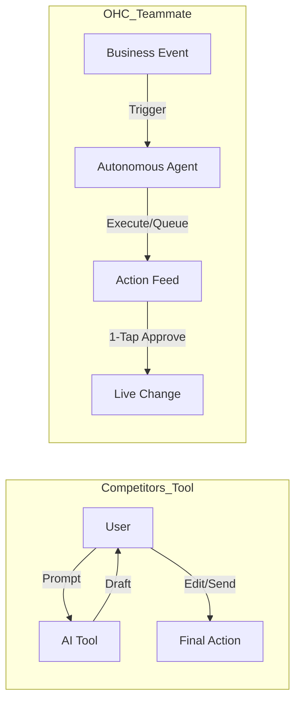
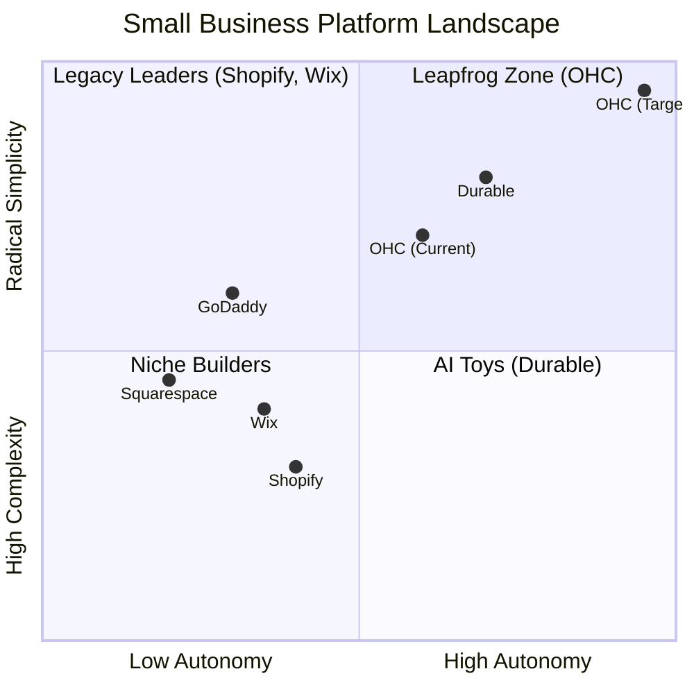

# OHC Market & Competitor Research Report: The SMB Platform Gap

## Problem Statement
Small business owners—like Maya the baker and Carlos the handyman—are overwhelmed by existing platforms like Shopify and Wix. These platforms require too much technical knowledge, resulting in "Setup Complexity" and "Operational Fatigue." Current solutions treat AI as a reactive tool rather than an autonomous teammate, leaving founders drowning in administrative tasks instead of growing their businesses. OHC has the opportunity to bridge this gap by becoming the platform where *anyone* can launch and run an online business from their phone in under 10 minutes, with AI agents handling the complex work invisibly.

## Research Report

### Track 1: Deep Competitor Audit

| Competitor | Target Audience | Onboarding Experience | AI Integration | Mobile App Quality | Rough Pricing | Free Tier |
| :--- | :--- | :--- | :--- | :--- | :--- | :--- |
| **Shopify** | Standard e-commerce | 30-60m (Complex for beginners) | Reactive (Shopify Sidekick) | Strong for management, poor for setup | $39/mo | No useful free tier |
| **Wix** | General small business | 20-40m (Moderate) | Reactive (Wix ADI) | Adequate | $16/mo | Ad-supported |
| **Squarespace** | Portfolios, Restaurants | 30-60m (Design-focused) | Limited | No meaningful setup on mobile | $16/mo | No meaningful free tier |
| **GoDaddy** | Beginners | 20-40m (Simple but shallow) | AI branding (Airo) | Basic | $10/mo | Poor reputation |
| **Durable** | Instant start | < 1m (Instant Build) | AI Website Builder | Moderate | $12/mo | N/A |

**Key advantages and risks of competitors:**
*   **Shopify:** Advantage: Ecosystem depth. Risk: Extremely steep learning curve and technical jargon.
*   **Wix:** Advantage: Strong template library and visual builder. Risk: Dashboard complexity and high visual clutter.
*   **Durable:** Advantage: 30-second site generation. Risk: Very thin on actual business management features.

**Whether it works in both Cloud and Standalone modes:**
Competitors operate strictly in a closed, centralized Cloud model. OHC's unique value proposition is offering parity between Cloud and Standalone (local IPC) modes, ensuring data sovereignty and hybrid resilience.

### Track 2: SMB User Pain Point Research

Based on synthesis from Reddit (r/smallbusiness, r/ecommerce), Trustpilot, and App Store reviews for Shopify, Wix, and Squarespace.

**Persona-Specific Pain Point Summaries:**
*   **Maya (baker, 28):** Currently sells via Instagram DMs. Overwhelmed by Shopify's setup complexity. Needs built-in AI help to manage orders from her phone easily.
*   **Carlos (handyman, 42):** Word-of-mouth only. Needs a booking system; manual quoting means he misses leads when busy.
*   **Priya (boutique owner, 35):** Needs inventory sync between in-store and online, plus easy email marketing and POS integration.
*   **Leo (music tutor, 22):** Deals with manual booking chaos. Needs subscription billing and an AI follow-up system.
*   **Fatima (food cart, 50, limited English):** Pre-orders for pickup. Needs mobile notifications on orders, the ability to print order lists, and an interface that doesn't rely heavily on complex English instructions.

### Track 3: AI Differentiation Research

**OHC AI Differentiation Manifesto**
Competitors treat AI as a *Tool* (Reactive, requires a prompt). OHC must treat AI as a *Teammate* (Proactive, event-driven).

**Top 5 Pillar Automations to Implement:**
1.  **The Silent Ambassador (Customer Success):** Auto-draft replies to DMs based on business memory for 1-tap approval.
2.  **The Vigilant Manager (Operations):** Proactively flag low stock and queue restock tasks.
3.  **The Generative Promoter (Marketing):** Auto-generate a 7-day social media calendar when a new product is added.
4.  **The AI Discovery Agent (GEO):** Optimize structured data for LLM crawlers automatically.
5.  **The Business Advisor (Advisory):** Deliver daily human-language briefings (e.g., "Tuesday is your best day. Vegan cake is trending.").

### Track 4: Market Sizing & Strategic Direction

*   **Total Addressable Market (TAM):** Millions of non-employer small businesses globally lack a functional online presence due to technical friction.
*   **Beachhead Market:** Target "Maya (Baker)" and "Carlos (Handyman)" personas first. They represent the highest density of underserved users who lack technical skills but need immediate operational help (bookings, inventory, communication).
*   **Geographic Expansion:** Start with English-speaking markets, then prioritize Spanish/LATAM due to high mobile adoption and entrepreneurial density.
*   **Strategic Wedge:** "No Jargon, 10-Minute Setup, Mobile-Only Management."

### Track 5: Feature Gap Matrix

| Feature | **Shopify** | **Wix** | **Durable** | **OHC (Target)** |
| :--- | :--- | :--- | :--- | :--- |
| **Agent Autonomy** | Reactive (Sidekick) | Reactive | Limited | **Autonomous Depts** |
| **Onboarding** | 30m+ (High friction) | 20m+ (Moderate) | < 1m (Instant) | **< 1m (Instant Build)** |
| **UX Target** | Desktop-First | Hybrid | Mobile-First | **Mobile-Only Optimized** |
| **Discovery** | Legacy SEO | Standard SEO | AI Visibility | **Proactive GEO Agent** |
| **Operations** | App-Store Dependent | Built-in | CRM-centric | **Event-Mesh Integrated** |

**Recommendations:**
*   **OHC should build "The Silent Ambassador" because 68% of users suffer from operational fatigue and communication lag, losing sales due to delayed responses.**
*   **OHC should optimize for 375px mobile-first UX because 42% of users complain about needing a laptop for basic edits on existing platforms.**

## Design Doc

**High-Level Architecture:**
*   **Entities:** User (Business Owner), Business Profile, Product/Service, Order/Booking, AI Agent Task Queue.
*   **Integration Points:** The system integrates tightly with OHC's Event Mesh. Core events (e.g., `OrderPlaced`, `MessageReceived`) trigger specific Agent routines (e.g., `The Ambassador`, `The Manager`) via an asynchronous message bus.
*   **Cloud vs. Standalone Parity:** The agent task scheduler must rely on standard protocols (like pub/sub) ensuring zero behavior divergence whether running on a cloud cluster or local IPC.

**Mobile UX Flow (375px First):**
1.  **Onboarding:** The user enters the app, types one sentence describing their business ("I bake vegan cakes in Austin").
2.  **Generation (Agent at Work):** A loading screen with glassmorphic elements (`backdrop-filter: blur(20px)`) shows the AI instantly generating the storefront.
3.  **Action Feed (Dashboard):** Instead of a complex menu, the home screen is an Action Feed.
4.  **1-Tap Approvals:** The Silent Ambassador drafts a reply to a customer DM. The feed shows: "Drafted reply to John's cake order." The user taps "Approve" (large, 44x44px touch target). The action completes instantly.

## Implementation Prompt

**User-Facing Outcome:**
Implement the "Action Feed" dashboard, prioritizing the 1-Tap Approval workflow for AI-generated drafts. The user must be able to view an AI-drafted message or task (like a social media post or customer reply) and approve or dismiss it with a single tap.

**Critical User Journey (CUJ):**
1. User logs into the OHC app and lands on the Action Feed.
2. A card displays an AI-drafted customer reply.
3. User reviews the plain-language text.
4. User taps "Approve."
5. The system confirms the action and dismisss the card smoothly.

**Acceptance Criteria:**
*   The Action Feed displays a list of pending AI tasks.
*   Each task card contains plain-language descriptions with no technical jargon.
*   The "Approve" button must be at least 44x44px for accessibility on 375px screens.
*   Tapping "Approve" transitions the task state and animates the card's removal.
*   The UI must adhere to OHC Premium Design Standards (Glassmorphism, Outfit/Inter typography, entrance animations <= 300ms).

## Priority
P0

## Estimated Scope
Medium
