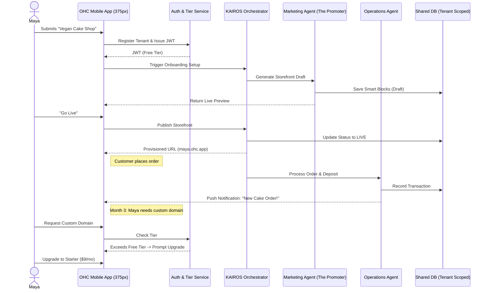
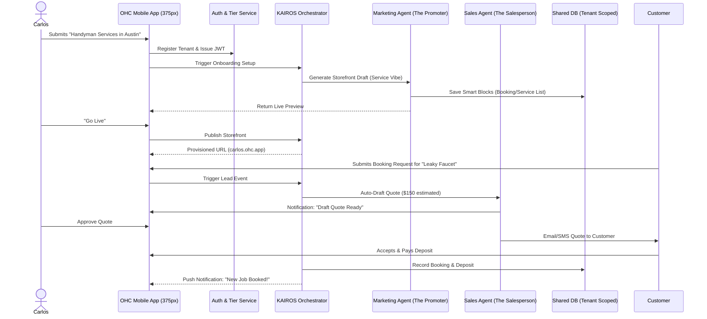
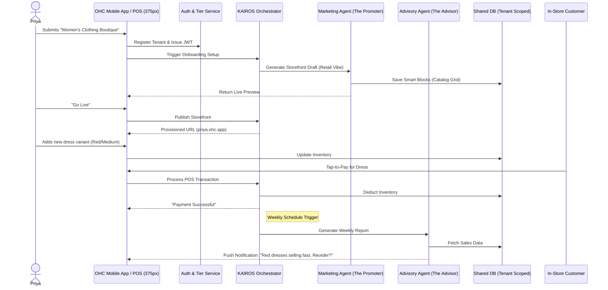
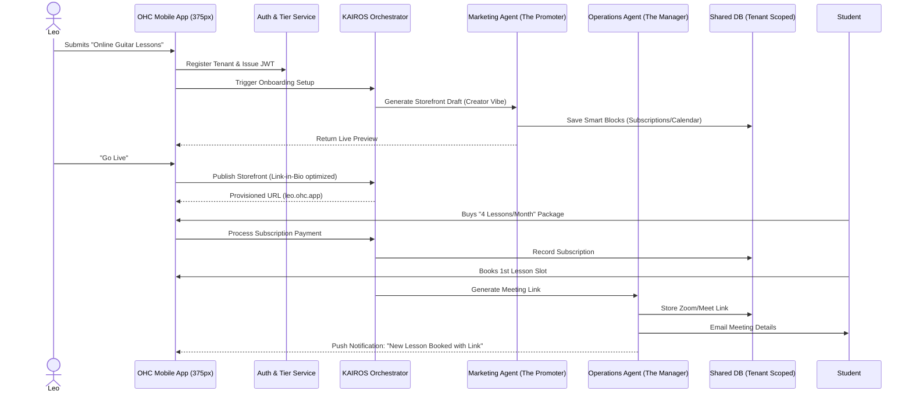
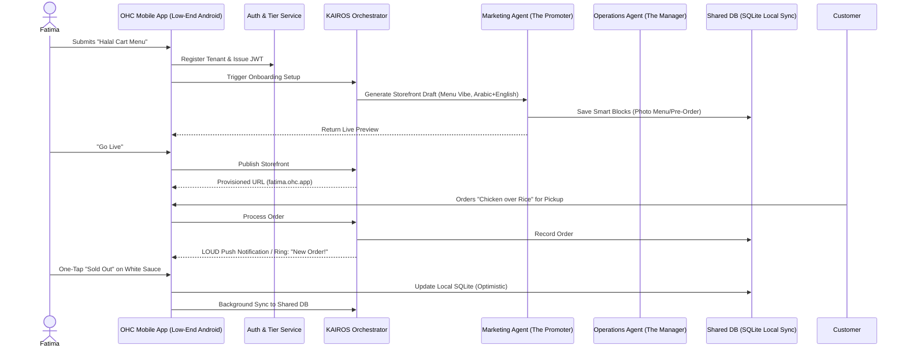

# [architecture]_business_journey

## Title
Architectural Mapping of the End-to-End Business Journey for OHC Personas

## Problem Statement
The OneHumanCorp (OHC) platform aims to empower a diverse range of non-technical small business owners—such as Maya the Baker, Carlos the Handyman, Priya the Boutique Owner, Leo the Music Tutor, and Fatima the Food Cart Operator—to launch and grow their businesses entirely from a mobile device within 10 minutes. A critical gap exists: the end-to-end user journeys (Acquisition, Onboarding, Activation, Retention, Revenue, Referral) lack a cohesive architectural map, risking fragmentation and user drop-off at critical friction points. We must define these pathways to ensure the system naturally guides users to success without exposing them to technical jargon or complexity.

## Research Report
The business journey is evaluated against our core personas, reflecting real-world pain points and requirements:
- **Maya (Home Baker, 28):** Driven by Instagram, requires easy custom order forms, deposit handling, and an AI to intercept and draft replies for incoming inquiries.
- **Carlos (Handyman, 42):** Reliant on word of mouth, needs a mobile-friendly service listing, automated quoting via an AI salesperson, and a straightforward booking calendar with deposits.
- **Priya (Boutique Owner, 35):** Needs a unified system for in-store tap-to-pay and online sales, syncing inventory variants (size/color), and actionable, plain-language analytics for reordering.
- **Leo (Music Tutor, 22):** Operates online and in-person, requiring subscription management for lesson packages, automated meeting link generation, and a TikTok link-in-bio presence.
- **Fatima (Food Cart Operator, 50):** Faces language barriers and relies on older Android hardware. Needs extreme simplicity: a photo menu with sold-out toggles, pre-order capabilities, and prominent push notifications.

### Journey Stages & Friction Points
1.  **Acquisition:** Discovery via social channels or word-of-mouth. The CTA ("Launch in 5 mins") must match the rapid onboarding reality.
2.  **Onboarding:** The most critical friction point. Requesting complex DNS setup or exhaustive product catalogs upfront causes abandonment. We must capture minimum viable data (Vibe, Name, Basic Service/Product) and let the "Promoter" AI generate the rest.
3.  **Activation:** The "Aha!" moment—a live, shareable URL and the first transaction. This must happen on Day 1.
4.  **Retention:** Friction occurs if users have to hunt for metrics. "The Advisor" AI mitigates this with weekly, plain-language health reports and proactive suggestions.
5.  **Revenue:** Transitioning to paid tiers ($9/mo Starter). Friction: Unexpected hard limits. Solution: Graceful degradation and contextual upgrade prompts.
6.  **Referral:** Viral loops built into the storefront footer ("Built with OHC") and referral discounts for both parties.

## Design Doc

### Key Design Decisions
-   **Progressive Onboarding:** The initial setup wizard asks for the absolute minimum (e.g., "Describe your business in one sentence"). Advanced settings are deferred and introduced contextually later.
-   **AI-First Setup:** The Marketing & Advertising Agent ("The Promoter") uses the initial input to automatically select a visual vibe, generate placeholder content, and structure the Smart Blocks (Hero, Catalog, Booking).
-   **Mobile-First Constraint:** Every flow, especially the complex ones like Payment Gateway integration, is designed strictly for the 375px mobile viewport first. Large touch targets (≥ 44x44px) and clear, jargon-free typography are mandatory.
-   **Offline Resilience:** For users like Fatima on spotty networks, critical actions (e.g., toggling an item "Sold Out") must update optimistically in the local SQLite SIPDB and sync asynchronously via the KAIROS Orchestrator.

### Mobile UX Flow (375px First) - Maya's Onboarding
1.  **Welcome Screen:** "Let's build your business. What do you do?" [Text Input: "I make custom vegan cakes in Brooklyn."]
2.  **AI Generation Shimmer:** "The Promoter is building your storefront..." (2-3 seconds, progressive loading).
3.  **Preview Screen:** A fully rendered, mobile-responsive draft storefront (Glassmorphism styling, Outfit headers).
4.  **One-Tap Activation:** "Looks great, let's go live!" -> Provisions `maya.ohc.app` instantly.
5.  **First Action Prompt:** "Your shop is live! Add your first cake to start taking orders."

### Architecture Diagrams

#### End-to-End Flow for Maya (The Baker)

## Implementation Prompt
**To Implementer Agent:**
Implement the progressive onboarding flow for the Mobile UI (Slint framework) strictly adhering to the 375px width constraint. Develop the "Welcome Screen" capturing minimal business data, the AI Generation shimmer state, and the "Preview Screen" displaying the generated storefront draft. Wire these screens to the KAIROS Orchestrator to trigger "The Promoter" agent for automatic Smart Block generation. Ensure all text uses plain language (e.g., "Go Live" instead of "Publish to CDN") and all touch targets are ≥ 44x44px. Do not prescribe specific database schemas or API endpoints; focus on delivering the described User Journey and UX flow.

## Priority
P0

## Estimated Scope
Medium

#### End-to-End Flow for Carlos (The Handyman)

#### End-to-End Flow for Priya (The Boutique Owner)

#### End-to-End Flow for Leo (The Music Tutor)

#### End-to-End Flow for Fatima (The Food Cart)

