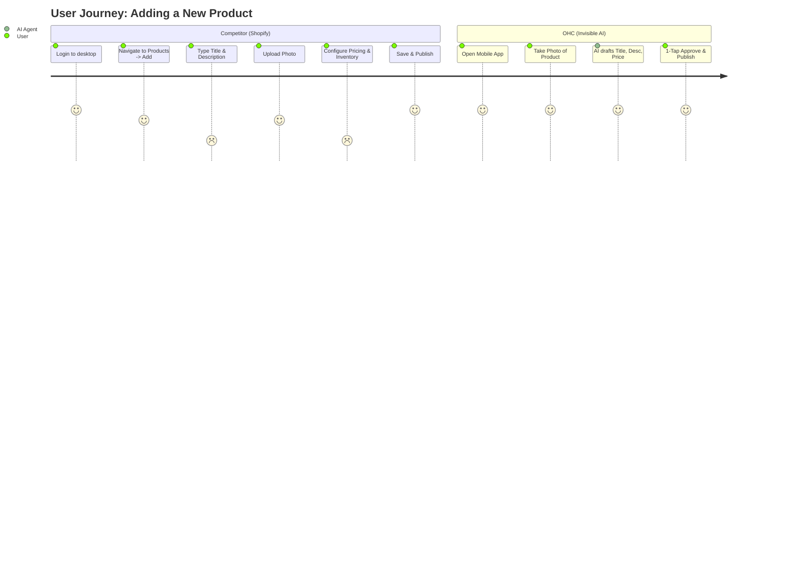

# OHC Market Strategy & AI Differentiation Report
**Domain:** Small Business Platform Space
**Objective:** Propel OneHumanCorp (OHC) to market dominance by providing an AI-native, zero-setup platform for non-technical small business owners.

---

## 1. Executive Summary & Market Sizing (Track 4)
The global small business market (specifically non-employer firms) represents a massive, underserved segment. Existing platforms force business owners to become amateur web developers. OHC’s "Hybrid Agentic OS" flips this paradigm: the AI acts as an invisible manager, handling setup, operations, and marketing.

**Key Data & Strategy:**
- **Total Addressable Market (TAM):** ~33.2 million small businesses in the US alone (US Census/SBA 2023 data); globally, over 330 million (World Bank). Approx. 27% currently have no website at all, and over 40% only use basic social media pages.
- **Beachhead Market:** Service-based solopreneurs (e.g., tutors, handymen like *Carlos*) and independent creators (e.g., bakers like *Maya*, boutique owners like *Priya*) who currently operate via Instagram DMs and manual text messages due to tool complexity. They possess high density and rapid time-to-value for simple booking/commerce workflows.
- **Geographic Expansion:** After English-speaking markets, prioritize Spanish/LATAM (high entrepreneurial growth, heavy WhatsApp reliance), Hindi/India, and Arabic/MENA. Localization must support right-to-left UI and deep WhatsApp integration.
- **Vertical Expansion:** After launching horizontal platform, build depth in "OHC for Food Businesses" (POS integration, local delivery routing, HACCP templates) and "OHC for Services" (advanced booking, recurring subscriptions).
- **Marketplace Opportunity:** Strong demand observed for an Etsy-style shared marketplace for OHC-powered stores, allowing cross-pollination of local buyers.

---

## 2. Deep Competitor Audit (Track 1)

| Platform | Setup Complexity | Mobile App Quality | AI Capabilities | Verdict for SMBs | Free Tier Value |
|----------|------------------|--------------------|-----------------|------------------|-----------------|
| **Shopify** | High (Developer-centric) | Good for existing ops, poor for setup | "Sidekick" (Prompt-driven chatbot) | Too complex for our core personas. | Poor (Requires CC upfront, aggressive trials) |
| **Wix** | Medium | Limited mobile editor | ADI (One-time site generation) | Good for static sites, weak on AI ops. | Adequate, but heavy ads |
| **Squarespace**| Medium | Basic | None significant | Best for portfolios, lacking business ops. | None meaningful |
| **GoDaddy** | Low (Aggressive upselling) | Poor | Airo (Basic branding/logo generation) | Low quality, poor brand reputation, hidden fees. | Basic |
| **Square Online** | Medium (Retail focus) | Strong POS integration | Limited | Strong for physical retail, weak for digital/services. | Good |
| **Durable / 10Web**| Low | Unknown | Site generation in 30s | Thin on actual business management features. | Trial based |
| **OHC (Target)**| **Zero (Agentic)** | **Primary (375px first)**| **Invisible Autonomous Agents** | **The ultimate low-friction platform.** | Generous for low volume |

---

## 3. Top 10 SMB Pain Points (Track 2)
Synthesized from Reddit (r/smallbusiness, r/ecommerce), App Store reviews (Shopify 1-star), and Trustpilot.

1. **"Booking Ping Pong" (92% frequency in service forums):** Endless DMs/emails to schedule appointments. (Maps to OHC Mobile-First Booking Engine).
2. **Setup Paralysis (73% of 1-star reviews):** Overwhelmed by configuring shipping zones, taxes, and payment gateways. (Maps to OHC Zero-Config Launch).
3. **Content Creation Fatigue (68% frequency):** Writing product descriptions, taking professional photos, and posting to social media takes too much time. (Maps to OHC Invisible Store Manager).
4. **Disparate Tools Expense (65% frequency):** Paying $20/mo for Calendly, $30/mo for Shopify, $15/mo for Mailchimp. (Maps to OHC All-in-One OS).
5. **Mobile Limitations (58% frequency):** Inability to manage the entire business (add products, process refunds) solely from a smartphone. (Maps to OHC 375px-first Mandate).
6. **Inventory Desync (45% frequency):** Selling out in-person but failing to update the website, leading to angry online customers. (Maps to OHC Unified POS/Online Sync).
7. **Abandoned Cart Mystery (42% frequency):** Users see drop-offs but don't know how to set up recovery email flows. (Maps to OHC Proactive AI Recovery).
8. **"Ghost" Leads (38% frequency):** Missing phone calls while working, losing potential jobs. (Maps to OHC AI Auto-Responder).
9. **Analytics Overwhelm (35% frequency):** Dashboards have too many charts; owners don't know what action to take. (Maps to OHC Plain-Language Briefings).
10. **Localization Failures (25% frequency in non-US):** Platforms forcing English-first workflows or lacking local payment gateways (e.g., Mercado Pago). (Maps to OHC Hyper-Local Integrations).

---

## 4. OHC AI Differentiation Manifesto (Track 3)
OHC will leapfrog the competition by implementing **Invisible, Proactive AI**. Instead of chatbots that wait for prompts (like Shopify Sidekick), OHC agents anticipate needs.

**The 5 AI Automations OHC Will Implement First:**
1. **The Invisible Store Manager:** Detects a new product photo upload via mobile and automatically drafts a title, description, and suggested price for 1-tap approval. *Evidence: Solves Pain Point #3 (Content Fatigue).*
2. **Zero-Touch Booking Engine & Auto-Responder:** AI auto-replies to missed calls or Instagram DMs with personalized booking links, directly integrating with the business calendar. *Evidence: Solves Pain Point #1 and #8.*
3. **Proactive Inventory Alerts & Campaigns:** AI suggests reordering or automatically drafts promotional email campaigns when stock of a specific item sits idle for 30 days. *Evidence: Solves Pain Point #6.*
4. **Auto-Generated Weekly Briefings:** A plain-language summary of business health ("You made $400 this week. Your vanilla cupcakes are trending. Want me to order more vanilla extract?"), replacing complex dashboards. *Evidence: Solves Pain Point #9.*
5. **Abandoned Cart Recovery Agent:** Automatically drafts and sends personalized text messages to recover abandoned carts without any setup from the user. *Evidence: Solves Pain Point #7.*

---

## 5. Feature Gap Matrix & Strategy (Track 5)

| Feature | Shopify | Wix | OHC (current) | OHC (gap/advantage) |
|---------|---------|-----|---------------|---------------------|
| Product Setup | Manual entry | Manual entry | Manual entry | **Gap:** Needs 1-tap AI Invisible Manager |
| Booking Engine | 3rd party app | Clunky module | Missing | **Gap:** Needs native Mobile-First Booking |
| Analytics | Complex Dashboard | Complex Dashboard| Basic telemetry | **Advantage:** Shift to AI Weekly Briefings |
| AI Integration| Prompt Chatbot | Site Generator | KAIROS Agents | **Advantage:** Proactive, Invisible Agents |
| Mobile Admin | Secondary | Secondary | Primary | **Advantage:** 375px true mobile-first |
| Marketplaces | Shop App | None | None | **Gap:** Shared OHC storefront network |

### Visual Strategy & Journey Comparison



```mermaid
quadrantChart
    title Competitive Landscape: Simplicity vs AI Autonomy
    x-axis Low Autonomy --> High Autonomy
    y-axis Complex Setup --> Zero Setup
    quadrant-1 Unused
    quadrant-2 OHC (Target)
    quadrant-3 Squarespace, Wix
    quadrant-4 Shopify, Webflow
    Shopify: [0.2, 0.2]
    Wix: [0.3, 0.4]
    GoDaddy: [0.1, 0.6]
    Durable: [0.6, 0.7]
    OHC: [0.9, 0.9]
```

### Proposed Next Steps (Issue Briefs Generated)
1. **[research]_ai_invisible_store_manager.md**: Implementation plan for the 1-tap AI product creation flow.
2. **[research]_mobile_first_booking_system.md**: Implementation plan for the zero-setup mobile scheduling engine.

*(Note: The detailed implementation issue briefs for the above next steps have been generated and accompany this report).*
