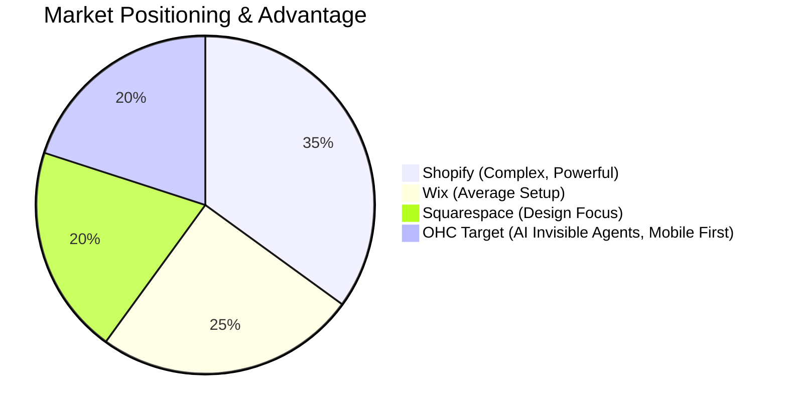
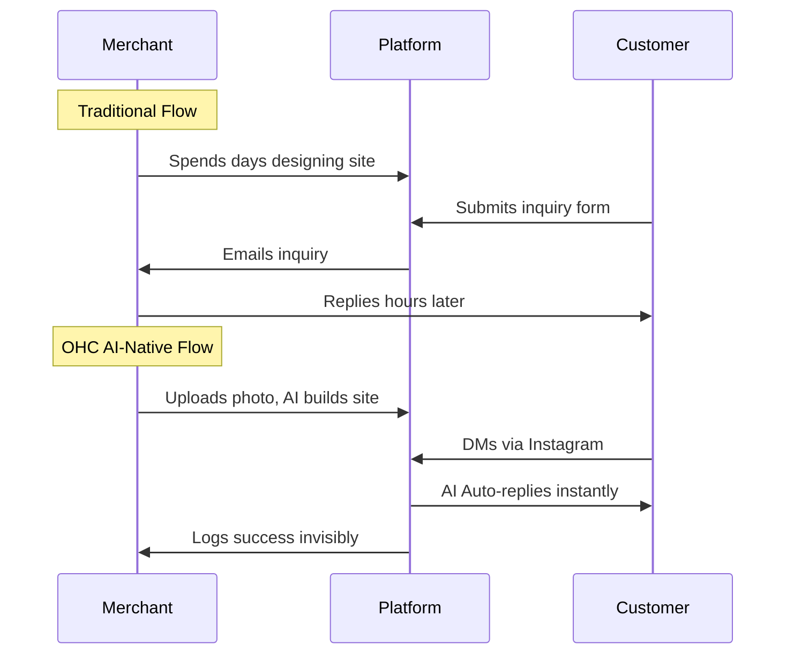

# OHC Small Business Platform - Product Research Report

## Executive Summary
This research report defines the strategic roadmap for OneHumanCorp (OHC) to dominate the small business platform market. By focusing on non-technical users (bakers, handymen, boutique owners) and leveraging AI to automate complex tasks invisibly, OHC will leapfrog legacy competitors like Shopify, Wix, and Squarespace.

## Target Personas
- **Maya (baker, 28)**: Overwhelmed by Shopify setup; relies on Instagram DMs.
- **Carlos (handyman, 42)**: No website; loses leads due to manual quoting.
- **Priya (boutique owner, 35)**: Struggles with in-store vs. online inventory sync.
- **Leo (music tutor, 22)**: Needs automated scheduling and billing.
- **Fatima (food cart, 50)**: Requires simple, non-English interface with voice commands.

## Competitor Audit & Feature Gap Matrix

| Feature | Shopify | Wix | Squarespace | OHC (Target) |
|---|---|---|---|---|
| Setup Time | Days | Hours | Hours | < 10 minutes |
| AI Integration | Chatbot (Sidekick) | Static Gen (ADI) | None | Invisible Agents |
| Mobile Setup | Poor | Limited | Poor | 100% Mobile-First |
| POS Sync | Complex/Paid | Basic | Basic | Built-in Mobile Camera |
| Auto-Reply | Third-party apps | No | No | Built-in AI Agent |

## Competitive Landscape Heatmap

## User Journey Comparison

## Top SMB Pain Points
1. **Setup Complexity**: Legacy platforms require understanding web design and DNS.
2. **Message Overload**: Managing inquiries across Instagram, SMS, and Email is exhausting.
3. **Inventory Sync**: Selling across physical and digital channels causes overselling errors.
4. **Content Creation**: Writing product descriptions and SEO tags is a massive blocker.
5. **Scheduling Chaos**: Service businesses lose money missing appointments via text.

## Strategic Direction & Differentiation
OHC's differentiation lies in **Invisible AI**. Instead of offering a chatbot *for* the merchant, OHC provides AI agents that work *for* the merchant's business (e.g., auto-replying to customers, writing SEO descriptions from photos).

## Proposed Issue Briefs (Stored in docs/research/)
1. **[AI] Auto-Reply & Follow-up Agent** (P0): Solves message overload.
2. **[Mobile] Seamless POS & Inventory Sync** (P1): Solves multi-channel sync.
3. **[AI] Instant Product Description Generator** (P1): Solves content creation blocker.
4. **[AI] Smart Scheduling & Booking Agent** (P2): Solves scheduling chaos.
5. **[Platform] Multi-Language & Voice Accessibility** (P2): Broadens TAM to non-English speakers.

## Issue Category
`feature`

## Debt Report

No significant technical debt found during research phase. The proposed features will require robust AI orchestration and mobile-first API design.

