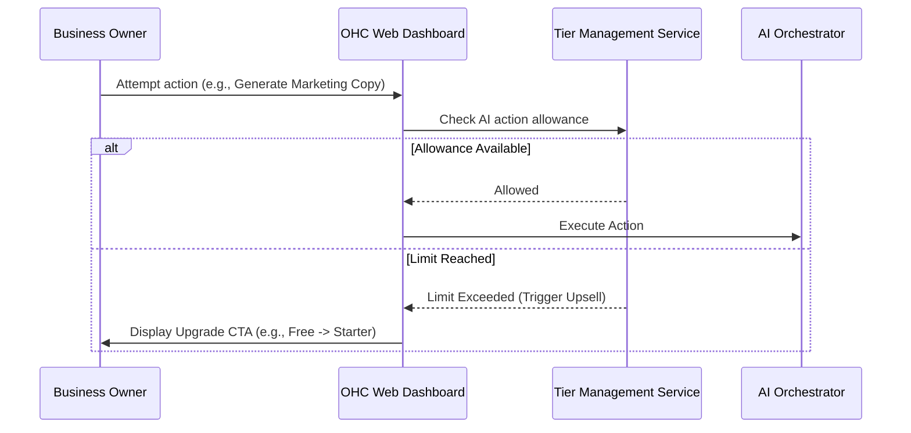

# Research Report: Multi-Tenant SaaS Tier Architecture

## Problem Statement
Small business owners coming to OneHumanCorp (OHC) need a transparent, easy-to-understand tier system that grows with their business. The current architecture needs to define the user-facing limits, how upgrades are presented, and the friction points when scaling from Free to Business.

## Research Report
The Multi-Tenant SaaS Tier Architecture is critical for revenue growth and retention. Comparing with Shopify and Wix, the tiers must feel value-driven rather than punitive.

Key Findings:
- **Free Tier:** Acts as an acquisition engine. Needs to support basic operations but limit AI actions and storage.
- **Starter Tier:** The first major upgrade. Provides a custom domain and increased limits.
- **Pro Tier:** Unlimited products and AI actions. For established businesses.
- **Business Tier:** For high-volume businesses requiring maximum storage and multi-domain support.

## Design Doc

### Architecture Diagram

### UI Wireframes & Screen Flow (375px)
- **Settings > Plan Details (Mobile View):** A simple card layout displaying current plan usage (e.g., "15/100 AI actions used").
- **Upgrade Modal:** A bottom-sheet modal highlighting the benefits of the next tier, tailored to the specific limit reached (e.g., "Need more marketing help? Upgrade to Starter for 1,000 AI actions/mo.").

### AI Agent Integration Points
- **The Advisor Agent:** Monitors usage and suggests proactive upgrades before limits are hit during peak seasons.
- **The Protector Agent:** Ensures data retention policies align with the current tier's storage limits.

### Key Design Decisions
- Limits are checked proactively to prevent failed actions.
- Upgrade CTAs are context-aware, appearing exactly when a limit blocks a desired action.

## Implementation Prompt
**User-Facing Outcome:** Business owners should clearly see their current plan limits and seamlessly upgrade when they hit a threshold, directly from their mobile device.
**CUJ:**
1. User attempts an action that exceeds their current tier limit.
2. A friendly, context-aware bottom-sheet modal explains the limit and offers a one-tap upgrade.
3. Upon upgrade, the action immediately resumes.
**Acceptance Criteria:**
- Implement the tier logic and limit enforcement.
- Build the responsive upgrade modal.
- Integrate "The Advisor" logic for proactive upgrade suggestions.

## Priority
P0

## Estimated Scope
Medium
