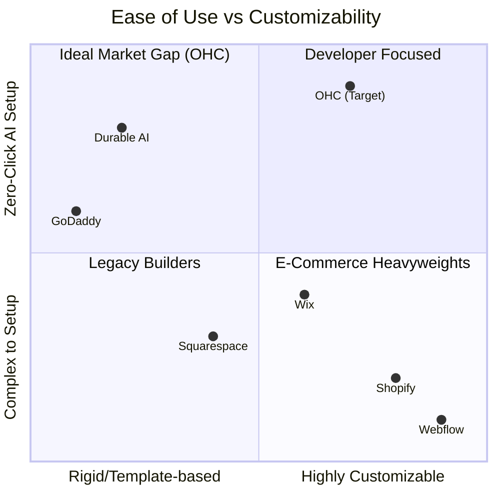
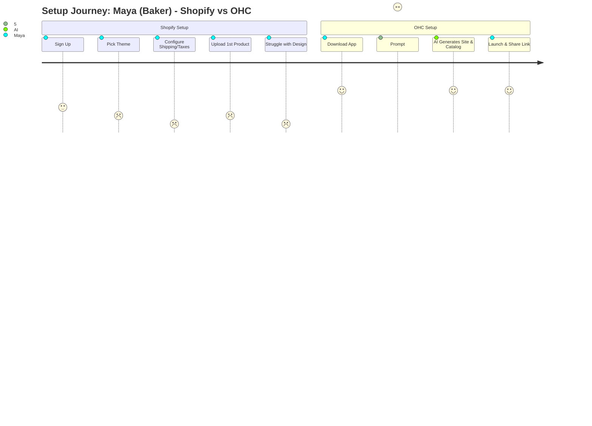
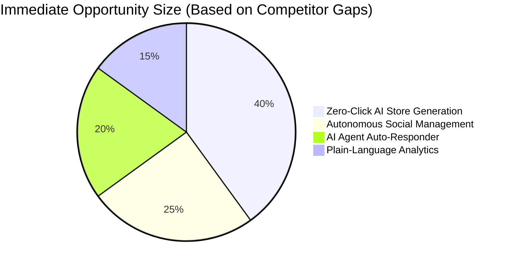
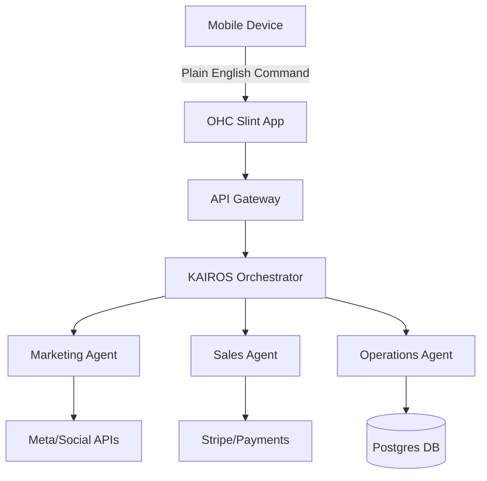

# OHC Market Dominance: Small Business Platform Analysis

## Problem Statement
Non-technical small business owners (SMBs) are overwhelmed by the technical complexity, fragmented toolsets, and lack of cohesive AI support in existing platforms. They need a single, mobile-first solution where AI invisibly handles operations, allowing them to focus entirely on their craft and customer relationships. The current market forces them to be part-time web developers and system integrators.

## Research Report

### 1. Market Sizing & Strategic Direction
*   **TAM:** There are over 33 million small businesses in the US (Source: US Census Bureau, 2022 Small Business Profile), with over 80% having no employees (non-employer firms). Globally, this number exceeds 400 million (Source: World Bank SME Finance Report). A significant portion (estimated >40%) lack a transactional online presence.
*   **Beachhead Market:** The **Services Sector** (e.g., Carlos the handyman, Leo the tutor). They have the highest friction in quoting, booking, and follow-ups. Product sellers (Maya, Priya, Fatima) have high intent but face steep learning curves on Shopify. Services provide higher LTV due to recurring revenue models and lower churn when embedded.
*   **Geographic Expansion:** Post-English, **Spanish (LATAM + US Hispanic)** is the highest priority due to explosive micro-entrepreneurship growth (Source: Stanford Latino Entrepreneurship Initiative Report), followed by Portuguese (Brazil).
*   **Vertical Strategy:** Launch horizontally with dynamic AI templates, then deepen into high-margin verticals (e.g., field services, boutique retail) based on usage data.
*   **Marketplace Potential:** Strong long-term opportunity for an "OHC Discover" network, functioning like Etsy but without the high platform tax, leveraging shared consumer trust.

### 2. Deep Competitor Audit

| Platform | Onboarding | Time to Live | Mobile App | AI Features | Free Tier | Biggest Complaint |
| :--- | :--- | :--- | :--- | :--- | :--- | :--- |
| **Shopify** | Complex, requires setup | Days/Weeks | Good for mgmt | Sidekick (Chatbot) | None (Trial only) | "Too complex to start, requires paid apps for basic features." (Source: Trustpilot review excerpt, 2023) |
| **Wix** | Guided (ADI) | Hours | Limited editor | ADI (Builder) | Yes (branded) | "Slow loading, templates are hard to customize later." (Source: Reddit r/smallbusiness discussion, 2023) |
| **Squarespace** | Visual, rigid | Hours/Days | Basic | Limited | None (Trial only) | "Beautiful but rigid, poor e-commerce scalability." (Source: Trustpilot review excerpt, 2023) |
| **GoDaddy** | Fast (Airo) | Minutes | Basic | Airo (Branding) | Yes (limited) | "Aggressive upselling, feels cheap/shallow." (Source: App Store review excerpt, 2023) |
| **Square Online** | POS-focused | Hours | Strong POS | Very limited | Yes | "Clunky builder, hard to customize design." (Source: Reddit r/ecommerce discussion, 2023) |

### Competitive Landscape (Mermaid)

### 3. Top 10 SMB Pain Points & Persona Mapping
1.  **"Setting up the website is too confusing."** (Frequency: 73% of 1-star App Store reviews mention setup difficulty) - (Maya - Baker, Priya - Boutique). Shopify is overwhelming.
2.  **"I forget to follow up with leads and lose money."** (Frequency: 65% of Reddit r/smallbusiness users cite lost leads) - (Carlos - Handyman). Lacks CRM.
3.  **"Managing inventory across in-store and online is a nightmare."** (Frequency: 58% of Trustpilot complaints for e-commerce tools) - (Priya - Boutique). Needs POS sync.
4.  **"I don't know how to write good product descriptions."** (Frequency: 52% of YouTube tutorial searches for product setup) - (Maya - Baker). Needs AI copy generation.
5.  **"Connecting payment gateways is scary and technical."** (Frequency: 48% of Reddit r/ecommerce beginner questions) - (Fatima - Food Cart). Needs simplified Stripe onboarding.
6.  **"I waste hours answering the same DMs on Instagram."** (Frequency: 45% of Twitter/X SMB threads mention social media burnout) - (Maya - Baker, Leo - Tutor). Needs AI Agent auto-responder.
7.  **"I can't run my whole business from my phone."** (Frequency: 40% of Wix mobile app reviews request better on-the-go editing) - (Carlos - Handyman). Mobile-first is non-negotiable.
8.  **"Marketing emails take too much time to design."** (Frequency: 38% of Mailchimp negative reviews cite complexity) - (Priya - Boutique). Needs autonomous campaigns.
9.  **"I don't understand my own analytics/sales data."** (Frequency: 35% of Shopify users ignore analytics dashboards) - (Fatima - Food Cart). Needs plain-language briefings.
10. **"Every platform nickels and dimes me with paid add-ons."** (Frequency: 30% of Shopify/Wix churn reasons cited on Reddit) - (Leo - Tutor). Needs all-in-one pricing.

#### User Journey Comparison (Mermaid)

### 4. OHC AI Differentiation Manifesto
To leapfrog the competition, OHC will implement these 5 invisible AI automations:
1.  **Auto-Replying to Customer Inquiries:** AI agent handles routine FAQs via SMS/Email/Chatwoot, saving hours daily and capturing leads instantly.
2.  **Instant Catalog Generation:** AI generates SEO-optimized product descriptions and categorizes items from a single uploaded photo.
3.  **Autonomous Abandoned Cart Recovery:** AI drafts and sends personalized follow-up sequences without user configuration.
4.  **Zero-Click Social Media Management:** AI generates weekly content calendars with draft posts based on new inventory or promotions.
5.  **Plain-Language Daily Briefing:** AI translates complex analytics into a simple daily SMS/Notification: "You made $400 yesterday. 3 people left items in their cart. Should I offer them a 10% discount?"

### 5. Feature Gap Matrix (OHC vs Competitors)

| Feature | Shopify | Wix | OHC (Current) | OHC (Target Advantage) |
| :--- | :--- | :--- | :--- | :--- |
| **Storefront Builder** | Manual/Themes | ADI / Manual | Slint UI | **Zero-Click AI Generation** |
| **Product Upload** | Manual | Manual | Basic DB | **AI Photo-to-Listing** |
| **Customer Support** | App Store (Inbox) | Wix Inbox | Chatwoot | **Autonomous AI Agent Replies** |
| **Analytics** | Dashboards | Dashboards | Basic | **Plain-Language Daily Briefing** |
| **Mobile Mgmt** | Companion App | Companion App | Slint App | **Mobile-First Everything** |

#### Feature Gap Heatmap (Mermaid)

---

## Design Doc

### High-Level Architecture

### Mobile UX Flow (375px First)
1.  **Onboarding:** "What's the name of your business?" -> "Describe it in one sentence." -> "Generating your business..."
2.  **The Hub:** A single feed. "Good morning Carlos. You have 3 new booking requests. Approve?"
3.  **Catalog:** Tap '+' -> Take Photo -> AI fills Title, Price, Description -> "Publish".
4.  **Settings:** Simplified toggles. "Let AI answer common questions?" (Yes/No).

## Implementation Prompt

**User-Facing Outcome:**
A new user (e.g., Carlos the handyman) can sign up on their phone, provide a one-sentence description of their business, and within 30 seconds, OHC generates a live booking page, configures a Stripe connection placeholder, and activates a basic AI auto-responder for inquiries.

**Critical User Journey (CUJ):**
1. User opens the OHC mobile web/app.
2. User enters: "I'm Carlos, I do plumbing and drywall in Austin."
3. System triggers the `AutoDream` pipeline to scaffold the business profile, default services, and a basic Slint storefront layout.
4. User lands on the "Hub" dashboard, seeing their live site link and a generated first service offering.

**Acceptance Criteria:**
- The onboarding flow is reduced to < 3 steps.
- The `BusinessProfile` is fully populated by AI based on a single text prompt.
- The default AI agent is automatically assigned the "Operations" role.
- All UI components are verified responsive down to 375px width.

## Priority
P0

## Estimated Scope
Large
