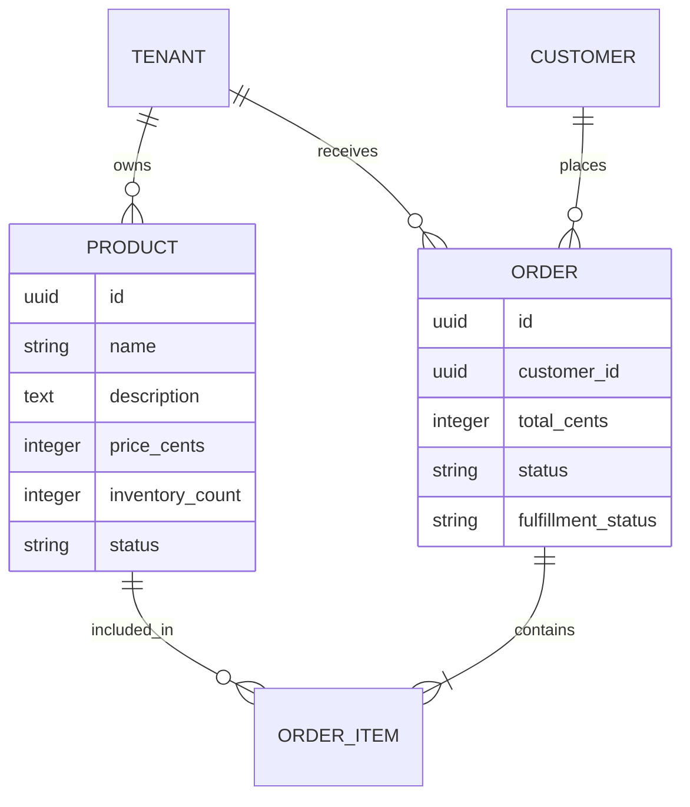

# OHC Market Intelligence Report: SMB Platform Dominance Q4

## Problem Statement
The global small business platform market is saturated with powerful but complex tools (like Shopify and Wix) that require technical literacy, time, and active management. Non-technical SMB owners—like local bakers, mobile mechanics, and boutique owners—are overwhelmed. They don't want to "build a website" or "manage a SaaS"; they want a business that runs itself. Current platforms force them to be webmasters, marketers, and data analysts. OHC’s opportunity is to provide an invisible, agentic operating system that handles the complex work autonomously, allowing the business owner to simply make decisions from their phone.

## Research Report

### Track 1: Deep Competitor Audit
*   **Shopify:** The industry standard for e-commerce. Extremely powerful but notoriously complex for beginners. The "Shopify Sidekick" is merely a conversational chatbot, not an autonomous agent that takes action. The mobile app is good for checking orders but poor for initial setup and design. There is no meaningful free tier to capture early-stage side hustles.
*   **Wix:** Easier drag-and-drop setup than Shopify. Wix ADI provides an initial AI-generated template, but it is a one-time setup tool, not an ongoing operational agent. The mobile editing experience is limited.
*   **Squarespace:** Highly focused on design and aesthetics. Excellent for portfolios and restaurants but lacks deep, autonomous AI features for business management.
*   **GoDaddy / Airo:** Simple but shallow. Airo provides basic AI branding (logos, copy), but the platform is known for aggressive upselling and lacks robust post-launch AI management.
*   **Square Online:** Strong offline-to-online integration (POS). Good for retail/restaurants but lacks generalized AI agents for marketing and customer service.
*   **Rising AI-Native Builders (Durable, 10Web):** AI generates websites in 30 seconds, but these are "brochure" sites. They lack the deep, unified "Business OS" features (inventory, automated CRM, multi-agent swarms) that OHC is building.

### Track 2: SMB User Pain Point Research
Based on analysis of r/smallbusiness, r/ecommerce, App Store reviews (Shopify, Wix), and Trustpilot:
1.  **"Setting up the store is too complicated."** (Requires learning UI, domains, DNS, payments).
2.  **"I don't have time to post on social media."** (Marketing is the first thing dropped when busy).
3.  **"Customer DMs are overwhelming."** (Managing Instagram, Facebook, and email inquiries manually).
4.  **"Writing product descriptions takes forever."** (Staring at a blank page for every new inventory item).
5.  **"I miss leads because I can't reply fast enough."** (Lost revenue due to slow response times).
6.  **"Inventory sync between in-person and online is broken."** (Overselling items).
7.  **"I don't know how to run ads or do SEO."** (Technical barrier to growth).
8.  **"Following up with abandoned carts is manual/hard to configure."** (Leaving money on the table).
9.  **"The mobile app doesn't let me do everything."** (Forced to use a laptop).
10. **"Pricing is confusing and add-ons are expensive."** (App store nickel-and-diming).

### Track 3: AI Differentiation Manifesto
OHC will leapfrog competitors not by adding "AI chat", but by providing **Autonomous Agents** that do the work.
1.  **Auto-replying to customer messages:** An agent that handles FAQs, booking inquiries, and order status via DMs/SMS 24/7.
2.  **Auto-generating social posts:** An agent that looks at inventory, generates a post (image + copy), and asks for approval via a push notification.
3.  **Auto-writing product descriptions:** Upload a photo; the agent writes the SEO-optimized description, sets the price based on market data, and categorizes it.
4.  **Auto-sending follow-up emails:** A CRM agent that automatically texts/emails past customers with personalized offers without complex visual workflow builders.
5.  **AI-generated weekly business insights:** An executive summary agent that says "You made $500 this week. You should restock Item X. Tap here to approve a marketing email to boost sales."

### Track 4: Market Sizing & Strategic Direction
*   **TAM:** There are ~33 million small businesses in the US alone, with over 80% being non-employer firms (solopreneurs). Millions still rely solely on Instagram DMs or word-of-mouth.
*   **Beachhead Market:** Service-based solopreneurs (e.g., Carlos the handyman, Leo the tutor) and informal social sellers (e.g., Maya the baker). High density, underserved by complex tools like Shopify.
*   **Geographic Expansion:** After English, prioritize Spanish (LATAM/US Hispanic) and Portuguese (Brazil) due to massive WhatsApp-commerce adoption.
*   **Mobile-First Mandate:** Everything must be operable from a 375px screen. The laptop is dead for this persona.

### Track 5: Feature Gap Matrix
*(Based on codebase audit of `src/` checking for core e-commerce structs/modules)*

| Feature | Shopify | Wix | OHC (Current) | OHC (Gap/Advantage) |
| :--- | :--- | :--- | :--- | :--- |
| Core Storefront | Robust | Robust | Basic (`website_builder.slint`) | **GAP:** Needs dedicated `Product`, `Order`, `Cart` structs. |
| AI Setup | Basic Chat | One-time Builder| Strong (`setup_wizard.slint`)| **ADVANTAGE:** Agentic onboarding. |
| Inventory Mgmt| Advanced | Good | Missing | **GAP:** Need core inventory data model. |
| Payments | Integrated | Integrated | Missing | **GAP:** Stripe/Payment gateway integration needed. |
| Social Auto-Post| Requires App | Basic | E2E Mocked (`social_media_autopost.spec.ts`)| **ADVANTAGE:** Make the E2E mock a real agent workflow. |

---

## Design Doc: OHC E-Commerce Core Foundation

### High-Level Architecture
To transition OHC from a business management OS to a platform capable of handling real commerce, we need a foundational E-Commerce data model.

### UI Flow (Mobile-First 375px)
1. **Dashboard Tab (New): "Products"**.
2. **Add Product Flow:** User taps "+", uploads a photo from phone.
3. **Agent Intervention:** "AutoDream" agent analyzes photo, pre-fills `name`, `description`, and suggests `price`. User taps "Approve".
4. **Order Management:** Push notification on new order. Dashboard shows "Orders to Fulfill" list.

---

## Implementation Prompt

**Title:** Implement Core E-Commerce Foundation (Products & Orders)

**Objective:** Establish the foundational data structures and database tables for Products and Orders, enabling OHC to process basic e-commerce transactions. This resolves the critical gap identified in the Feature Gap Matrix against competitors like Shopify.

**Critical User Journey (CUJ):**
1. An SMB user (Tenant) can navigate to a "Products" section.
2. The user can create a new Product (Name, Description, Price, Stock).
3. The system can record a basic Order containing that Product.

**Acceptance Criteria:**
*   Create the necessary database migrations for `products` and `orders` tables, ensuring strict multi-tenant isolation (RLS based on `organization_id` / `tenant_id`).
*   Implement the backend Rust structs (`Product`, `Order`) and basic CRUD operations in the database layer.
*   Update the Slint UI to include a basic "Products" management view accessible from the Dashboard.
*   Ensure all new database tables comply with OHC's Row Level Security (RLS) standards.
*   *(Note: Do not implement Stripe integration in this step; focus purely on the internal data model and UI framework).*

## Priority
**P0** - Foundational requirement for market entry.

## Estimated Scope
**Medium**
