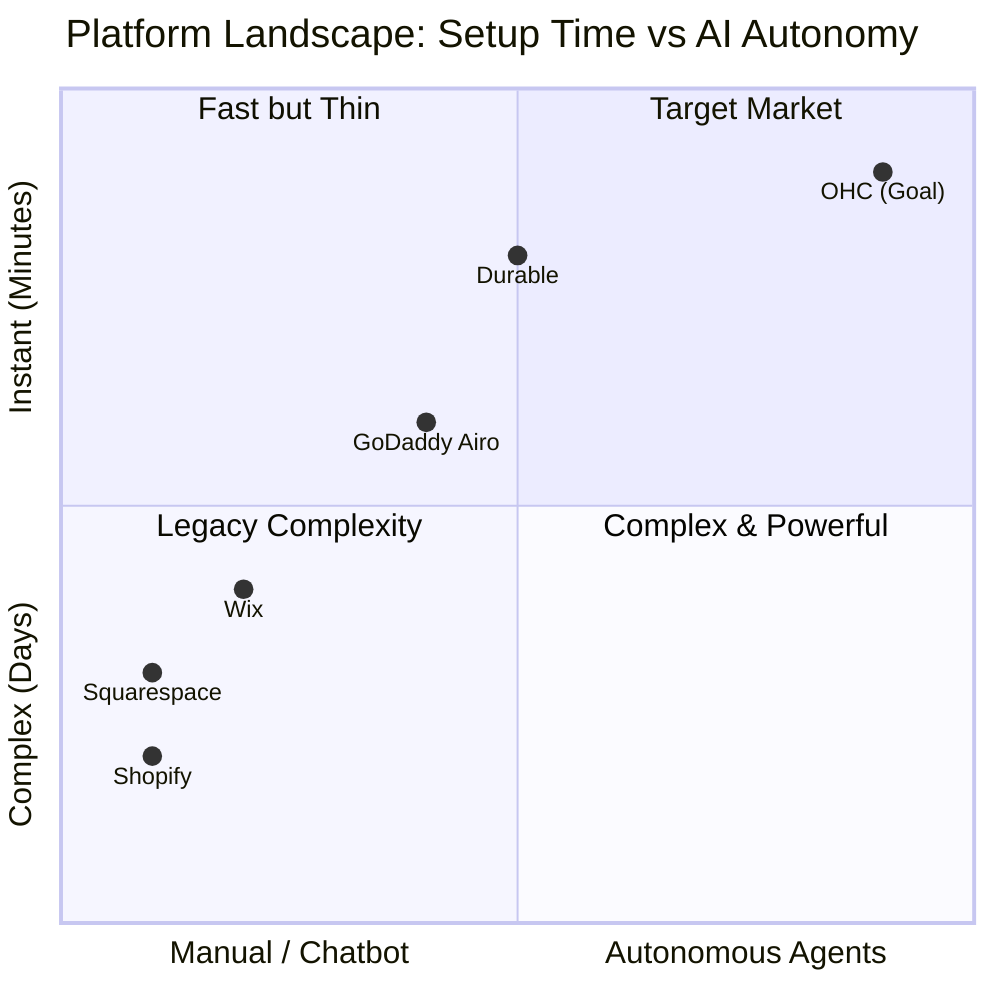
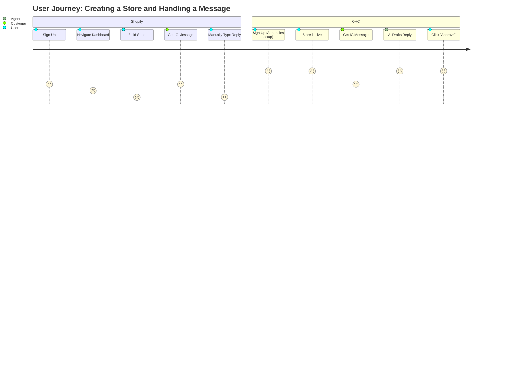

# OHC Product Research: Autonomous AI Background Agents for Operations

## Goal
Drive OHC's market dominance by replacing manual, repetitive tasks with autonomous background AI agents acting as functional departments (Operations, Customer Success, Marketing, etc.).

---

## 1. Persona-Specific Pain Point Summaries
Every engineering decision must be evaluated against these real personas.

### 🧁 Maya — The Home Baker (28, non-technical)
- **Pain Point:** Constant Instagram DMs asking about custom cake options while she tries to bake.
- **Competitor Failure:** Shopify is too complex; it assumes she understands DNS and fulfillment centers.
- **OHC Solution:** *The Ambassador* agent automatically drafts contextual replies to her DMs.

### 🔧 Carlos — The Freelance Handyman (42, non-technical)
- **Pain Point:** Manual quoting over the phone while on a ladder; loses leads because he can't respond fast enough.
- **Competitor Failure:** Wix booking systems require complex setup.
- **OHC Solution:** *The Salesperson* agent automatically sends a quote based on a customer's described problem.

### 👗 Priya — The Boutique Owner (35, semi-technical)
- **Pain Point:** Desires daily analytics to know what sold but finds current tools require complex dashboard navigation.
- **Competitor Failure:** Existing POS/E-commerce integrations (like Square) don't offer proactive, plain-language advice.
- **OHC Solution:** *The Advisor* agent sends a weekly SMS: "Blue dresses sold out. Reorder for next week."

### 🎵 Leo — The Music Tutor (22, non-technical)
- **Pain Point:** Chaos managing Google Calendar links and chasing down students for monthly subscription payments.
- **Competitor Failure:** Most tools treat bookings as a secondary feature instead of the core product.
- **OHC Solution:** *The Operations Manager* agent handles Zoom links and *The Accountant* handles recurring billing.

### 🍜 Fatima — The Food Cart Operator (50, non-technical, limited English)
- **Pain Point:** Needs simple pre-orders on a slow Android phone; English-heavy tools are unusable.
- **Competitor Failure:** Shopify and GoDaddy dashboards are too jargon-heavy and unoptimized for cheap mobile hardware.
- **OHC Solution:** A localized, zero-jargon, mobile-first app that simply alerts her when an order is placed.

---

## 2. Competitive Landscape & Feature Gap

### Mermaid.js Chart: Platform Setup Time vs. AI Capabilities

### Competitor Audit
- **Shopify (https://shopify.com)**: 30-60 min setup. Mobile app poor for setup. "Shopify Sidekick" is reactive, not autonomous.
- **Wix (https://wix.com)**: 20-40 min setup. "Wix ADI" is a one-time setup tool. Mobile editing is limited.
- **Squarespace (https://squarespace.com)**: 30-60 min setup. Very design-heavy, lacks deep business/AI features.
- **GoDaddy (https://godaddy.com)**: "Airo" generates a simple logo/draft but offers limited post-launch utility. Aggressive upselling.
- **Square Online (https://squareup.com)**: Great for POS, but limited design and proactive AI tools.

---

## 3. Top 10 SMB Pain Points (Ranked)

1.  **Constant Customer Communication:** "I spend 3 hours a day just answering the same questions on Instagram DMs and email." (Customer Success gap)
2.  **Writing Product Descriptions:** "It takes me 30 minutes just to upload one new item because writing the description and tags is exhausting." (Marketing/Ops gap)
3.  **Following up on Leads/Abandoned Carts:** "I know people abandon their carts, but I don't have the time to manually email them all." (Sales gap)
4.  **Managing Inventory Across Channels:** "I sold out in-store but forgot to update my online site." (Operations gap)
5.  **Social Media Consistency:** "I know I need to post on TikTok/Instagram daily, but I don't have time or know what to post." (Marketing gap)
6.  **Complex Setup & Jargon:** "What is a DNS record? Why do I need to set up shipping zones?" (Onboarding gap)
7.  **Understanding Financials:** "I see sales coming in, but I don't know if I'm actually making a profit after expenses and fees." (Finance gap)
8.  **Booking Management:** "Customers book a time but don't pay the deposit, and I have to chase them down." (Operations/Sales gap)
9.  **Mobile Management:** "I'm always on the go. I can't wait until I get home to my laptop to fix a typo on my site." (Platform gap)
10. **Legal & Policies:** "I just copy-pasted a privacy policy from another site. I hope it's legal." (Legal gap)

---

## 4. AI Differentiation Research: The OHC Manifesto

**The Problem:** Small businesses don't need a chatbot. They need *employees*.
**The OHC Solution:** AI as functional, autonomous departments.

### Top 5 Autonomous AI Automations OHC Will Implement First
1.  **The Ambassador (Customer Success): Auto-Drafting Replies.** Solves Pain Point #1.
2.  **The Operations Manager (Operations): Auto-Generating Product Listings.** Solves Pain Point #2.
3.  **The Promoter (Marketing): Auto-Scheduling Social Posts.** Solves Pain Point #5.
4.  **The Salesperson (Sales): Auto-Following Up on Leads.** Solves Pain Point #3.
5.  **The Advisor (Business Advisory): Weekly Plain-Language Insights.** Solves Pain Point #7.

---

## 5. Market Sizing & Strategic Direction

### Mermaid.js Chart: User Journey Comparison

-   **TAM:** ~33 million small businesses in the US alone.
-   **Beachhead Market:** "The Side Hustler to Full-Time Transition."
-   **Strategic Focus:** OHC must nail the **Mobile-First** and **Zero-Jargon** experience.

---

## 6. Feature Gap Matrix

| Feature | Shopify | Wix | OHC (Current) | OHC (Gap/Advantage) |
| :--- | :--- | :--- | :--- | :--- |
| **Setup Time** | 30-60 min | 20-40 min | Fast | **Advantage:** OHC aims for < 10 min. |
| **AI Agents** | Reactive (Sidekick) | One-time (ADI) | Defined in backend | **Gap:** Needs UI integration (Activity Feed). |
| **Mobile Mgmt** | Partial | Partial | 375px First | **Advantage:** Full parity on mobile. |
| **Booking + Store** | Store only | Complex | Supported | **Advantage:** All-in-one native support. |
| **Auto-Replies** | Third-party apps | Limited | Missing | **Gap:** Implement "The Ambassador". |
| **Auto-Insights** | Complex dashboards | Basic stats | Missing | **Gap:** Implement "The Advisor". |

---

## 7. Next Steps / Issue Briefs to Generate

### Issue Brief: Autonomous AI Background Agents for Operations (P0)

**Problem Statement:** Small business owners (Carlos, Maya) are overwhelmed by manual tasks: answering repetitive questions and writing product descriptions. Competitor platforms (Shopify, Wix) treat AI as a reactive chatbot. Users need AI that operates autonomously in the background as functional departments.

**Design Doc:**
- **High-Level Architecture**: Introduce specific agent personas (e.g., "The Ambassador" for Customer Success). Triggers should be event-driven (`MessageReceived`, `CartAbandoned`). State Management uses the PostgreSQL `SKIP LOCKED` pattern.
- **Mobile UX Flow (375px First)**: Display an "Agent Activity Feed" on the home screen showing recent actions, allowing users to tap and click "Approve". Settings should provide toggles for specific behaviors.
- **Implementation Prompt**: Implement the backend job queue and agent event processing loop to enable autonomous AI actions. Create the Flutter mobile UI (perfect rendering at 375px) to display the "Agent Activity Feed" on the home dashboard. The feature must be entirely transparent to the user, with plain-language descriptions.
- **Estimated Scope**: Large

### Issue Brief: Zero-Jargon Mobile-First Dashboard (P1)

**Problem Statement:** Current dashboards (Shopify, Wix) use complex e-commerce terminology (SKUs, DNS). Non-technical owners (Fatima) manage businesses from their phones and are confused by this jargon.

**Design Doc:**
- **High-Level Architecture**: UI Framework in Flutter. Design System uses OHC Premium Token library (Glassmorphism, Outfit/Inter typography). State Management via Riverpod.
- **Mobile UX Flow (375px First)**: Home screen focuses on plain-language metrics ("You made $150 today"). Action buttons must be large touch targets (≥ 44x44px). Group settings by business function (e.g., "My Money").
- **Implementation Prompt**: Redesign the core dashboard UI in Flutter strictly adhering to the 375px mobile-first mandate. Ensure all terminology is plain language. Implement the OHC Premium Design System tokens for a high-end feel.
- **Estimated Scope**: Medium
