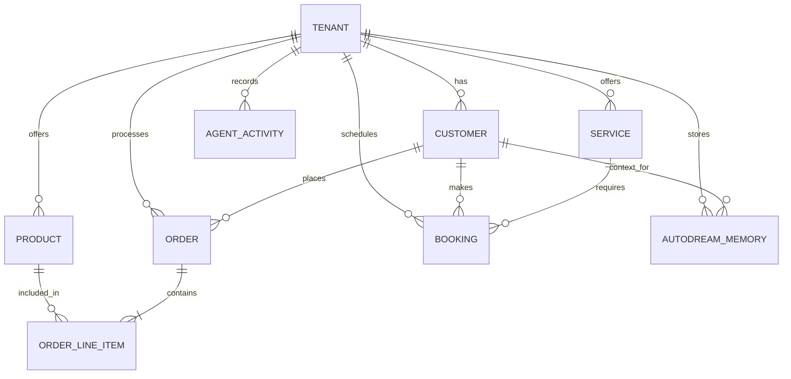

# [architecture] OHC Data Model & Multi-Tenancy Architecture

## Title
Refine and Document Core Entity Data Model and Access Patterns

## Problem Statement
Small business owners coming to OHC (like Maya the baker or Carlos the handyman) need a system that flawlessly tracks their orders, bookings, customers, and AI agent activities. However, as OHC scales to support hundreds of thousands of concurrent tenants, the underlying data model must ensure absolute multi-tenant isolation, efficient access patterns for AI agents (who need historical context), and clear relationships between core business entities (products, services, orders, bookings, customers). Without a clearly documented data model, implementers risk introducing cross-tenant data leaks, poorly structured relationships that hinder the AI's ability to recall context, or creating schemas that don't gracefully fallback to SQLite for Standalone deployments.

## Research Report
The current OHC architecture operates across multiple modes (Cloud-native shared service, Headless cloud API, Desktop standalone). This demands a robust schema that utilizes PostgreSQL features (like RLS - Row Level Security, JSONB, and `pgvector` for AI embeddings) while maintaining a graceful degradation path for local SQLite deployments.

Competitor analysis:
- **Shopify:** Uses a complex but highly extensible graph data model (GraphQL API). It can be overwhelming for non-technical users.
- **Wix/Squarespace:** Simpler data models, mostly document-based, but lack deep built-in AI context embedding.
- **OHC's Unfair Advantage:** OHC requires a hybrid data model where transactional data (orders, inventory) is deeply intertwined with vector embeddings (AI agent memories) to provide the "AutoDream" continuous learning loop.

A primary invariant of the OHC architecture is that *every* table must have a `tenant_id` to enforce Row-Level Security (RLS) in PostgreSQL, ensuring that no tenant (business owner) can access another tenant's data, either directly or via an AI agent's context window.

## Design Doc
The core data model revolves around the concept of a `Tenant` (the business). All other entities belong to a tenant.

### Key Entities & Relationships:
- `Tenant`: Represents a single business (e.g., Maya's Bakery).
- `Customer`: An end-user interacting with a Tenant (e.g., someone buying a cake).
- `Product`/`Service`: What the Tenant offers.
- `Order`/`Booking`: The transactional intent from a Customer for a Product/Service.
- `AgentActivity`: Logs of AI actions, mapped to a `Tenant` and specific context (Order, Customer).
- `AutodreamMemory`: Vector embeddings representing consolidated knowledge about Customers or Orders for AI context retrieval.

### Entity-Relationship Diagram

### Key Invariants:
1. **Multi-Tenant Isolation:** Every table MUST include a `tenant_id` column. PostgreSQL Row-Level Security (RLS) policies MUST be defined for every table to restrict access.
2. **Graceful Degradation:** Features relying on `pgvector` (like `autodream_memories`) must fallback to standard BLOB or text storage in SQLite for Standalone Mode. Similarly, `JSONB` columns in Postgres must gracefully map to `TEXT` in SQLite.
3. **AI Context Access Patterns:** Agents querying for historical context should query `autodream_memories` joined with `customer_id` or `order_id`, and always filtered by `tenant_id`.

### Migration Strategy
To evolve the schema over time without downtime:
- All schema changes must be applied additively. For instance, do not drop columns; instead, add new ones and deprecate the old ones after application code has fully transitioned.
- Database migrations must define a dual path (`_pg.sql` and `_sqlite.sql`) ensuring migrations can be applied both against the cloud PostgreSQL clusters and local SQLite files simultaneously.
- Long-running migrations (like adding indices to large tables) should utilize `CONCURRENTLY` in PostgreSQL to avoid locking the tables.

## Implementation Prompt
**Task for Implementer:**
Update the core schema definitions (both PostgreSQL and SQLite migrations) to formalize the entities: `customers`, `products`, `services`, `orders`, and `bookings`.
1. Ensure every table has a `tenant_id` column.
2. For PostgreSQL migrations (`_pg.sql`), apply RLS policies based on `tenant_id`.
3. Provide equivalent SQLite migrations (`_sqlite.sql`) ensuring types degrade gracefully (e.g., JSONB to TEXT).
4. Update the Go ORM/Query layer to ensure the `tenant_id` is always passed implicitly from the request context into the DB queries.
5. Create an E2E test verifying that an action performed by one tenant cannot retrieve data belonging to another tenant.

## Priority
P0

## Estimated Scope
Medium

