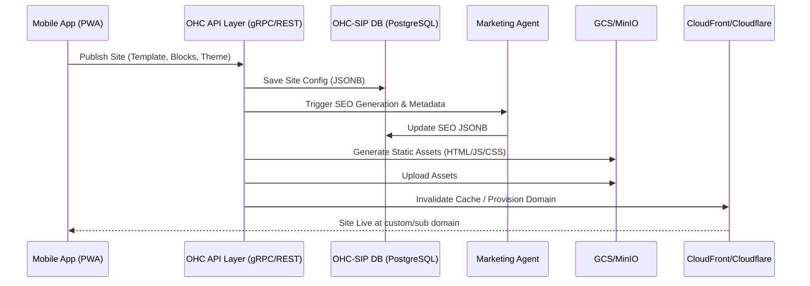

# OHC Website and Storefront Builder Architecture

## 1. Title
[architecture] Implement Drag-and-Drop Website Builder and Rendering Engine

## 2. Problem Statement
Non-technical small business owners (like Maya the baker or Carlos the handyman) are intimidated by complex website builders (e.g., Shopify, Wix, Squarespace) and overwhelmed by the technical jargon of domains, SSL, templates, and hosting. They need a simple, visually appealing, mobile-first builder that can generate a functioning storefront or service page in under 10 minutes without coding.

## 3. Research Report
### Current Codebase
The existing code has basic support for a `website_builder.slint` layout with a wizard (template selection, colors, product entry, domain choice). However, the backend storage of this structure, real rendering logic, CDN generation, and true drag-and-drop mechanics in the React/Flutter PWA are missing.

### Competitive Analysis
- **Shopify**: Highly flexible, extensive templates. Setup is slow (30-60 mins), high technical friction for a complete beginner. Uses Liquid for templating.
- **Wix**: True drag-and-drop, but overwhelming choices. Slower mobile performance. Often leads to messy designs if the user isn't design-savvy.
- **Squarespace**: Beautiful templates, structured editing. Good design constraints, but still requires understanding sections and blocks.
- **OHC Solution**: Provide heavily opinionated, premium design-constrained content blocks (Glassmorphism, Outfit/Inter typography). AI pre-fills content based on business description. Every block is responsive by default.

## 4. Design Doc

### Architecture Diagram

### Mobile UX Flow (375px first)
1. **Wizard/Setup**: Choose a goal (Sell products, Book services, Portfolio).
2. **AI Generation**: AI selects an opinionated template and populates a 1-page site.
3. **Block Editing (Drag-and-Drop)**:
   - Screen displays the site structure as a vertical stack of "Blocks" (Hero, Products, Services, Contact).
   - User can reorder blocks by long-pressing and dragging.
   - Tapping a block opens an editing modal (e.g., change Hero image, edit text).
4. **Theme Toggles**: Global toggles for Typography (e.g., "Playful" vs "Professional") and Color Palette.
5. **Publish**: 1-tap publish. SSL and sub-domain setup happen synchronously. Custom domains guide user through DNS setup or in-app purchase.

### Key Design Decisions
- **JSONB Representation**: The website's structure is strictly defined as a JSON tree stored in PostgreSQL. The frontend renders this tree. This prevents "broken" layouts and allows AI to easily manipulate the site structure.
- **Pre-defined Blocks**: No free-form absolute positioning. Users select from a library of highly polished, responsive blocks.
- **Server-Side Generation**: The actual public site is statically generated and deployed to a CDN for maximum performance and SEO.

## 5. Implementation Prompt
Implement the backend API and database models for the Website Builder, and a Flutter PWA frontend to consume it.
1. Define a robust JSON schema for the website structure (Pages, Sections, Blocks, Theme).
2. Create PostgreSQL tables (`pages`, `site_config`) to store this JSON with `tenant_id` isolation.
3. Implement gRPC endpoints for `SaveSiteDraft`, `PublishSite`, and `GetSiteConfig`.
4. Build a Flutter mobile-first UI that renders the JSON structure as interactive, reorderable blocks.
5. Ensure all visual elements adhere to the OHC Premium Token library (Glassmorphism, 20px blur).
6. Implement the publishing logic that signals the CDN and provisions the domain.
Do not prescribe the specific JSON library or exact CDN API, but ensure the data models are flexible enough for AI manipulation.

## 6. Priority
`P0` (Critical - Core Platform Feature)

## 7. Estimated Scope
Large
