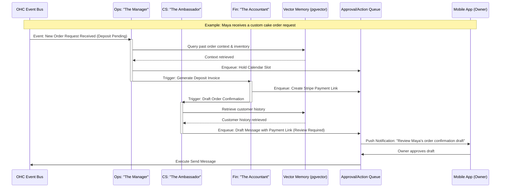

# Design Doc: AI Agent Department Architecture

**Author:** KAIROS Orchestrator (L8)
**Status:** Draft
**Last Updated:** 2024-05-18

## 1. Overview
This document outlines the architecture for the AI Agent Departments within the OneHumanCorp (OHC) platform. It details how "The Manager", "The Promoter", "The Salesperson", "The Ambassador", "The Accountant", "The Protector", and "The Advisor" operate invisibly in the background. It addresses how they are triggered, coordinate with each other, manage state/memory, and execute actions on behalf of the non-technical business owner, ensuring a seamless, automated business management experience from mobile or desktop.

## 2. Goals & Non-Goals
### 2.1 Goals
- Define the triggering mechanisms (event-driven, scheduled, on-demand) for AI agents across all 7 departments.
- Establish the inter-departmental coordination protocol (how one agent hands off context to another).
- Define the memory and state retrieval mechanisms (pgvector embeddings, conversation history) to maintain context over time.
- Outline the approval workflow (auto-execution vs. draft-for-review) to give users confidence in AI actions.
- Detail the AI budget and rate-limiting strategy per tenant based on their subscription tier.

### 2.2 Non-Goals
- Prescribing specific job queue implementations (e.g., Celery vs. custom Postgres queue).
- Detailing specific LLM prompt texts or parameters.
- Choosing the exact Vector Database schema implementation.

## 3. Detailed Design

### 3.1 Architecture Diagram

### 3.2 Department Execution Models
#### Trigger Mechanisms
- **Event-Driven:** React to system events (e.g., Stripe webhook for payment, incoming Instagram DM).
- **Scheduled (Cron):** Routine tasks (e.g., "The Advisor" generating weekly health reports on Sunday evenings).
- **On-Demand:** Explicitly requested by the business owner via chat or UI actions.

#### Inter-Agent Coordination (The Mailbox)
Agents coordinate using an asynchronous message bus (e.g., Redis Pub/Sub for realtime, Postgres `SKIP LOCKED` for durable jobs). When "The Manager" completes an order update, it publishes an `OrderUpdated` event, which "The Ambassador" consumes to draft a notification to the customer.

### 3.3 Memory and Context Management
Agents require context to act intelligently.
- **Short-term Memory:** The current transaction or conversation session state.
- **Long-term Memory (AutoDream):** Background pipelines consolidate episodic interactions into a persistent `autodream_memories_master` table using `pgvector`. When an agent is invoked, it retrieves relevant embeddings (e.g., "Has Maya baked vegan cakes for this customer before?").

### 3.4 Approval Workflows & Confidence Scoring
To build trust, agents operate with variable autonomy based on risk:
- **Low Risk / High Confidence:** Auto-execute (e.g., updating inventory count after a sale).
- **High Risk / Low Confidence:** Draft-for-review (e.g., sending a custom quote, issuing a refund).
- The system must queue actions in an `ActionQueue` table. Drafts trigger a push notification to the owner's mobile app: "The Ambassador drafted a reply to Sarah. Tap to review."

### 3.5 AI Budget and Throttling
To manage costs, AI actions are metered per tenant.
- A `tenant_ai_usage` table tracks monthly token/action consumption.
- If a tenant nears their tier limit (e.g., Free tier's 100 actions/mo), "The Advisor" agent will proactively notify them: "You're getting busy! Upgrade to Starter to let us handle more inquiries."

## 4. Problem Statement & Research Report

### 4.1 Problem Statement
Small business owners (like Maya the Baker or Carlos the Handyman) lack the time, expertise, and capital to manage complex software stacks, hire assistants, or configure automated workflows. Existing platforms (Shopify, Wix) treat AI as a bolted-on chatbot or text generator, still requiring the user to orchestrate the business logic.

### 4.2 Research Report
Research indicates a massive gap in the market for *autonomous* business management.
- **Shopify:** Offers "Sidekick," an AI assistant, but it primarily answers questions about how to use Shopify or performs basic data retrieval. It does not proactively run the business.
- **Wix/Squarespace:** Provide AI website generation and some text copywriting, but lack operational AI agents that handle fulfillment, finance, or customer success asynchronously.
- **GoDaddy:** "Airo" assists with initial setup but stops short of continuous operational management.
- **E-commerce Trends:** Global e-commerce is increasingly mobile-first and social-driven. Cross-border and digital payments are surging. However, the administrative burden on solopreneurs remains the primary bottleneck to growth.
- **Conclusion:** OHC's differentiation is treating AI as the *infrastructure* of the business. Organizing agents into understandable "Departments" (The Manager, The Accountant) maps perfectly to a non-technical user's mental model of how a business operates, reducing cognitive load.

## 5. Implementation Prompt

**Objective:** Implement the core infrastructure for the AI Agent Departments, specifically focusing on the event-driven triggering and the "Draft-for-Review" approval workflow.

**User Journey (CUJ):**
1. An external event occurs (e.g., an incoming webhook simulating a customer DM).
2. The event is routed to "The Ambassador" (Customer Success) agent.
3. The agent retrieves context from the vector database and generates a draft response.
4. Because the action requires approval, the agent places the draft in the `ActionQueue`.
5. The mobile app UI displays a notification/card indicating a pending draft.
6. The user taps "Approve", the action executes, and the system logs the outcome.

**Acceptance Criteria:**
- Create the foundational interface/base class for an AI Department Agent.
- Implement the Event Bus routing mechanism that triggers agents based on specific topics.
- Implement the `ActionQueue` data model and API endpoints for retrieving and approving pending actions.
- Ensure all logic supports multi-tenancy (using the `tenant_id` pattern).
- Provide a robust E2E test covering the full CUJ from event trigger to user approval.

## 6. Project Details
**Priority:** P0 (Critical path for platform differentiation)
**Estimated Scope:** Large

