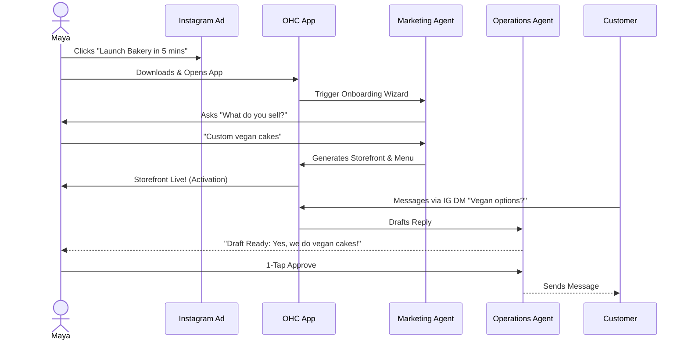

# Issue Brief: Unified Architecture for AI Agent Departments & Business Journey

## Title
Unified Architectural Map: AI Agent Departments & End-to-End Business Journey

## Problem Statement
OneHumanCorp (OHC) is designed to empower non-technical small business owners (like Maya the Baker, Carlos the Handyman, and Fatima the Food Cart Operator) to launch and run their businesses in under 10 minutes. However, currently, the overarching business journeys—from Acquisition through Activation to Revenue and Referral—are fragmented, and the AI capabilities are not cohesively integrated into these flows. We need a unified architectural design that maps the end-to-end user journeys for these diverse personas and clearly defines how the 7 AI Agent Departments (Operations, Marketing, Sales, Customer Success, Finance, Legal, Advisory) seamlessly and autonomously operate within these journeys to reduce operational fatigue and drive success.

## Research Report
### Context and Personas
The architecture is evaluated against core real-world personas, ensuring maximum simplicity and value:
1.  **Maya (Home Baker):** Needs mobile-first storefront, IG integration, deposit payments, and AI handling DMs.
2.  **Carlos (Handyman):** Requires service listings, booking with deposits, unified inbox, and AI quote generation.
3.  **Priya (Boutique Owner):** Wants omnichannel support, POS integration, inventory sync, and daily analytics.
4.  **Leo (Music Tutor):** Needs subscription packages, schedule syncing, auto-meeting links, and strong public profile.
5.  **Fatima (Food Cart Operator):** Prioritizes extreme simplicity, pre-orders, multi-language UI, and fast low-data mobile performance.

### Journey Stages & Friction Points
-   **Acquisition to Onboarding:** Initial setup must take <10 mins. **Friction:** Cognitive overload from requesting too much info upfront.
-   **Activation:** The "Aha!" moment (live storefront/first booking) within Day 1.
-   **Retention & Revenue:** Kept engaged via actionable notifications. **Friction:** "Financial Fog" and "Operational Fatigue" (e.g., answering repetitive DMs).

### AI Agent Departments
To solve these friction points, AI operates proactively as a "Teammate", not reactively as a "Tool".
-   **Operations ("The Manager"):** Order processing, inventory, bookings.
-   **Marketing ("The Promoter"):** Website design, SEO, social posts.
-   **Sales ("The Salesperson"):** Quotes, lead follow-up.
-   **Customer Success ("The Ambassador"):** Drafted DM replies, review requests.
-   **Finance ("The Accountant"):** Payments, subscription billing.
-   **Legal ("The Protector"):** Terms, contracts, compliance.
-   **Advisory ("The Advisor"):** Human-language daily briefings.

## Design Doc

### Key Architectural Decisions
1.  **Event-Driven Autonomous AI:** Agents are triggered by KAIROS mesh events (e.g., new order, new DM) rather than explicit user prompts.
2.  **1-Tap Approval Workflow:** High-risk actions (e.g., sending emails, publishing posts) are drafted by agents and pushed to an "Action Required" feed on the mobile dashboard for 1-tap approval.
3.  **Progressive Profiling & Setup:** The onboarding wizard requests minimal data; the Marketing Agent generates the initial storefront. Advanced configs are deferred and suggested later by the Advisory Agent.
4.  **Unified Memory (AutoDream):** All agents access `pgvector` embeddings (`autodream_memories`) for long-term context, scoped strictly by `tenant_id`.

### Architecture Diagrams (Mermaid.js)

#### Overall AI Department Coordination
```mermaid
sequenceDiagram
    participant O as KAIROS Orchestrator
    participant Hub as Teammate Mesh (Hub)
    participant Op as Operations Agent
    participant CS as Customer Success Agent
    participant DB as OHC-SIP DB (Memory)
    participant UI as Mobile Dashboard

    O->>Hub: Event: New DM (e.g., "Vegan cakes?")
    Hub->>CS: Trigger: Draft Reply
    CS->>DB: Fetch Memory (Business Context)
    DB-->>CS: Context: "Sells vegan cakes"
    CS->>DB: Save Draft Action
    CS->>UI: Push Notification: "Action Required"
    UI->>O: User 1-Tap Approves
    O->>Hub: Execute Drafted Reply

    classDef premium fill:rgba(255,255,255,0.03),stroke:rgba(255,255,255,0.08),stroke-width:1px,color:#fff,backdrop-filter:blur(20px) saturate(200%);
    class O,Hub,Op,CS,DB,UI premium;
```

#### Example Journey: Maya the Baker


## Implementation Prompt
**To Implementer Agent:**
Implement the unified KAIROS orchestrator flow supporting the event-driven triggers for the 7 AI Agent Departments and the mobile-first onboarding journey. Create the necessary `Action Required` feed data structures in the database to support the Draft-for-Review (1-tap approval) workflow. Build the mobile UI (optimized for 375px) that displays these pending actions clearly without technical jargon. Ensure that all background agent operations utilize the `Teammate Mesh` for coordination and respect `tenant_id` isolation. Provide robust E2E test coverage demonstrating a user moving from initial onboarding to approving an agent-drafted action.

## Priority
P0

## Estimated Scope
Large
