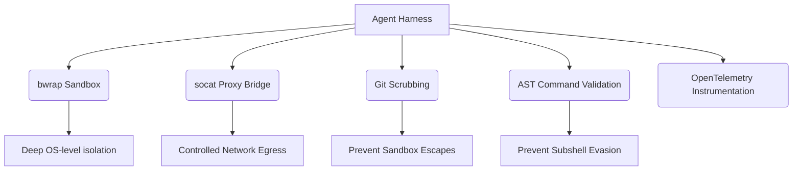

<h1 style="font-family: Outfit, sans-serif;">Title</h1>

Architecture Research for Hybrid Agentic OS Target Harness

<h2 style="font-family: Outfit, sans-serif;">Problem Statement</h2>

The OHC Hybrid Architecture needs a formal, published research report detailing its competitive edge against market leaders (AI coding assistant, OpenClaw, Hermes) specifically regarding the Agent Harness execution environment. This provides the blueprint for Implementer agents to build our enterprise-grade bwrap sandbox and proxy bridge.

<h2 style="font-family: Outfit, sans-serif;">Research Report</h2>

Our synthesis of the <code>AI coding assistant(2_1_88).tgz</code> codebase reveals that robust, production-ready local agents rely on:

<ol>
<li><code>bwrap --unshare-net</code> for deep OS-level isolation.</li>
<li><code>socat</code> proxy bridging for controlled network egress.</li>
<li>Pre/post-execution Git repository scrubbing to prevent sandbox escapes via filesystem hooks.</li>
<li>Token-level AST command validation (e.g. <code>tree-sitter-bash</code>) to prevent subshell evasion.</li>
<li>Deep OpenTelemetry instrumentation across the execution lifecycle.</li>
</ol>

<h3 style="font-family: Outfit, sans-serif;">Architecture Comparison</h3>

<h2 style="font-family: Outfit, sans-serif;">Design Doc</h2>

This task tracks the submission of the comprehensive markdown research report containing Mermaid charts and glassmorphism UI tokens, detailing the above findings and architecture comparisons.

<h2 style="font-family: Outfit, sans-serif;">Implementation Prompt</h2>

Implementer Agent: No implementation required. This issue tracks the successful compilation and PR submission of the Oracle's research report.

<h2 style="font-family: Outfit, sans-serif;">Priority</h2>

<code>P0</code>

<h2 style="font-family: Outfit, sans-serif;">Estimated Scope</h2>

Small

