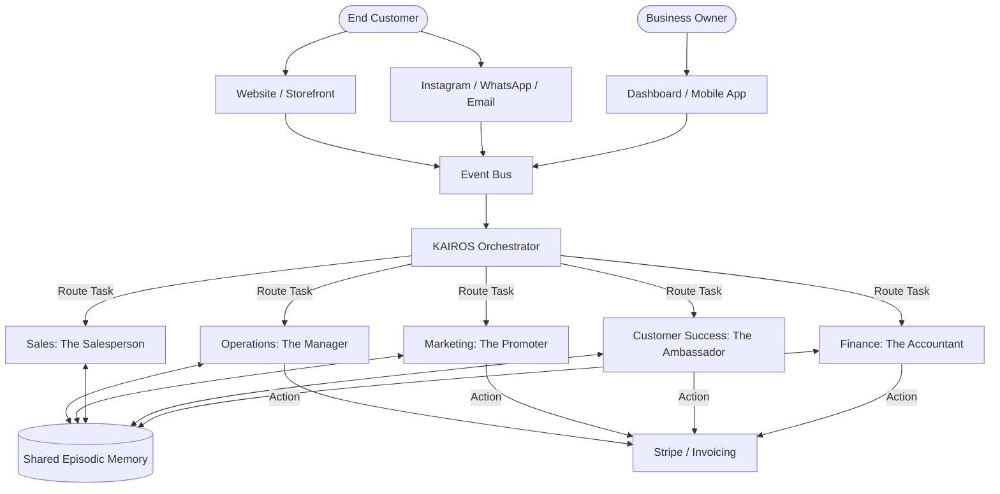

[RESEARCHER]
# AI Agent Department Architecture

## Problem Statement
Small business owners often struggle with managing various aspects of their business, from customer service and marketing to operations and finance. They lack the time, expertise, or resources to handle all these functions efficiently. A non-technical baker like Maya, or a food cart operator like Fatima, cannot be expected to configure complex AI workflows, write prompts, or wire up different services. They need "departments" that act like human employees, seamlessly handling tasks in the background without requiring technical setup or oversight.

## Research Report
### Market Analysis
- **Shopify:** Offers basic AI tools (Shopify Magic) for product descriptions and email generation, but lacks a cohesive, autonomous "department" structure that handles tasks end-to-end.
- **Wix/Squarespace:** Provide AI website builders and basic SEO tools, but do not offer autonomous agents that manage ongoing business operations or customer interactions.
- **GoDaddy:** Focuses on domain and basic hosting with some AI integration, but lacks the sophisticated, multi-agent orchestration required for comprehensive business management.

### Key Findings
1. **Abstraction is Key:** Users understand "Marketing" and "Customer Service," not "LLM Chains" or "RAG."
2. **Autonomy vs. Control:** Users need to trust the AI. High-stakes actions (e.g., refunds, mass emails) require approval workflows initially, transitioning to full autonomy as trust builds.
3. **Context Sharing:** Departments must share context. If the "Operations" agent knows an order is delayed, the "Customer Success" agent must adjust its messaging accordingly.

## Design Doc

### Architecture Overview
The AI Agent Department Architecture is designed to mirror a real-world business structure. Agents are grouped into functional "Departments," each responsible for specific domains. The KAIROS Orchestrator manages inter-departmental communication, shared memory, and task routing.

#### Mermaid Diagram: Agent Department Orchestration

### Key Architectural Decisions

1. **Event-Driven Invocation:** Departments are triggered via an Event Bus managed by the KAIROS Orchestrator. This allows for asynchronous, decoupled execution (e.g., "New Order Placed" event triggers Finance for payment and Operations for fulfillment).
2. **Shared Episodic Memory:** All departments read from and write to a centralized memory store. This ensures the "Marketing" agent knows about a recent "Customer Success" interaction, preventing tone-deaf promotions to a frustrated customer.
3. **Approval Gateways (Trust Fallback):** High-risk actions are routed to a "Drafts" queue for the business owner to review via a simple push notification. Once approved N times, the owner can toggle the department to "Auto-Execute."
4. **Budget & Throttling:** Token usage and action limits are enforced at the Department level, tied to the multi-tenant SaaS tier. The KAIROS Orchestrator pauses lower-priority background tasks if limits are approached.

### Mobile UX Flow (375px)
1. **Department Setup:** User opens the app, taps "Hire an Employee." Selects "The Ambassador" (Customer Success).
2. **Configuration:** Simple toggles: "Reply to Instagram DMs," "Send Order Updates." No technical setup.
3. **Approval Flow:** Notification: "The Ambassador drafted a reply to Maya's DM regarding a vegan cake. [Approve] [Edit] [Reject]."
4. **Activity Summary:** A daily digest screen shows actions taken by all departments: "The Manager fulfilled 3 orders. The Promoter scheduled 2 Instagram posts."

## Implementation Prompt

**Role:** Implementer (Agent Development)
**Task:** Build the core foundation for the "Customer Success: The Ambassador" department.
**Context:** This department is responsible for handling incoming customer inquiries (e.g., Instagram DMs, website chat) and sending order updates.
**User Journey (CUJ):**
1. A customer sends a message on the storefront: "Where is my order #123?"
2. The system triggers an event to the Customer Success department.
3. The Ambassador retrieves order #123 context from the shared memory.
4. The Ambassador drafts a response and, based on the owner's trust settings, either sends it automatically or pushes a notification for approval.
**Acceptance Criteria:**
- The agent can receive a text input and customer ID.
- The agent can query recent order status for that customer.
- The agent outputs a natural, brand-aligned response.
- The agent respects an "auto-execute" vs "draft" flag.
- Do NOT prescribe the specific LLM API or database schema; implement the core logic and interfaces that integrate with the KAIROS Orchestrator.

## Priority
P0 (Critical)

## Estimated Scope
Large
