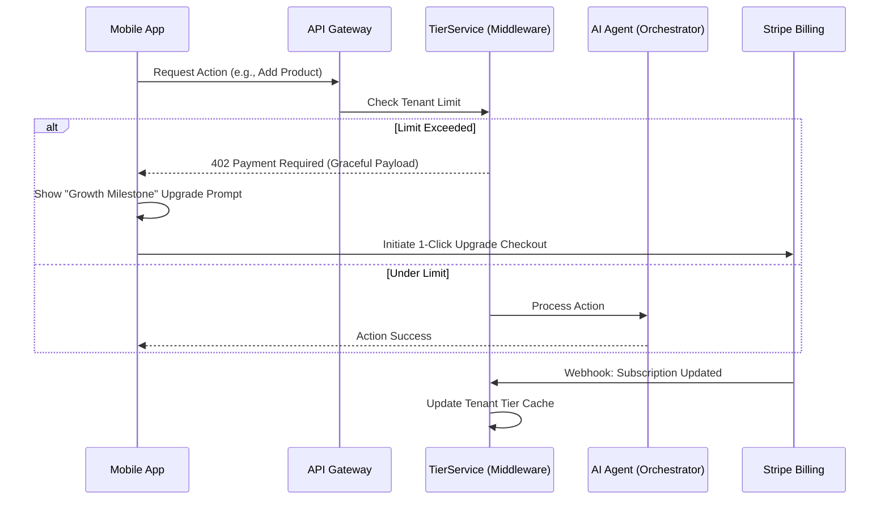

# OHC Multi-Tenant SaaS Tier Architecture & TierService Design

## Title
OHC SaaS Tier Strategy: Frictionless Limits & Graceful Degradation for Mobile-First SMBs

## Problem Statement
OneHumanCorp needs a monetization strategy that doesn't alienate non-technical users (like Fatima or Maya) with hard errors or complex paywalls. The current platform lacks a formalized multi-tenant tier system, making it impossible to enforce usage limits (e.g., number of products, AI actions) based on subscription plans. Without this, OHC cannot sustainably offer a robust free tier while scaling up to premium offerings.

## Research Report
- **Competitive Landscape**:
  - Shopify requires a paid plan to launch, creating immediate friction.
  - Wix/Squarespace use ad-supported free tiers that look unprofessional.
- **OHC's Approach**: A generous, volume-limited Free tier ($0/mo, 10 products, 100 AI actions) that allows users to experience the "Aha!" moment (first sale) before hitting a paywall.
- **Key finding**: Upgrades must be framed as "Business Growth Milestones" rather than "Error: Limit Reached". The AI "Business Advisory" agent should proactively suggest upgrades when usage spikes.

## Design Doc

### Tier Structure Matrix
| Tier | Price | Products | AI Actions/mo | AI Departments | Storage | Domain |
|---|---|---|---|---|---|---|
| **Free** | $0/mo | 10 | 100 | 1 (Ops) | 500MB | OHC Subdomain |
| **Starter** | $9/mo | 100 | 1,000 | 3 | 5GB | Custom Domain |
| **Pro** | $29/mo | Unlimited | Unlimited | 10 | 50GB | Custom + SSL |
| **Business**| $79/mo | Unlimited | Unlimited | Unlimited | 500GB | Multi-domain |

### High-Level Architecture (Mermaid.js)

### Mobile UX Flow (375px First)
1.  **The Intercept**: When Fatima tries to add an 11th product on the Free tier, she doesn't get a red error box.
2.  **The "Growth" Prompt**: A bottom-sheet slides up with a Glassmorphism background: *"Your menu is growing! 🚀 Upgrade to Starter for $9/mo to add up to 100 items and unlock custom domains."*
3.  **The 1-Tap Upgrade**: Using native Apple Pay / Google Pay via Stripe Checkout integration, the upgrade takes less than 5 seconds.
4.  **Instant Resumption**: Upon successful payment, the original action (adding the product) is automatically completed without requiring her to re-type the details.

### AI Integration Points
- **The Advisor**: Monitors usage velocity. If Maya uses 80% of her AI actions by day 15, The Advisor sends a gentle push notification: *"Your bakery is buzzing this month! You might need more AI actions soon to handle the volume."*
- **Agent Enforcement**: All AI agents route through the `TierService`. If the action limit is reached, agents enter a "Paused" state and notify the owner, rather than failing silently.

## Implementation Prompt
**To Implementer Agent:**
Implement the `TierService` middleware in the backend. This service must intercept requests (e.g., product creation, AI task dispatch) and validate them against the `tenant.tier` limits stored in the database. Implement a structured error response (e.g., HTTP 402) that the Slint frontend can interpret to display the "Growth Milestone" upgrade prompt. Integrate Stripe webhooks to listen for `customer.subscription.updated` events to asynchronously update the tenant's tier status. Ensure all upgrade prompts in the UI adhere strictly to the OHC Premium Design Standards (Glassmorphism, plain-language text, >= 44x44px touch targets). Do NOT implement hard blocking database constraints; use the middleware layer.

## Priority
P0

## Estimated Scope
Large
