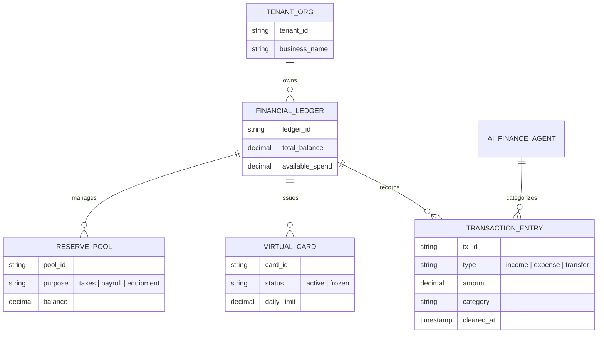
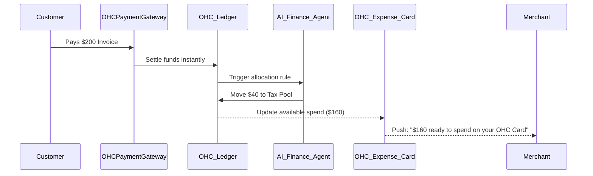

# Universal Treasury & Cashflow Engine

## Title
Universal Treasury & Cashflow Engine: Instant Business Capital & Spending

## Problem Statement
Small business owners like Maya (baker) and Fatima (food cart operator) face a critical cash-flow gap. When a customer pays them via traditional platforms, the funds take 2-5 days to hit their external bank account. However, they need to buy ingredients, pay for gas, or cover emergency repairs *today*. This delay forces them to rely on personal credit cards or high-interest loans to bridge the gap. They need a system where every dollar earned is instantly available to spend, automatically categorized, and seamlessly connected to their business operations without opening a separate banking app.

## Research Report
**Market & Competitor Analysis:**
- **Shopify Balance:** Offers zero-fee business accounts with an included virtual/physical card, providing instant access to Shopify sales. It also includes cashback and basic tax categorization.
- **Square Checking:** Gives sellers immediate access to their funds through a Square debit card, deeply integrated into their POS system.
- **Wix & Squarespace:** Rely primarily on standard Stripe/PayPal payouts, leaving sellers subject to the standard multi-day clearing delays unless they pay premium instant-payout fees.

**The OHC Advantage:**
OneHumanCorp can leverage BaaS (Banking-as-a-Service) primitives (like Stripe Treasury/Issuing) to create an invisible, multi-tenant financial core. Unlike competitors where the "Bank" is a separate tab, the OHC Treasury Engine is embedded directly into the AI Operations suite. When Carlos (handyman) takes a $500 deposit for a job, the OHC Finance Agent instantly routes $100 to a "Tax & Materials" bucket, makes $400 available on his OHC Expense Card, and auto-generates a budget for the job—all invisibly.

## Design Doc

### Architecture Diagram

### Core System Flows

### Mobile UX Flow (375px First)
1. **The "Money" Tab:**
   - A dedicated icon in the bottom navigation.
   - **Header:** Translucent glass card showing "Ready to Spend: $X,XXX".
   - **Quick Actions:** Three large, touch-friendly circular buttons: "Send Money", "Add to Apple/Google Wallet", "Freeze Card".
2. **Auto-Buckets:**
   - Below the header, a horizontal scrolling list of "Buckets" (e.g., Taxes, New Oven Fund).
   - Tapping a bucket shows a simple slider to adjust the auto-save percentage from every sale.
3. **Smart Feed:**
   - Instead of a traditional bank statement, the feed combines sales and expenses.
   - Example: "+$200 from Sarah (Cake)" followed by "-$45 at Costco (Ingredients)". The AI automatically links the expense to the incoming order if dates/amounts correlate.

### AI Agent Integration Points
- **Finance Operations Agent:**
  - Categorizes every swipe of the OHC Expense Card for end-of-year tax reporting without user input.
  - Monitors the "Ready to Spend" balance. If it drops below a predicted threshold based on upcoming scheduled bookings, the agent sends a plain-language nudge: "Heads up, you have $150 in material costs coming up for Friday's job, but your balance is $100. Want to move some funds from your Reserve?"

### Key Design Decisions
- **Unified Multi-Tenant Ledger:** The ledger must strictly partition data by `tenant_id`. No cross-tenant fund visibility is permitted.
- **Card Issuing Abstraction:** The design abstracts the BaaS provider. The system should define generic `VirtualCard` and `Ledger` interfaces so OHC can swap underlying providers (e.g., Stripe to Adyen) without changing the core business logic.
- **Zero-Friction Onboarding:** The OHC Wallet and Card are provisioned implicitly during the standard OHC business creation flow. No separate "Apply for a Bank Account" step.

## Implementation Prompt
**For the Engineering Swarm:**
Implement the core domain models and API endpoints for the Universal Treasury & Cashflow Engine.
- **CUJ:** A merchant receives a payment via their OHC storefront. The funds immediately appear in their "Ready to Spend" balance, minus a pre-configured percentage automatically swept into a "Tax Reserve" bucket. The merchant then views their virtual card details in the OHC mobile app to make a purchase online.
- **Acceptance Criteria:**
  - Define the `FinancialLedger`, `TransactionEntry`, `VirtualCard`, and `ReservePool` entities in the database schema, ensuring strict `tenant_id` scoping.
  - Implement the service layer to handle atomic deposits and rule-based splits (e.g., 80% to available, 20% to reserve) within a single database transaction.
  - Create REST/GraphQL endpoints for the mobile app to fetch the ledger balance, retrieve virtual card status, and list categorized transactions.
  - Integrate a mock/stub BaaS webhook listener that simulates incoming instant settlements.

## Priority
P0

## Estimated Scope
Large