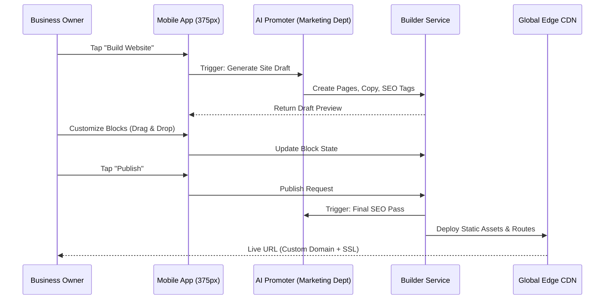

# [architecture] Website & Storefront Builder

**Title:** Implement OHC Drag-and-Drop Website & Storefront Builder
**Priority:** P0 (Critical)
**Estimated Scope:** Large

## Problem Statement
Small business owners (like Maya the baker and Carlos the handyman) need a fast, intuitive way to create a professional online presence without any coding knowledge. Existing platforms like Shopify and Wix are either too complex, require desktop access, or take hours to configure. OHC users need a builder that works flawlessly on a 375px mobile screen, allows them to go live in under 10 minutes, and relies on AI to handle design, copywriting, and SEO automatically.

## Research Report
### Market Gap & Competitive Analysis
- **Shopify:** Powerful but requires significant setup time (30-60 min). Management is not truly mobile-first. Assumes technical competency.
- **Wix / Squarespace:** Drag-and-drop is powerful on desktop but clunky or non-existent on mobile devices. AI tools are an afterthought rather than core infrastructure.
- **OHC Opportunity:** Treat AI as the primary designer ("The Promoter" department). A mobile-first, block-based editor that passes the "grandmother test." Instead of absolute positioning (like Wix), OHC uses a constrained, premium block system (glassmorphism, predefined typography).

### Core Features Needed
- Mobile-first block editor (Hero, Product Grid, Text, Testimonials, Booking Calendar, Contact Form).
- Premium templates with automatic branding consistency.
- 1-tap publishing flow (Draft → Live).
- Automatic SEO optimization by "The Promoter" AI.
- Custom domain provisioning with automatic SSL.

## Design Doc
### Architecture Flow

### Mobile UX Flow (375px First)
1. **Onboarding:** User selects business type (e.g., "Food Cart").
2. **AI Draft Generation:** The Promoter AI instantly generates a complete draft site with placeholder text and layout optimized for that industry.
3. **Block Editing:** Users see a vertical stack of blocks. Tapping a block opens a native mobile sheet to edit content (e.g., swap image, edit text).
4. **Adding Blocks:** A simple "+" button opens a drawer of functional blocks (Hero, Gallery, Calendar, Products).
5. **Publishing:** A persistent "Publish" button at the top right. 1-tap goes live.

### AI Agent Integration Points
- **The Promoter (Marketing & Advertising):**
  - Analyzes user's business type and automatically suggests the best initial layout.
  - Generates initial copywriting for Hero sections and About pages.
  - Automatically injects meta tags, OpenGraph images, and structured data for SEO.
- **The Manager (Operations):**
  - Seamlessly links the Product Grid block to active inventory.
  - Connects the Booking Calendar block to the user's availability.

### Key Design Decisions
- **Constrained Block System:** Unlike free-form builders, users cannot accidentally break the layout. Blocks are predefined, responsive components adhering to the OHC Premium Token library (Glassmorphism, 20px blur).
- **Mobile-First Editing:** The editor is designed exclusively for a 375px screen, utilizing bottom sheets and native mobile keyboards, ensuring it works perfectly on smartphones.
- **AI-Driven First Draft:** The blank page problem is eliminated. AI generates a 90% complete site based on 2-3 initial questions.
- **Invisible Infrastructure:** Users never see terms like "DNS", "A Record", or "SSL". Custom domain connection is handled behind the scenes.

## Implementation Prompt
**Role:** Implementer Agent
**Task:** Build the backend services and frontend components for the new Website & Storefront Builder.
**CUJ (Critical User Journey):**
1. The user logs into the mobile app and taps "Website".
2. The UI requests a generated draft from the AI Promoter.
3. The user adds a "Testimonials" block, edits the text using the native keyboard, and moves the block up.
4. The user taps "Publish", which finalizes the SEO metadata and deploys the site to a live URL with SSL.
**Acceptance Criteria:**
- The editor must be fully functional on a 375px viewport without horizontal scrolling.
- UI components must implement the OHC Design System (Glassmorphism, outfit/inter fonts).
- 100% E2E test coverage simulating the entire flow from login to live site verification using the Playwright browser tool.
- Unit tests must achieve 100% coverage for new backend and frontend logic. Do not prescribe specific DB schemas; design them to support multi-tenant isolation.

