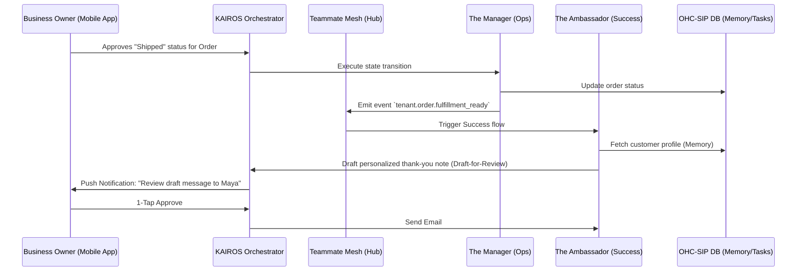

# AI Agent Department Architecture

## Title
OHC AI Agent Department Architecture: Invisible Complexity & 1-Tap Approvals

## Problem Statement
Small business owners (Maya, Carlos, Priya, Leo, Fatima) are overwhelmed by the cognitive overhead of managing operations, marketing, sales, customer success, finance, legal, and business strategy. They do not have time to learn complicated software, define complex automation rules, or manage multiple isolated tools. The OHC platform must handle all this complexity invisibly in the background. However, if AI agents act completely autonomously without human oversight, trust is broken, and costly mistakes can occur. The system needs a structured way to organize AI agents into recognizable "Departments" and coordinate their actions through a "Draft-for-Review" workflow that allows business owners to maintain full control with simple 1-tap approvals on their mobile devices.

## Research Report

### Persona-Specific Pain Point Summaries
- **Maya (Baker)**: Needs an agent to automatically draft replies to Instagram DMs at 2 AM ("Do you do vegan cakes?"), but wants to approve them before sending so her tone remains personal.
- **Carlos (Handyman)**: Struggles to find time to generate quotes after a site visit. Needs an agent to automatically draft a quote based on his voice notes and past pricing.
- **Priya (Boutique Owner)**: Overwhelmed by tracking inventory across multiple channels. Needs an agent to proactively suggest a sale on overstocked items.
- **Leo (Music Tutor)**: Forgetful about following up with inactive students. Needs an agent to draft friendly re-engagement emails.
- **Fatima (Food Cart)**: Requires extreme simplicity due to language barriers. Needs an agent to summarize daily operations in plain Arabic without technical jargon.

### Competitive Benchmark: SMB Automation Platforms
| Feature / Platform | OHC AI Departments | Zapier / Make | Shopify Flow | Square / Wix Auto |
| :--- | :--- | :--- | :--- | :--- |
| **User Setup Required** | **Zero (Pre-configured)** | High (Manual mapping) | Medium (Logic building) | Low (Basic triggers) |
| **Mental Model** | **Real-world Business Roles** | If-This-Then-That | Event-Condition-Action | Linear Rules |
| **Trust Mechanism** | **1-Tap "Draft-for-Review"** | None (Executes blindly) | None | Basic Notifications |
| **Contextual Memory** | **Shared Semantic** | Isolated to specific run | Basic Store Data | Isolated |
| **Mobile-First Approval** | **100% Native Feel (375px)** | Clunky Mobile Web | Desktop Preferred | Basic |

### The "Grandmother Test" Analysis
Organizing agents into technical categories (e.g., "NLP Module", "Image Generator") confuses users. Categorizing them into real-world business roles (Operations, Marketing, Sales, Customer Success, Finance, Legal, Advisory) is instantly understandable. High-risk actions (sending emails, publishing posts, initiating refunds) require explicit owner approval to build trust. Low-risk actions (categorizing data, internal tagging) can be auto-executed.

## Design Doc

### High-Level Architecture Diagram (Mermaid.js)

### AI Agent Departments
1.  **Operations ("The Manager")**: Order processing, inventory tracking, fulfillment, refunds.
2.  **Marketing & Advertising ("The Promoter")**: Website design, SEO, social media posts, promotional content.
3.  **Sales & Acquisition ("The Salesperson")**: Quote generation, lead follow-up, referral tracking, upselling.
4.  **Customer Success ("The Ambassador")**: Message replies, order updates, review requests, re-engagement.
5.  **Finance & Payments ("The Accountant")**: Payment processing, financial reports, subscription billing, tax summaries.
6.  **Legal & Compliance ("The Protector")**: Terms/policies, contracts, GDPR compliance, liability.
7.  **Business Advisory ("The Advisor")**: Weekly health reports, action suggestions, seasonal trends.

### Mobile UX Flow (375px First)
1.  **Notification**: The business owner receives a push notification (e.g., "The Ambassador drafted a reply to a new Instagram DM").
2.  **Review**: The user taps the notification and opens the OHC mobile app. The UI presents the drafted message clearly and concisely using premium Glassmorphism design tokens (blur 20px, saturate 200%).
3.  **Approval/Edit**: The user can either 1-tap "Approve & Send" (a large, accessible button ≥ 44x44px), or tap to edit the draft manually.
4.  **Execution**: Upon approval, the Orchestrator executes the action. The UI updates optimistically, showing a success state instantly while background sync handles the actual request.

### Key Design Decisions
1.  **Draft-for-Review Default**: All external-facing or financially impacting actions MUST default to Draft-for-Review to maintain trust and prevent errors.
2.  **Shared Task List Coordination**: Coordination between agents happens via the KAIROS Shared Task List and Teammate Mesh to ensure reliable handoffs, prevent duplicate actions, and maintain strict multi-tenant boundaries.
3.  **Semantic Memory Integration**: Agents use semantic memory to recall past interactions and customer preferences, avoiding brittle relational lookups.
4.  **Budgeting and Throttling**: AI usage is tied directly to the tenant's multi-tenant tier limits. The orchestrator must track the number of actions executed per month. When the limit is approached, the system degrades gracefully, pausing autonomous execution and prompting an upgrade via the "Business Advisory" agent, rather than displaying raw API error codes.

## Implementation Prompt
**To Implementer Agent:**
Implement the "Draft-for-Review" approval engine within the KAIROS Orchestrator to support the 7 AI Agent Departments.
1. Define a unified API contract for agents to submit tasks with an `ActionRisk` level (Low/High).
2. Create a pending approval queue in the database for tasks marked as High Risk, ensuring all queries are strictly scoped by the tenant's identifier.
3. Build the mobile-first (375px) UI component that displays a feed of pending agent actions using OHC premium design tokens (Outfit/Inter fonts, Glassmorphism).
4. Implement the "1-Tap Approve" endpoint that transitions a task from `PENDING_APPROVAL` to `EXECUTING` and triggers the agent to finalize the action via the Teammate Mesh.
5. Ensure the UI optimistically updates upon approval and handles network resilience gracefully.
6. Enforce tiered usage limits at the API layer, blocking executions when quotas are exceeded and returning a graceful error payload.
7. Include End-to-End UI tests verifying the complete flow from an agent submitting a draft to the user approving it and the final execution.
Do not prescribe the specific database schema or backend routing; focus on the unified API contract and the user journey transitions.

## Priority
P0

## Estimated Scope
Large
