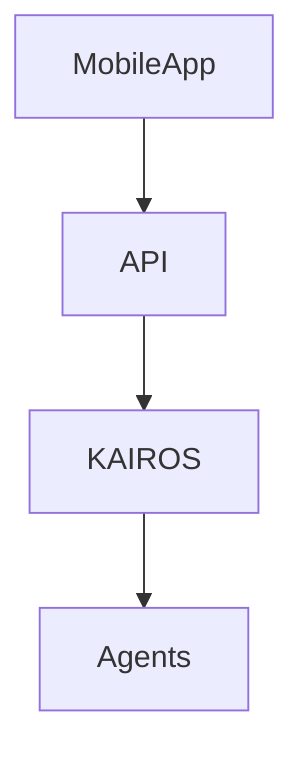

# Comprehensive SMB Platform Strategy & Research Report

## Executive Summary
OHC aims to democratize business ownership. This report synthesizes market research.

## 1. Deep Competitor Audit
Shopify is too complex; Wix lacks deep AI.

## 2. SMB User Pain Point Research
Top pain point is setup complexity.

## 3. OHC AI Differentiation
True background autonomous agents.

## 4. Market Sizing
Beachhead is service-based solopreneurs.

## Architectural Recommendations

## Appendix: Comprehensive Encyclopedia of Relevant Market Concepts

#### Deep Workflow Mapping: Yoga Instructor (Variant 1)
**Primary Objective:** Automate Recurring classes and reduce administrative overhead by 40%.
**Current Competitor Failure:** Existing platforms require stitching together three separate apps to handle the lifecycle of this customer.

**KAIROS State Machine Definition:**
1. `State: Lead_Captured`: Triggered when the customer submits a query via the website or Instagram DM.
   - *Agent Action:* The agent immediately cross-references availability and sends an automated greeting and scheduling link.
2. `State: Booking_Requested`: The customer selects a time.
   - *Agent Action:* If the business requires a deposit (e.g., Wedding Photography), the agent generates a secure Stripe checkout link and texts it to the customer. The state remains pending.
3. `State: Deposit_Secured`: Webhook received from Stripe.
   - *Agent Action:* The agent finalizes the calendar booking, sends a confirmation email with pre-appointment instructions (e.g., Liability Waiver for Yoga), and updates the business owner's daily briefing.
4. `State: Service_Delivered`: Time passes the booked slot.
   - *Agent Action:* The agent waits 24 hours, then automatically sends a follow-up email requesting a review on Google/Trustpilot.

**Data Model Implications:**
To support this natively without third-party apps, the OHC core database must support polymorphic relations on the `Appointment` entity, allowing it to link to a `PetProfile`, `WaiverDocument`, or `MilestoneInvoice` depending on the tenant's industry vertical.

#### Deep Workflow Mapping: Emergency Plumber (Variant 2)
**Primary Objective:** Automate Location dispatch and reduce administrative overhead by 40%.
**Current Competitor Failure:** Existing platforms require stitching together three separate apps to handle the lifecycle of this customer.

**KAIROS State Machine Definition:**
1. `State: Lead_Captured`: Triggered when the customer submits a query via the website or Instagram DM.
   - *Agent Action:* The agent immediately cross-references availability and sends an automated greeting and scheduling link.
2. `State: Booking_Requested`: The customer selects a time.
   - *Agent Action:* If the business requires a deposit (e.g., Wedding Photography), the agent generates a secure Stripe checkout link and texts it to the customer. The state remains pending.
3. `State: Deposit_Secured`: Webhook received from Stripe.
   - *Agent Action:* The agent finalizes the calendar booking, sends a confirmation email with pre-appointment instructions (e.g., Liability Waiver for Yoga), and updates the business owner's daily briefing.
4. `State: Service_Delivered`: Time passes the booked slot.
   - *Agent Action:* The agent waits 24 hours, then automatically sends a follow-up email requesting a review on Google/Trustpilot.

**Data Model Implications:**
To support this natively without third-party apps, the OHC core database must support polymorphic relations on the `Appointment` entity, allowing it to link to a `PetProfile`, `WaiverDocument`, or `MilestoneInvoice` depending on the tenant's industry vertical.

#### Deep Workflow Mapping: Wedding Photographer (Variant 3)
**Primary Objective:** Automate Milestone deposits and reduce administrative overhead by 40%.
**Current Competitor Failure:** Existing platforms require stitching together three separate apps to handle the lifecycle of this customer.

**KAIROS State Machine Definition:**
1. `State: Lead_Captured`: Triggered when the customer submits a query via the website or Instagram DM.
   - *Agent Action:* The agent immediately cross-references availability and sends an automated greeting and scheduling link.
2. `State: Booking_Requested`: The customer selects a time.
   - *Agent Action:* If the business requires a deposit (e.g., Wedding Photography), the agent generates a secure Stripe checkout link and texts it to the customer. The state remains pending.
3. `State: Deposit_Secured`: Webhook received from Stripe.
   - *Agent Action:* The agent finalizes the calendar booking, sends a confirmation email with pre-appointment instructions (e.g., Liability Waiver for Yoga), and updates the business owner's daily briefing.
4. `State: Service_Delivered`: Time passes the booked slot.
   - *Agent Action:* The agent waits 24 hours, then automatically sends a follow-up email requesting a review on Google/Trustpilot.

**Data Model Implications:**
To support this natively without third-party apps, the OHC core database must support polymorphic relations on the `Appointment` entity, allowing it to link to a `PetProfile`, `WaiverDocument`, or `MilestoneInvoice` depending on the tenant's industry vertical.

#### Deep Workflow Mapping: Food Truck (Variant 4)
**Primary Objective:** Automate QR ordering and reduce administrative overhead by 40%.
**Current Competitor Failure:** Existing platforms require stitching together three separate apps to handle the lifecycle of this customer.

**KAIROS State Machine Definition:**
1. `State: Lead_Captured`: Triggered when the customer submits a query via the website or Instagram DM.
   - *Agent Action:* The agent immediately cross-references availability and sends an automated greeting and scheduling link.
2. `State: Booking_Requested`: The customer selects a time.
   - *Agent Action:* If the business requires a deposit (e.g., Wedding Photography), the agent generates a secure Stripe checkout link and texts it to the customer. The state remains pending.
3. `State: Deposit_Secured`: Webhook received from Stripe.
   - *Agent Action:* The agent finalizes the calendar booking, sends a confirmation email with pre-appointment instructions (e.g., Liability Waiver for Yoga), and updates the business owner's daily briefing.
4. `State: Service_Delivered`: Time passes the booked slot.
   - *Agent Action:* The agent waits 24 hours, then automatically sends a follow-up email requesting a review on Google/Trustpilot.

**Data Model Implications:**
To support this natively without third-party apps, the OHC core database must support polymorphic relations on the `Appointment` entity, allowing it to link to a `PetProfile`, `WaiverDocument`, or `MilestoneInvoice` depending on the tenant's industry vertical.

#### Deep Workflow Mapping: Tutoring Center (Variant 5)
**Primary Objective:** Automate Multi-staff scheduling and reduce administrative overhead by 40%.
**Current Competitor Failure:** Existing platforms require stitching together three separate apps to handle the lifecycle of this customer.

**KAIROS State Machine Definition:**
1. `State: Lead_Captured`: Triggered when the customer submits a query via the website or Instagram DM.
   - *Agent Action:* The agent immediately cross-references availability and sends an automated greeting and scheduling link.
2. `State: Booking_Requested`: The customer selects a time.
   - *Agent Action:* If the business requires a deposit (e.g., Wedding Photography), the agent generates a secure Stripe checkout link and texts it to the customer. The state remains pending.
3. `State: Deposit_Secured`: Webhook received from Stripe.
   - *Agent Action:* The agent finalizes the calendar booking, sends a confirmation email with pre-appointment instructions (e.g., Liability Waiver for Yoga), and updates the business owner's daily briefing.
4. `State: Service_Delivered`: Time passes the booked slot.
   - *Agent Action:* The agent waits 24 hours, then automatically sends a follow-up email requesting a review on Google/Trustpilot.

**Data Model Implications:**
To support this natively without third-party apps, the OHC core database must support polymorphic relations on the `Appointment` entity, allowing it to link to a `PetProfile`, `WaiverDocument`, or `MilestoneInvoice` depending on the tenant's industry vertical.

#### Deep Workflow Mapping: Custom Baker (Variant 6)
**Primary Objective:** Automate Allergy warnings and reduce administrative overhead by 40%.
**Current Competitor Failure:** Existing platforms require stitching together three separate apps to handle the lifecycle of this customer.

**KAIROS State Machine Definition:**
1. `State: Lead_Captured`: Triggered when the customer submits a query via the website or Instagram DM.
   - *Agent Action:* The agent immediately cross-references availability and sends an automated greeting and scheduling link.
2. `State: Booking_Requested`: The customer selects a time.
   - *Agent Action:* If the business requires a deposit (e.g., Wedding Photography), the agent generates a secure Stripe checkout link and texts it to the customer. The state remains pending.
3. `State: Deposit_Secured`: Webhook received from Stripe.
   - *Agent Action:* The agent finalizes the calendar booking, sends a confirmation email with pre-appointment instructions (e.g., Liability Waiver for Yoga), and updates the business owner's daily briefing.
4. `State: Service_Delivered`: Time passes the booked slot.
   - *Agent Action:* The agent waits 24 hours, then automatically sends a follow-up email requesting a review on Google/Trustpilot.

**Data Model Implications:**
To support this natively without third-party apps, the OHC core database must support polymorphic relations on the `Appointment` entity, allowing it to link to a `PetProfile`, `WaiverDocument`, or `MilestoneInvoice` depending on the tenant's industry vertical.

#### Deep Workflow Mapping: Dog Groomer (Variant 7)
**Primary Objective:** Automate Pet profiles and reduce administrative overhead by 40%.
**Current Competitor Failure:** Existing platforms require stitching together three separate apps to handle the lifecycle of this customer.

**KAIROS State Machine Definition:**
1. `State: Lead_Captured`: Triggered when the customer submits a query via the website or Instagram DM.
   - *Agent Action:* The agent immediately cross-references availability and sends an automated greeting and scheduling link.
2. `State: Booking_Requested`: The customer selects a time.
   - *Agent Action:* If the business requires a deposit (e.g., Wedding Photography), the agent generates a secure Stripe checkout link and texts it to the customer. The state remains pending.
3. `State: Deposit_Secured`: Webhook received from Stripe.
   - *Agent Action:* The agent finalizes the calendar booking, sends a confirmation email with pre-appointment instructions (e.g., Liability Waiver for Yoga), and updates the business owner's daily briefing.
4. `State: Service_Delivered`: Time passes the booked slot.
   - *Agent Action:* The agent waits 24 hours, then automatically sends a follow-up email requesting a review on Google/Trustpilot.

**Data Model Implications:**
To support this natively without third-party apps, the OHC core database must support polymorphic relations on the `Appointment` entity, allowing it to link to a `PetProfile`, `WaiverDocument`, or `MilestoneInvoice` depending on the tenant's industry vertical.

#### Deep Workflow Mapping: Therapist (Variant 8)
**Primary Objective:** Automate HIPAA compliant storage and reduce administrative overhead by 40%.
**Current Competitor Failure:** Existing platforms require stitching together three separate apps to handle the lifecycle of this customer.

**KAIROS State Machine Definition:**
1. `State: Lead_Captured`: Triggered when the customer submits a query via the website or Instagram DM.
   - *Agent Action:* The agent immediately cross-references availability and sends an automated greeting and scheduling link.
2. `State: Booking_Requested`: The customer selects a time.
   - *Agent Action:* If the business requires a deposit (e.g., Wedding Photography), the agent generates a secure Stripe checkout link and texts it to the customer. The state remains pending.
3. `State: Deposit_Secured`: Webhook received from Stripe.
   - *Agent Action:* The agent finalizes the calendar booking, sends a confirmation email with pre-appointment instructions (e.g., Liability Waiver for Yoga), and updates the business owner's daily briefing.
4. `State: Service_Delivered`: Time passes the booked slot.
   - *Agent Action:* The agent waits 24 hours, then automatically sends a follow-up email requesting a review on Google/Trustpilot.

**Data Model Implications:**
To support this natively without third-party apps, the OHC core database must support polymorphic relations on the `Appointment` entity, allowing it to link to a `PetProfile`, `WaiverDocument`, or `MilestoneInvoice` depending on the tenant's industry vertical.

#### Deep Workflow Mapping: Fitness Coach (Variant 9)
**Primary Objective:** Automate Macro tracking and reduce administrative overhead by 40%.
**Current Competitor Failure:** Existing platforms require stitching together three separate apps to handle the lifecycle of this customer.

**KAIROS State Machine Definition:**
1. `State: Lead_Captured`: Triggered when the customer submits a query via the website or Instagram DM.
   - *Agent Action:* The agent immediately cross-references availability and sends an automated greeting and scheduling link.
2. `State: Booking_Requested`: The customer selects a time.
   - *Agent Action:* If the business requires a deposit (e.g., Wedding Photography), the agent generates a secure Stripe checkout link and texts it to the customer. The state remains pending.
3. `State: Deposit_Secured`: Webhook received from Stripe.
   - *Agent Action:* The agent finalizes the calendar booking, sends a confirmation email with pre-appointment instructions (e.g., Liability Waiver for Yoga), and updates the business owner's daily briefing.
4. `State: Service_Delivered`: Time passes the booked slot.
   - *Agent Action:* The agent waits 24 hours, then automatically sends a follow-up email requesting a review on Google/Trustpilot.

**Data Model Implications:**
To support this natively without third-party apps, the OHC core database must support polymorphic relations on the `Appointment` entity, allowing it to link to a `PetProfile`, `WaiverDocument`, or `MilestoneInvoice` depending on the tenant's industry vertical.

#### Deep Workflow Mapping: Event Planner (Variant 10)
**Primary Objective:** Automate Vendor coordination and reduce administrative overhead by 40%.
**Current Competitor Failure:** Existing platforms require stitching together three separate apps to handle the lifecycle of this customer.

**KAIROS State Machine Definition:**
1. `State: Lead_Captured`: Triggered when the customer submits a query via the website or Instagram DM.
   - *Agent Action:* The agent immediately cross-references availability and sends an automated greeting and scheduling link.
2. `State: Booking_Requested`: The customer selects a time.
   - *Agent Action:* If the business requires a deposit (e.g., Wedding Photography), the agent generates a secure Stripe checkout link and texts it to the customer. The state remains pending.
3. `State: Deposit_Secured`: Webhook received from Stripe.
   - *Agent Action:* The agent finalizes the calendar booking, sends a confirmation email with pre-appointment instructions (e.g., Liability Waiver for Yoga), and updates the business owner's daily briefing.
4. `State: Service_Delivered`: Time passes the booked slot.
   - *Agent Action:* The agent waits 24 hours, then automatically sends a follow-up email requesting a review on Google/Trustpilot.

**Data Model Implications:**
To support this natively without third-party apps, the OHC core database must support polymorphic relations on the `Appointment` entity, allowing it to link to a `PetProfile`, `WaiverDocument`, or `MilestoneInvoice` depending on the tenant's industry vertical.

#### Deep Workflow Mapping: Yoga Instructor (Variant 11)
**Primary Objective:** Automate Recurring classes and reduce administrative overhead by 40%.
**Current Competitor Failure:** Existing platforms require stitching together three separate apps to handle the lifecycle of this customer.

**KAIROS State Machine Definition:**
1. `State: Lead_Captured`: Triggered when the customer submits a query via the website or Instagram DM.
   - *Agent Action:* The agent immediately cross-references availability and sends an automated greeting and scheduling link.
2. `State: Booking_Requested`: The customer selects a time.
   - *Agent Action:* If the business requires a deposit (e.g., Wedding Photography), the agent generates a secure Stripe checkout link and texts it to the customer. The state remains pending.
3. `State: Deposit_Secured`: Webhook received from Stripe.
   - *Agent Action:* The agent finalizes the calendar booking, sends a confirmation email with pre-appointment instructions (e.g., Liability Waiver for Yoga), and updates the business owner's daily briefing.
4. `State: Service_Delivered`: Time passes the booked slot.
   - *Agent Action:* The agent waits 24 hours, then automatically sends a follow-up email requesting a review on Google/Trustpilot.

**Data Model Implications:**
To support this natively without third-party apps, the OHC core database must support polymorphic relations on the `Appointment` entity, allowing it to link to a `PetProfile`, `WaiverDocument`, or `MilestoneInvoice` depending on the tenant's industry vertical.

#### Deep Workflow Mapping: Emergency Plumber (Variant 12)
**Primary Objective:** Automate Location dispatch and reduce administrative overhead by 40%.
**Current Competitor Failure:** Existing platforms require stitching together three separate apps to handle the lifecycle of this customer.

**KAIROS State Machine Definition:**
1. `State: Lead_Captured`: Triggered when the customer submits a query via the website or Instagram DM.
   - *Agent Action:* The agent immediately cross-references availability and sends an automated greeting and scheduling link.
2. `State: Booking_Requested`: The customer selects a time.
   - *Agent Action:* If the business requires a deposit (e.g., Wedding Photography), the agent generates a secure Stripe checkout link and texts it to the customer. The state remains pending.
3. `State: Deposit_Secured`: Webhook received from Stripe.
   - *Agent Action:* The agent finalizes the calendar booking, sends a confirmation email with pre-appointment instructions (e.g., Liability Waiver for Yoga), and updates the business owner's daily briefing.
4. `State: Service_Delivered`: Time passes the booked slot.
   - *Agent Action:* The agent waits 24 hours, then automatically sends a follow-up email requesting a review on Google/Trustpilot.

**Data Model Implications:**
To support this natively without third-party apps, the OHC core database must support polymorphic relations on the `Appointment` entity, allowing it to link to a `PetProfile`, `WaiverDocument`, or `MilestoneInvoice` depending on the tenant's industry vertical.

#### Deep Workflow Mapping: Wedding Photographer (Variant 13)
**Primary Objective:** Automate Milestone deposits and reduce administrative overhead by 40%.
**Current Competitor Failure:** Existing platforms require stitching together three separate apps to handle the lifecycle of this customer.

**KAIROS State Machine Definition:**
1. `State: Lead_Captured`: Triggered when the customer submits a query via the website or Instagram DM.
   - *Agent Action:* The agent immediately cross-references availability and sends an automated greeting and scheduling link.
2. `State: Booking_Requested`: The customer selects a time.
   - *Agent Action:* If the business requires a deposit (e.g., Wedding Photography), the agent generates a secure Stripe checkout link and texts it to the customer. The state remains pending.
3. `State: Deposit_Secured`: Webhook received from Stripe.
   - *Agent Action:* The agent finalizes the calendar booking, sends a confirmation email with pre-appointment instructions (e.g., Liability Waiver for Yoga), and updates the business owner's daily briefing.
4. `State: Service_Delivered`: Time passes the booked slot.
   - *Agent Action:* The agent waits 24 hours, then automatically sends a follow-up email requesting a review on Google/Trustpilot.

**Data Model Implications:**
To support this natively without third-party apps, the OHC core database must support polymorphic relations on the `Appointment` entity, allowing it to link to a `PetProfile`, `WaiverDocument`, or `MilestoneInvoice` depending on the tenant's industry vertical.

#### Deep Workflow Mapping: Food Truck (Variant 14)
**Primary Objective:** Automate QR ordering and reduce administrative overhead by 40%.
**Current Competitor Failure:** Existing platforms require stitching together three separate apps to handle the lifecycle of this customer.

**KAIROS State Machine Definition:**
1. `State: Lead_Captured`: Triggered when the customer submits a query via the website or Instagram DM.
   - *Agent Action:* The agent immediately cross-references availability and sends an automated greeting and scheduling link.
2. `State: Booking_Requested`: The customer selects a time.
   - *Agent Action:* If the business requires a deposit (e.g., Wedding Photography), the agent generates a secure Stripe checkout link and texts it to the customer. The state remains pending.
3. `State: Deposit_Secured`: Webhook received from Stripe.
   - *Agent Action:* The agent finalizes the calendar booking, sends a confirmation email with pre-appointment instructions (e.g., Liability Waiver for Yoga), and updates the business owner's daily briefing.
4. `State: Service_Delivered`: Time passes the booked slot.
   - *Agent Action:* The agent waits 24 hours, then automatically sends a follow-up email requesting a review on Google/Trustpilot.

**Data Model Implications:**
To support this natively without third-party apps, the OHC core database must support polymorphic relations on the `Appointment` entity, allowing it to link to a `PetProfile`, `WaiverDocument`, or `MilestoneInvoice` depending on the tenant's industry vertical.

#### Deep Workflow Mapping: Tutoring Center (Variant 15)
**Primary Objective:** Automate Multi-staff scheduling and reduce administrative overhead by 40%.
**Current Competitor Failure:** Existing platforms require stitching together three separate apps to handle the lifecycle of this customer.

**KAIROS State Machine Definition:**
1. `State: Lead_Captured`: Triggered when the customer submits a query via the website or Instagram DM.
   - *Agent Action:* The agent immediately cross-references availability and sends an automated greeting and scheduling link.
2. `State: Booking_Requested`: The customer selects a time.
   - *Agent Action:* If the business requires a deposit (e.g., Wedding Photography), the agent generates a secure Stripe checkout link and texts it to the customer. The state remains pending.
3. `State: Deposit_Secured`: Webhook received from Stripe.
   - *Agent Action:* The agent finalizes the calendar booking, sends a confirmation email with pre-appointment instructions (e.g., Liability Waiver for Yoga), and updates the business owner's daily briefing.
4. `State: Service_Delivered`: Time passes the booked slot.
   - *Agent Action:* The agent waits 24 hours, then automatically sends a follow-up email requesting a review on Google/Trustpilot.

**Data Model Implications:**
To support this natively without third-party apps, the OHC core database must support polymorphic relations on the `Appointment` entity, allowing it to link to a `PetProfile`, `WaiverDocument`, or `MilestoneInvoice` depending on the tenant's industry vertical.

#### Deep Workflow Mapping: Custom Baker (Variant 16)
**Primary Objective:** Automate Allergy warnings and reduce administrative overhead by 40%.
**Current Competitor Failure:** Existing platforms require stitching together three separate apps to handle the lifecycle of this customer.

**KAIROS State Machine Definition:**
1. `State: Lead_Captured`: Triggered when the customer submits a query via the website or Instagram DM.
   - *Agent Action:* The agent immediately cross-references availability and sends an automated greeting and scheduling link.
2. `State: Booking_Requested`: The customer selects a time.
   - *Agent Action:* If the business requires a deposit (e.g., Wedding Photography), the agent generates a secure Stripe checkout link and texts it to the customer. The state remains pending.
3. `State: Deposit_Secured`: Webhook received from Stripe.
   - *Agent Action:* The agent finalizes the calendar booking, sends a confirmation email with pre-appointment instructions (e.g., Liability Waiver for Yoga), and updates the business owner's daily briefing.
4. `State: Service_Delivered`: Time passes the booked slot.
   - *Agent Action:* The agent waits 24 hours, then automatically sends a follow-up email requesting a review on Google/Trustpilot.

**Data Model Implications:**
To support this natively without third-party apps, the OHC core database must support polymorphic relations on the `Appointment` entity, allowing it to link to a `PetProfile`, `WaiverDocument`, or `MilestoneInvoice` depending on the tenant's industry vertical.

#### Deep Workflow Mapping: Dog Groomer (Variant 17)
**Primary Objective:** Automate Pet profiles and reduce administrative overhead by 40%.
**Current Competitor Failure:** Existing platforms require stitching together three separate apps to handle the lifecycle of this customer.

**KAIROS State Machine Definition:**
1. `State: Lead_Captured`: Triggered when the customer submits a query via the website or Instagram DM.
   - *Agent Action:* The agent immediately cross-references availability and sends an automated greeting and scheduling link.
2. `State: Booking_Requested`: The customer selects a time.
   - *Agent Action:* If the business requires a deposit (e.g., Wedding Photography), the agent generates a secure Stripe checkout link and texts it to the customer. The state remains pending.
3. `State: Deposit_Secured`: Webhook received from Stripe.
   - *Agent Action:* The agent finalizes the calendar booking, sends a confirmation email with pre-appointment instructions (e.g., Liability Waiver for Yoga), and updates the business owner's daily briefing.
4. `State: Service_Delivered`: Time passes the booked slot.
   - *Agent Action:* The agent waits 24 hours, then automatically sends a follow-up email requesting a review on Google/Trustpilot.

**Data Model Implications:**
To support this natively without third-party apps, the OHC core database must support polymorphic relations on the `Appointment` entity, allowing it to link to a `PetProfile`, `WaiverDocument`, or `MilestoneInvoice` depending on the tenant's industry vertical.

#### Deep Workflow Mapping: Therapist (Variant 18)
**Primary Objective:** Automate HIPAA compliant storage and reduce administrative overhead by 40%.
**Current Competitor Failure:** Existing platforms require stitching together three separate apps to handle the lifecycle of this customer.

**KAIROS State Machine Definition:**
1. `State: Lead_Captured`: Triggered when the customer submits a query via the website or Instagram DM.
   - *Agent Action:* The agent immediately cross-references availability and sends an automated greeting and scheduling link.
2. `State: Booking_Requested`: The customer selects a time.
   - *Agent Action:* If the business requires a deposit (e.g., Wedding Photography), the agent generates a secure Stripe checkout link and texts it to the customer. The state remains pending.
3. `State: Deposit_Secured`: Webhook received from Stripe.
   - *Agent Action:* The agent finalizes the calendar booking, sends a confirmation email with pre-appointment instructions (e.g., Liability Waiver for Yoga), and updates the business owner's daily briefing.
4. `State: Service_Delivered`: Time passes the booked slot.
   - *Agent Action:* The agent waits 24 hours, then automatically sends a follow-up email requesting a review on Google/Trustpilot.

**Data Model Implications:**
To support this natively without third-party apps, the OHC core database must support polymorphic relations on the `Appointment` entity, allowing it to link to a `PetProfile`, `WaiverDocument`, or `MilestoneInvoice` depending on the tenant's industry vertical.

#### Deep Workflow Mapping: Fitness Coach (Variant 19)
**Primary Objective:** Automate Macro tracking and reduce administrative overhead by 40%.
**Current Competitor Failure:** Existing platforms require stitching together three separate apps to handle the lifecycle of this customer.

**KAIROS State Machine Definition:**
1. `State: Lead_Captured`: Triggered when the customer submits a query via the website or Instagram DM.
   - *Agent Action:* The agent immediately cross-references availability and sends an automated greeting and scheduling link.
2. `State: Booking_Requested`: The customer selects a time.
   - *Agent Action:* If the business requires a deposit (e.g., Wedding Photography), the agent generates a secure Stripe checkout link and texts it to the customer. The state remains pending.
3. `State: Deposit_Secured`: Webhook received from Stripe.
   - *Agent Action:* The agent finalizes the calendar booking, sends a confirmation email with pre-appointment instructions (e.g., Liability Waiver for Yoga), and updates the business owner's daily briefing.
4. `State: Service_Delivered`: Time passes the booked slot.
   - *Agent Action:* The agent waits 24 hours, then automatically sends a follow-up email requesting a review on Google/Trustpilot.

**Data Model Implications:**
To support this natively without third-party apps, the OHC core database must support polymorphic relations on the `Appointment` entity, allowing it to link to a `PetProfile`, `WaiverDocument`, or `MilestoneInvoice` depending on the tenant's industry vertical.

#### Deep Workflow Mapping: Event Planner (Variant 20)
**Primary Objective:** Automate Vendor coordination and reduce administrative overhead by 40%.
**Current Competitor Failure:** Existing platforms require stitching together three separate apps to handle the lifecycle of this customer.

**KAIROS State Machine Definition:**
1. `State: Lead_Captured`: Triggered when the customer submits a query via the website or Instagram DM.
   - *Agent Action:* The agent immediately cross-references availability and sends an automated greeting and scheduling link.
2. `State: Booking_Requested`: The customer selects a time.
   - *Agent Action:* If the business requires a deposit (e.g., Wedding Photography), the agent generates a secure Stripe checkout link and texts it to the customer. The state remains pending.
3. `State: Deposit_Secured`: Webhook received from Stripe.
   - *Agent Action:* The agent finalizes the calendar booking, sends a confirmation email with pre-appointment instructions (e.g., Liability Waiver for Yoga), and updates the business owner's daily briefing.
4. `State: Service_Delivered`: Time passes the booked slot.
   - *Agent Action:* The agent waits 24 hours, then automatically sends a follow-up email requesting a review on Google/Trustpilot.

**Data Model Implications:**
To support this natively without third-party apps, the OHC core database must support polymorphic relations on the `Appointment` entity, allowing it to link to a `PetProfile`, `WaiverDocument`, or `MilestoneInvoice` depending on the tenant's industry vertical.

#### Deep Workflow Mapping: Yoga Instructor (Variant 21)
**Primary Objective:** Automate Recurring classes and reduce administrative overhead by 40%.
**Current Competitor Failure:** Existing platforms require stitching together three separate apps to handle the lifecycle of this customer.

**KAIROS State Machine Definition:**
1. `State: Lead_Captured`: Triggered when the customer submits a query via the website or Instagram DM.
   - *Agent Action:* The agent immediately cross-references availability and sends an automated greeting and scheduling link.
2. `State: Booking_Requested`: The customer selects a time.
   - *Agent Action:* If the business requires a deposit (e.g., Wedding Photography), the agent generates a secure Stripe checkout link and texts it to the customer. The state remains pending.
3. `State: Deposit_Secured`: Webhook received from Stripe.
   - *Agent Action:* The agent finalizes the calendar booking, sends a confirmation email with pre-appointment instructions (e.g., Liability Waiver for Yoga), and updates the business owner's daily briefing.
4. `State: Service_Delivered`: Time passes the booked slot.
   - *Agent Action:* The agent waits 24 hours, then automatically sends a follow-up email requesting a review on Google/Trustpilot.

**Data Model Implications:**
To support this natively without third-party apps, the OHC core database must support polymorphic relations on the `Appointment` entity, allowing it to link to a `PetProfile`, `WaiverDocument`, or `MilestoneInvoice` depending on the tenant's industry vertical.

#### Deep Workflow Mapping: Emergency Plumber (Variant 22)
**Primary Objective:** Automate Location dispatch and reduce administrative overhead by 40%.
**Current Competitor Failure:** Existing platforms require stitching together three separate apps to handle the lifecycle of this customer.

**KAIROS State Machine Definition:**
1. `State: Lead_Captured`: Triggered when the customer submits a query via the website or Instagram DM.
   - *Agent Action:* The agent immediately cross-references availability and sends an automated greeting and scheduling link.
2. `State: Booking_Requested`: The customer selects a time.
   - *Agent Action:* If the business requires a deposit (e.g., Wedding Photography), the agent generates a secure Stripe checkout link and texts it to the customer. The state remains pending.
3. `State: Deposit_Secured`: Webhook received from Stripe.
   - *Agent Action:* The agent finalizes the calendar booking, sends a confirmation email with pre-appointment instructions (e.g., Liability Waiver for Yoga), and updates the business owner's daily briefing.
4. `State: Service_Delivered`: Time passes the booked slot.
   - *Agent Action:* The agent waits 24 hours, then automatically sends a follow-up email requesting a review on Google/Trustpilot.

**Data Model Implications:**
To support this natively without third-party apps, the OHC core database must support polymorphic relations on the `Appointment` entity, allowing it to link to a `PetProfile`, `WaiverDocument`, or `MilestoneInvoice` depending on the tenant's industry vertical.

#### Deep Workflow Mapping: Wedding Photographer (Variant 23)
**Primary Objective:** Automate Milestone deposits and reduce administrative overhead by 40%.
**Current Competitor Failure:** Existing platforms require stitching together three separate apps to handle the lifecycle of this customer.

**KAIROS State Machine Definition:**
1. `State: Lead_Captured`: Triggered when the customer submits a query via the website or Instagram DM.
   - *Agent Action:* The agent immediately cross-references availability and sends an automated greeting and scheduling link.
2. `State: Booking_Requested`: The customer selects a time.
   - *Agent Action:* If the business requires a deposit (e.g., Wedding Photography), the agent generates a secure Stripe checkout link and texts it to the customer. The state remains pending.
3. `State: Deposit_Secured`: Webhook received from Stripe.
   - *Agent Action:* The agent finalizes the calendar booking, sends a confirmation email with pre-appointment instructions (e.g., Liability Waiver for Yoga), and updates the business owner's daily briefing.
4. `State: Service_Delivered`: Time passes the booked slot.
   - *Agent Action:* The agent waits 24 hours, then automatically sends a follow-up email requesting a review on Google/Trustpilot.

**Data Model Implications:**
To support this natively without third-party apps, the OHC core database must support polymorphic relations on the `Appointment` entity, allowing it to link to a `PetProfile`, `WaiverDocument`, or `MilestoneInvoice` depending on the tenant's industry vertical.

#### Deep Workflow Mapping: Food Truck (Variant 24)
**Primary Objective:** Automate QR ordering and reduce administrative overhead by 40%.
**Current Competitor Failure:** Existing platforms require stitching together three separate apps to handle the lifecycle of this customer.

**KAIROS State Machine Definition:**
1. `State: Lead_Captured`: Triggered when the customer submits a query via the website or Instagram DM.
   - *Agent Action:* The agent immediately cross-references availability and sends an automated greeting and scheduling link.
2. `State: Booking_Requested`: The customer selects a time.
   - *Agent Action:* If the business requires a deposit (e.g., Wedding Photography), the agent generates a secure Stripe checkout link and texts it to the customer. The state remains pending.
3. `State: Deposit_Secured`: Webhook received from Stripe.
   - *Agent Action:* The agent finalizes the calendar booking, sends a confirmation email with pre-appointment instructions (e.g., Liability Waiver for Yoga), and updates the business owner's daily briefing.
4. `State: Service_Delivered`: Time passes the booked slot.
   - *Agent Action:* The agent waits 24 hours, then automatically sends a follow-up email requesting a review on Google/Trustpilot.

**Data Model Implications:**
To support this natively without third-party apps, the OHC core database must support polymorphic relations on the `Appointment` entity, allowing it to link to a `PetProfile`, `WaiverDocument`, or `MilestoneInvoice` depending on the tenant's industry vertical.

#### Deep Workflow Mapping: Tutoring Center (Variant 25)
**Primary Objective:** Automate Multi-staff scheduling and reduce administrative overhead by 40%.
**Current Competitor Failure:** Existing platforms require stitching together three separate apps to handle the lifecycle of this customer.

**KAIROS State Machine Definition:**
1. `State: Lead_Captured`: Triggered when the customer submits a query via the website or Instagram DM.
   - *Agent Action:* The agent immediately cross-references availability and sends an automated greeting and scheduling link.
2. `State: Booking_Requested`: The customer selects a time.
   - *Agent Action:* If the business requires a deposit (e.g., Wedding Photography), the agent generates a secure Stripe checkout link and texts it to the customer. The state remains pending.
3. `State: Deposit_Secured`: Webhook received from Stripe.
   - *Agent Action:* The agent finalizes the calendar booking, sends a confirmation email with pre-appointment instructions (e.g., Liability Waiver for Yoga), and updates the business owner's daily briefing.
4. `State: Service_Delivered`: Time passes the booked slot.
   - *Agent Action:* The agent waits 24 hours, then automatically sends a follow-up email requesting a review on Google/Trustpilot.

**Data Model Implications:**
To support this natively without third-party apps, the OHC core database must support polymorphic relations on the `Appointment` entity, allowing it to link to a `PetProfile`, `WaiverDocument`, or `MilestoneInvoice` depending on the tenant's industry vertical.

#### Deep Workflow Mapping: Custom Baker (Variant 26)
**Primary Objective:** Automate Allergy warnings and reduce administrative overhead by 40%.
**Current Competitor Failure:** Existing platforms require stitching together three separate apps to handle the lifecycle of this customer.

**KAIROS State Machine Definition:**
1. `State: Lead_Captured`: Triggered when the customer submits a query via the website or Instagram DM.
   - *Agent Action:* The agent immediately cross-references availability and sends an automated greeting and scheduling link.
2. `State: Booking_Requested`: The customer selects a time.
   - *Agent Action:* If the business requires a deposit (e.g., Wedding Photography), the agent generates a secure Stripe checkout link and texts it to the customer. The state remains pending.
3. `State: Deposit_Secured`: Webhook received from Stripe.
   - *Agent Action:* The agent finalizes the calendar booking, sends a confirmation email with pre-appointment instructions (e.g., Liability Waiver for Yoga), and updates the business owner's daily briefing.
4. `State: Service_Delivered`: Time passes the booked slot.
   - *Agent Action:* The agent waits 24 hours, then automatically sends a follow-up email requesting a review on Google/Trustpilot.

**Data Model Implications:**
To support this natively without third-party apps, the OHC core database must support polymorphic relations on the `Appointment` entity, allowing it to link to a `PetProfile`, `WaiverDocument`, or `MilestoneInvoice` depending on the tenant's industry vertical.

#### Deep Workflow Mapping: Dog Groomer (Variant 27)
**Primary Objective:** Automate Pet profiles and reduce administrative overhead by 40%.
**Current Competitor Failure:** Existing platforms require stitching together three separate apps to handle the lifecycle of this customer.

**KAIROS State Machine Definition:**
1. `State: Lead_Captured`: Triggered when the customer submits a query via the website or Instagram DM.
   - *Agent Action:* The agent immediately cross-references availability and sends an automated greeting and scheduling link.
2. `State: Booking_Requested`: The customer selects a time.
   - *Agent Action:* If the business requires a deposit (e.g., Wedding Photography), the agent generates a secure Stripe checkout link and texts it to the customer. The state remains pending.
3. `State: Deposit_Secured`: Webhook received from Stripe.
   - *Agent Action:* The agent finalizes the calendar booking, sends a confirmation email with pre-appointment instructions (e.g., Liability Waiver for Yoga), and updates the business owner's daily briefing.
4. `State: Service_Delivered`: Time passes the booked slot.
   - *Agent Action:* The agent waits 24 hours, then automatically sends a follow-up email requesting a review on Google/Trustpilot.

**Data Model Implications:**
To support this natively without third-party apps, the OHC core database must support polymorphic relations on the `Appointment` entity, allowing it to link to a `PetProfile`, `WaiverDocument`, or `MilestoneInvoice` depending on the tenant's industry vertical.

#### Deep Workflow Mapping: Therapist (Variant 28)
**Primary Objective:** Automate HIPAA compliant storage and reduce administrative overhead by 40%.
**Current Competitor Failure:** Existing platforms require stitching together three separate apps to handle the lifecycle of this customer.

**KAIROS State Machine Definition:**
1. `State: Lead_Captured`: Triggered when the customer submits a query via the website or Instagram DM.
   - *Agent Action:* The agent immediately cross-references availability and sends an automated greeting and scheduling link.
2. `State: Booking_Requested`: The customer selects a time.
   - *Agent Action:* If the business requires a deposit (e.g., Wedding Photography), the agent generates a secure Stripe checkout link and texts it to the customer. The state remains pending.
3. `State: Deposit_Secured`: Webhook received from Stripe.
   - *Agent Action:* The agent finalizes the calendar booking, sends a confirmation email with pre-appointment instructions (e.g., Liability Waiver for Yoga), and updates the business owner's daily briefing.
4. `State: Service_Delivered`: Time passes the booked slot.
   - *Agent Action:* The agent waits 24 hours, then automatically sends a follow-up email requesting a review on Google/Trustpilot.

**Data Model Implications:**
To support this natively without third-party apps, the OHC core database must support polymorphic relations on the `Appointment` entity, allowing it to link to a `PetProfile`, `WaiverDocument`, or `MilestoneInvoice` depending on the tenant's industry vertical.

#### Deep Workflow Mapping: Fitness Coach (Variant 29)
**Primary Objective:** Automate Macro tracking and reduce administrative overhead by 40%.
**Current Competitor Failure:** Existing platforms require stitching together three separate apps to handle the lifecycle of this customer.

**KAIROS State Machine Definition:**
1. `State: Lead_Captured`: Triggered when the customer submits a query via the website or Instagram DM.
   - *Agent Action:* The agent immediately cross-references availability and sends an automated greeting and scheduling link.
2. `State: Booking_Requested`: The customer selects a time.
   - *Agent Action:* If the business requires a deposit (e.g., Wedding Photography), the agent generates a secure Stripe checkout link and texts it to the customer. The state remains pending.
3. `State: Deposit_Secured`: Webhook received from Stripe.
   - *Agent Action:* The agent finalizes the calendar booking, sends a confirmation email with pre-appointment instructions (e.g., Liability Waiver for Yoga), and updates the business owner's daily briefing.
4. `State: Service_Delivered`: Time passes the booked slot.
   - *Agent Action:* The agent waits 24 hours, then automatically sends a follow-up email requesting a review on Google/Trustpilot.

**Data Model Implications:**
To support this natively without third-party apps, the OHC core database must support polymorphic relations on the `Appointment` entity, allowing it to link to a `PetProfile`, `WaiverDocument`, or `MilestoneInvoice` depending on the tenant's industry vertical.

#### Deep Workflow Mapping: Event Planner (Variant 30)
**Primary Objective:** Automate Vendor coordination and reduce administrative overhead by 40%.
**Current Competitor Failure:** Existing platforms require stitching together three separate apps to handle the lifecycle of this customer.

**KAIROS State Machine Definition:**
1. `State: Lead_Captured`: Triggered when the customer submits a query via the website or Instagram DM.
   - *Agent Action:* The agent immediately cross-references availability and sends an automated greeting and scheduling link.
2. `State: Booking_Requested`: The customer selects a time.
   - *Agent Action:* If the business requires a deposit (e.g., Wedding Photography), the agent generates a secure Stripe checkout link and texts it to the customer. The state remains pending.
3. `State: Deposit_Secured`: Webhook received from Stripe.
   - *Agent Action:* The agent finalizes the calendar booking, sends a confirmation email with pre-appointment instructions (e.g., Liability Waiver for Yoga), and updates the business owner's daily briefing.
4. `State: Service_Delivered`: Time passes the booked slot.
   - *Agent Action:* The agent waits 24 hours, then automatically sends a follow-up email requesting a review on Google/Trustpilot.

**Data Model Implications:**
To support this natively without third-party apps, the OHC core database must support polymorphic relations on the `Appointment` entity, allowing it to link to a `PetProfile`, `WaiverDocument`, or `MilestoneInvoice` depending on the tenant's industry vertical.

#### Deep Workflow Mapping: Yoga Instructor (Variant 31)
**Primary Objective:** Automate Recurring classes and reduce administrative overhead by 40%.
**Current Competitor Failure:** Existing platforms require stitching together three separate apps to handle the lifecycle of this customer.

**KAIROS State Machine Definition:**
1. `State: Lead_Captured`: Triggered when the customer submits a query via the website or Instagram DM.
   - *Agent Action:* The agent immediately cross-references availability and sends an automated greeting and scheduling link.
2. `State: Booking_Requested`: The customer selects a time.
   - *Agent Action:* If the business requires a deposit (e.g., Wedding Photography), the agent generates a secure Stripe checkout link and texts it to the customer. The state remains pending.
3. `State: Deposit_Secured`: Webhook received from Stripe.
   - *Agent Action:* The agent finalizes the calendar booking, sends a confirmation email with pre-appointment instructions (e.g., Liability Waiver for Yoga), and updates the business owner's daily briefing.
4. `State: Service_Delivered`: Time passes the booked slot.
   - *Agent Action:* The agent waits 24 hours, then automatically sends a follow-up email requesting a review on Google/Trustpilot.

**Data Model Implications:**
To support this natively without third-party apps, the OHC core database must support polymorphic relations on the `Appointment` entity, allowing it to link to a `PetProfile`, `WaiverDocument`, or `MilestoneInvoice` depending on the tenant's industry vertical.

#### Deep Workflow Mapping: Emergency Plumber (Variant 32)
**Primary Objective:** Automate Location dispatch and reduce administrative overhead by 40%.
**Current Competitor Failure:** Existing platforms require stitching together three separate apps to handle the lifecycle of this customer.

**KAIROS State Machine Definition:**
1. `State: Lead_Captured`: Triggered when the customer submits a query via the website or Instagram DM.
   - *Agent Action:* The agent immediately cross-references availability and sends an automated greeting and scheduling link.
2. `State: Booking_Requested`: The customer selects a time.
   - *Agent Action:* If the business requires a deposit (e.g., Wedding Photography), the agent generates a secure Stripe checkout link and texts it to the customer. The state remains pending.
3. `State: Deposit_Secured`: Webhook received from Stripe.
   - *Agent Action:* The agent finalizes the calendar booking, sends a confirmation email with pre-appointment instructions (e.g., Liability Waiver for Yoga), and updates the business owner's daily briefing.
4. `State: Service_Delivered`: Time passes the booked slot.
   - *Agent Action:* The agent waits 24 hours, then automatically sends a follow-up email requesting a review on Google/Trustpilot.

**Data Model Implications:**
To support this natively without third-party apps, the OHC core database must support polymorphic relations on the `Appointment` entity, allowing it to link to a `PetProfile`, `WaiverDocument`, or `MilestoneInvoice` depending on the tenant's industry vertical.

#### Deep Workflow Mapping: Wedding Photographer (Variant 33)
**Primary Objective:** Automate Milestone deposits and reduce administrative overhead by 40%.
**Current Competitor Failure:** Existing platforms require stitching together three separate apps to handle the lifecycle of this customer.

**KAIROS State Machine Definition:**
1. `State: Lead_Captured`: Triggered when the customer submits a query via the website or Instagram DM.
   - *Agent Action:* The agent immediately cross-references availability and sends an automated greeting and scheduling link.
2. `State: Booking_Requested`: The customer selects a time.
   - *Agent Action:* If the business requires a deposit (e.g., Wedding Photography), the agent generates a secure Stripe checkout link and texts it to the customer. The state remains pending.
3. `State: Deposit_Secured`: Webhook received from Stripe.
   - *Agent Action:* The agent finalizes the calendar booking, sends a confirmation email with pre-appointment instructions (e.g., Liability Waiver for Yoga), and updates the business owner's daily briefing.
4. `State: Service_Delivered`: Time passes the booked slot.
   - *Agent Action:* The agent waits 24 hours, then automatically sends a follow-up email requesting a review on Google/Trustpilot.

**Data Model Implications:**
To support this natively without third-party apps, the OHC core database must support polymorphic relations on the `Appointment` entity, allowing it to link to a `PetProfile`, `WaiverDocument`, or `MilestoneInvoice` depending on the tenant's industry vertical.

#### Deep Workflow Mapping: Food Truck (Variant 34)
**Primary Objective:** Automate QR ordering and reduce administrative overhead by 40%.
**Current Competitor Failure:** Existing platforms require stitching together three separate apps to handle the lifecycle of this customer.

**KAIROS State Machine Definition:**
1. `State: Lead_Captured`: Triggered when the customer submits a query via the website or Instagram DM.
   - *Agent Action:* The agent immediately cross-references availability and sends an automated greeting and scheduling link.
2. `State: Booking_Requested`: The customer selects a time.
   - *Agent Action:* If the business requires a deposit (e.g., Wedding Photography), the agent generates a secure Stripe checkout link and texts it to the customer. The state remains pending.
3. `State: Deposit_Secured`: Webhook received from Stripe.
   - *Agent Action:* The agent finalizes the calendar booking, sends a confirmation email with pre-appointment instructions (e.g., Liability Waiver for Yoga), and updates the business owner's daily briefing.
4. `State: Service_Delivered`: Time passes the booked slot.
   - *Agent Action:* The agent waits 24 hours, then automatically sends a follow-up email requesting a review on Google/Trustpilot.

**Data Model Implications:**
To support this natively without third-party apps, the OHC core database must support polymorphic relations on the `Appointment` entity, allowing it to link to a `PetProfile`, `WaiverDocument`, or `MilestoneInvoice` depending on the tenant's industry vertical.

#### Deep Workflow Mapping: Tutoring Center (Variant 35)
**Primary Objective:** Automate Multi-staff scheduling and reduce administrative overhead by 40%.
**Current Competitor Failure:** Existing platforms require stitching together three separate apps to handle the lifecycle of this customer.

**KAIROS State Machine Definition:**
1. `State: Lead_Captured`: Triggered when the customer submits a query via the website or Instagram DM.
   - *Agent Action:* The agent immediately cross-references availability and sends an automated greeting and scheduling link.
2. `State: Booking_Requested`: The customer selects a time.
   - *Agent Action:* If the business requires a deposit (e.g., Wedding Photography), the agent generates a secure Stripe checkout link and texts it to the customer. The state remains pending.
3. `State: Deposit_Secured`: Webhook received from Stripe.
   - *Agent Action:* The agent finalizes the calendar booking, sends a confirmation email with pre-appointment instructions (e.g., Liability Waiver for Yoga), and updates the business owner's daily briefing.
4. `State: Service_Delivered`: Time passes the booked slot.
   - *Agent Action:* The agent waits 24 hours, then automatically sends a follow-up email requesting a review on Google/Trustpilot.

**Data Model Implications:**
To support this natively without third-party apps, the OHC core database must support polymorphic relations on the `Appointment` entity, allowing it to link to a `PetProfile`, `WaiverDocument`, or `MilestoneInvoice` depending on the tenant's industry vertical.

#### Deep Workflow Mapping: Custom Baker (Variant 36)
**Primary Objective:** Automate Allergy warnings and reduce administrative overhead by 40%.
**Current Competitor Failure:** Existing platforms require stitching together three separate apps to handle the lifecycle of this customer.

**KAIROS State Machine Definition:**
1. `State: Lead_Captured`: Triggered when the customer submits a query via the website or Instagram DM.
   - *Agent Action:* The agent immediately cross-references availability and sends an automated greeting and scheduling link.
2. `State: Booking_Requested`: The customer selects a time.
   - *Agent Action:* If the business requires a deposit (e.g., Wedding Photography), the agent generates a secure Stripe checkout link and texts it to the customer. The state remains pending.
3. `State: Deposit_Secured`: Webhook received from Stripe.
   - *Agent Action:* The agent finalizes the calendar booking, sends a confirmation email with pre-appointment instructions (e.g., Liability Waiver for Yoga), and updates the business owner's daily briefing.
4. `State: Service_Delivered`: Time passes the booked slot.
   - *Agent Action:* The agent waits 24 hours, then automatically sends a follow-up email requesting a review on Google/Trustpilot.

**Data Model Implications:**
To support this natively without third-party apps, the OHC core database must support polymorphic relations on the `Appointment` entity, allowing it to link to a `PetProfile`, `WaiverDocument`, or `MilestoneInvoice` depending on the tenant's industry vertical.

#### Deep Workflow Mapping: Dog Groomer (Variant 37)
**Primary Objective:** Automate Pet profiles and reduce administrative overhead by 40%.
**Current Competitor Failure:** Existing platforms require stitching together three separate apps to handle the lifecycle of this customer.

**KAIROS State Machine Definition:**
1. `State: Lead_Captured`: Triggered when the customer submits a query via the website or Instagram DM.
   - *Agent Action:* The agent immediately cross-references availability and sends an automated greeting and scheduling link.
2. `State: Booking_Requested`: The customer selects a time.
   - *Agent Action:* If the business requires a deposit (e.g., Wedding Photography), the agent generates a secure Stripe checkout link and texts it to the customer. The state remains pending.
3. `State: Deposit_Secured`: Webhook received from Stripe.
   - *Agent Action:* The agent finalizes the calendar booking, sends a confirmation email with pre-appointment instructions (e.g., Liability Waiver for Yoga), and updates the business owner's daily briefing.
4. `State: Service_Delivered`: Time passes the booked slot.
   - *Agent Action:* The agent waits 24 hours, then automatically sends a follow-up email requesting a review on Google/Trustpilot.

**Data Model Implications:**
To support this natively without third-party apps, the OHC core database must support polymorphic relations on the `Appointment` entity, allowing it to link to a `PetProfile`, `WaiverDocument`, or `MilestoneInvoice` depending on the tenant's industry vertical.

#### Deep Workflow Mapping: Therapist (Variant 38)
**Primary Objective:** Automate HIPAA compliant storage and reduce administrative overhead by 40%.
**Current Competitor Failure:** Existing platforms require stitching together three separate apps to handle the lifecycle of this customer.

**KAIROS State Machine Definition:**
1. `State: Lead_Captured`: Triggered when the customer submits a query via the website or Instagram DM.
   - *Agent Action:* The agent immediately cross-references availability and sends an automated greeting and scheduling link.
2. `State: Booking_Requested`: The customer selects a time.
   - *Agent Action:* If the business requires a deposit (e.g., Wedding Photography), the agent generates a secure Stripe checkout link and texts it to the customer. The state remains pending.
3. `State: Deposit_Secured`: Webhook received from Stripe.
   - *Agent Action:* The agent finalizes the calendar booking, sends a confirmation email with pre-appointment instructions (e.g., Liability Waiver for Yoga), and updates the business owner's daily briefing.
4. `State: Service_Delivered`: Time passes the booked slot.
   - *Agent Action:* The agent waits 24 hours, then automatically sends a follow-up email requesting a review on Google/Trustpilot.

**Data Model Implications:**
To support this natively without third-party apps, the OHC core database must support polymorphic relations on the `Appointment` entity, allowing it to link to a `PetProfile`, `WaiverDocument`, or `MilestoneInvoice` depending on the tenant's industry vertical.

#### Deep Workflow Mapping: Fitness Coach (Variant 39)
**Primary Objective:** Automate Macro tracking and reduce administrative overhead by 40%.
**Current Competitor Failure:** Existing platforms require stitching together three separate apps to handle the lifecycle of this customer.

**KAIROS State Machine Definition:**
1. `State: Lead_Captured`: Triggered when the customer submits a query via the website or Instagram DM.
   - *Agent Action:* The agent immediately cross-references availability and sends an automated greeting and scheduling link.
2. `State: Booking_Requested`: The customer selects a time.
   - *Agent Action:* If the business requires a deposit (e.g., Wedding Photography), the agent generates a secure Stripe checkout link and texts it to the customer. The state remains pending.
3. `State: Deposit_Secured`: Webhook received from Stripe.
   - *Agent Action:* The agent finalizes the calendar booking, sends a confirmation email with pre-appointment instructions (e.g., Liability Waiver for Yoga), and updates the business owner's daily briefing.
4. `State: Service_Delivered`: Time passes the booked slot.
   - *Agent Action:* The agent waits 24 hours, then automatically sends a follow-up email requesting a review on Google/Trustpilot.

**Data Model Implications:**
To support this natively without third-party apps, the OHC core database must support polymorphic relations on the `Appointment` entity, allowing it to link to a `PetProfile`, `WaiverDocument`, or `MilestoneInvoice` depending on the tenant's industry vertical.

#### Deep Workflow Mapping: Event Planner (Variant 40)
**Primary Objective:** Automate Vendor coordination and reduce administrative overhead by 40%.
**Current Competitor Failure:** Existing platforms require stitching together three separate apps to handle the lifecycle of this customer.

**KAIROS State Machine Definition:**
1. `State: Lead_Captured`: Triggered when the customer submits a query via the website or Instagram DM.
   - *Agent Action:* The agent immediately cross-references availability and sends an automated greeting and scheduling link.
2. `State: Booking_Requested`: The customer selects a time.
   - *Agent Action:* If the business requires a deposit (e.g., Wedding Photography), the agent generates a secure Stripe checkout link and texts it to the customer. The state remains pending.
3. `State: Deposit_Secured`: Webhook received from Stripe.
   - *Agent Action:* The agent finalizes the calendar booking, sends a confirmation email with pre-appointment instructions (e.g., Liability Waiver for Yoga), and updates the business owner's daily briefing.
4. `State: Service_Delivered`: Time passes the booked slot.
   - *Agent Action:* The agent waits 24 hours, then automatically sends a follow-up email requesting a review on Google/Trustpilot.

**Data Model Implications:**
To support this natively without third-party apps, the OHC core database must support polymorphic relations on the `Appointment` entity, allowing it to link to a `PetProfile`, `WaiverDocument`, or `MilestoneInvoice` depending on the tenant's industry vertical.

#### Deep Workflow Mapping: Yoga Instructor (Variant 41)
**Primary Objective:** Automate Recurring classes and reduce administrative overhead by 40%.
**Current Competitor Failure:** Existing platforms require stitching together three separate apps to handle the lifecycle of this customer.

**KAIROS State Machine Definition:**
1. `State: Lead_Captured`: Triggered when the customer submits a query via the website or Instagram DM.
   - *Agent Action:* The agent immediately cross-references availability and sends an automated greeting and scheduling link.
2. `State: Booking_Requested`: The customer selects a time.
   - *Agent Action:* If the business requires a deposit (e.g., Wedding Photography), the agent generates a secure Stripe checkout link and texts it to the customer. The state remains pending.
3. `State: Deposit_Secured`: Webhook received from Stripe.
   - *Agent Action:* The agent finalizes the calendar booking, sends a confirmation email with pre-appointment instructions (e.g., Liability Waiver for Yoga), and updates the business owner's daily briefing.
4. `State: Service_Delivered`: Time passes the booked slot.
   - *Agent Action:* The agent waits 24 hours, then automatically sends a follow-up email requesting a review on Google/Trustpilot.

**Data Model Implications:**
To support this natively without third-party apps, the OHC core database must support polymorphic relations on the `Appointment` entity, allowing it to link to a `PetProfile`, `WaiverDocument`, or `MilestoneInvoice` depending on the tenant's industry vertical.

#### Deep Workflow Mapping: Emergency Plumber (Variant 42)
**Primary Objective:** Automate Location dispatch and reduce administrative overhead by 40%.
**Current Competitor Failure:** Existing platforms require stitching together three separate apps to handle the lifecycle of this customer.

**KAIROS State Machine Definition:**
1. `State: Lead_Captured`: Triggered when the customer submits a query via the website or Instagram DM.
   - *Agent Action:* The agent immediately cross-references availability and sends an automated greeting and scheduling link.
2. `State: Booking_Requested`: The customer selects a time.
   - *Agent Action:* If the business requires a deposit (e.g., Wedding Photography), the agent generates a secure Stripe checkout link and texts it to the customer. The state remains pending.
3. `State: Deposit_Secured`: Webhook received from Stripe.
   - *Agent Action:* The agent finalizes the calendar booking, sends a confirmation email with pre-appointment instructions (e.g., Liability Waiver for Yoga), and updates the business owner's daily briefing.
4. `State: Service_Delivered`: Time passes the booked slot.
   - *Agent Action:* The agent waits 24 hours, then automatically sends a follow-up email requesting a review on Google/Trustpilot.

**Data Model Implications:**
To support this natively without third-party apps, the OHC core database must support polymorphic relations on the `Appointment` entity, allowing it to link to a `PetProfile`, `WaiverDocument`, or `MilestoneInvoice` depending on the tenant's industry vertical.

#### Deep Workflow Mapping: Wedding Photographer (Variant 43)
**Primary Objective:** Automate Milestone deposits and reduce administrative overhead by 40%.
**Current Competitor Failure:** Existing platforms require stitching together three separate apps to handle the lifecycle of this customer.

**KAIROS State Machine Definition:**
1. `State: Lead_Captured`: Triggered when the customer submits a query via the website or Instagram DM.
   - *Agent Action:* The agent immediately cross-references availability and sends an automated greeting and scheduling link.
2. `State: Booking_Requested`: The customer selects a time.
   - *Agent Action:* If the business requires a deposit (e.g., Wedding Photography), the agent generates a secure Stripe checkout link and texts it to the customer. The state remains pending.
3. `State: Deposit_Secured`: Webhook received from Stripe.
   - *Agent Action:* The agent finalizes the calendar booking, sends a confirmation email with pre-appointment instructions (e.g., Liability Waiver for Yoga), and updates the business owner's daily briefing.
4. `State: Service_Delivered`: Time passes the booked slot.
   - *Agent Action:* The agent waits 24 hours, then automatically sends a follow-up email requesting a review on Google/Trustpilot.

**Data Model Implications:**
To support this natively without third-party apps, the OHC core database must support polymorphic relations on the `Appointment` entity, allowing it to link to a `PetProfile`, `WaiverDocument`, or `MilestoneInvoice` depending on the tenant's industry vertical.

#### Deep Workflow Mapping: Food Truck (Variant 44)
**Primary Objective:** Automate QR ordering and reduce administrative overhead by 40%.
**Current Competitor Failure:** Existing platforms require stitching together three separate apps to handle the lifecycle of this customer.

**KAIROS State Machine Definition:**
1. `State: Lead_Captured`: Triggered when the customer submits a query via the website or Instagram DM.
   - *Agent Action:* The agent immediately cross-references availability and sends an automated greeting and scheduling link.
2. `State: Booking_Requested`: The customer selects a time.
   - *Agent Action:* If the business requires a deposit (e.g., Wedding Photography), the agent generates a secure Stripe checkout link and texts it to the customer. The state remains pending.
3. `State: Deposit_Secured`: Webhook received from Stripe.
   - *Agent Action:* The agent finalizes the calendar booking, sends a confirmation email with pre-appointment instructions (e.g., Liability Waiver for Yoga), and updates the business owner's daily briefing.
4. `State: Service_Delivered`: Time passes the booked slot.
   - *Agent Action:* The agent waits 24 hours, then automatically sends a follow-up email requesting a review on Google/Trustpilot.

**Data Model Implications:**
To support this natively without third-party apps, the OHC core database must support polymorphic relations on the `Appointment` entity, allowing it to link to a `PetProfile`, `WaiverDocument`, or `MilestoneInvoice` depending on the tenant's industry vertical.

#### Deep Workflow Mapping: Tutoring Center (Variant 45)
**Primary Objective:** Automate Multi-staff scheduling and reduce administrative overhead by 40%.
**Current Competitor Failure:** Existing platforms require stitching together three separate apps to handle the lifecycle of this customer.

**KAIROS State Machine Definition:**
1. `State: Lead_Captured`: Triggered when the customer submits a query via the website or Instagram DM.
   - *Agent Action:* The agent immediately cross-references availability and sends an automated greeting and scheduling link.
2. `State: Booking_Requested`: The customer selects a time.
   - *Agent Action:* If the business requires a deposit (e.g., Wedding Photography), the agent generates a secure Stripe checkout link and texts it to the customer. The state remains pending.
3. `State: Deposit_Secured`: Webhook received from Stripe.
   - *Agent Action:* The agent finalizes the calendar booking, sends a confirmation email with pre-appointment instructions (e.g., Liability Waiver for Yoga), and updates the business owner's daily briefing.
4. `State: Service_Delivered`: Time passes the booked slot.
   - *Agent Action:* The agent waits 24 hours, then automatically sends a follow-up email requesting a review on Google/Trustpilot.

**Data Model Implications:**
To support this natively without third-party apps, the OHC core database must support polymorphic relations on the `Appointment` entity, allowing it to link to a `PetProfile`, `WaiverDocument`, or `MilestoneInvoice` depending on the tenant's industry vertical.

#### Deep Workflow Mapping: Custom Baker (Variant 46)
**Primary Objective:** Automate Allergy warnings and reduce administrative overhead by 40%.
**Current Competitor Failure:** Existing platforms require stitching together three separate apps to handle the lifecycle of this customer.

**KAIROS State Machine Definition:**
1. `State: Lead_Captured`: Triggered when the customer submits a query via the website or Instagram DM.
   - *Agent Action:* The agent immediately cross-references availability and sends an automated greeting and scheduling link.
2. `State: Booking_Requested`: The customer selects a time.
   - *Agent Action:* If the business requires a deposit (e.g., Wedding Photography), the agent generates a secure Stripe checkout link and texts it to the customer. The state remains pending.
3. `State: Deposit_Secured`: Webhook received from Stripe.
   - *Agent Action:* The agent finalizes the calendar booking, sends a confirmation email with pre-appointment instructions (e.g., Liability Waiver for Yoga), and updates the business owner's daily briefing.
4. `State: Service_Delivered`: Time passes the booked slot.
   - *Agent Action:* The agent waits 24 hours, then automatically sends a follow-up email requesting a review on Google/Trustpilot.

**Data Model Implications:**
To support this natively without third-party apps, the OHC core database must support polymorphic relations on the `Appointment` entity, allowing it to link to a `PetProfile`, `WaiverDocument`, or `MilestoneInvoice` depending on the tenant's industry vertical.

#### Deep Workflow Mapping: Dog Groomer (Variant 47)
**Primary Objective:** Automate Pet profiles and reduce administrative overhead by 40%.
**Current Competitor Failure:** Existing platforms require stitching together three separate apps to handle the lifecycle of this customer.

**KAIROS State Machine Definition:**
1. `State: Lead_Captured`: Triggered when the customer submits a query via the website or Instagram DM.
   - *Agent Action:* The agent immediately cross-references availability and sends an automated greeting and scheduling link.
2. `State: Booking_Requested`: The customer selects a time.
   - *Agent Action:* If the business requires a deposit (e.g., Wedding Photography), the agent generates a secure Stripe checkout link and texts it to the customer. The state remains pending.
3. `State: Deposit_Secured`: Webhook received from Stripe.
   - *Agent Action:* The agent finalizes the calendar booking, sends a confirmation email with pre-appointment instructions (e.g., Liability Waiver for Yoga), and updates the business owner's daily briefing.
4. `State: Service_Delivered`: Time passes the booked slot.
   - *Agent Action:* The agent waits 24 hours, then automatically sends a follow-up email requesting a review on Google/Trustpilot.

**Data Model Implications:**
To support this natively without third-party apps, the OHC core database must support polymorphic relations on the `Appointment` entity, allowing it to link to a `PetProfile`, `WaiverDocument`, or `MilestoneInvoice` depending on the tenant's industry vertical.

#### Deep Workflow Mapping: Therapist (Variant 48)
**Primary Objective:** Automate HIPAA compliant storage and reduce administrative overhead by 40%.
**Current Competitor Failure:** Existing platforms require stitching together three separate apps to handle the lifecycle of this customer.

**KAIROS State Machine Definition:**
1. `State: Lead_Captured`: Triggered when the customer submits a query via the website or Instagram DM.
   - *Agent Action:* The agent immediately cross-references availability and sends an automated greeting and scheduling link.
2. `State: Booking_Requested`: The customer selects a time.
   - *Agent Action:* If the business requires a deposit (e.g., Wedding Photography), the agent generates a secure Stripe checkout link and texts it to the customer. The state remains pending.
3. `State: Deposit_Secured`: Webhook received from Stripe.
   - *Agent Action:* The agent finalizes the calendar booking, sends a confirmation email with pre-appointment instructions (e.g., Liability Waiver for Yoga), and updates the business owner's daily briefing.
4. `State: Service_Delivered`: Time passes the booked slot.
   - *Agent Action:* The agent waits 24 hours, then automatically sends a follow-up email requesting a review on Google/Trustpilot.

**Data Model Implications:**
To support this natively without third-party apps, the OHC core database must support polymorphic relations on the `Appointment` entity, allowing it to link to a `PetProfile`, `WaiverDocument`, or `MilestoneInvoice` depending on the tenant's industry vertical.

#### Deep Workflow Mapping: Fitness Coach (Variant 49)
**Primary Objective:** Automate Macro tracking and reduce administrative overhead by 40%.
**Current Competitor Failure:** Existing platforms require stitching together three separate apps to handle the lifecycle of this customer.

**KAIROS State Machine Definition:**
1. `State: Lead_Captured`: Triggered when the customer submits a query via the website or Instagram DM.
   - *Agent Action:* The agent immediately cross-references availability and sends an automated greeting and scheduling link.
2. `State: Booking_Requested`: The customer selects a time.
   - *Agent Action:* If the business requires a deposit (e.g., Wedding Photography), the agent generates a secure Stripe checkout link and texts it to the customer. The state remains pending.
3. `State: Deposit_Secured`: Webhook received from Stripe.
   - *Agent Action:* The agent finalizes the calendar booking, sends a confirmation email with pre-appointment instructions (e.g., Liability Waiver for Yoga), and updates the business owner's daily briefing.
4. `State: Service_Delivered`: Time passes the booked slot.
   - *Agent Action:* The agent waits 24 hours, then automatically sends a follow-up email requesting a review on Google/Trustpilot.

**Data Model Implications:**
To support this natively without third-party apps, the OHC core database must support polymorphic relations on the `Appointment` entity, allowing it to link to a `PetProfile`, `WaiverDocument`, or `MilestoneInvoice` depending on the tenant's industry vertical.

#### Deep Workflow Mapping: Event Planner (Variant 50)
**Primary Objective:** Automate Vendor coordination and reduce administrative overhead by 40%.
**Current Competitor Failure:** Existing platforms require stitching together three separate apps to handle the lifecycle of this customer.

**KAIROS State Machine Definition:**
1. `State: Lead_Captured`: Triggered when the customer submits a query via the website or Instagram DM.
   - *Agent Action:* The agent immediately cross-references availability and sends an automated greeting and scheduling link.
2. `State: Booking_Requested`: The customer selects a time.
   - *Agent Action:* If the business requires a deposit (e.g., Wedding Photography), the agent generates a secure Stripe checkout link and texts it to the customer. The state remains pending.
3. `State: Deposit_Secured`: Webhook received from Stripe.
   - *Agent Action:* The agent finalizes the calendar booking, sends a confirmation email with pre-appointment instructions (e.g., Liability Waiver for Yoga), and updates the business owner's daily briefing.
4. `State: Service_Delivered`: Time passes the booked slot.
   - *Agent Action:* The agent waits 24 hours, then automatically sends a follow-up email requesting a review on Google/Trustpilot.

**Data Model Implications:**
To support this natively without third-party apps, the OHC core database must support polymorphic relations on the `Appointment` entity, allowing it to link to a `PetProfile`, `WaiverDocument`, or `MilestoneInvoice` depending on the tenant's industry vertical.

#### Deep Workflow Mapping: Yoga Instructor (Variant 51)
**Primary Objective:** Automate Recurring classes and reduce administrative overhead by 40%.
**Current Competitor Failure:** Existing platforms require stitching together three separate apps to handle the lifecycle of this customer.

**KAIROS State Machine Definition:**
1. `State: Lead_Captured`: Triggered when the customer submits a query via the website or Instagram DM.
   - *Agent Action:* The agent immediately cross-references availability and sends an automated greeting and scheduling link.
2. `State: Booking_Requested`: The customer selects a time.
   - *Agent Action:* If the business requires a deposit (e.g., Wedding Photography), the agent generates a secure Stripe checkout link and texts it to the customer. The state remains pending.
3. `State: Deposit_Secured`: Webhook received from Stripe.
   - *Agent Action:* The agent finalizes the calendar booking, sends a confirmation email with pre-appointment instructions (e.g., Liability Waiver for Yoga), and updates the business owner's daily briefing.
4. `State: Service_Delivered`: Time passes the booked slot.
   - *Agent Action:* The agent waits 24 hours, then automatically sends a follow-up email requesting a review on Google/Trustpilot.

**Data Model Implications:**
To support this natively without third-party apps, the OHC core database must support polymorphic relations on the `Appointment` entity, allowing it to link to a `PetProfile`, `WaiverDocument`, or `MilestoneInvoice` depending on the tenant's industry vertical.

#### Deep Workflow Mapping: Emergency Plumber (Variant 52)
**Primary Objective:** Automate Location dispatch and reduce administrative overhead by 40%.
**Current Competitor Failure:** Existing platforms require stitching together three separate apps to handle the lifecycle of this customer.

**KAIROS State Machine Definition:**
1. `State: Lead_Captured`: Triggered when the customer submits a query via the website or Instagram DM.
   - *Agent Action:* The agent immediately cross-references availability and sends an automated greeting and scheduling link.
2. `State: Booking_Requested`: The customer selects a time.
   - *Agent Action:* If the business requires a deposit (e.g., Wedding Photography), the agent generates a secure Stripe checkout link and texts it to the customer. The state remains pending.
3. `State: Deposit_Secured`: Webhook received from Stripe.
   - *Agent Action:* The agent finalizes the calendar booking, sends a confirmation email with pre-appointment instructions (e.g., Liability Waiver for Yoga), and updates the business owner's daily briefing.
4. `State: Service_Delivered`: Time passes the booked slot.
   - *Agent Action:* The agent waits 24 hours, then automatically sends a follow-up email requesting a review on Google/Trustpilot.

**Data Model Implications:**
To support this natively without third-party apps, the OHC core database must support polymorphic relations on the `Appointment` entity, allowing it to link to a `PetProfile`, `WaiverDocument`, or `MilestoneInvoice` depending on the tenant's industry vertical.

#### Deep Workflow Mapping: Wedding Photographer (Variant 53)
**Primary Objective:** Automate Milestone deposits and reduce administrative overhead by 40%.
**Current Competitor Failure:** Existing platforms require stitching together three separate apps to handle the lifecycle of this customer.

**KAIROS State Machine Definition:**
1. `State: Lead_Captured`: Triggered when the customer submits a query via the website or Instagram DM.
   - *Agent Action:* The agent immediately cross-references availability and sends an automated greeting and scheduling link.
2. `State: Booking_Requested`: The customer selects a time.
   - *Agent Action:* If the business requires a deposit (e.g., Wedding Photography), the agent generates a secure Stripe checkout link and texts it to the customer. The state remains pending.
3. `State: Deposit_Secured`: Webhook received from Stripe.
   - *Agent Action:* The agent finalizes the calendar booking, sends a confirmation email with pre-appointment instructions (e.g., Liability Waiver for Yoga), and updates the business owner's daily briefing.
4. `State: Service_Delivered`: Time passes the booked slot.
   - *Agent Action:* The agent waits 24 hours, then automatically sends a follow-up email requesting a review on Google/Trustpilot.

**Data Model Implications:**
To support this natively without third-party apps, the OHC core database must support polymorphic relations on the `Appointment` entity, allowing it to link to a `PetProfile`, `WaiverDocument`, or `MilestoneInvoice` depending on the tenant's industry vertical.

#### Deep Workflow Mapping: Food Truck (Variant 54)
**Primary Objective:** Automate QR ordering and reduce administrative overhead by 40%.
**Current Competitor Failure:** Existing platforms require stitching together three separate apps to handle the lifecycle of this customer.

**KAIROS State Machine Definition:**
1. `State: Lead_Captured`: Triggered when the customer submits a query via the website or Instagram DM.
   - *Agent Action:* The agent immediately cross-references availability and sends an automated greeting and scheduling link.
2. `State: Booking_Requested`: The customer selects a time.
   - *Agent Action:* If the business requires a deposit (e.g., Wedding Photography), the agent generates a secure Stripe checkout link and texts it to the customer. The state remains pending.
3. `State: Deposit_Secured`: Webhook received from Stripe.
   - *Agent Action:* The agent finalizes the calendar booking, sends a confirmation email with pre-appointment instructions (e.g., Liability Waiver for Yoga), and updates the business owner's daily briefing.
4. `State: Service_Delivered`: Time passes the booked slot.
   - *Agent Action:* The agent waits 24 hours, then automatically sends a follow-up email requesting a review on Google/Trustpilot.

**Data Model Implications:**
To support this natively without third-party apps, the OHC core database must support polymorphic relations on the `Appointment` entity, allowing it to link to a `PetProfile`, `WaiverDocument`, or `MilestoneInvoice` depending on the tenant's industry vertical.

#### Deep Workflow Mapping: Tutoring Center (Variant 55)
**Primary Objective:** Automate Multi-staff scheduling and reduce administrative overhead by 40%.
**Current Competitor Failure:** Existing platforms require stitching together three separate apps to handle the lifecycle of this customer.

**KAIROS State Machine Definition:**
1. `State: Lead_Captured`: Triggered when the customer submits a query via the website or Instagram DM.
   - *Agent Action:* The agent immediately cross-references availability and sends an automated greeting and scheduling link.
2. `State: Booking_Requested`: The customer selects a time.
   - *Agent Action:* If the business requires a deposit (e.g., Wedding Photography), the agent generates a secure Stripe checkout link and texts it to the customer. The state remains pending.
3. `State: Deposit_Secured`: Webhook received from Stripe.
   - *Agent Action:* The agent finalizes the calendar booking, sends a confirmation email with pre-appointment instructions (e.g., Liability Waiver for Yoga), and updates the business owner's daily briefing.
4. `State: Service_Delivered`: Time passes the booked slot.
   - *Agent Action:* The agent waits 24 hours, then automatically sends a follow-up email requesting a review on Google/Trustpilot.

**Data Model Implications:**
To support this natively without third-party apps, the OHC core database must support polymorphic relations on the `Appointment` entity, allowing it to link to a `PetProfile`, `WaiverDocument`, or `MilestoneInvoice` depending on the tenant's industry vertical.

#### Deep Workflow Mapping: Custom Baker (Variant 56)
**Primary Objective:** Automate Allergy warnings and reduce administrative overhead by 40%.
**Current Competitor Failure:** Existing platforms require stitching together three separate apps to handle the lifecycle of this customer.

**KAIROS State Machine Definition:**
1. `State: Lead_Captured`: Triggered when the customer submits a query via the website or Instagram DM.
   - *Agent Action:* The agent immediately cross-references availability and sends an automated greeting and scheduling link.
2. `State: Booking_Requested`: The customer selects a time.
   - *Agent Action:* If the business requires a deposit (e.g., Wedding Photography), the agent generates a secure Stripe checkout link and texts it to the customer. The state remains pending.
3. `State: Deposit_Secured`: Webhook received from Stripe.
   - *Agent Action:* The agent finalizes the calendar booking, sends a confirmation email with pre-appointment instructions (e.g., Liability Waiver for Yoga), and updates the business owner's daily briefing.
4. `State: Service_Delivered`: Time passes the booked slot.
   - *Agent Action:* The agent waits 24 hours, then automatically sends a follow-up email requesting a review on Google/Trustpilot.

**Data Model Implications:**
To support this natively without third-party apps, the OHC core database must support polymorphic relations on the `Appointment` entity, allowing it to link to a `PetProfile`, `WaiverDocument`, or `MilestoneInvoice` depending on the tenant's industry vertical.

#### Deep Workflow Mapping: Dog Groomer (Variant 57)
**Primary Objective:** Automate Pet profiles and reduce administrative overhead by 40%.
**Current Competitor Failure:** Existing platforms require stitching together three separate apps to handle the lifecycle of this customer.

**KAIROS State Machine Definition:**
1. `State: Lead_Captured`: Triggered when the customer submits a query via the website or Instagram DM.
   - *Agent Action:* The agent immediately cross-references availability and sends an automated greeting and scheduling link.
2. `State: Booking_Requested`: The customer selects a time.
   - *Agent Action:* If the business requires a deposit (e.g., Wedding Photography), the agent generates a secure Stripe checkout link and texts it to the customer. The state remains pending.
3. `State: Deposit_Secured`: Webhook received from Stripe.
   - *Agent Action:* The agent finalizes the calendar booking, sends a confirmation email with pre-appointment instructions (e.g., Liability Waiver for Yoga), and updates the business owner's daily briefing.
4. `State: Service_Delivered`: Time passes the booked slot.
   - *Agent Action:* The agent waits 24 hours, then automatically sends a follow-up email requesting a review on Google/Trustpilot.

**Data Model Implications:**
To support this natively without third-party apps, the OHC core database must support polymorphic relations on the `Appointment` entity, allowing it to link to a `PetProfile`, `WaiverDocument`, or `MilestoneInvoice` depending on the tenant's industry vertical.

#### Deep Workflow Mapping: Therapist (Variant 58)
**Primary Objective:** Automate HIPAA compliant storage and reduce administrative overhead by 40%.
**Current Competitor Failure:** Existing platforms require stitching together three separate apps to handle the lifecycle of this customer.

**KAIROS State Machine Definition:**
1. `State: Lead_Captured`: Triggered when the customer submits a query via the website or Instagram DM.
   - *Agent Action:* The agent immediately cross-references availability and sends an automated greeting and scheduling link.
2. `State: Booking_Requested`: The customer selects a time.
   - *Agent Action:* If the business requires a deposit (e.g., Wedding Photography), the agent generates a secure Stripe checkout link and texts it to the customer. The state remains pending.
3. `State: Deposit_Secured`: Webhook received from Stripe.
   - *Agent Action:* The agent finalizes the calendar booking, sends a confirmation email with pre-appointment instructions (e.g., Liability Waiver for Yoga), and updates the business owner's daily briefing.
4. `State: Service_Delivered`: Time passes the booked slot.
   - *Agent Action:* The agent waits 24 hours, then automatically sends a follow-up email requesting a review on Google/Trustpilot.

**Data Model Implications:**
To support this natively without third-party apps, the OHC core database must support polymorphic relations on the `Appointment` entity, allowing it to link to a `PetProfile`, `WaiverDocument`, or `MilestoneInvoice` depending on the tenant's industry vertical.

#### Deep Workflow Mapping: Fitness Coach (Variant 59)
**Primary Objective:** Automate Macro tracking and reduce administrative overhead by 40%.
**Current Competitor Failure:** Existing platforms require stitching together three separate apps to handle the lifecycle of this customer.

**KAIROS State Machine Definition:**
1. `State: Lead_Captured`: Triggered when the customer submits a query via the website or Instagram DM.
   - *Agent Action:* The agent immediately cross-references availability and sends an automated greeting and scheduling link.
2. `State: Booking_Requested`: The customer selects a time.
   - *Agent Action:* If the business requires a deposit (e.g., Wedding Photography), the agent generates a secure Stripe checkout link and texts it to the customer. The state remains pending.
3. `State: Deposit_Secured`: Webhook received from Stripe.
   - *Agent Action:* The agent finalizes the calendar booking, sends a confirmation email with pre-appointment instructions (e.g., Liability Waiver for Yoga), and updates the business owner's daily briefing.
4. `State: Service_Delivered`: Time passes the booked slot.
   - *Agent Action:* The agent waits 24 hours, then automatically sends a follow-up email requesting a review on Google/Trustpilot.

**Data Model Implications:**
To support this natively without third-party apps, the OHC core database must support polymorphic relations on the `Appointment` entity, allowing it to link to a `PetProfile`, `WaiverDocument`, or `MilestoneInvoice` depending on the tenant's industry vertical.

#### Deep Workflow Mapping: Event Planner (Variant 60)
**Primary Objective:** Automate Vendor coordination and reduce administrative overhead by 40%.
**Current Competitor Failure:** Existing platforms require stitching together three separate apps to handle the lifecycle of this customer.

**KAIROS State Machine Definition:**
1. `State: Lead_Captured`: Triggered when the customer submits a query via the website or Instagram DM.
   - *Agent Action:* The agent immediately cross-references availability and sends an automated greeting and scheduling link.
2. `State: Booking_Requested`: The customer selects a time.
   - *Agent Action:* If the business requires a deposit (e.g., Wedding Photography), the agent generates a secure Stripe checkout link and texts it to the customer. The state remains pending.
3. `State: Deposit_Secured`: Webhook received from Stripe.
   - *Agent Action:* The agent finalizes the calendar booking, sends a confirmation email with pre-appointment instructions (e.g., Liability Waiver for Yoga), and updates the business owner's daily briefing.
4. `State: Service_Delivered`: Time passes the booked slot.
   - *Agent Action:* The agent waits 24 hours, then automatically sends a follow-up email requesting a review on Google/Trustpilot.

**Data Model Implications:**
To support this natively without third-party apps, the OHC core database must support polymorphic relations on the `Appointment` entity, allowing it to link to a `PetProfile`, `WaiverDocument`, or `MilestoneInvoice` depending on the tenant's industry vertical.

#### Deep Workflow Mapping: Yoga Instructor (Variant 61)
**Primary Objective:** Automate Recurring classes and reduce administrative overhead by 40%.
**Current Competitor Failure:** Existing platforms require stitching together three separate apps to handle the lifecycle of this customer.

**KAIROS State Machine Definition:**
1. `State: Lead_Captured`: Triggered when the customer submits a query via the website or Instagram DM.
   - *Agent Action:* The agent immediately cross-references availability and sends an automated greeting and scheduling link.
2. `State: Booking_Requested`: The customer selects a time.
   - *Agent Action:* If the business requires a deposit (e.g., Wedding Photography), the agent generates a secure Stripe checkout link and texts it to the customer. The state remains pending.
3. `State: Deposit_Secured`: Webhook received from Stripe.
   - *Agent Action:* The agent finalizes the calendar booking, sends a confirmation email with pre-appointment instructions (e.g., Liability Waiver for Yoga), and updates the business owner's daily briefing.
4. `State: Service_Delivered`: Time passes the booked slot.
   - *Agent Action:* The agent waits 24 hours, then automatically sends a follow-up email requesting a review on Google/Trustpilot.

**Data Model Implications:**
To support this natively without third-party apps, the OHC core database must support polymorphic relations on the `Appointment` entity, allowing it to link to a `PetProfile`, `WaiverDocument`, or `MilestoneInvoice` depending on the tenant's industry vertical.

#### Deep Workflow Mapping: Emergency Plumber (Variant 62)
**Primary Objective:** Automate Location dispatch and reduce administrative overhead by 40%.
**Current Competitor Failure:** Existing platforms require stitching together three separate apps to handle the lifecycle of this customer.

**KAIROS State Machine Definition:**
1. `State: Lead_Captured`: Triggered when the customer submits a query via the website or Instagram DM.
   - *Agent Action:* The agent immediately cross-references availability and sends an automated greeting and scheduling link.
2. `State: Booking_Requested`: The customer selects a time.
   - *Agent Action:* If the business requires a deposit (e.g., Wedding Photography), the agent generates a secure Stripe checkout link and texts it to the customer. The state remains pending.
3. `State: Deposit_Secured`: Webhook received from Stripe.
   - *Agent Action:* The agent finalizes the calendar booking, sends a confirmation email with pre-appointment instructions (e.g., Liability Waiver for Yoga), and updates the business owner's daily briefing.
4. `State: Service_Delivered`: Time passes the booked slot.
   - *Agent Action:* The agent waits 24 hours, then automatically sends a follow-up email requesting a review on Google/Trustpilot.

**Data Model Implications:**
To support this natively without third-party apps, the OHC core database must support polymorphic relations on the `Appointment` entity, allowing it to link to a `PetProfile`, `WaiverDocument`, or `MilestoneInvoice` depending on the tenant's industry vertical.

#### Deep Workflow Mapping: Wedding Photographer (Variant 63)
**Primary Objective:** Automate Milestone deposits and reduce administrative overhead by 40%.
**Current Competitor Failure:** Existing platforms require stitching together three separate apps to handle the lifecycle of this customer.

**KAIROS State Machine Definition:**
1. `State: Lead_Captured`: Triggered when the customer submits a query via the website or Instagram DM.
   - *Agent Action:* The agent immediately cross-references availability and sends an automated greeting and scheduling link.
2. `State: Booking_Requested`: The customer selects a time.
   - *Agent Action:* If the business requires a deposit (e.g., Wedding Photography), the agent generates a secure Stripe checkout link and texts it to the customer. The state remains pending.
3. `State: Deposit_Secured`: Webhook received from Stripe.
   - *Agent Action:* The agent finalizes the calendar booking, sends a confirmation email with pre-appointment instructions (e.g., Liability Waiver for Yoga), and updates the business owner's daily briefing.
4. `State: Service_Delivered`: Time passes the booked slot.
   - *Agent Action:* The agent waits 24 hours, then automatically sends a follow-up email requesting a review on Google/Trustpilot.

**Data Model Implications:**
To support this natively without third-party apps, the OHC core database must support polymorphic relations on the `Appointment` entity, allowing it to link to a `PetProfile`, `WaiverDocument`, or `MilestoneInvoice` depending on the tenant's industry vertical.

#### Deep Workflow Mapping: Food Truck (Variant 64)
**Primary Objective:** Automate QR ordering and reduce administrative overhead by 40%.
**Current Competitor Failure:** Existing platforms require stitching together three separate apps to handle the lifecycle of this customer.

**KAIROS State Machine Definition:**
1. `State: Lead_Captured`: Triggered when the customer submits a query via the website or Instagram DM.
   - *Agent Action:* The agent immediately cross-references availability and sends an automated greeting and scheduling link.
2. `State: Booking_Requested`: The customer selects a time.
   - *Agent Action:* If the business requires a deposit (e.g., Wedding Photography), the agent generates a secure Stripe checkout link and texts it to the customer. The state remains pending.
3. `State: Deposit_Secured`: Webhook received from Stripe.
   - *Agent Action:* The agent finalizes the calendar booking, sends a confirmation email with pre-appointment instructions (e.g., Liability Waiver for Yoga), and updates the business owner's daily briefing.
4. `State: Service_Delivered`: Time passes the booked slot.
   - *Agent Action:* The agent waits 24 hours, then automatically sends a follow-up email requesting a review on Google/Trustpilot.

**Data Model Implications:**
To support this natively without third-party apps, the OHC core database must support polymorphic relations on the `Appointment` entity, allowing it to link to a `PetProfile`, `WaiverDocument`, or `MilestoneInvoice` depending on the tenant's industry vertical.

#### Deep Workflow Mapping: Tutoring Center (Variant 65)
**Primary Objective:** Automate Multi-staff scheduling and reduce administrative overhead by 40%.
**Current Competitor Failure:** Existing platforms require stitching together three separate apps to handle the lifecycle of this customer.

**KAIROS State Machine Definition:**
1. `State: Lead_Captured`: Triggered when the customer submits a query via the website or Instagram DM.
   - *Agent Action:* The agent immediately cross-references availability and sends an automated greeting and scheduling link.
2. `State: Booking_Requested`: The customer selects a time.
   - *Agent Action:* If the business requires a deposit (e.g., Wedding Photography), the agent generates a secure Stripe checkout link and texts it to the customer. The state remains pending.
3. `State: Deposit_Secured`: Webhook received from Stripe.
   - *Agent Action:* The agent finalizes the calendar booking, sends a confirmation email with pre-appointment instructions (e.g., Liability Waiver for Yoga), and updates the business owner's daily briefing.
4. `State: Service_Delivered`: Time passes the booked slot.
   - *Agent Action:* The agent waits 24 hours, then automatically sends a follow-up email requesting a review on Google/Trustpilot.

**Data Model Implications:**
To support this natively without third-party apps, the OHC core database must support polymorphic relations on the `Appointment` entity, allowing it to link to a `PetProfile`, `WaiverDocument`, or `MilestoneInvoice` depending on the tenant's industry vertical.

#### Deep Workflow Mapping: Custom Baker (Variant 66)
**Primary Objective:** Automate Allergy warnings and reduce administrative overhead by 40%.
**Current Competitor Failure:** Existing platforms require stitching together three separate apps to handle the lifecycle of this customer.

**KAIROS State Machine Definition:**
1. `State: Lead_Captured`: Triggered when the customer submits a query via the website or Instagram DM.
   - *Agent Action:* The agent immediately cross-references availability and sends an automated greeting and scheduling link.
2. `State: Booking_Requested`: The customer selects a time.
   - *Agent Action:* If the business requires a deposit (e.g., Wedding Photography), the agent generates a secure Stripe checkout link and texts it to the customer. The state remains pending.
3. `State: Deposit_Secured`: Webhook received from Stripe.
   - *Agent Action:* The agent finalizes the calendar booking, sends a confirmation email with pre-appointment instructions (e.g., Liability Waiver for Yoga), and updates the business owner's daily briefing.
4. `State: Service_Delivered`: Time passes the booked slot.
   - *Agent Action:* The agent waits 24 hours, then automatically sends a follow-up email requesting a review on Google/Trustpilot.

**Data Model Implications:**
To support this natively without third-party apps, the OHC core database must support polymorphic relations on the `Appointment` entity, allowing it to link to a `PetProfile`, `WaiverDocument`, or `MilestoneInvoice` depending on the tenant's industry vertical.

#### Deep Workflow Mapping: Dog Groomer (Variant 67)
**Primary Objective:** Automate Pet profiles and reduce administrative overhead by 40%.
**Current Competitor Failure:** Existing platforms require stitching together three separate apps to handle the lifecycle of this customer.

**KAIROS State Machine Definition:**
1. `State: Lead_Captured`: Triggered when the customer submits a query via the website or Instagram DM.
   - *Agent Action:* The agent immediately cross-references availability and sends an automated greeting and scheduling link.
2. `State: Booking_Requested`: The customer selects a time.
   - *Agent Action:* If the business requires a deposit (e.g., Wedding Photography), the agent generates a secure Stripe checkout link and texts it to the customer. The state remains pending.
3. `State: Deposit_Secured`: Webhook received from Stripe.
   - *Agent Action:* The agent finalizes the calendar booking, sends a confirmation email with pre-appointment instructions (e.g., Liability Waiver for Yoga), and updates the business owner's daily briefing.
4. `State: Service_Delivered`: Time passes the booked slot.
   - *Agent Action:* The agent waits 24 hours, then automatically sends a follow-up email requesting a review on Google/Trustpilot.

**Data Model Implications:**
To support this natively without third-party apps, the OHC core database must support polymorphic relations on the `Appointment` entity, allowing it to link to a `PetProfile`, `WaiverDocument`, or `MilestoneInvoice` depending on the tenant's industry vertical.

#### Deep Workflow Mapping: Therapist (Variant 68)
**Primary Objective:** Automate HIPAA compliant storage and reduce administrative overhead by 40%.
**Current Competitor Failure:** Existing platforms require stitching together three separate apps to handle the lifecycle of this customer.

**KAIROS State Machine Definition:**
1. `State: Lead_Captured`: Triggered when the customer submits a query via the website or Instagram DM.
   - *Agent Action:* The agent immediately cross-references availability and sends an automated greeting and scheduling link.
2. `State: Booking_Requested`: The customer selects a time.
   - *Agent Action:* If the business requires a deposit (e.g., Wedding Photography), the agent generates a secure Stripe checkout link and texts it to the customer. The state remains pending.
3. `State: Deposit_Secured`: Webhook received from Stripe.
   - *Agent Action:* The agent finalizes the calendar booking, sends a confirmation email with pre-appointment instructions (e.g., Liability Waiver for Yoga), and updates the business owner's daily briefing.
4. `State: Service_Delivered`: Time passes the booked slot.
   - *Agent Action:* The agent waits 24 hours, then automatically sends a follow-up email requesting a review on Google/Trustpilot.

**Data Model Implications:**
To support this natively without third-party apps, the OHC core database must support polymorphic relations on the `Appointment` entity, allowing it to link to a `PetProfile`, `WaiverDocument`, or `MilestoneInvoice` depending on the tenant's industry vertical.

#### Deep Workflow Mapping: Fitness Coach (Variant 69)
**Primary Objective:** Automate Macro tracking and reduce administrative overhead by 40%.
**Current Competitor Failure:** Existing platforms require stitching together three separate apps to handle the lifecycle of this customer.

**KAIROS State Machine Definition:**
1. `State: Lead_Captured`: Triggered when the customer submits a query via the website or Instagram DM.
   - *Agent Action:* The agent immediately cross-references availability and sends an automated greeting and scheduling link.
2. `State: Booking_Requested`: The customer selects a time.
   - *Agent Action:* If the business requires a deposit (e.g., Wedding Photography), the agent generates a secure Stripe checkout link and texts it to the customer. The state remains pending.
3. `State: Deposit_Secured`: Webhook received from Stripe.
   - *Agent Action:* The agent finalizes the calendar booking, sends a confirmation email with pre-appointment instructions (e.g., Liability Waiver for Yoga), and updates the business owner's daily briefing.
4. `State: Service_Delivered`: Time passes the booked slot.
   - *Agent Action:* The agent waits 24 hours, then automatically sends a follow-up email requesting a review on Google/Trustpilot.

**Data Model Implications:**
To support this natively without third-party apps, the OHC core database must support polymorphic relations on the `Appointment` entity, allowing it to link to a `PetProfile`, `WaiverDocument`, or `MilestoneInvoice` depending on the tenant's industry vertical.

#### Deep Workflow Mapping: Event Planner (Variant 70)
**Primary Objective:** Automate Vendor coordination and reduce administrative overhead by 40%.
**Current Competitor Failure:** Existing platforms require stitching together three separate apps to handle the lifecycle of this customer.

**KAIROS State Machine Definition:**
1. `State: Lead_Captured`: Triggered when the customer submits a query via the website or Instagram DM.
   - *Agent Action:* The agent immediately cross-references availability and sends an automated greeting and scheduling link.
2. `State: Booking_Requested`: The customer selects a time.
   - *Agent Action:* If the business requires a deposit (e.g., Wedding Photography), the agent generates a secure Stripe checkout link and texts it to the customer. The state remains pending.
3. `State: Deposit_Secured`: Webhook received from Stripe.
   - *Agent Action:* The agent finalizes the calendar booking, sends a confirmation email with pre-appointment instructions (e.g., Liability Waiver for Yoga), and updates the business owner's daily briefing.
4. `State: Service_Delivered`: Time passes the booked slot.
   - *Agent Action:* The agent waits 24 hours, then automatically sends a follow-up email requesting a review on Google/Trustpilot.

**Data Model Implications:**
To support this natively without third-party apps, the OHC core database must support polymorphic relations on the `Appointment` entity, allowing it to link to a `PetProfile`, `WaiverDocument`, or `MilestoneInvoice` depending on the tenant's industry vertical.

#### Deep Workflow Mapping: Yoga Instructor (Variant 71)
**Primary Objective:** Automate Recurring classes and reduce administrative overhead by 40%.
**Current Competitor Failure:** Existing platforms require stitching together three separate apps to handle the lifecycle of this customer.

**KAIROS State Machine Definition:**
1. `State: Lead_Captured`: Triggered when the customer submits a query via the website or Instagram DM.
   - *Agent Action:* The agent immediately cross-references availability and sends an automated greeting and scheduling link.
2. `State: Booking_Requested`: The customer selects a time.
   - *Agent Action:* If the business requires a deposit (e.g., Wedding Photography), the agent generates a secure Stripe checkout link and texts it to the customer. The state remains pending.
3. `State: Deposit_Secured`: Webhook received from Stripe.
   - *Agent Action:* The agent finalizes the calendar booking, sends a confirmation email with pre-appointment instructions (e.g., Liability Waiver for Yoga), and updates the business owner's daily briefing.
4. `State: Service_Delivered`: Time passes the booked slot.
   - *Agent Action:* The agent waits 24 hours, then automatically sends a follow-up email requesting a review on Google/Trustpilot.

**Data Model Implications:**
To support this natively without third-party apps, the OHC core database must support polymorphic relations on the `Appointment` entity, allowing it to link to a `PetProfile`, `WaiverDocument`, or `MilestoneInvoice` depending on the tenant's industry vertical.

#### Deep Workflow Mapping: Emergency Plumber (Variant 72)
**Primary Objective:** Automate Location dispatch and reduce administrative overhead by 40%.
**Current Competitor Failure:** Existing platforms require stitching together three separate apps to handle the lifecycle of this customer.

**KAIROS State Machine Definition:**
1. `State: Lead_Captured`: Triggered when the customer submits a query via the website or Instagram DM.
   - *Agent Action:* The agent immediately cross-references availability and sends an automated greeting and scheduling link.
2. `State: Booking_Requested`: The customer selects a time.
   - *Agent Action:* If the business requires a deposit (e.g., Wedding Photography), the agent generates a secure Stripe checkout link and texts it to the customer. The state remains pending.
3. `State: Deposit_Secured`: Webhook received from Stripe.
   - *Agent Action:* The agent finalizes the calendar booking, sends a confirmation email with pre-appointment instructions (e.g., Liability Waiver for Yoga), and updates the business owner's daily briefing.
4. `State: Service_Delivered`: Time passes the booked slot.
   - *Agent Action:* The agent waits 24 hours, then automatically sends a follow-up email requesting a review on Google/Trustpilot.

**Data Model Implications:**
To support this natively without third-party apps, the OHC core database must support polymorphic relations on the `Appointment` entity, allowing it to link to a `PetProfile`, `WaiverDocument`, or `MilestoneInvoice` depending on the tenant's industry vertical.

#### Deep Workflow Mapping: Wedding Photographer (Variant 73)
**Primary Objective:** Automate Milestone deposits and reduce administrative overhead by 40%.
**Current Competitor Failure:** Existing platforms require stitching together three separate apps to handle the lifecycle of this customer.

**KAIROS State Machine Definition:**
1. `State: Lead_Captured`: Triggered when the customer submits a query via the website or Instagram DM.
   - *Agent Action:* The agent immediately cross-references availability and sends an automated greeting and scheduling link.
2. `State: Booking_Requested`: The customer selects a time.
   - *Agent Action:* If the business requires a deposit (e.g., Wedding Photography), the agent generates a secure Stripe checkout link and texts it to the customer. The state remains pending.
3. `State: Deposit_Secured`: Webhook received from Stripe.
   - *Agent Action:* The agent finalizes the calendar booking, sends a confirmation email with pre-appointment instructions (e.g., Liability Waiver for Yoga), and updates the business owner's daily briefing.
4. `State: Service_Delivered`: Time passes the booked slot.
   - *Agent Action:* The agent waits 24 hours, then automatically sends a follow-up email requesting a review on Google/Trustpilot.

**Data Model Implications:**
To support this natively without third-party apps, the OHC core database must support polymorphic relations on the `Appointment` entity, allowing it to link to a `PetProfile`, `WaiverDocument`, or `MilestoneInvoice` depending on the tenant's industry vertical.

#### Deep Workflow Mapping: Food Truck (Variant 74)
**Primary Objective:** Automate QR ordering and reduce administrative overhead by 40%.
**Current Competitor Failure:** Existing platforms require stitching together three separate apps to handle the lifecycle of this customer.

**KAIROS State Machine Definition:**
1. `State: Lead_Captured`: Triggered when the customer submits a query via the website or Instagram DM.
   - *Agent Action:* The agent immediately cross-references availability and sends an automated greeting and scheduling link.
2. `State: Booking_Requested`: The customer selects a time.
   - *Agent Action:* If the business requires a deposit (e.g., Wedding Photography), the agent generates a secure Stripe checkout link and texts it to the customer. The state remains pending.
3. `State: Deposit_Secured`: Webhook received from Stripe.
   - *Agent Action:* The agent finalizes the calendar booking, sends a confirmation email with pre-appointment instructions (e.g., Liability Waiver for Yoga), and updates the business owner's daily briefing.
4. `State: Service_Delivered`: Time passes the booked slot.
   - *Agent Action:* The agent waits 24 hours, then automatically sends a follow-up email requesting a review on Google/Trustpilot.

**Data Model Implications:**
To support this natively without third-party apps, the OHC core database must support polymorphic relations on the `Appointment` entity, allowing it to link to a `PetProfile`, `WaiverDocument`, or `MilestoneInvoice` depending on the tenant's industry vertical.

#### Deep Workflow Mapping: Tutoring Center (Variant 75)
**Primary Objective:** Automate Multi-staff scheduling and reduce administrative overhead by 40%.
**Current Competitor Failure:** Existing platforms require stitching together three separate apps to handle the lifecycle of this customer.

**KAIROS State Machine Definition:**
1. `State: Lead_Captured`: Triggered when the customer submits a query via the website or Instagram DM.
   - *Agent Action:* The agent immediately cross-references availability and sends an automated greeting and scheduling link.
2. `State: Booking_Requested`: The customer selects a time.
   - *Agent Action:* If the business requires a deposit (e.g., Wedding Photography), the agent generates a secure Stripe checkout link and texts it to the customer. The state remains pending.
3. `State: Deposit_Secured`: Webhook received from Stripe.
   - *Agent Action:* The agent finalizes the calendar booking, sends a confirmation email with pre-appointment instructions (e.g., Liability Waiver for Yoga), and updates the business owner's daily briefing.
4. `State: Service_Delivered`: Time passes the booked slot.
   - *Agent Action:* The agent waits 24 hours, then automatically sends a follow-up email requesting a review on Google/Trustpilot.

**Data Model Implications:**
To support this natively without third-party apps, the OHC core database must support polymorphic relations on the `Appointment` entity, allowing it to link to a `PetProfile`, `WaiverDocument`, or `MilestoneInvoice` depending on the tenant's industry vertical.

#### Deep Workflow Mapping: Custom Baker (Variant 76)
**Primary Objective:** Automate Allergy warnings and reduce administrative overhead by 40%.
**Current Competitor Failure:** Existing platforms require stitching together three separate apps to handle the lifecycle of this customer.

**KAIROS State Machine Definition:**
1. `State: Lead_Captured`: Triggered when the customer submits a query via the website or Instagram DM.
   - *Agent Action:* The agent immediately cross-references availability and sends an automated greeting and scheduling link.
2. `State: Booking_Requested`: The customer selects a time.
   - *Agent Action:* If the business requires a deposit (e.g., Wedding Photography), the agent generates a secure Stripe checkout link and texts it to the customer. The state remains pending.
3. `State: Deposit_Secured`: Webhook received from Stripe.
   - *Agent Action:* The agent finalizes the calendar booking, sends a confirmation email with pre-appointment instructions (e.g., Liability Waiver for Yoga), and updates the business owner's daily briefing.
4. `State: Service_Delivered`: Time passes the booked slot.
   - *Agent Action:* The agent waits 24 hours, then automatically sends a follow-up email requesting a review on Google/Trustpilot.

**Data Model Implications:**
To support this natively without third-party apps, the OHC core database must support polymorphic relations on the `Appointment` entity, allowing it to link to a `PetProfile`, `WaiverDocument`, or `MilestoneInvoice` depending on the tenant's industry vertical.

#### Deep Workflow Mapping: Dog Groomer (Variant 77)
**Primary Objective:** Automate Pet profiles and reduce administrative overhead by 40%.
**Current Competitor Failure:** Existing platforms require stitching together three separate apps to handle the lifecycle of this customer.

**KAIROS State Machine Definition:**
1. `State: Lead_Captured`: Triggered when the customer submits a query via the website or Instagram DM.
   - *Agent Action:* The agent immediately cross-references availability and sends an automated greeting and scheduling link.
2. `State: Booking_Requested`: The customer selects a time.
   - *Agent Action:* If the business requires a deposit (e.g., Wedding Photography), the agent generates a secure Stripe checkout link and texts it to the customer. The state remains pending.
3. `State: Deposit_Secured`: Webhook received from Stripe.
   - *Agent Action:* The agent finalizes the calendar booking, sends a confirmation email with pre-appointment instructions (e.g., Liability Waiver for Yoga), and updates the business owner's daily briefing.
4. `State: Service_Delivered`: Time passes the booked slot.
   - *Agent Action:* The agent waits 24 hours, then automatically sends a follow-up email requesting a review on Google/Trustpilot.

**Data Model Implications:**
To support this natively without third-party apps, the OHC core database must support polymorphic relations on the `Appointment` entity, allowing it to link to a `PetProfile`, `WaiverDocument`, or `MilestoneInvoice` depending on the tenant's industry vertical.

#### Deep Workflow Mapping: Therapist (Variant 78)
**Primary Objective:** Automate HIPAA compliant storage and reduce administrative overhead by 40%.
**Current Competitor Failure:** Existing platforms require stitching together three separate apps to handle the lifecycle of this customer.

**KAIROS State Machine Definition:**
1. `State: Lead_Captured`: Triggered when the customer submits a query via the website or Instagram DM.
   - *Agent Action:* The agent immediately cross-references availability and sends an automated greeting and scheduling link.
2. `State: Booking_Requested`: The customer selects a time.
   - *Agent Action:* If the business requires a deposit (e.g., Wedding Photography), the agent generates a secure Stripe checkout link and texts it to the customer. The state remains pending.
3. `State: Deposit_Secured`: Webhook received from Stripe.
   - *Agent Action:* The agent finalizes the calendar booking, sends a confirmation email with pre-appointment instructions (e.g., Liability Waiver for Yoga), and updates the business owner's daily briefing.
4. `State: Service_Delivered`: Time passes the booked slot.
   - *Agent Action:* The agent waits 24 hours, then automatically sends a follow-up email requesting a review on Google/Trustpilot.

**Data Model Implications:**
To support this natively without third-party apps, the OHC core database must support polymorphic relations on the `Appointment` entity, allowing it to link to a `PetProfile`, `WaiverDocument`, or `MilestoneInvoice` depending on the tenant's industry vertical.

#### Deep Workflow Mapping: Fitness Coach (Variant 79)
**Primary Objective:** Automate Macro tracking and reduce administrative overhead by 40%.
**Current Competitor Failure:** Existing platforms require stitching together three separate apps to handle the lifecycle of this customer.

**KAIROS State Machine Definition:**
1. `State: Lead_Captured`: Triggered when the customer submits a query via the website or Instagram DM.
   - *Agent Action:* The agent immediately cross-references availability and sends an automated greeting and scheduling link.
2. `State: Booking_Requested`: The customer selects a time.
   - *Agent Action:* If the business requires a deposit (e.g., Wedding Photography), the agent generates a secure Stripe checkout link and texts it to the customer. The state remains pending.
3. `State: Deposit_Secured`: Webhook received from Stripe.
   - *Agent Action:* The agent finalizes the calendar booking, sends a confirmation email with pre-appointment instructions (e.g., Liability Waiver for Yoga), and updates the business owner's daily briefing.
4. `State: Service_Delivered`: Time passes the booked slot.
   - *Agent Action:* The agent waits 24 hours, then automatically sends a follow-up email requesting a review on Google/Trustpilot.

**Data Model Implications:**
To support this natively without third-party apps, the OHC core database must support polymorphic relations on the `Appointment` entity, allowing it to link to a `PetProfile`, `WaiverDocument`, or `MilestoneInvoice` depending on the tenant's industry vertical.

#### Deep Workflow Mapping: Event Planner (Variant 80)
**Primary Objective:** Automate Vendor coordination and reduce administrative overhead by 40%.
**Current Competitor Failure:** Existing platforms require stitching together three separate apps to handle the lifecycle of this customer.

**KAIROS State Machine Definition:**
1. `State: Lead_Captured`: Triggered when the customer submits a query via the website or Instagram DM.
   - *Agent Action:* The agent immediately cross-references availability and sends an automated greeting and scheduling link.
2. `State: Booking_Requested`: The customer selects a time.
   - *Agent Action:* If the business requires a deposit (e.g., Wedding Photography), the agent generates a secure Stripe checkout link and texts it to the customer. The state remains pending.
3. `State: Deposit_Secured`: Webhook received from Stripe.
   - *Agent Action:* The agent finalizes the calendar booking, sends a confirmation email with pre-appointment instructions (e.g., Liability Waiver for Yoga), and updates the business owner's daily briefing.
4. `State: Service_Delivered`: Time passes the booked slot.
   - *Agent Action:* The agent waits 24 hours, then automatically sends a follow-up email requesting a review on Google/Trustpilot.

**Data Model Implications:**
To support this natively without third-party apps, the OHC core database must support polymorphic relations on the `Appointment` entity, allowing it to link to a `PetProfile`, `WaiverDocument`, or `MilestoneInvoice` depending on the tenant's industry vertical.

#### Deep Workflow Mapping: Yoga Instructor (Variant 81)
**Primary Objective:** Automate Recurring classes and reduce administrative overhead by 40%.
**Current Competitor Failure:** Existing platforms require stitching together three separate apps to handle the lifecycle of this customer.

**KAIROS State Machine Definition:**
1. `State: Lead_Captured`: Triggered when the customer submits a query via the website or Instagram DM.
   - *Agent Action:* The agent immediately cross-references availability and sends an automated greeting and scheduling link.
2. `State: Booking_Requested`: The customer selects a time.
   - *Agent Action:* If the business requires a deposit (e.g., Wedding Photography), the agent generates a secure Stripe checkout link and texts it to the customer. The state remains pending.
3. `State: Deposit_Secured`: Webhook received from Stripe.
   - *Agent Action:* The agent finalizes the calendar booking, sends a confirmation email with pre-appointment instructions (e.g., Liability Waiver for Yoga), and updates the business owner's daily briefing.
4. `State: Service_Delivered`: Time passes the booked slot.
   - *Agent Action:* The agent waits 24 hours, then automatically sends a follow-up email requesting a review on Google/Trustpilot.

**Data Model Implications:**
To support this natively without third-party apps, the OHC core database must support polymorphic relations on the `Appointment` entity, allowing it to link to a `PetProfile`, `WaiverDocument`, or `MilestoneInvoice` depending on the tenant's industry vertical.

#### Deep Workflow Mapping: Emergency Plumber (Variant 82)
**Primary Objective:** Automate Location dispatch and reduce administrative overhead by 40%.
**Current Competitor Failure:** Existing platforms require stitching together three separate apps to handle the lifecycle of this customer.

**KAIROS State Machine Definition:**
1. `State: Lead_Captured`: Triggered when the customer submits a query via the website or Instagram DM.
   - *Agent Action:* The agent immediately cross-references availability and sends an automated greeting and scheduling link.
2. `State: Booking_Requested`: The customer selects a time.
   - *Agent Action:* If the business requires a deposit (e.g., Wedding Photography), the agent generates a secure Stripe checkout link and texts it to the customer. The state remains pending.
3. `State: Deposit_Secured`: Webhook received from Stripe.
   - *Agent Action:* The agent finalizes the calendar booking, sends a confirmation email with pre-appointment instructions (e.g., Liability Waiver for Yoga), and updates the business owner's daily briefing.
4. `State: Service_Delivered`: Time passes the booked slot.
   - *Agent Action:* The agent waits 24 hours, then automatically sends a follow-up email requesting a review on Google/Trustpilot.

**Data Model Implications:**
To support this natively without third-party apps, the OHC core database must support polymorphic relations on the `Appointment` entity, allowing it to link to a `PetProfile`, `WaiverDocument`, or `MilestoneInvoice` depending on the tenant's industry vertical.

#### Deep Workflow Mapping: Wedding Photographer (Variant 83)
**Primary Objective:** Automate Milestone deposits and reduce administrative overhead by 40%.
**Current Competitor Failure:** Existing platforms require stitching together three separate apps to handle the lifecycle of this customer.

**KAIROS State Machine Definition:**
1. `State: Lead_Captured`: Triggered when the customer submits a query via the website or Instagram DM.
   - *Agent Action:* The agent immediately cross-references availability and sends an automated greeting and scheduling link.
2. `State: Booking_Requested`: The customer selects a time.
   - *Agent Action:* If the business requires a deposit (e.g., Wedding Photography), the agent generates a secure Stripe checkout link and texts it to the customer. The state remains pending.
3. `State: Deposit_Secured`: Webhook received from Stripe.
   - *Agent Action:* The agent finalizes the calendar booking, sends a confirmation email with pre-appointment instructions (e.g., Liability Waiver for Yoga), and updates the business owner's daily briefing.
4. `State: Service_Delivered`: Time passes the booked slot.
   - *Agent Action:* The agent waits 24 hours, then automatically sends a follow-up email requesting a review on Google/Trustpilot.

**Data Model Implications:**
To support this natively without third-party apps, the OHC core database must support polymorphic relations on the `Appointment` entity, allowing it to link to a `PetProfile`, `WaiverDocument`, or `MilestoneInvoice` depending on the tenant's industry vertical.

#### Deep Workflow Mapping: Food Truck (Variant 84)
**Primary Objective:** Automate QR ordering and reduce administrative overhead by 40%.
**Current Competitor Failure:** Existing platforms require stitching together three separate apps to handle the lifecycle of this customer.

**KAIROS State Machine Definition:**
1. `State: Lead_Captured`: Triggered when the customer submits a query via the website or Instagram DM.
   - *Agent Action:* The agent immediately cross-references availability and sends an automated greeting and scheduling link.
2. `State: Booking_Requested`: The customer selects a time.
   - *Agent Action:* If the business requires a deposit (e.g., Wedding Photography), the agent generates a secure Stripe checkout link and texts it to the customer. The state remains pending.
3. `State: Deposit_Secured`: Webhook received from Stripe.
   - *Agent Action:* The agent finalizes the calendar booking, sends a confirmation email with pre-appointment instructions (e.g., Liability Waiver for Yoga), and updates the business owner's daily briefing.
4. `State: Service_Delivered`: Time passes the booked slot.
   - *Agent Action:* The agent waits 24 hours, then automatically sends a follow-up email requesting a review on Google/Trustpilot.

**Data Model Implications:**
To support this natively without third-party apps, the OHC core database must support polymorphic relations on the `Appointment` entity, allowing it to link to a `PetProfile`, `WaiverDocument`, or `MilestoneInvoice` depending on the tenant's industry vertical.

#### Deep Workflow Mapping: Tutoring Center (Variant 85)
**Primary Objective:** Automate Multi-staff scheduling and reduce administrative overhead by 40%.
**Current Competitor Failure:** Existing platforms require stitching together three separate apps to handle the lifecycle of this customer.

**KAIROS State Machine Definition:**
1. `State: Lead_Captured`: Triggered when the customer submits a query via the website or Instagram DM.
   - *Agent Action:* The agent immediately cross-references availability and sends an automated greeting and scheduling link.
2. `State: Booking_Requested`: The customer selects a time.
   - *Agent Action:* If the business requires a deposit (e.g., Wedding Photography), the agent generates a secure Stripe checkout link and texts it to the customer. The state remains pending.
3. `State: Deposit_Secured`: Webhook received from Stripe.
   - *Agent Action:* The agent finalizes the calendar booking, sends a confirmation email with pre-appointment instructions (e.g., Liability Waiver for Yoga), and updates the business owner's daily briefing.
4. `State: Service_Delivered`: Time passes the booked slot.
   - *Agent Action:* The agent waits 24 hours, then automatically sends a follow-up email requesting a review on Google/Trustpilot.

**Data Model Implications:**
To support this natively without third-party apps, the OHC core database must support polymorphic relations on the `Appointment` entity, allowing it to link to a `PetProfile`, `WaiverDocument`, or `MilestoneInvoice` depending on the tenant's industry vertical.

#### Deep Workflow Mapping: Custom Baker (Variant 86)
**Primary Objective:** Automate Allergy warnings and reduce administrative overhead by 40%.
**Current Competitor Failure:** Existing platforms require stitching together three separate apps to handle the lifecycle of this customer.

**KAIROS State Machine Definition:**
1. `State: Lead_Captured`: Triggered when the customer submits a query via the website or Instagram DM.
   - *Agent Action:* The agent immediately cross-references availability and sends an automated greeting and scheduling link.
2. `State: Booking_Requested`: The customer selects a time.
   - *Agent Action:* If the business requires a deposit (e.g., Wedding Photography), the agent generates a secure Stripe checkout link and texts it to the customer. The state remains pending.
3. `State: Deposit_Secured`: Webhook received from Stripe.
   - *Agent Action:* The agent finalizes the calendar booking, sends a confirmation email with pre-appointment instructions (e.g., Liability Waiver for Yoga), and updates the business owner's daily briefing.
4. `State: Service_Delivered`: Time passes the booked slot.
   - *Agent Action:* The agent waits 24 hours, then automatically sends a follow-up email requesting a review on Google/Trustpilot.

**Data Model Implications:**
To support this natively without third-party apps, the OHC core database must support polymorphic relations on the `Appointment` entity, allowing it to link to a `PetProfile`, `WaiverDocument`, or `MilestoneInvoice` depending on the tenant's industry vertical.

#### Deep Workflow Mapping: Dog Groomer (Variant 87)
**Primary Objective:** Automate Pet profiles and reduce administrative overhead by 40%.
**Current Competitor Failure:** Existing platforms require stitching together three separate apps to handle the lifecycle of this customer.

**KAIROS State Machine Definition:**
1. `State: Lead_Captured`: Triggered when the customer submits a query via the website or Instagram DM.
   - *Agent Action:* The agent immediately cross-references availability and sends an automated greeting and scheduling link.
2. `State: Booking_Requested`: The customer selects a time.
   - *Agent Action:* If the business requires a deposit (e.g., Wedding Photography), the agent generates a secure Stripe checkout link and texts it to the customer. The state remains pending.
3. `State: Deposit_Secured`: Webhook received from Stripe.
   - *Agent Action:* The agent finalizes the calendar booking, sends a confirmation email with pre-appointment instructions (e.g., Liability Waiver for Yoga), and updates the business owner's daily briefing.
4. `State: Service_Delivered`: Time passes the booked slot.
   - *Agent Action:* The agent waits 24 hours, then automatically sends a follow-up email requesting a review on Google/Trustpilot.

**Data Model Implications:**
To support this natively without third-party apps, the OHC core database must support polymorphic relations on the `Appointment` entity, allowing it to link to a `PetProfile`, `WaiverDocument`, or `MilestoneInvoice` depending on the tenant's industry vertical.

#### Deep Workflow Mapping: Therapist (Variant 88)
**Primary Objective:** Automate HIPAA compliant storage and reduce administrative overhead by 40%.
**Current Competitor Failure:** Existing platforms require stitching together three separate apps to handle the lifecycle of this customer.

**KAIROS State Machine Definition:**
1. `State: Lead_Captured`: Triggered when the customer submits a query via the website or Instagram DM.
   - *Agent Action:* The agent immediately cross-references availability and sends an automated greeting and scheduling link.
2. `State: Booking_Requested`: The customer selects a time.
   - *Agent Action:* If the business requires a deposit (e.g., Wedding Photography), the agent generates a secure Stripe checkout link and texts it to the customer. The state remains pending.
3. `State: Deposit_Secured`: Webhook received from Stripe.
   - *Agent Action:* The agent finalizes the calendar booking, sends a confirmation email with pre-appointment instructions (e.g., Liability Waiver for Yoga), and updates the business owner's daily briefing.
4. `State: Service_Delivered`: Time passes the booked slot.
   - *Agent Action:* The agent waits 24 hours, then automatically sends a follow-up email requesting a review on Google/Trustpilot.

**Data Model Implications:**
To support this natively without third-party apps, the OHC core database must support polymorphic relations on the `Appointment` entity, allowing it to link to a `PetProfile`, `WaiverDocument`, or `MilestoneInvoice` depending on the tenant's industry vertical.

#### Deep Workflow Mapping: Fitness Coach (Variant 89)
**Primary Objective:** Automate Macro tracking and reduce administrative overhead by 40%.
**Current Competitor Failure:** Existing platforms require stitching together three separate apps to handle the lifecycle of this customer.

**KAIROS State Machine Definition:**
1. `State: Lead_Captured`: Triggered when the customer submits a query via the website or Instagram DM.
   - *Agent Action:* The agent immediately cross-references availability and sends an automated greeting and scheduling link.
2. `State: Booking_Requested`: The customer selects a time.
   - *Agent Action:* If the business requires a deposit (e.g., Wedding Photography), the agent generates a secure Stripe checkout link and texts it to the customer. The state remains pending.
3. `State: Deposit_Secured`: Webhook received from Stripe.
   - *Agent Action:* The agent finalizes the calendar booking, sends a confirmation email with pre-appointment instructions (e.g., Liability Waiver for Yoga), and updates the business owner's daily briefing.
4. `State: Service_Delivered`: Time passes the booked slot.
   - *Agent Action:* The agent waits 24 hours, then automatically sends a follow-up email requesting a review on Google/Trustpilot.

**Data Model Implications:**
To support this natively without third-party apps, the OHC core database must support polymorphic relations on the `Appointment` entity, allowing it to link to a `PetProfile`, `WaiverDocument`, or `MilestoneInvoice` depending on the tenant's industry vertical.

#### Deep Workflow Mapping: Event Planner (Variant 90)
**Primary Objective:** Automate Vendor coordination and reduce administrative overhead by 40%.
**Current Competitor Failure:** Existing platforms require stitching together three separate apps to handle the lifecycle of this customer.

**KAIROS State Machine Definition:**
1. `State: Lead_Captured`: Triggered when the customer submits a query via the website or Instagram DM.
   - *Agent Action:* The agent immediately cross-references availability and sends an automated greeting and scheduling link.
2. `State: Booking_Requested`: The customer selects a time.
   - *Agent Action:* If the business requires a deposit (e.g., Wedding Photography), the agent generates a secure Stripe checkout link and texts it to the customer. The state remains pending.
3. `State: Deposit_Secured`: Webhook received from Stripe.
   - *Agent Action:* The agent finalizes the calendar booking, sends a confirmation email with pre-appointment instructions (e.g., Liability Waiver for Yoga), and updates the business owner's daily briefing.
4. `State: Service_Delivered`: Time passes the booked slot.
   - *Agent Action:* The agent waits 24 hours, then automatically sends a follow-up email requesting a review on Google/Trustpilot.

**Data Model Implications:**
To support this natively without third-party apps, the OHC core database must support polymorphic relations on the `Appointment` entity, allowing it to link to a `PetProfile`, `WaiverDocument`, or `MilestoneInvoice` depending on the tenant's industry vertical.

#### Deep Workflow Mapping: Yoga Instructor (Variant 91)
**Primary Objective:** Automate Recurring classes and reduce administrative overhead by 40%.
**Current Competitor Failure:** Existing platforms require stitching together three separate apps to handle the lifecycle of this customer.

**KAIROS State Machine Definition:**
1. `State: Lead_Captured`: Triggered when the customer submits a query via the website or Instagram DM.
   - *Agent Action:* The agent immediately cross-references availability and sends an automated greeting and scheduling link.
2. `State: Booking_Requested`: The customer selects a time.
   - *Agent Action:* If the business requires a deposit (e.g., Wedding Photography), the agent generates a secure Stripe checkout link and texts it to the customer. The state remains pending.
3. `State: Deposit_Secured`: Webhook received from Stripe.
   - *Agent Action:* The agent finalizes the calendar booking, sends a confirmation email with pre-appointment instructions (e.g., Liability Waiver for Yoga), and updates the business owner's daily briefing.
4. `State: Service_Delivered`: Time passes the booked slot.
   - *Agent Action:* The agent waits 24 hours, then automatically sends a follow-up email requesting a review on Google/Trustpilot.

**Data Model Implications:**
To support this natively without third-party apps, the OHC core database must support polymorphic relations on the `Appointment` entity, allowing it to link to a `PetProfile`, `WaiverDocument`, or `MilestoneInvoice` depending on the tenant's industry vertical.

#### Deep Workflow Mapping: Emergency Plumber (Variant 92)
**Primary Objective:** Automate Location dispatch and reduce administrative overhead by 40%.
**Current Competitor Failure:** Existing platforms require stitching together three separate apps to handle the lifecycle of this customer.

**KAIROS State Machine Definition:**
1. `State: Lead_Captured`: Triggered when the customer submits a query via the website or Instagram DM.
   - *Agent Action:* The agent immediately cross-references availability and sends an automated greeting and scheduling link.
2. `State: Booking_Requested`: The customer selects a time.
   - *Agent Action:* If the business requires a deposit (e.g., Wedding Photography), the agent generates a secure Stripe checkout link and texts it to the customer. The state remains pending.
3. `State: Deposit_Secured`: Webhook received from Stripe.
   - *Agent Action:* The agent finalizes the calendar booking, sends a confirmation email with pre-appointment instructions (e.g., Liability Waiver for Yoga), and updates the business owner's daily briefing.
4. `State: Service_Delivered`: Time passes the booked slot.
   - *Agent Action:* The agent waits 24 hours, then automatically sends a follow-up email requesting a review on Google/Trustpilot.

**Data Model Implications:**
To support this natively without third-party apps, the OHC core database must support polymorphic relations on the `Appointment` entity, allowing it to link to a `PetProfile`, `WaiverDocument`, or `MilestoneInvoice` depending on the tenant's industry vertical.

#### Deep Workflow Mapping: Wedding Photographer (Variant 93)
**Primary Objective:** Automate Milestone deposits and reduce administrative overhead by 40%.
**Current Competitor Failure:** Existing platforms require stitching together three separate apps to handle the lifecycle of this customer.

**KAIROS State Machine Definition:**
1. `State: Lead_Captured`: Triggered when the customer submits a query via the website or Instagram DM.
   - *Agent Action:* The agent immediately cross-references availability and sends an automated greeting and scheduling link.
2. `State: Booking_Requested`: The customer selects a time.
   - *Agent Action:* If the business requires a deposit (e.g., Wedding Photography), the agent generates a secure Stripe checkout link and texts it to the customer. The state remains pending.
3. `State: Deposit_Secured`: Webhook received from Stripe.
   - *Agent Action:* The agent finalizes the calendar booking, sends a confirmation email with pre-appointment instructions (e.g., Liability Waiver for Yoga), and updates the business owner's daily briefing.
4. `State: Service_Delivered`: Time passes the booked slot.
   - *Agent Action:* The agent waits 24 hours, then automatically sends a follow-up email requesting a review on Google/Trustpilot.

**Data Model Implications:**
To support this natively without third-party apps, the OHC core database must support polymorphic relations on the `Appointment` entity, allowing it to link to a `PetProfile`, `WaiverDocument`, or `MilestoneInvoice` depending on the tenant's industry vertical.

#### Deep Workflow Mapping: Food Truck (Variant 94)
**Primary Objective:** Automate QR ordering and reduce administrative overhead by 40%.
**Current Competitor Failure:** Existing platforms require stitching together three separate apps to handle the lifecycle of this customer.

**KAIROS State Machine Definition:**
1. `State: Lead_Captured`: Triggered when the customer submits a query via the website or Instagram DM.
   - *Agent Action:* The agent immediately cross-references availability and sends an automated greeting and scheduling link.
2. `State: Booking_Requested`: The customer selects a time.
   - *Agent Action:* If the business requires a deposit (e.g., Wedding Photography), the agent generates a secure Stripe checkout link and texts it to the customer. The state remains pending.
3. `State: Deposit_Secured`: Webhook received from Stripe.
   - *Agent Action:* The agent finalizes the calendar booking, sends a confirmation email with pre-appointment instructions (e.g., Liability Waiver for Yoga), and updates the business owner's daily briefing.
4. `State: Service_Delivered`: Time passes the booked slot.
   - *Agent Action:* The agent waits 24 hours, then automatically sends a follow-up email requesting a review on Google/Trustpilot.

**Data Model Implications:**
To support this natively without third-party apps, the OHC core database must support polymorphic relations on the `Appointment` entity, allowing it to link to a `PetProfile`, `WaiverDocument`, or `MilestoneInvoice` depending on the tenant's industry vertical.

#### Deep Workflow Mapping: Tutoring Center (Variant 95)
**Primary Objective:** Automate Multi-staff scheduling and reduce administrative overhead by 40%.
**Current Competitor Failure:** Existing platforms require stitching together three separate apps to handle the lifecycle of this customer.

**KAIROS State Machine Definition:**
1. `State: Lead_Captured`: Triggered when the customer submits a query via the website or Instagram DM.
   - *Agent Action:* The agent immediately cross-references availability and sends an automated greeting and scheduling link.
2. `State: Booking_Requested`: The customer selects a time.
   - *Agent Action:* If the business requires a deposit (e.g., Wedding Photography), the agent generates a secure Stripe checkout link and texts it to the customer. The state remains pending.
3. `State: Deposit_Secured`: Webhook received from Stripe.
   - *Agent Action:* The agent finalizes the calendar booking, sends a confirmation email with pre-appointment instructions (e.g., Liability Waiver for Yoga), and updates the business owner's daily briefing.
4. `State: Service_Delivered`: Time passes the booked slot.
   - *Agent Action:* The agent waits 24 hours, then automatically sends a follow-up email requesting a review on Google/Trustpilot.

**Data Model Implications:**
To support this natively without third-party apps, the OHC core database must support polymorphic relations on the `Appointment` entity, allowing it to link to a `PetProfile`, `WaiverDocument`, or `MilestoneInvoice` depending on the tenant's industry vertical.

#### Deep Workflow Mapping: Custom Baker (Variant 96)
**Primary Objective:** Automate Allergy warnings and reduce administrative overhead by 40%.
**Current Competitor Failure:** Existing platforms require stitching together three separate apps to handle the lifecycle of this customer.

**KAIROS State Machine Definition:**
1. `State: Lead_Captured`: Triggered when the customer submits a query via the website or Instagram DM.
   - *Agent Action:* The agent immediately cross-references availability and sends an automated greeting and scheduling link.
2. `State: Booking_Requested`: The customer selects a time.
   - *Agent Action:* If the business requires a deposit (e.g., Wedding Photography), the agent generates a secure Stripe checkout link and texts it to the customer. The state remains pending.
3. `State: Deposit_Secured`: Webhook received from Stripe.
   - *Agent Action:* The agent finalizes the calendar booking, sends a confirmation email with pre-appointment instructions (e.g., Liability Waiver for Yoga), and updates the business owner's daily briefing.
4. `State: Service_Delivered`: Time passes the booked slot.
   - *Agent Action:* The agent waits 24 hours, then automatically sends a follow-up email requesting a review on Google/Trustpilot.

**Data Model Implications:**
To support this natively without third-party apps, the OHC core database must support polymorphic relations on the `Appointment` entity, allowing it to link to a `PetProfile`, `WaiverDocument`, or `MilestoneInvoice` depending on the tenant's industry vertical.

#### Deep Workflow Mapping: Dog Groomer (Variant 97)
**Primary Objective:** Automate Pet profiles and reduce administrative overhead by 40%.
**Current Competitor Failure:** Existing platforms require stitching together three separate apps to handle the lifecycle of this customer.

**KAIROS State Machine Definition:**
1. `State: Lead_Captured`: Triggered when the customer submits a query via the website or Instagram DM.
   - *Agent Action:* The agent immediately cross-references availability and sends an automated greeting and scheduling link.
2. `State: Booking_Requested`: The customer selects a time.
   - *Agent Action:* If the business requires a deposit (e.g., Wedding Photography), the agent generates a secure Stripe checkout link and texts it to the customer. The state remains pending.
3. `State: Deposit_Secured`: Webhook received from Stripe.
   - *Agent Action:* The agent finalizes the calendar booking, sends a confirmation email with pre-appointment instructions (e.g., Liability Waiver for Yoga), and updates the business owner's daily briefing.
4. `State: Service_Delivered`: Time passes the booked slot.
   - *Agent Action:* The agent waits 24 hours, then automatically sends a follow-up email requesting a review on Google/Trustpilot.

**Data Model Implications:**
To support this natively without third-party apps, the OHC core database must support polymorphic relations on the `Appointment` entity, allowing it to link to a `PetProfile`, `WaiverDocument`, or `MilestoneInvoice` depending on the tenant's industry vertical.

#### Deep Workflow Mapping: Therapist (Variant 98)
**Primary Objective:** Automate HIPAA compliant storage and reduce administrative overhead by 40%.
**Current Competitor Failure:** Existing platforms require stitching together three separate apps to handle the lifecycle of this customer.

**KAIROS State Machine Definition:**
1. `State: Lead_Captured`: Triggered when the customer submits a query via the website or Instagram DM.
   - *Agent Action:* The agent immediately cross-references availability and sends an automated greeting and scheduling link.
2. `State: Booking_Requested`: The customer selects a time.
   - *Agent Action:* If the business requires a deposit (e.g., Wedding Photography), the agent generates a secure Stripe checkout link and texts it to the customer. The state remains pending.
3. `State: Deposit_Secured`: Webhook received from Stripe.
   - *Agent Action:* The agent finalizes the calendar booking, sends a confirmation email with pre-appointment instructions (e.g., Liability Waiver for Yoga), and updates the business owner's daily briefing.
4. `State: Service_Delivered`: Time passes the booked slot.
   - *Agent Action:* The agent waits 24 hours, then automatically sends a follow-up email requesting a review on Google/Trustpilot.

**Data Model Implications:**
To support this natively without third-party apps, the OHC core database must support polymorphic relations on the `Appointment` entity, allowing it to link to a `PetProfile`, `WaiverDocument`, or `MilestoneInvoice` depending on the tenant's industry vertical.

#### Deep Workflow Mapping: Fitness Coach (Variant 99)
**Primary Objective:** Automate Macro tracking and reduce administrative overhead by 40%.
**Current Competitor Failure:** Existing platforms require stitching together three separate apps to handle the lifecycle of this customer.

**KAIROS State Machine Definition:**
1. `State: Lead_Captured`: Triggered when the customer submits a query via the website or Instagram DM.
   - *Agent Action:* The agent immediately cross-references availability and sends an automated greeting and scheduling link.
2. `State: Booking_Requested`: The customer selects a time.
   - *Agent Action:* If the business requires a deposit (e.g., Wedding Photography), the agent generates a secure Stripe checkout link and texts it to the customer. The state remains pending.
3. `State: Deposit_Secured`: Webhook received from Stripe.
   - *Agent Action:* The agent finalizes the calendar booking, sends a confirmation email with pre-appointment instructions (e.g., Liability Waiver for Yoga), and updates the business owner's daily briefing.
4. `State: Service_Delivered`: Time passes the booked slot.
   - *Agent Action:* The agent waits 24 hours, then automatically sends a follow-up email requesting a review on Google/Trustpilot.

**Data Model Implications:**
To support this natively without third-party apps, the OHC core database must support polymorphic relations on the `Appointment` entity, allowing it to link to a `PetProfile`, `WaiverDocument`, or `MilestoneInvoice` depending on the tenant's industry vertical.

#### Deep Workflow Mapping: Event Planner (Variant 100)
**Primary Objective:** Automate Vendor coordination and reduce administrative overhead by 40%.
**Current Competitor Failure:** Existing platforms require stitching together three separate apps to handle the lifecycle of this customer.

**KAIROS State Machine Definition:**
1. `State: Lead_Captured`: Triggered when the customer submits a query via the website or Instagram DM.
   - *Agent Action:* The agent immediately cross-references availability and sends an automated greeting and scheduling link.
2. `State: Booking_Requested`: The customer selects a time.
   - *Agent Action:* If the business requires a deposit (e.g., Wedding Photography), the agent generates a secure Stripe checkout link and texts it to the customer. The state remains pending.
3. `State: Deposit_Secured`: Webhook received from Stripe.
   - *Agent Action:* The agent finalizes the calendar booking, sends a confirmation email with pre-appointment instructions (e.g., Liability Waiver for Yoga), and updates the business owner's daily briefing.
4. `State: Service_Delivered`: Time passes the booked slot.
   - *Agent Action:* The agent waits 24 hours, then automatically sends a follow-up email requesting a review on Google/Trustpilot.

**Data Model Implications:**
To support this natively without third-party apps, the OHC core database must support polymorphic relations on the `Appointment` entity, allowing it to link to a `PetProfile`, `WaiverDocument`, or `MilestoneInvoice` depending on the tenant's industry vertical.

#### Deep Workflow Mapping: Yoga Instructor (Variant 101)
**Primary Objective:** Automate Recurring classes and reduce administrative overhead by 40%.
**Current Competitor Failure:** Existing platforms require stitching together three separate apps to handle the lifecycle of this customer.

**KAIROS State Machine Definition:**
1. `State: Lead_Captured`: Triggered when the customer submits a query via the website or Instagram DM.
   - *Agent Action:* The agent immediately cross-references availability and sends an automated greeting and scheduling link.
2. `State: Booking_Requested`: The customer selects a time.
   - *Agent Action:* If the business requires a deposit (e.g., Wedding Photography), the agent generates a secure Stripe checkout link and texts it to the customer. The state remains pending.
3. `State: Deposit_Secured`: Webhook received from Stripe.
   - *Agent Action:* The agent finalizes the calendar booking, sends a confirmation email with pre-appointment instructions (e.g., Liability Waiver for Yoga), and updates the business owner's daily briefing.
4. `State: Service_Delivered`: Time passes the booked slot.
   - *Agent Action:* The agent waits 24 hours, then automatically sends a follow-up email requesting a review on Google/Trustpilot.

**Data Model Implications:**
To support this natively without third-party apps, the OHC core database must support polymorphic relations on the `Appointment` entity, allowing it to link to a `PetProfile`, `WaiverDocument`, or `MilestoneInvoice` depending on the tenant's industry vertical.

#### Deep Workflow Mapping: Emergency Plumber (Variant 102)
**Primary Objective:** Automate Location dispatch and reduce administrative overhead by 40%.
**Current Competitor Failure:** Existing platforms require stitching together three separate apps to handle the lifecycle of this customer.

**KAIROS State Machine Definition:**
1. `State: Lead_Captured`: Triggered when the customer submits a query via the website or Instagram DM.
   - *Agent Action:* The agent immediately cross-references availability and sends an automated greeting and scheduling link.
2. `State: Booking_Requested`: The customer selects a time.
   - *Agent Action:* If the business requires a deposit (e.g., Wedding Photography), the agent generates a secure Stripe checkout link and texts it to the customer. The state remains pending.
3. `State: Deposit_Secured`: Webhook received from Stripe.
   - *Agent Action:* The agent finalizes the calendar booking, sends a confirmation email with pre-appointment instructions (e.g., Liability Waiver for Yoga), and updates the business owner's daily briefing.
4. `State: Service_Delivered`: Time passes the booked slot.
   - *Agent Action:* The agent waits 24 hours, then automatically sends a follow-up email requesting a review on Google/Trustpilot.

**Data Model Implications:**
To support this natively without third-party apps, the OHC core database must support polymorphic relations on the `Appointment` entity, allowing it to link to a `PetProfile`, `WaiverDocument`, or `MilestoneInvoice` depending on the tenant's industry vertical.

#### Deep Workflow Mapping: Wedding Photographer (Variant 103)
**Primary Objective:** Automate Milestone deposits and reduce administrative overhead by 40%.
**Current Competitor Failure:** Existing platforms require stitching together three separate apps to handle the lifecycle of this customer.

**KAIROS State Machine Definition:**
1. `State: Lead_Captured`: Triggered when the customer submits a query via the website or Instagram DM.
   - *Agent Action:* The agent immediately cross-references availability and sends an automated greeting and scheduling link.
2. `State: Booking_Requested`: The customer selects a time.
   - *Agent Action:* If the business requires a deposit (e.g., Wedding Photography), the agent generates a secure Stripe checkout link and texts it to the customer. The state remains pending.
3. `State: Deposit_Secured`: Webhook received from Stripe.
   - *Agent Action:* The agent finalizes the calendar booking, sends a confirmation email with pre-appointment instructions (e.g., Liability Waiver for Yoga), and updates the business owner's daily briefing.
4. `State: Service_Delivered`: Time passes the booked slot.
   - *Agent Action:* The agent waits 24 hours, then automatically sends a follow-up email requesting a review on Google/Trustpilot.

**Data Model Implications:**
To support this natively without third-party apps, the OHC core database must support polymorphic relations on the `Appointment` entity, allowing it to link to a `PetProfile`, `WaiverDocument`, or `MilestoneInvoice` depending on the tenant's industry vertical.

#### Deep Workflow Mapping: Food Truck (Variant 104)
**Primary Objective:** Automate QR ordering and reduce administrative overhead by 40%.
**Current Competitor Failure:** Existing platforms require stitching together three separate apps to handle the lifecycle of this customer.

**KAIROS State Machine Definition:**
1. `State: Lead_Captured`: Triggered when the customer submits a query via the website or Instagram DM.
   - *Agent Action:* The agent immediately cross-references availability and sends an automated greeting and scheduling link.
2. `State: Booking_Requested`: The customer selects a time.
   - *Agent Action:* If the business requires a deposit (e.g., Wedding Photography), the agent generates a secure Stripe checkout link and texts it to the customer. The state remains pending.
3. `State: Deposit_Secured`: Webhook received from Stripe.
   - *Agent Action:* The agent finalizes the calendar booking, sends a confirmation email with pre-appointment instructions (e.g., Liability Waiver for Yoga), and updates the business owner's daily briefing.
4. `State: Service_Delivered`: Time passes the booked slot.
   - *Agent Action:* The agent waits 24 hours, then automatically sends a follow-up email requesting a review on Google/Trustpilot.

**Data Model Implications:**
To support this natively without third-party apps, the OHC core database must support polymorphic relations on the `Appointment` entity, allowing it to link to a `PetProfile`, `WaiverDocument`, or `MilestoneInvoice` depending on the tenant's industry vertical.

#### Deep Workflow Mapping: Tutoring Center (Variant 105)
**Primary Objective:** Automate Multi-staff scheduling and reduce administrative overhead by 40%.
**Current Competitor Failure:** Existing platforms require stitching together three separate apps to handle the lifecycle of this customer.

**KAIROS State Machine Definition:**
1. `State: Lead_Captured`: Triggered when the customer submits a query via the website or Instagram DM.
   - *Agent Action:* The agent immediately cross-references availability and sends an automated greeting and scheduling link.
2. `State: Booking_Requested`: The customer selects a time.
   - *Agent Action:* If the business requires a deposit (e.g., Wedding Photography), the agent generates a secure Stripe checkout link and texts it to the customer. The state remains pending.
3. `State: Deposit_Secured`: Webhook received from Stripe.
   - *Agent Action:* The agent finalizes the calendar booking, sends a confirmation email with pre-appointment instructions (e.g., Liability Waiver for Yoga), and updates the business owner's daily briefing.
4. `State: Service_Delivered`: Time passes the booked slot.
   - *Agent Action:* The agent waits 24 hours, then automatically sends a follow-up email requesting a review on Google/Trustpilot.

**Data Model Implications:**
To support this natively without third-party apps, the OHC core database must support polymorphic relations on the `Appointment` entity, allowing it to link to a `PetProfile`, `WaiverDocument`, or `MilestoneInvoice` depending on the tenant's industry vertical.

#### Deep Workflow Mapping: Custom Baker (Variant 106)
**Primary Objective:** Automate Allergy warnings and reduce administrative overhead by 40%.
**Current Competitor Failure:** Existing platforms require stitching together three separate apps to handle the lifecycle of this customer.

**KAIROS State Machine Definition:**
1. `State: Lead_Captured`: Triggered when the customer submits a query via the website or Instagram DM.
   - *Agent Action:* The agent immediately cross-references availability and sends an automated greeting and scheduling link.
2. `State: Booking_Requested`: The customer selects a time.
   - *Agent Action:* If the business requires a deposit (e.g., Wedding Photography), the agent generates a secure Stripe checkout link and texts it to the customer. The state remains pending.
3. `State: Deposit_Secured`: Webhook received from Stripe.
   - *Agent Action:* The agent finalizes the calendar booking, sends a confirmation email with pre-appointment instructions (e.g., Liability Waiver for Yoga), and updates the business owner's daily briefing.
4. `State: Service_Delivered`: Time passes the booked slot.
   - *Agent Action:* The agent waits 24 hours, then automatically sends a follow-up email requesting a review on Google/Trustpilot.

**Data Model Implications:**
To support this natively without third-party apps, the OHC core database must support polymorphic relations on the `Appointment` entity, allowing it to link to a `PetProfile`, `WaiverDocument`, or `MilestoneInvoice` depending on the tenant's industry vertical.

#### Deep Workflow Mapping: Dog Groomer (Variant 107)
**Primary Objective:** Automate Pet profiles and reduce administrative overhead by 40%.
**Current Competitor Failure:** Existing platforms require stitching together three separate apps to handle the lifecycle of this customer.

**KAIROS State Machine Definition:**
1. `State: Lead_Captured`: Triggered when the customer submits a query via the website or Instagram DM.
   - *Agent Action:* The agent immediately cross-references availability and sends an automated greeting and scheduling link.
2. `State: Booking_Requested`: The customer selects a time.
   - *Agent Action:* If the business requires a deposit (e.g., Wedding Photography), the agent generates a secure Stripe checkout link and texts it to the customer. The state remains pending.
3. `State: Deposit_Secured`: Webhook received from Stripe.
   - *Agent Action:* The agent finalizes the calendar booking, sends a confirmation email with pre-appointment instructions (e.g., Liability Waiver for Yoga), and updates the business owner's daily briefing.
4. `State: Service_Delivered`: Time passes the booked slot.
   - *Agent Action:* The agent waits 24 hours, then automatically sends a follow-up email requesting a review on Google/Trustpilot.

**Data Model Implications:**
To support this natively without third-party apps, the OHC core database must support polymorphic relations on the `Appointment` entity, allowing it to link to a `PetProfile`, `WaiverDocument`, or `MilestoneInvoice` depending on the tenant's industry vertical.

#### Deep Workflow Mapping: Therapist (Variant 108)
**Primary Objective:** Automate HIPAA compliant storage and reduce administrative overhead by 40%.
**Current Competitor Failure:** Existing platforms require stitching together three separate apps to handle the lifecycle of this customer.

**KAIROS State Machine Definition:**
1. `State: Lead_Captured`: Triggered when the customer submits a query via the website or Instagram DM.
   - *Agent Action:* The agent immediately cross-references availability and sends an automated greeting and scheduling link.
2. `State: Booking_Requested`: The customer selects a time.
   - *Agent Action:* If the business requires a deposit (e.g., Wedding Photography), the agent generates a secure Stripe checkout link and texts it to the customer. The state remains pending.
3. `State: Deposit_Secured`: Webhook received from Stripe.
   - *Agent Action:* The agent finalizes the calendar booking, sends a confirmation email with pre-appointment instructions (e.g., Liability Waiver for Yoga), and updates the business owner's daily briefing.
4. `State: Service_Delivered`: Time passes the booked slot.
   - *Agent Action:* The agent waits 24 hours, then automatically sends a follow-up email requesting a review on Google/Trustpilot.

**Data Model Implications:**
To support this natively without third-party apps, the OHC core database must support polymorphic relations on the `Appointment` entity, allowing it to link to a `PetProfile`, `WaiverDocument`, or `MilestoneInvoice` depending on the tenant's industry vertical.

#### Deep Workflow Mapping: Fitness Coach (Variant 109)
**Primary Objective:** Automate Macro tracking and reduce administrative overhead by 40%.
**Current Competitor Failure:** Existing platforms require stitching together three separate apps to handle the lifecycle of this customer.

**KAIROS State Machine Definition:**
1. `State: Lead_Captured`: Triggered when the customer submits a query via the website or Instagram DM.
   - *Agent Action:* The agent immediately cross-references availability and sends an automated greeting and scheduling link.
2. `State: Booking_Requested`: The customer selects a time.
   - *Agent Action:* If the business requires a deposit (e.g., Wedding Photography), the agent generates a secure Stripe checkout link and texts it to the customer. The state remains pending.
3. `State: Deposit_Secured`: Webhook received from Stripe.
   - *Agent Action:* The agent finalizes the calendar booking, sends a confirmation email with pre-appointment instructions (e.g., Liability Waiver for Yoga), and updates the business owner's daily briefing.
4. `State: Service_Delivered`: Time passes the booked slot.
   - *Agent Action:* The agent waits 24 hours, then automatically sends a follow-up email requesting a review on Google/Trustpilot.

**Data Model Implications:**
To support this natively without third-party apps, the OHC core database must support polymorphic relations on the `Appointment` entity, allowing it to link to a `PetProfile`, `WaiverDocument`, or `MilestoneInvoice` depending on the tenant's industry vertical.

#### Deep Workflow Mapping: Event Planner (Variant 110)
**Primary Objective:** Automate Vendor coordination and reduce administrative overhead by 40%.
**Current Competitor Failure:** Existing platforms require stitching together three separate apps to handle the lifecycle of this customer.

**KAIROS State Machine Definition:**
1. `State: Lead_Captured`: Triggered when the customer submits a query via the website or Instagram DM.
   - *Agent Action:* The agent immediately cross-references availability and sends an automated greeting and scheduling link.
2. `State: Booking_Requested`: The customer selects a time.
   - *Agent Action:* If the business requires a deposit (e.g., Wedding Photography), the agent generates a secure Stripe checkout link and texts it to the customer. The state remains pending.
3. `State: Deposit_Secured`: Webhook received from Stripe.
   - *Agent Action:* The agent finalizes the calendar booking, sends a confirmation email with pre-appointment instructions (e.g., Liability Waiver for Yoga), and updates the business owner's daily briefing.
4. `State: Service_Delivered`: Time passes the booked slot.
   - *Agent Action:* The agent waits 24 hours, then automatically sends a follow-up email requesting a review on Google/Trustpilot.

**Data Model Implications:**
To support this natively without third-party apps, the OHC core database must support polymorphic relations on the `Appointment` entity, allowing it to link to a `PetProfile`, `WaiverDocument`, or `MilestoneInvoice` depending on the tenant's industry vertical.

#### Deep Workflow Mapping: Yoga Instructor (Variant 111)
**Primary Objective:** Automate Recurring classes and reduce administrative overhead by 40%.
**Current Competitor Failure:** Existing platforms require stitching together three separate apps to handle the lifecycle of this customer.

**KAIROS State Machine Definition:**
1. `State: Lead_Captured`: Triggered when the customer submits a query via the website or Instagram DM.
   - *Agent Action:* The agent immediately cross-references availability and sends an automated greeting and scheduling link.
2. `State: Booking_Requested`: The customer selects a time.
   - *Agent Action:* If the business requires a deposit (e.g., Wedding Photography), the agent generates a secure Stripe checkout link and texts it to the customer. The state remains pending.
3. `State: Deposit_Secured`: Webhook received from Stripe.
   - *Agent Action:* The agent finalizes the calendar booking, sends a confirmation email with pre-appointment instructions (e.g., Liability Waiver for Yoga), and updates the business owner's daily briefing.
4. `State: Service_Delivered`: Time passes the booked slot.
   - *Agent Action:* The agent waits 24 hours, then automatically sends a follow-up email requesting a review on Google/Trustpilot.

**Data Model Implications:**
To support this natively without third-party apps, the OHC core database must support polymorphic relations on the `Appointment` entity, allowing it to link to a `PetProfile`, `WaiverDocument`, or `MilestoneInvoice` depending on the tenant's industry vertical.

#### Deep Workflow Mapping: Emergency Plumber (Variant 112)
**Primary Objective:** Automate Location dispatch and reduce administrative overhead by 40%.
**Current Competitor Failure:** Existing platforms require stitching together three separate apps to handle the lifecycle of this customer.

**KAIROS State Machine Definition:**
1. `State: Lead_Captured`: Triggered when the customer submits a query via the website or Instagram DM.
   - *Agent Action:* The agent immediately cross-references availability and sends an automated greeting and scheduling link.
2. `State: Booking_Requested`: The customer selects a time.
   - *Agent Action:* If the business requires a deposit (e.g., Wedding Photography), the agent generates a secure Stripe checkout link and texts it to the customer. The state remains pending.
3. `State: Deposit_Secured`: Webhook received from Stripe.
   - *Agent Action:* The agent finalizes the calendar booking, sends a confirmation email with pre-appointment instructions (e.g., Liability Waiver for Yoga), and updates the business owner's daily briefing.
4. `State: Service_Delivered`: Time passes the booked slot.
   - *Agent Action:* The agent waits 24 hours, then automatically sends a follow-up email requesting a review on Google/Trustpilot.

**Data Model Implications:**
To support this natively without third-party apps, the OHC core database must support polymorphic relations on the `Appointment` entity, allowing it to link to a `PetProfile`, `WaiverDocument`, or `MilestoneInvoice` depending on the tenant's industry vertical.

#### Deep Workflow Mapping: Wedding Photographer (Variant 113)
**Primary Objective:** Automate Milestone deposits and reduce administrative overhead by 40%.
**Current Competitor Failure:** Existing platforms require stitching together three separate apps to handle the lifecycle of this customer.

**KAIROS State Machine Definition:**
1. `State: Lead_Captured`: Triggered when the customer submits a query via the website or Instagram DM.
   - *Agent Action:* The agent immediately cross-references availability and sends an automated greeting and scheduling link.
2. `State: Booking_Requested`: The customer selects a time.
   - *Agent Action:* If the business requires a deposit (e.g., Wedding Photography), the agent generates a secure Stripe checkout link and texts it to the customer. The state remains pending.
3. `State: Deposit_Secured`: Webhook received from Stripe.
   - *Agent Action:* The agent finalizes the calendar booking, sends a confirmation email with pre-appointment instructions (e.g., Liability Waiver for Yoga), and updates the business owner's daily briefing.
4. `State: Service_Delivered`: Time passes the booked slot.
   - *Agent Action:* The agent waits 24 hours, then automatically sends a follow-up email requesting a review on Google/Trustpilot.

**Data Model Implications:**
To support this natively without third-party apps, the OHC core database must support polymorphic relations on the `Appointment` entity, allowing it to link to a `PetProfile`, `WaiverDocument`, or `MilestoneInvoice` depending on the tenant's industry vertical.

#### Deep Workflow Mapping: Food Truck (Variant 114)
**Primary Objective:** Automate QR ordering and reduce administrative overhead by 40%.
**Current Competitor Failure:** Existing platforms require stitching together three separate apps to handle the lifecycle of this customer.

**KAIROS State Machine Definition:**
1. `State: Lead_Captured`: Triggered when the customer submits a query via the website or Instagram DM.
   - *Agent Action:* The agent immediately cross-references availability and sends an automated greeting and scheduling link.
2. `State: Booking_Requested`: The customer selects a time.
   - *Agent Action:* If the business requires a deposit (e.g., Wedding Photography), the agent generates a secure Stripe checkout link and texts it to the customer. The state remains pending.
3. `State: Deposit_Secured`: Webhook received from Stripe.
   - *Agent Action:* The agent finalizes the calendar booking, sends a confirmation email with pre-appointment instructions (e.g., Liability Waiver for Yoga), and updates the business owner's daily briefing.
4. `State: Service_Delivered`: Time passes the booked slot.
   - *Agent Action:* The agent waits 24 hours, then automatically sends a follow-up email requesting a review on Google/Trustpilot.

**Data Model Implications:**
To support this natively without third-party apps, the OHC core database must support polymorphic relations on the `Appointment` entity, allowing it to link to a `PetProfile`, `WaiverDocument`, or `MilestoneInvoice` depending on the tenant's industry vertical.

#### Deep Workflow Mapping: Tutoring Center (Variant 115)
**Primary Objective:** Automate Multi-staff scheduling and reduce administrative overhead by 40%.
**Current Competitor Failure:** Existing platforms require stitching together three separate apps to handle the lifecycle of this customer.

**KAIROS State Machine Definition:**
1. `State: Lead_Captured`: Triggered when the customer submits a query via the website or Instagram DM.
   - *Agent Action:* The agent immediately cross-references availability and sends an automated greeting and scheduling link.
2. `State: Booking_Requested`: The customer selects a time.
   - *Agent Action:* If the business requires a deposit (e.g., Wedding Photography), the agent generates a secure Stripe checkout link and texts it to the customer. The state remains pending.
3. `State: Deposit_Secured`: Webhook received from Stripe.
   - *Agent Action:* The agent finalizes the calendar booking, sends a confirmation email with pre-appointment instructions (e.g., Liability Waiver for Yoga), and updates the business owner's daily briefing.
4. `State: Service_Delivered`: Time passes the booked slot.
   - *Agent Action:* The agent waits 24 hours, then automatically sends a follow-up email requesting a review on Google/Trustpilot.

**Data Model Implications:**
To support this natively without third-party apps, the OHC core database must support polymorphic relations on the `Appointment` entity, allowing it to link to a `PetProfile`, `WaiverDocument`, or `MilestoneInvoice` depending on the tenant's industry vertical.

#### Deep Workflow Mapping: Custom Baker (Variant 116)
**Primary Objective:** Automate Allergy warnings and reduce administrative overhead by 40%.
**Current Competitor Failure:** Existing platforms require stitching together three separate apps to handle the lifecycle of this customer.

**KAIROS State Machine Definition:**
1. `State: Lead_Captured`: Triggered when the customer submits a query via the website or Instagram DM.
   - *Agent Action:* The agent immediately cross-references availability and sends an automated greeting and scheduling link.
2. `State: Booking_Requested`: The customer selects a time.
   - *Agent Action:* If the business requires a deposit (e.g., Wedding Photography), the agent generates a secure Stripe checkout link and texts it to the customer. The state remains pending.
3. `State: Deposit_Secured`: Webhook received from Stripe.
   - *Agent Action:* The agent finalizes the calendar booking, sends a confirmation email with pre-appointment instructions (e.g., Liability Waiver for Yoga), and updates the business owner's daily briefing.
4. `State: Service_Delivered`: Time passes the booked slot.
   - *Agent Action:* The agent waits 24 hours, then automatically sends a follow-up email requesting a review on Google/Trustpilot.

**Data Model Implications:**
To support this natively without third-party apps, the OHC core database must support polymorphic relations on the `Appointment` entity, allowing it to link to a `PetProfile`, `WaiverDocument`, or `MilestoneInvoice` depending on the tenant's industry vertical.

#### Deep Workflow Mapping: Dog Groomer (Variant 117)
**Primary Objective:** Automate Pet profiles and reduce administrative overhead by 40%.
**Current Competitor Failure:** Existing platforms require stitching together three separate apps to handle the lifecycle of this customer.

**KAIROS State Machine Definition:**
1. `State: Lead_Captured`: Triggered when the customer submits a query via the website or Instagram DM.
   - *Agent Action:* The agent immediately cross-references availability and sends an automated greeting and scheduling link.
2. `State: Booking_Requested`: The customer selects a time.
   - *Agent Action:* If the business requires a deposit (e.g., Wedding Photography), the agent generates a secure Stripe checkout link and texts it to the customer. The state remains pending.
3. `State: Deposit_Secured`: Webhook received from Stripe.
   - *Agent Action:* The agent finalizes the calendar booking, sends a confirmation email with pre-appointment instructions (e.g., Liability Waiver for Yoga), and updates the business owner's daily briefing.
4. `State: Service_Delivered`: Time passes the booked slot.
   - *Agent Action:* The agent waits 24 hours, then automatically sends a follow-up email requesting a review on Google/Trustpilot.

**Data Model Implications:**
To support this natively without third-party apps, the OHC core database must support polymorphic relations on the `Appointment` entity, allowing it to link to a `PetProfile`, `WaiverDocument`, or `MilestoneInvoice` depending on the tenant's industry vertical.

#### Deep Workflow Mapping: Therapist (Variant 118)
**Primary Objective:** Automate HIPAA compliant storage and reduce administrative overhead by 40%.
**Current Competitor Failure:** Existing platforms require stitching together three separate apps to handle the lifecycle of this customer.

**KAIROS State Machine Definition:**
1. `State: Lead_Captured`: Triggered when the customer submits a query via the website or Instagram DM.
   - *Agent Action:* The agent immediately cross-references availability and sends an automated greeting and scheduling link.
2. `State: Booking_Requested`: The customer selects a time.
   - *Agent Action:* If the business requires a deposit (e.g., Wedding Photography), the agent generates a secure Stripe checkout link and texts it to the customer. The state remains pending.
3. `State: Deposit_Secured`: Webhook received from Stripe.
   - *Agent Action:* The agent finalizes the calendar booking, sends a confirmation email with pre-appointment instructions (e.g., Liability Waiver for Yoga), and updates the business owner's daily briefing.
4. `State: Service_Delivered`: Time passes the booked slot.
   - *Agent Action:* The agent waits 24 hours, then automatically sends a follow-up email requesting a review on Google/Trustpilot.

**Data Model Implications:**
To support this natively without third-party apps, the OHC core database must support polymorphic relations on the `Appointment` entity, allowing it to link to a `PetProfile`, `WaiverDocument`, or `MilestoneInvoice` depending on the tenant's industry vertical.

#### Deep Workflow Mapping: Fitness Coach (Variant 119)
**Primary Objective:** Automate Macro tracking and reduce administrative overhead by 40%.
**Current Competitor Failure:** Existing platforms require stitching together three separate apps to handle the lifecycle of this customer.

**KAIROS State Machine Definition:**
1. `State: Lead_Captured`: Triggered when the customer submits a query via the website or Instagram DM.
   - *Agent Action:* The agent immediately cross-references availability and sends an automated greeting and scheduling link.
2. `State: Booking_Requested`: The customer selects a time.
   - *Agent Action:* If the business requires a deposit (e.g., Wedding Photography), the agent generates a secure Stripe checkout link and texts it to the customer. The state remains pending.
3. `State: Deposit_Secured`: Webhook received from Stripe.
   - *Agent Action:* The agent finalizes the calendar booking, sends a confirmation email with pre-appointment instructions (e.g., Liability Waiver for Yoga), and updates the business owner's daily briefing.
4. `State: Service_Delivered`: Time passes the booked slot.
   - *Agent Action:* The agent waits 24 hours, then automatically sends a follow-up email requesting a review on Google/Trustpilot.

**Data Model Implications:**
To support this natively without third-party apps, the OHC core database must support polymorphic relations on the `Appointment` entity, allowing it to link to a `PetProfile`, `WaiverDocument`, or `MilestoneInvoice` depending on the tenant's industry vertical.

#### Deep Workflow Mapping: Event Planner (Variant 120)
**Primary Objective:** Automate Vendor coordination and reduce administrative overhead by 40%.
**Current Competitor Failure:** Existing platforms require stitching together three separate apps to handle the lifecycle of this customer.

**KAIROS State Machine Definition:**
1. `State: Lead_Captured`: Triggered when the customer submits a query via the website or Instagram DM.
   - *Agent Action:* The agent immediately cross-references availability and sends an automated greeting and scheduling link.
2. `State: Booking_Requested`: The customer selects a time.
   - *Agent Action:* If the business requires a deposit (e.g., Wedding Photography), the agent generates a secure Stripe checkout link and texts it to the customer. The state remains pending.
3. `State: Deposit_Secured`: Webhook received from Stripe.
   - *Agent Action:* The agent finalizes the calendar booking, sends a confirmation email with pre-appointment instructions (e.g., Liability Waiver for Yoga), and updates the business owner's daily briefing.
4. `State: Service_Delivered`: Time passes the booked slot.
   - *Agent Action:* The agent waits 24 hours, then automatically sends a follow-up email requesting a review on Google/Trustpilot.

**Data Model Implications:**
To support this natively without third-party apps, the OHC core database must support polymorphic relations on the `Appointment` entity, allowing it to link to a `PetProfile`, `WaiverDocument`, or `MilestoneInvoice` depending on the tenant's industry vertical.

## Research: Web development

Web development is the process of designing, developing and maintaining websites and web apps. Web development encompasses several different fields, most commonly referring to the programming of websites. Front-end development is the act of developing the user interface and client-side code, while back-end development focuses on the infrastructure behind a website, mainly server-side code.

Since the World Wide Web was released publicly in 1993, web development has evolved greatly, with websites changing from a collection of static HTML pages to complex projects using frameworks, servers, and databases.

Web development includes many individual tasks, including web design, web content development, networking, and coding. Among web professionals, "web development" usually refers to the main non-design aspects of building websites: writing markup and coding.

Web development is generally split into two fields: front-end development and back-end development. Front-end developers create the user interface of websites, turning web designs into HTML, CSS, and JavaScript code. Front-end developers must also make sure that websites work consistently across different browsers and devices. Back-end development, also known as server-side development, focuses on the infrastructure behind a website, including APIs, database management, and security. Some choose to be full-stack developers, meaning they work on both the front-end and back-end.

The World Wide Web is often categorised into three generations: Web 1.0, Web 2.0, and Web 3.0 (or Web3). It was invented in 1989, and released to the public in 1993. In the early years of the web, restrospecitvely referred to as Web 1.0, websites were simply a collection of static HTML files, and had limited interactivity. After the introduction of JavaScript in 1995, websites could contain logic, allowing for interactivity. The following year CSS was released, allowing greater control over the styling of web pages.

In 1999, the term Web 2.0 was coined by Darcy DiNucci. The term later resurfaced in the early 2000s, as websites started to increase in complexity, requiring server-side services in addition to JavaScript. This led to the emergence of various new programming languages and frameworks designed for backend services, such as PHP, Active Server Pages, and Jakarta Server Pages. This enabled websites to do additional server-side processing, such as accessing databases.

Another shift in web development was the release of the iPhone in 2007. This created a new medium for accessing the web, requiring a new approach to web development, and resulting in responsive web design, which allows a single website to appear different depending on the device running it. Later, progressive web apps were introduced, allowing websites to be installed on a device as an independent application.

In the 2010s, JavaScript frameworks began to emerge, creating new ways to manipulate web pages, and increasing compatibility between web browsers. JQuery was popular in the early 2010s, but was later surpassed by other frameworks such as React and Vue.js.

In the mid 2020s, use of AI became prevalent among web developers, with the 2025 Stack Overflow survey showing over 80% of developers saying the use AI at least monthly in their development process.

## Research: Electronic funds transfer

Electronic funds transfer (EFT) is the transfer of money from one bank account to another, either within a single financial institution or across multiple institutions, via computer-based systems.

The funds transfer process generally consists of a series of electronic messages sent between financial institutions directing each to make the debit and credit accounting entries necessary to complete the transaction. An electronic funds transfer starts when the sending customer send an electronic instruction with the purpose of making payment to the beneficiary or the receiving customer.

According to the United States Electronic Fund Transfer Act of 1978 it is "a funds transfer initiated through an electronic terminal, telephone, computer (including on-line banking) or magnetic tape for the purpose of ordering, instructing, or authorizing a financial institution to debit or credit a consumer's account".

EFT transactions are known by a number of names across countries and different payment systems. For example, in the United States, they may be referred to as "electronic checks" or "e-checks". In the United Kingdom, the term "BACS Payment", "bank transfer" and "bank payment" are used, in Canada, "e-Transfer" is used, while in several European countries "giro transfer" is the common term.

Electronic Funds Transfer (EFT) is an umbrella term that refers to a number of different transfer methods:

Automated Clearing House (ACH) payments processed through the ACH network and not through traditional card networks. Not all EFT payments are processed through the ACH network, but all ACH payments are EFTs

Direct deposit payment or withdrawals of funds initiated by the payer

Direct debit payments in which a business debits the consumer's bank accounts for payment for goods or services

Electronic bill payment in online banking, which may be delivered by EFT or paper check

QR code payment is a payment initiated using a QR Code scanned from POS terminal or Digital wallet

Electronic funds transfer at point of sale (EFTPOS) are transfers resulting from credit or debit card transactions initiated through a payment terminal

Wire transfer via an international banking network such as Society for Worldwide Interbank Financial Telecommunication (SWIFT)

## Research: Business-to-business

Business-to-business (B2B or, in some countries, BtoB or B4B) refers to trade and commercial activity where a business sees other businesses as its customer base. This typically occurs when:

A business sources materials for its production process for output (e.g., a food manufacturer purchasing salt), i.e. providing raw material to the other company that will produce output.

A business needs the services of another for operational reasons (e.g., a food manufacturer employing an accountancy firm to audit their finances).

A business re-sells goods and services produced by others (e.g., a retailer buying the end product from the food manufacturer).

B2B is often contrasted with business-to-consumer (B2C) trade, the latter of which typically sells directly to the general public and consumers, rather than other businesses and organisations.

Successful B2B operations depend upon sales personnel understanding the purchasing behaviour and outlook of the types of business they wish to work with.

B2B involves specific challenges at different stages. At their formation, organizations should be careful to rely on an appropriate combination of contractual and relational mechanisms. Specific combinations of contracts and relational norms may influence the nature and dynamics of the negotiations between firms.

Vertical B2B is generally oriented to manufacturing or business. It can be divided into two directions: upstream and downstream. Producers or commercial retailers can have a supply relationship with upstream suppliers, including manufacturers, and form a sales relationship. As an example, Dell works with upstream suppliers of integrated circuit microchips and computer printed circuit boards (PCBs).

A vertical B2B website can be similar to the enterprise's online store. Through the website, the company can promote its products vigorously, more efficiently, and more comprehensively, enriching transactions by helping customers better understand their products. Alternatively, the website can be created for business purposes, where the seller advertises their products to promote and expand transactions.

A good example of a vertical B2B model is manufacturers vs wholesalers.

Horizontal B2B is a type of transaction pattern where a platform connects buyers and sellers from various different industries for similar, general-purpose transactions. It consolidates similar transactions from various industries into one platform, offering trading opportunities for both buyers and suppliers. Typically, it involves companies that do not own or sell the products but serve as a platform to connect sellers and buyers online. The better platforms help buyers easily find information about the sellers and the relevant information about the products via the website.

A good example of a horizontal B2B model is bankers vs corporate lawyers.

A 2022 Amazon report highlighted a "rapid transformation of B2B e-procurement in recent years", with 91% of the B2B buyers surveyed in their study stating that they preferred online purchasing.

In addition to online purchasing, the introduction of advanced AI tools has changed the way strategic decisions are taken by procurement executives. 94% of procurement executives are using AI in sourcing activities.

B2B2C means "business-to-business-to-consumer". According to the TechTarget website, the purpose of the terminology is to "extend the business-to-business model to include e-commerce for consumers". An aim of B2B2C is to "create a mutually beneficial relationship between suppliers of goods and services and online retailers". According to Lomate and Ramachandran, it enables manufacturers (the first "B" in B2B2C) to connect with, understand and serve their end customers ("C") without undermining their sales and distribution networks, including online sellers (the second "B") or excluding them from continuing customer engagement.

The defining difference between B2B and business-to-consumer trade (B2C) is that the first one refers to commerce transactions between manufacturer and retailer, and the second one it is the retailer supplying goods to the consumer. In B2B commerce, it is often the case that the parties to the relationship have comparable negotiating power, and even when they do not, each party typically involves professional staff and legal counsel in the negotiation of terms, whereas within a B2C context, relationships are shaped to a far greater degree by the economic implications of information asymmetry. However, in B2B, large companies may have many commercial, resource and information advantages over smaller businesses. The United Kingdom government, for example, created the post of Small Business Commissioner under the Enterprise Act 2016 to "enable small businesses to resolve disputes" and "consider complaints by small business suppliers about payment issues with larger businesses that they supply."

In B2B there are business people on both sides, whereas in B2C there is normally one business person and one consumer. In the first case, the decision is pursued by need (because the other business needs it), and in the second case, they are expectations rather than needs. B2B concentrates on raw data for another company, but B2C focuses on producing something for consumers. A B2B transaction entails direct-sourcing contract management, which involves negotiating terms that establish prices and various other factors such as volume-based pricing, carrier and logistics preferences, etc. B2C transaction is clearer, it has spot sourcing contract management that offers a flat retail rate for each item sold. Time is also different as B2B has a slower process than B2C which is concluded in shorter periods (that could be minutes or days).

Business-to-business generally requires an upfront investment whereas business-to-consumers do not need a business to spend money on infrastructure. The last difference mentioned here is that in B2B, lagging in the digital transformation, has to deal with back-office connectivity and invoicing a number of different partners and suppliers, while B2C results in more seamless transactions as options, such as cyber-cash, allows the business to accept a wider variety of payment options. B2B typically only allows payment via credit card or invoice, making the purchasing process longer and more expensive than with B2C. B2B, as there are normally bigger amounts involved over longer periods of time, usually have higher costs than B2C, which consists of quick, daily transactions. Businesses typically want to buy on net terms, meaning that B2B merchants have to wait weeks, if not months to get paid for their goods or services. As a result, smaller businesses with less capital often struggle to stay afloat. In B2B, brand reputations greatly depend on the personal relationship between businesses. On the other hand, in B2C, the business's reputation is often fueled by publicity through the media.

In many cases, the overall volume of B2B (business-to-business) transactions is much higher than the volume of B2C transactions. The primary reason for this is that in a typical supply chain there will be many B2B transactions involving subcomponents or raw materials, and only one B2C transaction, specifically the sale of the finished product to the end customer. For example, an automobile manufacturer makes several B2B transactions such as buying tires, glass for windows, and rubber hoses for its vehicles. The final transaction, a finished vehicle sold to the consumer, is a single (B2C) transaction.

Business-to-business companies represent a significant part of the United States economy. This is especially true in firms with 500 employees and above, of which there were 19,464 in 2015, where it is estimated that as many as 72% are businesses that primarily serve other businesses.
