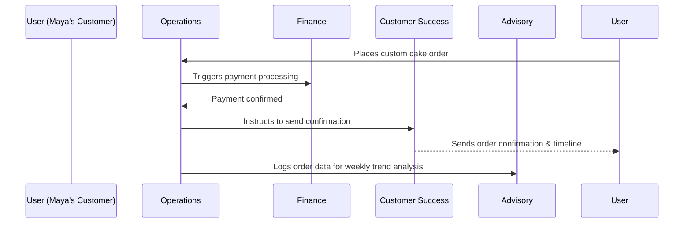

# AI Agent Department Architecture

## Problem Statement

Small business owners—whether they run a physical food cart, a mobile tutoring service, or an Instagram bakery—are overwhelmed by the operational overhead of running a business. They spend hours on administrative tasks instead of their core craft. The gap in current solutions (like Shopify, Wix, or Squarespace) is that these platforms are passive toolkits requiring manual configuration, code-level integrations, and continuous active management. For our core personas (Maya, Carlos, Priya, Leo, Fatima), learning a complex dashboard or managing multiple third-party plugins is an insurmountable barrier. They need an active, autonomous workforce that operates invisibly in the background.

## Research Report

Our competitive analysis highlights a structural vulnerability across the small business platform market:

| Competitor | Target User Profile | Agentic Capabilities | Complexity | User Experience Lens |
| :--- | :--- | :--- | :--- | :--- |
| **Shopify** | Dedicated E-commerce Managers | Low (Chatbots) | High (Requires Apps/Plugins) | Utilitarian, complex dashboard. |
| **Wix** | DIY Creators | Low (Static site generation) | Medium | Requires manual drag-and-drop management. |
| **Squarespace** | Creatives | Low | Medium | Beautiful, but passive toolkit. |
| **OHC (Hybrid Agentic OS)** | "Single Human CEO" | High (Autonomous Swarm) | Zero (Invisibly managed) | Premium (Glassmorphism), fully autonomous. |

The average small business owner cannot orchestrate a traditional tech stack. By structuring our AI agents into familiar, real-world "Departments," OHC abstracts the complexity of automation into friendly concepts that resonate immediately with non-technical users.

## Design Doc

### 1. The 7 AI Departments

OHC organizes its swarm intelligence into seven distinct departments, ensuring specialized tasks are handled autonomously while maintaining a cohesive business context.

1. **Operations ("The Manager"):** Processes orders, tracks inventory, manages bookings, and handles fulfillment or refunds.
2. **Marketing & Advertising ("The Promoter"):** Designs the website, creates social media posts, optimizes SEO, and builds link-in-bio pages.
3. **Sales & Acquisition ("The Salesperson"):** Generates quotes, follows up on leads, tracks referrals, and suggests upsells.
4. **Customer Success ("The Ambassador"):** Replies to customer messages, sends order updates, requests reviews, and runs re-engagement campaigns.
5. **Finance & Payments ("The Accountant"):** Processes payments, generates financial reports, manages subscriptions, and provides tax summaries.
6. **Legal & Compliance ("The Protector"):** Handles terms of service, policies, GDPR compliance, and tracks liability disclaimers.
7. **Business Advisory ("The Advisor"):** Provides weekly health reports, next-action suggestions, and analyzes seasonal trends.

### 2. Cross-Department Coordination Flow

When an event occurs, it triggers a chain reaction across departments without user intervention.

### 3. Key Design Decisions

- **Event-Driven Invocation:** Departments operate via an event-driven architecture (triggered on-demand, by schedule, or via system events) rather than requiring manual user initiation.
- **Shared Memory Context:** All departments share a durable, distributed state machine (KAIROS Shared Task List). If Operations knows a cake order is vegan, Customer Success automatically uses that context when replying to inquiries.
- **Action Approval Thresholds:** Actions are categorized. Low-risk actions (e.g., sending an order confirmation) execute automatically. High-risk actions (e.g., issuing a large refund or finalizing a legal document) generate a "Draft-for-Review" notification, seeking explicit approval from the business owner.
- **Mobile-First UX:** The AI Department interactions are presented as a conversational feed or simple push notifications. The UI relies on the Visual Excellence Mandate (Glassmorphism, 20px blur) to present complex data cleanly on small viewports (375px).

### 4. Hybrid Architecture Synergy

By leveraging the OHC Hybrid Agentic OS, the AI Departments function efficiently:
- **Local Fallback:** If Carlos is working in a basement with poor connectivity, his local SQLite handles immediate quote generation (Salesperson).
- **Cloud Escalation:** When Maya runs a massive end-of-month financial report, the system escalates to the cloud PostgreSQL swarm (Accountant) for heavy lifting.

## Implementation Prompt

**To the Implementer Swarm:**
Implement the foundational logic and UI for the "AI Agent Departments" interface within the OHC platform.
- **Objective:** Create the user-facing settings and dashboard elements where a business owner can view the status and activity of the 7 AI Departments.
- **CUJ (Critical User Journey):** From the mobile dashboard, a user should be able to navigate to the "My Team" section, see a summarized activity feed for each department, and toggle the approval thresholds (Auto-execute vs. Draft-for-review) for key actions.
- **Acceptance Criteria:**
  - The UI must adhere strictly to the Visual Excellence Mandate (Outfit/Inter fonts, Glassmorphism design tokens).
  - The feature must be 100% usable on a 375px mobile viewport.
  - Mock the cross-department communication for the frontend feed (do not build the backend scheduling infrastructure yet).
  - Ensure all interactions pass the "Grandmother Test."

**Priority:** P0
**Estimated Scope:** Large

