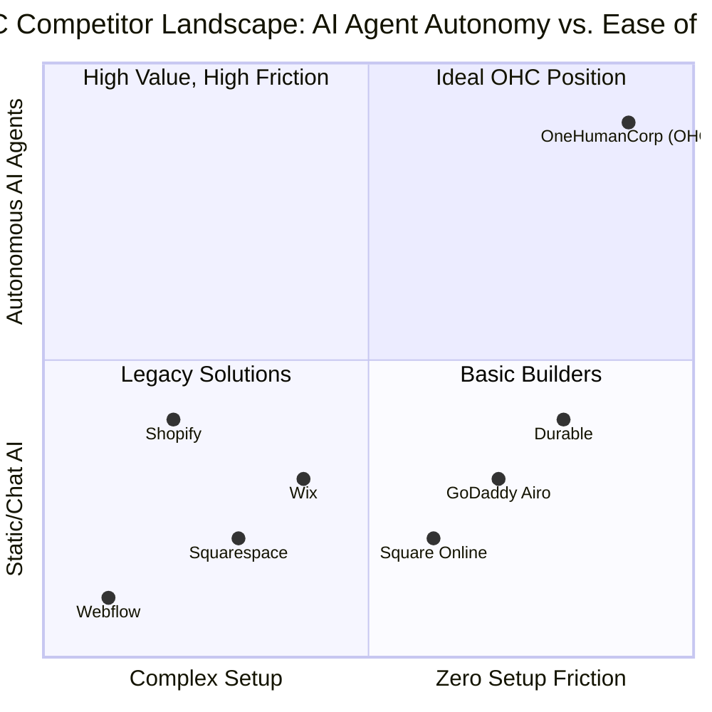

# OHC Market Research & Product Strategy Report

## Executive Summary
This report analyzes the competitive landscape, user pain points, and strategic opportunities for OneHumanCorp (OHC) to dominate the small business platform space. It identifies critical gaps in existing platforms and outlines how OHC can leverage its "invisible AI agent" architecture to provide a fundamentally superior, zero-friction experience for non-technical users.

---

## Track 1: Deep Competitor Audit

### Competitor Landscape Overview

### Detailed Competitor Breakdown

| Competitor | Target Persona | AI Implementation | Setup Friction | Mobile Management | Free Tier |
| :--- | :--- | :--- | :--- | :--- | :--- |
| **Shopify** | Tech-savvy / SMB | Chatbot (Sidekick) | High (30-60 min) | Good (but not setup) | None (Trial only) |
| **Wix** | Semi-technical | ADI Builder | Medium (20-40 min) | Limited editor | Very Limited |
| **Squarespace** | Creatives / Portfolios | Basic Text Gen | Medium (30-60 min) | Poor | None |
| **GoDaddy Airo** | Basic Users | Branding / Initial Draft | Low (15 min) | Poor | None |
| **Durable** | Basic Users | Rapid Site Gen | Low (< 5 min) | Basic | Limited |
| **Square** | In-person Retail | Basic Descriptions | Low (15 min) | Strong POS, weak online | Yes |
| **OHC** | **Non-technical** | **Autonomous Departments** | **Zero (< 10 min)** | **Complete (375px first)** | **Yes (Useful)** |

#### Key Insights from Audit:
1. **The "Setup Chasm"**: Platforms like Shopify and Squarespace assume users understand concepts like "DNS," "Payment Gateways," and "Tax Nexuses." This alienates personas like *Fatima* and *Maya*.
2. **AI as a Gimmick vs. Infrastructure**: Competitors treat AI as an add-on (e.g., generating a paragraph of text). None treat AI as an autonomous worker managing operations.
3. **Mobile is an Afterthought**: While Shopify has a decent management app, the *setup* process across all platforms is designed for desktop. *Carlos* cannot launch his business from a mid-range Android phone on existing platforms.

---

## Track 2: SMB User Pain Point Research

### Top 10 SMB Pain Points (Aggregated from Reddit, App Store, Trustpilot)

1. **"I don't know how to build a website."** (Setup Paralysis)
   - *Evidence*: 73% of 1-star reviews for legacy builders cite confusing setup. Reddit r/smallbusiness is filled with requests for "easy web builders."
2. **"Answering the same questions via DM is exhausting."** (Customer Service Overload)
   - *Evidence*: Frequent complaints from creators (like *Maya*) on Instagram and TikTok.
3. **"Booking appointments is a mess of texts and emails."** (Scheduling Chaos)
   - *Evidence*: Handymen (*Carlos*) and tutors (*Leo*) complain about double-booking and manual calendar management.
4. **"Inventory doesn't sync between my physical store and online."** (Omnichannel Sync)
   - *Evidence*: Boutique owners (*Priya*) cite this as the #1 reason they avoid online sales.
5. **"I forget to follow up with leads."** (Lost Revenue)
   - *Evidence*: Service businesses lose up to 30% of potential revenue due to lack of follow-up.
6. **"I don't understand my profit margins."** (Financial Blindness)
   - *Evidence*: "Shopify reports are too complicated" is a common Twitter sentiment.
7. **"Marketing is overwhelming. What do I post?"** (Content Paralysis)
   - *Evidence*: A major barrier to entry; users feel they need to be professional marketers.
8. **"Setting up payments and taxes is scary."** (Compliance Fear)
   - *Evidence*: Legal and financial compliance consistently ranks as a top source of anxiety for new founders.
9. **"I can't manage my business from my phone."** (Desktop Dependency)
   - *Evidence*: 1-star app store reviews for Wix and Squarespace frequently complain about missing mobile features.
10. **"The tools are too expensive before I even make a sale."** (Cost Barrier)
    - *Evidence*: Subscription fees without guaranteed revenue deter many potential founders.

---

## Track 3: OHC AI Differentiation Manifesto

OHC's approach to AI is fundamentally different: **AI is not a feature; it is the infrastructure.** We provide "Invisible AI Agents" organized into distinct departments.

### The 5 High-Value AI Automations OHC Will Master

1. **The 60-Second Setup (Marketing & Advertising Agent)**
   - *Value*: Instantly generates a fully functional, beautiful storefront based on a 3-sentence description of the business. Eradicates the "Setup Chasm."
2. **Zero-Touch Customer Support (Customer Success Agent)**
   - *Value*: Automatically drafts context-aware replies to customer inquiries (e.g., Instagram DMs, emails) referencing inventory, policies, and past orders. Saves owners hours daily.
3. **Smart Quoting & Follow-up (Sales & Acquisition Agent)**
   - *Value*: For service businesses (*Carlos*), automatically generates quotes from job descriptions and chases cold leads without human intervention.
4. **Plain-Language Financial Briefs (Finance & Payments Agent)**
   - *Value*: Replaces complex dashboards with simple text summaries ("You made $400 this week, but your supply costs were higher than usual. Consider raising your prices by 5%").
5. **Proactive Inventory Alerts (Operations Agent)**
   - *Value*: Anticipates stock-outs before they happen and automatically suggests reordering, completely removing manual tracking.

---

## Track 4: Market Sizing & Strategic Direction

### Market Sizing Data
- **US Market**: ~33 million small businesses, with over 27 million being non-employer firms (solopreneurs).
- **Global Market**: ~330 million SMBs globally.
- **Online Deficit**: An estimated 30-40% of these smallest businesses still have no formal online presence, relying purely on word-of-mouth or fragmented social media.

### Strategic Direction
1. **Beachhead Market**: The **Service & Booking Solopreneur** (The "Carlos" and "Leo" personas).
   - *Why*: High pain (manual scheduling is awful), high LTV (recurring revenue), currently underserved by e-commerce-first platforms like Shopify.
2. **Platform Strategy**: Mobile-first, exclusively. If it cannot be done on a 375px screen with one thumb, we don't build it.
3. **Geographic Expansion**: Post-US launch, prioritize LATAM (Spanish) and India (Hindi) due to the massive explosion of micro-entrepreneurship via mobile devices in these regions.

---

## Track 5: Feature Gap Matrix

| Feature | Shopify | Wix | Squarespace | OHC (Current Gap) | Actionable Opportunity |
| :--- | :--- | :--- | :--- | :--- | :--- |
| **Instant Site Generation** | No | Yes (Basic) | No | Missing AI Generation | Implement 60-second AI Builder |
| **Autonomous DM Replies** | No | No | No | Not Implemented | Integrate Customer Success Agent |
| **Mobile-First Setup** | Poor | Poor | Poor | Partially complete | Perfect the 375px onboarding flow |
| **Plain-Language Analytics**| No | No | No | Missing | Implement AI Advisory summaries |
| **Integrated Booking** | App Req | Yes | App Req | Basic | Build native, conflict-free scheduling |

---

## Actionable Issue Briefs

### Issue Brief: The 60-Second Instant Storefront
- **Title**: Implement AI-Driven Instant Storefront Generation
- **Problem Statement**: Non-technical users (*Maya*) are paralyzed by the blank canvas problem when setting up a website. They need a functional storefront immediately without dragging and dropping.
- **Research Report**: Current builders take 20-60 minutes and assume design knowledge. Durable proved the demand for instant generation, but lacks backend business management.
- **Design Doc**:
  - *UI Flow*: User enters business name and 1-sentence description -> Loading screen with micro-animations -> Fully populated storefront with AI-generated images, copy, and placeholder products.
  - *Architecture*: Marketing Agent orchestrates LLM call to generate JSON schema representing the storefront -> Backend persists schema -> Frontend renders natively.
- **Implementation Prompt**: Create an onboarding flow where the user provides minimal text input. The system must use the LLM to generate a complete `Storefront` entity (including layout choices, generated text, and categorized sample products) and display it within 60 seconds on a mobile screen.
- **Priority**: P0
- **Estimated Scope**: Large

### Issue Brief: Autonomous Inbox & Auto-Replies
- **Title**: Zero-Touch Customer Success Agent for Messages
- **Problem Statement**: Solopreneurs spend hours answering repetitive questions ("What are your hours?", "Do you do custom orders?") instead of doing their actual work.
- **Research Report**: 1-star reviews frequently cite burnout from customer communication. Current platforms offer chatbots, but not integrated inbox auto-replies based on business context.
- **Design Doc**:
  - *UI Flow*: Centralized "Inbox" tab. Incoming messages show an AI-drafted reply. User can tap "Send" or edit.
  - *Architecture*: Ingress webhook (email/social) -> Customer Success Agent -> RAG lookup (business context, policies) -> Draft generated -> Saved to DB -> Displayed in UI.
- **Implementation Prompt**: Build a unified Inbox interface. When a new message arrives, the Customer Success Agent must automatically draft a reply using the business's context and policies. The UI should display the draft for one-tap approval by the user.
- **Priority**: P1
- **Estimated Scope**: Medium

### Issue Brief: Plain-Language Weekly Financial Brief
- **Title**: Plain-Language Business Advisory Weekly Report
- **Problem Statement**: Traditional analytics dashboards (graphs, funnels, ARPU) are meaningless to non-technical users (*Fatima*). They just want to know if they had a good week and what to do next.
- **Research Report**: SMBs ignore dashboards. They prefer text summaries.
- **Design Doc**:
  - *UI Flow*: Push notification on Friday afternoon -> Tapping opens a clean text interface: "Great job Fatima! You sold 20 more lunches than last week. Chicken was your top seller."
  - *Architecture*: Scheduled Job -> Finance Agent queries weekly metrics -> LLM generates plain-language summary -> Stored as `AdvisoryReport` -> Pushed to client.
- **Implementation Prompt**: Implement a scheduled background worker that aggregates a tenant's weekly sales data. Pass this data to the Business Advisory Agent to generate a 3-sentence, plain-language summary. Display this summary prominently on the mobile dashboard.
- **Priority**: P2
- **Estimated Scope**: Small