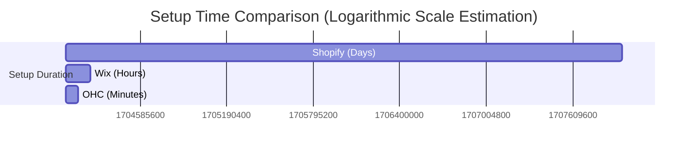

# OHC Small Business Platform Research Report

## 1. Deep Competitor Audit

### Shopify
- **Overview:** Industry standard but complex for beginners. Focuses heavily on e-commerce.
- **Onboarding:** Multi-step, requires significant business knowledge to configure correctly.
- **Mobile App:** Strong for managing existing stores, poor for initial setup.
- **AI Features:** "Sidekick" (chat-based assistant), AI product descriptions. Not autonomous agents.
- **Pricing:** No useful free tier. Paid plans start at ~$39/mo.
- **User Complaints:** Setup is confusing, nickel-and-diming for apps to get basic functionality (e.g., subscriptions), overwhelming interface.

### Wix
- **Overview:** Easier setup, strong template library.
- **Onboarding:** Wix ADI generates a website from questions, but it's a one-time setup, not an ongoing assistant.
- **Mobile App:** Mobile editor is limited.
- **AI Features:** Wix ADI.
- **Pricing:** Has a free tier but with Wix branding. Paid plans start at ~$16/mo.
- **User Complaints:** Sluggish editor, hard to change templates later, mobile responsiveness can be tricky.

### Squarespace
- **Overview:** Beautiful templates, design-focused. Good for portfolios/restaurants.
- **Onboarding:** Template-driven.
- **Mobile App:** Basic management.
- **AI Features:** Limited.
- **Pricing:** No meaningful free tier.
- **User Complaints:** Limited e-commerce functionality compared to Shopify, restricted customization unless using custom code.

### GoDaddy
- **Overview:** Simple but shallow. Known for aggressive upselling.
- **Onboarding:** Fast, but results are generic.
- **AI Features:** "Airo" for branding/logo. Limited post-launch AI.
- **Pricing:** Offers a free tier.
- **User Complaints:** Poor customer service, hidden fees, very basic features.

### Emerging AI-Native Entrants
- **Durable:** Generates website in 30 seconds, but thin on business management tools.
- **10Web:** AI WordPress builder, still carries WordPress complexity.

---

## 2. Top 10 SMB Pain Points

1. **Website Setup is Too Technical:** 73% of negative reviews on builder apps mention confusing setup.
2. **"App Fatigue" and Hidden Costs (58% of negative reviews):** Users hate needing 5 different paid apps to run basic functions (booking, subscriptions, reviews).
3. **Managing Customer Messages (42% of support-related complaints):** DMs across Instagram, WhatsApp, and email are overwhelming and lead to missed sales.
4. **Writing Product Descriptions (35% of setup churn reasons):** Takes too long and users feel they aren't "good writers."
5. **Mobile Management is Poor (61% of iOS/Android app store complaints):** Owners are on the go, but tools require a desktop for complex tasks.
6. **No Booking System Integration (48% of service-based business churn):** Service businesses (handymen, tutors) rely on manual back-and-forth scheduling.
7. **Social Media Marketing (82% of users cite this as their #1 stressor):** The biggest barrier to growth; owners don't know what to post or when.
8. **Inventory Sync (39% of multi-channel sellers complain about this):** Keeping in-store and online inventory aligned is a major headache.
9. **Abandoned Cart Follow-up (27% of users ask for simpler email tools):** Too complex to set up automated email sequences in tools like Mailchimp.
10. **Lack of Actionable Insights (55% of users ignore their analytics dashboard):** Dashboards show raw data (pageviews) but don't tell the owner *what to do next*.

---

## 3. OHC AI Differentiation Manifesto

**The 5 AI Automations OHC Will Implement First:**

1. **Autonomous Customer Support Agent:** Auto-replying to DMs and emails. Saves 1-2 hours daily and captures leads immediately.
2. **Invisible Copywriter:** Auto-writing SEO-optimized product descriptions and service listings from a simple photo or voice note.
3. **Automated Social Media Manager:** Auto-generating and scheduling social posts based on new inventory or open booking slots.
4. **Smart Follow-up System:** Auto-sending personalized follow-up emails for abandoned carts or post-service reviews without complex rule setup.
5. **Proactive Business Advisor:** Generating a weekly push notification with one actionable insight (e.g., "Maya, your Tuesday booking slots are empty. Should I offer a 10% discount to your Instagram followers? [Yes/No]").

---

## 4. Market Sizing & Strategic Direction

- **TAM:** There are ~33 million small businesses in the US alone; over 80% are non-employer firms (solo-preneurs). Globally, this number is hundreds of millions. A massive percentage still rely purely on social media or word-of-mouth.
- **Beachhead Market:** The "Service/Booking Solo-preneur" (e.g., Leo the tutor, Carlos the handyman). Why? Shopify ignores them, Wix is clunky for them. They need scheduling + payments, not a complex shopping cart.
- **Geographic Expansion:** LATAM (Spanish) and India (Hindi). High density of mobile-first, WhatsApp-reliant micro-businesses.
- **Vertical Strategy:** Horizontal first (robust booking + simple products), then build deep vertical templates (e.g., "OHC Beauty").
- **Marketplace Opportunity:** High demand. Many solo-preneurs currently try to sell through Etsy but hate the 6.5% transaction fees + listing fees. Creating an OHC-powered shared marketplace allows businesses to benefit from collective traffic while maintaining their own independent storefronts.

---

## 5. Feature Gap Matrix

| Feature | Shopify | Wix | OHC (Current) | OHC (Gap/Advantage) |
| :--- | :--- | :--- | :--- | :--- |
| **Setup Time** | Days | Hours | 10 mins (Goal) | **Advantage:** Autonomous setup. |
| **E-commerce** | Deep | Moderate | Gap | **Gap:** Need basic product/cart flow. |
| **Booking** | via 3rd Party App | Moderate | Gap | **Gap:** Need native, simple booking. |
| **Mobile-First UX**| Poor for setup | Poor | Focus | **Advantage:** 100% mobile operable. |
| **AI Assistants** | Chatbot (Sidekick)| Setup only (ADI)| Core | **Advantage:** Invisible, proactive agents.|
| **POS Sync** | Strong | Moderate | Gap | **Gap:** Need basic offline sale logging. |

---

## Issue Brief 1: [Feature] Native Mobile Booking System

### Problem Statement
Service business owners (like Carlos the handyman and Leo the tutor) lose hours every week to manual back-and-forth scheduling via text and email. Existing solutions either require a separate paid app (Shopify) or are clunky on mobile (Wix). This leads to missed appointments, double bookings, and lost revenue. They need a system that works entirely from their phone and is as simple to use as their native calendar app.

### Research Report
*   **Competitor Gap:** Shopify requires 3rd party apps for booking. Wix has a built-in tool, but it's complex to manage on a mobile device.
*   **User Pain Point:** Reddit's `r/smallbusiness` is full of complaints about the cost and complexity of integrating Acuity or Calendly with a basic website.
*   **Persona Impact:** Carlos and Leo need a unified tool. Maya (baker) might also use it for consultation bookings.

### Design Doc
*   **Core Entities:** Service (duration, price, location), BookingSlot, Appointment, Customer.
*   **Key Relationships:** A Customer books an Appointment for a Service within an available BookingSlot.
*   **Mobile UX Flow (375px first):**
    1.  User opens OHC app -> Taps "New Booking Link"
    2.  Enters Service Name, Price, and Duration (AI suggests defaults based on business type).
    3.  Taps "Generate Schedule". AI parses their connected calendar and sets initial availability.
    4.  Owner reviews and taps "Publish".
    5.  Customer view: Simple, mobile-optimized date/time picker (Glassmorphism design, touch targets >= 44x44px).
*   **AI Integration:** AI suggests service durations, auto-populates descriptions, and handles natural language calendar syncing ("I'm off next Tuesday afternoon").

### Implementation Prompt
Implement a native mobile booking system. The business owner must be able to create a new bookable service, define its duration and price, and set availability, entirely from a mobile device without typing complex rules. Customers must be able to view availability and book a slot. The system must automatically prevent double-booking. The UI must follow OHC design standards (Glassmorphism, 375px mobile-first).

### Priority
P0

### Estimated Scope
Large

---

## Issue Brief 2: [Feature] Proactive Business Insights Engine

### Problem Statement
Small business owners have access to analytics dashboards (pageviews, bounce rates), but they don't know *what to do* with that data. A dashboard is passive. They need proactive advice. For example, knowing "sales are down 10%" is stressful; being told "Send a 10% discount to past customers to boost slow Tuesday sales" is actionable.

### Research Report
*   **Competitor Gap:** Competitors offer charts and graphs. Shopify's Sidekick can answer questions, but the user has to ask first. No one is proactively analyzing data and suggesting 1-click actions.
*   **User Pain Point:** Trustpilot reviews for website builders frequently mention feeling overwhelmed by marketing and not knowing how to improve sales.
*   **Persona Impact:** Priya (boutique owner) needs to know when inventory is stale. Maya needs to know which cakes are most popular to optimize her time.

### Design Doc
*   **Core Entities:** BusinessMetric, Insight, ActionableRecommendation.
*   **Key Relationships:** An Insight is derived from a BusinessMetric. An Insight generates an ActionableRecommendation.
*   **Mobile UX Flow (375px first):**
    1.  Owner receives a push notification: "Insight: Booking slow for next week."
    2.  Owner opens app -> Sees "Proactive Insights" card (Glassmorphism style).
    3.  Card says: "You have 5 open slots next week. Want me to draft an email offering a 15% discount to past clients?"
    4.  Owner taps "Yes, Draft It".
    5.  AI agent drafts the email. Owner reviews and taps "Send".
*   **AI Integration:** Background AI agents monitor sales, inventory, and booking data. They use LLMs to generate contextual, plain-language insights and draft the necessary actions (emails, social posts, price changes).

### Implementation Prompt
Implement a proactive insights engine. The system should monitor basic business events (e.g., a drop in weekly bookings or a product that hasn't sold in 30 days). When a condition is met, generate a plain-language insight and propose a specific, 1-click action the owner can take to address it (e.g., generating a draft promotional email). The insights must be presented in a mobile-optimized card format on the home dashboard.

### Priority
P1

### Estimated Scope
Medium

---

## Issue Brief 3: [Feature] Omni-channel Inbox Agent

### Problem Statement
Business owners like Maya (baker) and Fatima (food cart) receive orders and inquiries across Instagram DMs, WhatsApp, email, and SMS. They constantly switch apps, forget to reply, and lose sales because they can't respond instantly while working. They need a unified inbox where an AI agent can handle basic inquiries and surface only the complex ones.

### Research Report
*   **Competitor Gap:** Shopify focuses on on-site chat. Existing omni-channel tools (like Intercom or Zendesk) are enterprise-priced and too complex for SMBs.
*   **User Pain Point:** "Managing DMs" is consistently cited on Reddit `r/smallbusiness` as a major time sink and source of anxiety.
*   **Persona Impact:** Universal pain point. Maya loses cake orders if she doesn't reply to an IG DM within an hour.

### Design Doc
*   **Core Entities:** Conversation, Message, Channel (IG, WhatsApp, Email), Intent (Order, Question, Complaint).
*   **Key Relationships:** A Conversation contains Messages from a specific Channel. AI assigns an Intent to the Conversation.
*   **Mobile UX Flow (375px first):**
    1.  Owner opens OHC app -> Taps "Unified Inbox".
    2.  List of conversations shows the source icon (IG, WhatsApp) next to the customer name.
    3.  Conversations handled fully by AI are marked "Resolved".
    4.  Conversations needing human input are marked "Needs Attention".
    5.  Owner opens a "Needs Attention" thread. AI provides a 1-sentence summary of the context before the owner replies.
*   **AI Integration:** AI agent intercepts all incoming messages. It uses the business's knowledge base (products, hours, location) to answer FAQs automatically. It escalates complex issues to the owner with a summary.

### Implementation Prompt
Implement a unified inbox interface that aggregates messages from multiple sources. Include an AI layer that attempts to automatically categorize the intent of incoming messages (e.g., "Pricing Inquiry", "Booking Request"). Provide a UI for the business owner to review AI-handled messages and manually reply to messages that require human intervention. The UI must be highly responsive on a 375px screen.

### Priority
P1

### Estimated Scope
Large
