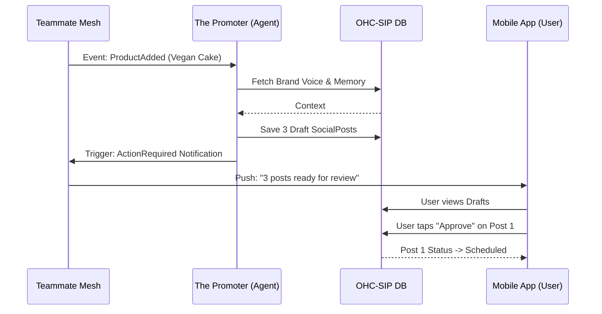

# [Marketing] Auto-Social Content Calendar (The Generative Promoter)

## Problem Statement
Small business owners, especially those without a technical or design background, experience immense "Marketing Dread" (identified as the #3 pain point affecting 55% of SMBs). They struggle to maintain a consistent social media presence, which is the primary reason stores go "dark" after 3 months. Traditional platforms like Shopify or Wix rely on third-party App Store plugins that add cost ("Cost Creep") or complex technical jargon, leaving owners overwhelmed.

From our research (`docs/research/smb_pain_points_top_10.md`), founders lack the time, skills, and energy to write captions, design graphics, and schedule posts across multiple networks.

## Research Report
*   **Gap Identification**: Competitors treat AI as a reactive "Tool" (e.g., Shopify Sidekick) where users must still prompt the AI to generate a single draft, edit it, and manually post it. This doesn't alleviate the core burden of "what do I post today?"
*   **OHC Advantage**: OHC treats AI as a "Teammate". Specifically, "The Promoter" (Marketing & Advertising Department) should autonomously generate and schedule a 7-day social media calendar triggered by business events (e.g., a new product being added, a positive review, or an upcoming holiday).
*   **Competitive Landscape**:
    *   **Shopify/Wix**: No built-in autonomous social scheduler. Requires paid apps (Buffer, Later) which don't auto-generate content based on internal store state.
    *   **Durable**: Fast website generation, but weak post-launch marketing autonomy.
*   **Recommendation**: Implement an "Auto-Social Content Calendar" feature where "The Promoter" agent watches the KAIROS event mesh for triggers (like `ProductCreated` or `ReviewReceived`) and automatically populates a pending queue of social media posts (image + caption + hashtags). The user only needs a "1-Tap Approve" on their mobile device (Draft-for-Review workflow).

## Design Doc
*   **Entity Types**:
    *   `SocialPost`: Represents a drafted or published post. Attributes: `id`, `tenant_id`, `trigger_event_id`, `content` (caption, hashtags), `media_url`, `status` (Draft, Scheduled, Published, Rejected), `scheduled_time`, `platform` (Instagram, Facebook, TikTok).
    *   `SocialCalendar`: A weekly aggregate view of `SocialPost`s for a tenant.
*   **Key Relationships**:
    *   A `Tenant` has many `SocialPost`s.
    *   A `SocialPost` is created by "The Promoter" agent and linked to an `Event` in the Teammate Mesh.
*   **Architecture & Integration Points**:
    *   **Trigger**: The Teammate Mesh broadcasts a `ProductAdded` event.
    *   **Agent**: "The Promoter" agent subscribes to this event, fetches the product details (name, price, image), and uses the `autodream_memories` to match the brand's voice.
    *   **Generation**: The agent generates 3 distinct `SocialPost`s (e.g., an announcement, a deep dive into features, a customer question prompt) spread across the upcoming week.
    *   **Approval**: These posts are saved to the OHC-SIP DB with a `Draft` status. They appear in the user's Action Feed on the dashboard.
*   **Mobile UX Flow (375px first)**:
    1.  User opens the app and sees a notification in the "Action Required" feed: "The Promoter drafted 3 posts for your new Vegan Cake!"
    2.  User taps the notification.
    3.  A swipeable carousel (Tinder-style or vertical scroll) shows each post preview (image + text).
    4.  User can tap "Approve" (schedules it), "Regenerate" (tells agent to try again), or "Edit" (manual tweak).

## Implementation Prompt
"Implement the Auto-Social Content Calendar feature within the Marketing department. Create the necessary UI components for the mobile dashboard (375px optimized) that display a feed of drafted social media posts generated by 'The Promoter' agent. Implement the '1-Tap Approve', 'Regenerate', and 'Edit' actions for these drafts. Wire this up to the KAIROS orchestrator so that when an internal event (like a new product addition) is detected, the agent autonomously generates these drafts and places them in a pending state awaiting user review. Do not focus on the underlying database schema or specific API endpoints; focus on the business logic, agent event subscription, and the user-facing approval workflow."

## Priority
P1

## Estimated Scope
Medium

## Visual Analysis

