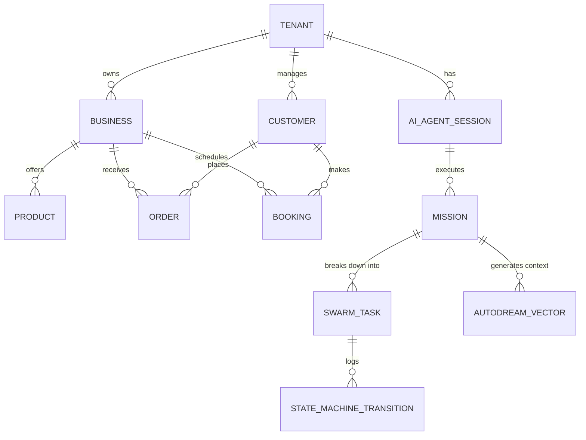

# OHC Data Model Architecture Review

## 1. Overview
This design document reviews and evolves the OHC (OneHumanCorp) data model to ensure it meets the requirements of a robust, multi-tenant SaaS platform where non-technical users can manage their small businesses. The architecture supports AI agents working invisibly in the background.

## 2. Goals & Non-Goals
### 2.1 Goals
- Define current entity types (Missions, Tasks, Sessions, Epics).
- Map out relationships between business entities, customer data, and AI operations.
- Enforce strict multi-tenancy invariants via `tenant_id` columns and PostgreSQL Row-Level Security (RLS).
- Define key access patterns for both the mobile-first frontend and the backend AI orchestrator.
- Outline a migration strategy for evolving the schema securely over time.

### 2.2 Non-Goals
- Provide explicit SQL DDL statements.
- Define exact REST/gRPC API endpoints or function signatures.

## 3. Entity-Relationship Diagram

## 4. Key Invariants
- **Multi-Tenancy:** Every single table (except for global lookup tables) MUST include a `tenant_id` column.
- **Data Isolation:** A business owner can only see and modify data belonging to their own `tenant_id`. AI agents operating on behalf of a business are strictly bound to that same `tenant_id`. PostgreSQL RLS policies enforce this at the database layer.
- **Agent Authority:** AI agents cannot approve their own high-risk actions. High-risk state transitions (e.g., publishing a website, refunding a customer) require explicit `tenant_id` owner approval.

## 5. Key Access Patterns
- **Frontend App (Mobile/Web):** High-frequency, low-latency reads for dashboard summaries, order lists, and upcoming bookings, filtered implicitly by the authenticated user's `tenant_id`.
- **AI Orchestrator (KAIROS):** Background polling for pending tasks (using `SKIP LOCKED`), querying `autodream_vectors` for historical context (vector similarity search scoped to `tenant_id`), and writing state transitions as tasks progress.

## 6. Migration Strategy
To evolve the schema without downtime:
1.  **Additive Changes First:** Add new columns or tables (always including `tenant_id`) in a forward-compatible way.
2.  **Dual-Writing (if replacing columns):** Write to both the old and new columns/tables in the application code.
3.  **Backfill Data:** Run background jobs to populate the new structures from historical data.
4.  **Read from New:** Switch application read paths to use the new structures.
5.  **Cleanup:** Remove old columns/tables and dual-write logic in a subsequent release. All database schema migrations must be tested against both the PostgreSQL (Cloud) and SQLite (Standalone/Testing) providers.
