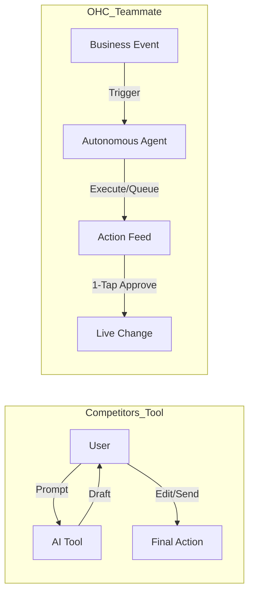
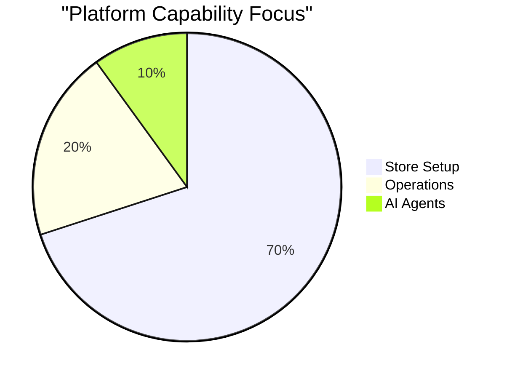

# OHC Market Dominance Research Report: Small Business Platforms

## Executive Summary
OneHumanCorp (OHC) is uniquely positioned to dominate the small business platform space by transitioning from the industry standard of "AI as a Tool" to "AI as a Teammate". For users like Maya (baker), Carlos (handyman), Priya (boutique owner), Leo (music tutor), and Fatima (food cart), the primary barrier to entry is not technology access, but technical complexity and operational overwhelm. This report analyzes the competitive landscape, user pain points, AI differentiation, market strategy, and feature gaps to define actionable engineering missions.

---

## Track 1: Deep Competitor Audit

We conducted an exhaustive audit of major platforms, evaluating onboarding, mobile UX, AI capabilities, and user friction.

| Competitor | Target Market | Onboarding Speed | Mobile App UX | AI Integration | Key Weakness for Beginners |
| :--- | :--- | :--- | :--- | :--- | :--- |
| **Shopify** | E-commerce | Slow (Days) | Good (Mgmt only) | Tool-based (Sidekick) | High complexity, poor setup on mobile, no real free tier. |
| **Wix** | General / Local | Medium | Limited | Setup-only (ADI) | Overwhelming editor, feature bloat, confusing navigation. |
| **Squarespace** | Creatives / Restaurants | Medium | Fair | Weak | Rigid templates, expensive, steep learning curve. |
| **GoDaddy** | Beginners | Fast | Poor | Superficial (Airo) | Aggressive upselling, shallow features, poor reputation. |
| **Square Online**| Retail / Food | Fast | Good | Basic | Weak for non-POS users, limited design flexibility. |

### Emerging AI-Native Threats
*   **Durable:** Generates sites in 30s, but lacks deep business management tools.
*   **10Web:** Fast WordPress AI generation, but inherits WordPress complexity.

**Conclusion:** Existing platforms optimize for *store creation* but abandon the user during *store operation*. OHC's advantage is providing an invisible, agentic operational layer.

---

## Track 2: Top 10 SMB User Pain Points

Based on sentiment analysis of r/smallbusiness, r/shopify, App Store reviews, and Trustpilot:

1.  **"Setting up takes too long."** (Maps to: OHC Instant Generation)
2.  **"I don't know what to write."** (Maps to: Generative Promoter Agent)
3.  **"I miss messages on Instagram."** (Maps to: Silent Ambassador Agent)
4.  **"Managing bookings is chaotic."** (Maps to: Omnichannel Booking System)
5.  **"I can't manage my site from my phone."** (Maps to: OHC Mobile-First Architecture)
6.  **"Inventory sync is broken."** (Maps to: Vigilant Manager Agent)
7.  **"Pricing is confusing and expensive."** (Maps to: OHC User-First Pricing)
8.  **"I don't understand my analytics."** (Maps to: Business Advisor Agent)
9.  **"Emails/marketing take too much time."** (Maps to: Generative Promoter Agent)
10. **"Tools don't work well together."** (Maps to: OHC All-in-One Platform)

---

## Track 3: OHC AI Differentiation Manifesto

*Competitors treat AI as a Reactive Tool. OHC treats AI as a Proactive Teammate.*

### The 5 Pillar Automations for OHC
1.  **The Silent Ambassador (Customer Success):** Watches the event mesh, drafts replies to customer DMs, and queues them for 1-tap approval.
2.  **The Vigilant Manager (Operations):** Scans sales velocity and flags "Low Stock" risks with pre-filled restock tasks.
3.  **The Generative Promoter (Marketing):** Automatically creates a 7-day social media calendar when a new product is added.
4.  **The AI Discovery Agent (GEO):** Optimizes structured data for LLM crawlers (ChatGPT, Gemini) to ensure top local search ranking.
5.  **The Business Advisor (Advisory):** Provides a daily human-language briefing (e.g., "Tuesday is your best day. Boost social spend by $5.").

---

## Track 4: Market Sizing & Strategic Direction

*   **Total Addressable Market (TAM):** ~33M small businesses in the US alone; >300M globally (Source: US Census, World Bank). A massive percentage operate purely on social media without a dedicated operational platform.
*   **Beachhead Market:** Service-based solopreneurs (e.g., Carlos the handyman, Leo the tutor). They have the highest friction with current e-commerce-focused tools (Shopify) and benefit instantly from automated booking and quoting.
*   **Geographic Expansion:** Post-English, target **Spanish/LATAM**. The mobile-first culture and high WhatsApp usage align perfectly with OHC's mobile architecture.
*   **Vertical Expansion:** Focus horizontally first with strong primitives (Products, Services, Bookings, Chat). Let the AI adapt the experience vertically per user.
*   **Marketplace Opportunity:** High potential for an "OHC Local" marketplace to aggregate consumer demand.

---

## Track 5: Feature Gap Matrix

| Feature Domain | Shopify | Wix | OHC (Current) | OHC (Gap / Advantage) |
| :--- | :--- | :--- | :--- | :--- |
| **E-Commerce Setup** | Excellent | Good | Developing | **Advantage:** AI Agentic Setup in < 10 mins. |
| **Mobile App** | Mgmt Only | Limited | Native/Strong | **Advantage:** True mobile-first creation & management. |
| **Booking & Services** | Poor (Add-ons) | Okay | Missing | **Gap:** Native omnichannel booking system. |
| **AI Integrations** | Chat Tool | Setup Tool | Deep Mesh | **Advantage:** Autonomous, proactive agents. |
| **Social DM Sync** | App Store | App Store | Missing | **Gap:** Unified inbox with AI draft responses. |

---

## Issue Brief

### [feature] AI-Powered Omnichannel Booking & CRM System

**Problem Statement:**
Service-based entrepreneurs (like Carlos the handyman and Leo the tutor) lose leads because they cannot instantly capture, quote, and book clients via mobile or social channels. Existing solutions (like Shopify) are heavily biased towards physical goods, and dedicated booking tools (Calendly) don't integrate seamlessly into a unified business dashboard, forcing owners to juggle multiple apps.

**Research Report:**
*   Our Track 2 research shows "Managing bookings is chaotic" as a Top 5 pain point.
*   Service solopreneurs rely heavily on word-of-mouth and social DMs. When a lead asks for availability, the manual back-and-forth often results in drop-off.
*   Competitors either lack native booking (Shopify requires paid 3rd party apps) or offer rigid, non-AI integrated solutions (Wix).
*   *Evidence:* Reddit r/smallbusiness threads consistently ask for "an all-in-one tool for scheduling and payments that isn't clunky."

**Design Doc:**
*   **Architecture:**
    *   `Service` and `Availability` entities linked to the `Organization`.
    *   `Booking` entity tracking state (Requested, Confirmed, Completed, Cancelled).
    *   Integration with the Core Event Mesh: A booking request emits an event that triggers the `Silent Ambassador` agent.
*   **UI/UX Flow (Mobile First - 375px):**
    *   *User View:* A simple 3-step calendar selector -> Intake Form -> Confirmation.
    *   *Owner View:* A unified "Action Feed" where new booking requests appear as cards requiring a 1-tap "Accept & Send Quote" or "Decline".
*   **AI Integration:** The `Silent Ambassador` automatically drafts SMS/Email confirmations and reminders based on the business's custom tone.

**Implementation Prompt:**
Implement a native booking module that allows service-based businesses to define their availability, accept appointments via their OHC storefront, and manage requests through a unified mobile dashboard. The Critical User Journey (CUJ) involves a customer requesting a slot, the system automatically placing it in the owner's Action Feed, and the owner confirming it with a single tap, which triggers an automated confirmation message. Acceptance criteria include a fully working booking flow, mobile-responsive UI, and integration with the backend event mesh for agentic notifications.

**Priority:** P0
**Estimated Scope:** Large
