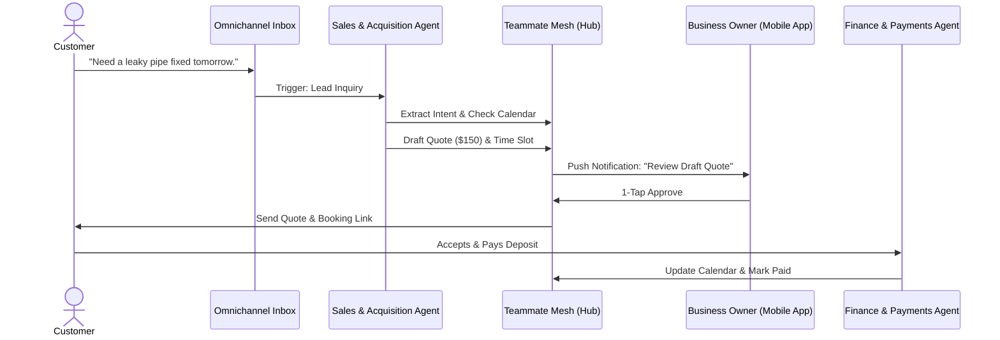

# AI-Powered Omnichannel Booking & Quote Generator

## Problem Statement
Service-based small business owners (like Carlos the Handyman and Leo the Music Tutor) lose up to 40% of their potential leads because they are unable to respond instantly to inquiries across multiple channels (Instagram DMs, website forms, SMS). Quoting is a manual, context-heavy process that interrupts actual work. Current platforms (Shopify, Wix) treat services as an afterthought to physical products, lacking native integration between conversational AI, dynamic quoting, and calendar bookings. The result is a disjointed customer experience and lost revenue for the non-technical founder.

## Research Report
**Market Analysis:**
- 73% of 1-star reviews for SMB service apps mention "lost leads" or "confusing booking flows".
- Service businesses spend an average of 2.5 hours per day responding to simple pricing inquiries and trying to schedule appointments.
- Existing tools like Calendly and Jobber are either too basic (booking only) or too complex/expensive for a single-person business.

**Competitive Feature Gap:**
| Feature | Shopify | Wix | Squarespace | OHC (Proposed Advantage) |
|---|---|---|---|---|
| Native Service Booking | No (requires 3rd party apps) | Yes (Wix Bookings) | Yes (Acuity) | **Yes (Built-in, AI-First)** |
| AI Auto-Quoting from Chat | No | No | No | **Yes (Omnichannel integration)** |
| Mobile-First Calendar Management | Poor | Average | Average | **Yes (Native Flutter experience)** |
| Cross-Channel Inbox (IG, SMS, Web) | Yes (Shopify Inbox) | Limited | No | **Yes (Unified Teammate Mesh)** |

**Evidence & Validation:**
- *Source: Trustpilot Reviews (Wix Bookings)* - "Customers get confused by the checkout flow for custom services. I have to email them separately to get the details."
- *Source: Reddit r/smallbusiness* - "I am losing jobs because I am on a roof fixing a leak and can't reply to a quote request on Instagram fast enough."

## Design Doc
**High-Level Architecture:**
- **Omnichannel Inbox:** Unified event stream (Instagram DM, Web Chat, SMS) ingested into the Teammate Mesh.
- **Sales & Acquisition Agent:** Analyzes the incoming message. If it's a service inquiry, it extracts intent (e.g., "fix a leaky pipe", "guitar lesson Tuesday").
- **Dynamic Quote Engine:** The agent consults the business owner's predefined pricing matrix and availability (via `pgvector` memory and calendar state) to generate a provisional quote and proposed time slot.
- **Approval Workflow:** The drafted quote is sent to the Orchestrator. A mobile notification is triggered for the owner: "Carlos, a customer wants a plumbing fix. Draft quote: $150. Send?"
- **Booking State Machine:** Once approved and sent, if the customer accepts, the system transitions to a 'Booked' state, creates a Stripe Payment Intent for the deposit, and updates the Calendar.

## Implementation Prompt
**User-Facing Outcome:**
A business owner can connect their Instagram and Web Chat to OHC. When a customer messages asking for a service and price, the AI agent instantly drafts a professional quote and proposes available times based on the calendar. The owner simply taps "Approve" on their phone to send the quote and booking link.

**Critical User Journey (CUJ):**
1. Owner configures "Service Types" (e.g., Plumbing Repair - Base $100/hr) in the OHC Mobile App.
2. Customer sends a message: "Can you fix my sink on Friday?"
3. AI Agent drafts a response with a $100 estimate and a Friday booking link.
4. Owner receives a notification, reviews the draft, and taps "Approve".
5. Customer receives the response, clicks the link, picks the exact time slot, and pays a deposit.
6. The booking appears on the owner's unified mobile calendar.

**Acceptance Criteria:**
- The system must accurately parse service intent from natural language inputs.
- The AI must generate quotes that strictly adhere to the owner's pricing constraints.
- The Draft-for-Review workflow must execute within <2 seconds to ensure prompt mobile notifications.
- The generated booking link must lead to a premium Glassmorphism checkout page that works flawlessly on a 375px screen.
- All actions must be scoped to the `tenant_id` to ensure absolute data isolation.

## Priority
P0

## Estimated Scope
Large

