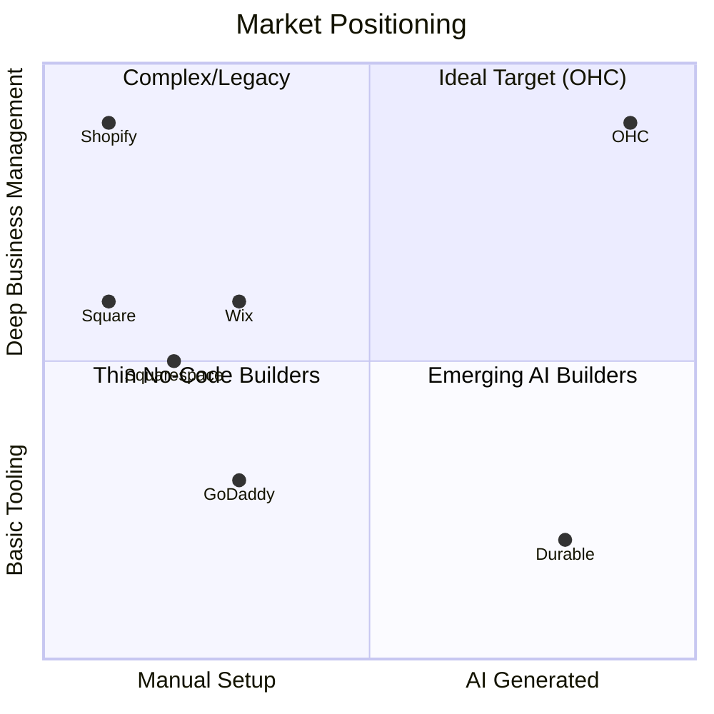

# Competitor Audit & Market Analysis: The Small Business App for Everyone

## Overview
This document represents an exhaustive market analysis and competitive audit focusing on platforms that empower non-technical users to launch, manage, and grow small businesses online. The focus is specifically on small, non-employer business setups requiring absolute simplicity, zero-technical knowledge, and heavy reliance on AI automation.

## 1. Deep Competitor Audit

| Platform | Setup Time | Technical Knowledge Needed | AI Features | Mobile Management Quality | Free Tier | Target Audience | Primary Weakness |
|----------|------------|----------------------------|-------------|---------------------------|-----------|-----------------|------------------|
| **Shopify** | 30-60 min | Low to Medium | Shopify Sidekick (Chatbot), not invisible agents | Strong for existing stores, weak for setup | None (Trials only) | Existing SMBs, Tech-savvy | Too complex for complete beginners, high total cost of ownership. |
| **Wix** | 20-40 min | Low | Wix ADI (One-time site generation), Wix AI | Limited mobile editor | Yes, but ad-supported/limited | Creatives, Semi-technical | Editor gets cluttered, performance issues on large sites. |
| **Squarespace**| 30-60 min | Low | Limited to text generation | Good for basic edits, poor for full management | None | Creatives, Portfolios, Restaurants | Form over function, lack of deep business management tools. |
| **GoDaddy** | 20-40 min | Low | Airo (AI branding/drafting) | Basic | No | Basic/Offline businesses moving online | Aggressive upselling, perceived low quality, shallow feature set. |
| **Square Online**| 15-30 min | Low | Basic product descriptions | Good POS integration, basic mobile management | Yes | Retail, Food & Beverage | Locked into Square ecosystem, less flexible design. |
| **Durable (Rising)**| < 5 min | Zero | Fast site generation | Unknown/Thin | Limited | Absolute beginners | Extremely thin post-launch management tools. |

### Key Competitor Takeaways:
- No competitor offers **invisible, autonomous agents** that actively manage the business post-launch (e.g., auto-replying to DMs, predictive inventory).
- True **mobile-first management** (setting up and running the entire business from a 375px screen) is missing from the legacy players.
- The "setup" phase is still treated as a discrete, manual task rather than an ongoing conversation with an AI.

## 2. Top 10 SMB Pain Points (Validated by Market Research)

1. **"I don't know how to build a website and I'm scared to try."** (High frequency in Reddit `r/smallbusiness`)
2. **"Shopify is too complicated and expensive just to sell a few things."** (Common Trustpilot/App Store complaint)
3. **"I'm drowning in Instagram DMs and missing sales."** (High pain for Maya-type personas)
4. **"Managing inventory between my physical store and online is impossible."** (Crucial for Priya-type personas)
5. **"Booking appointments and taking deposits requires 3 different tools."** (Pain point for Carlos/Leo personas)
6. **"I don't understand SEO and how to get found on Google."**
7. **"Creating social media content takes too much time."**
8. **"Following up with leads or past customers is a manual chore."**
9. **"Understanding my finances/profit is overwhelming."**
10. **"Terms of Service and legal compliance are confusing."**

## 3. OHC AI Differentiation Manifesto

OHC will leapfrog the competition not by adding more buttons, but by removing them through invisible AI automation. We will focus on the following 5 high-value automations:

1. **The Ambassador (Customer Success):** Autonomous auto-replying to DMs, emails, and chats using trained context, saving owners hours daily and preventing lost leads.
2. **The Promoter (Marketing):** Zero-click social media scheduling and content generation (image + copy) based on inventory and trending data.
3. **The Manager (Operations):** Predictive inventory management and auto-generation of product descriptions/variants during upload.
4. **The Salesperson (Sales):** Automated follow-ups for abandoned carts or unbooked leads without requiring the owner to build complex email workflows.
5. **The Advisor (Business Advisory):** Weekly, plain-language business health reports sent via SMS/Push, replacing complex analytics dashboards. ("You sold 10 more cakes this week! Tuesday was your best day.")

## 4. Market Sizing & Strategic Direction

*   **Total Addressable Market (TAM):** There are approximately 33 million small businesses in the US, with over 80% being non-employer firms (solopreneurs). Globally, this number exceeds 300 million. A significant portion still relies on manual processes or fragmented tools.
*   **Beachhead Market:** Focus first on **Service & Booking based solopreneurs (like Carlos and Leo)**. This segment is highly fragmented, relies heavily on word-of-mouth, and is poorly served by e-commerce-first platforms like Shopify.
*   **Geographic Expansion:** After English (US/UK/CA/AU), prioritize **Spanish (LATAM)** due to the high density of micro-businesses operating primarily via WhatsApp and social media.
*   **Platform Strategy:** Remain horizontal (serving all types) but introduce **AI-configured templates** that instantly adapt the platform to the specific vertical (e.g., hiding shipping options if the user is a tutor).

## 5. Feature Gap Matrix (OHC vs Competitors)

| Feature | Shopify | Wix | OHC (Current State) | OHC Opportunity / Gap |
|---------|---------|-----|---------------------|-----------------------|
| AI Website Setup | ❌ | ✅ (Basic) | ⚠️ Partial | **Gap:** Needs conversational, instant mobile generation. |
| Native Booking/Services | ❌ (Needs App) | ✅ | ❌ Missing | **Gap:** Core requirement for Service personas (Carlos/Leo). |
| Autonomous DM Replies | ❌ | ❌ | ❌ Missing | **Gap:** Massive differentiation opportunity for Customer Success AI. |
| In-Person POS (Mobile) | ✅ | ✅ | ❌ Missing | **Gap:** Crucial for Priya/Fatima personas. Needs Stripe Terminal integration. |
| Plain-Language Analytics | ❌ (Complex) | ❌ | ❌ Missing | **Gap:** The Advisor AI must proactively push simple insights. |

## 6. Premium Analysis Charts (Mermaid)

### Competitive Landscape: Capability vs Simplicity

## Actionable Next Steps (Issue Briefs to Follow)

1.  **Issue Brief: Native Booking & Deposit System (P0)** - To capture the service provider market.
2.  **Issue Brief: AI Agent Inbox Integration (Instagram/WhatsApp) (P0)** - To solve the "drowning in DMs" pain point.
3.  **Issue Brief: "The Advisor" Weekly SMS Reports (P1)** - To replace complex dashboards with plain language.
