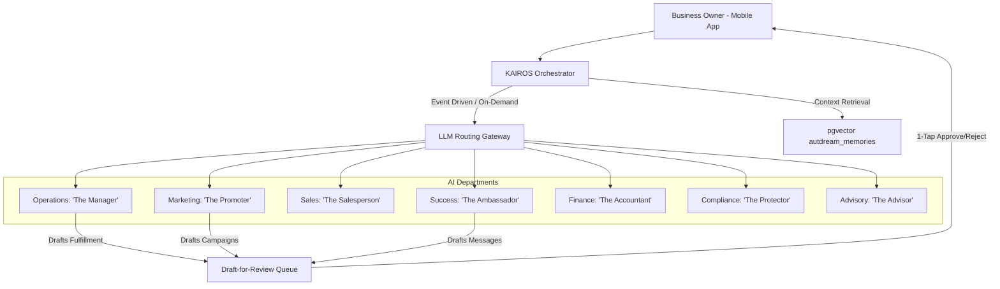

# Architecture Brief: AI Agent Department Integration

## Title
AI Agent Department Architecture: Invisible Orchestration for SMBs

## Problem Statement
Small business owners (Maya, Carlos, Priya, Leo, Fatima) need automated assistance to handle the complexity of daily operations. However, traditional AI integration exposes too much complexity (e.g., configuring APIs, defining prompt chains). If the platform cannot organize AI capabilities into understandable, business-aligned "departments" that run invisibly and coordinate seamlessly, the platform fails the "Grandmother Test" and users will abandon it. We need an architecture that allows AI agents to act as specialized employees (e.g., Operations, Marketing, Finance) while enforcing strict 1-tap approval workflows for high-risk actions.

## Research Report
- **The SMB Reality**: Non-technical users understand roles like "The Manager", "The Promoter", and "The Accountant". They do not understand "LLM Routing" or "Vector Stores".
- **Agent Handoffs**: Effective business operation requires coordination. For example, when an order is shipped, marketing should send a thank you. This requires durable, collision-free event handoffs.
- **Trust & Oversight**: Business owners are hesitant to let AI take external actions blindly. A "Draft-for-Review" model with 1-tap mobile approval builds trust and ensures quality control.
- **Contextual Memory**: Agents must remember past interactions and user preferences. Without long-term memory, agents feel robotic and disconnected from the business reality.

## Design Doc

### High-Level AI Department Architecture

### Department Execution & Coordination
1.  **Triggers**: Departments operate based on Scheduled (Cron), Event-Driven (system events), or On-Demand triggers.
2.  **Shared Task List**: Coordination is managed via the KAIROS Shared Task List. When "The Salesperson" closes a quote, it adds a "Process Order" task for "The Manager".
3.  **Memory Integration**: All departments query `autodream_memories` (powered by `pgvector`) to retrieve historical context and ensure personalized, consistent actions.

### Approval Workflows & Trust
-   **Auto-Execute**: Low-risk internal actions (e.g., tagging an inventory item) execute automatically.
-   **Draft-for-Review**: High-risk external actions (e.g., sending an email, refunding a payment, publishing a social post) enter a pending queue. The mobile app presents a simple notification requiring a 1-tap approval before the KAIROS orchestrator executes the action.

### Mobile UX Flow (375px First)
-   **Approval Notification**: Clear, plain-language notification ("Your weekly newsletter draft is ready for review").
-   **Action Card**: A glassmorphism-styled card displaying the proposed action, with large (>= 44x44px) "Approve" and "Edit" buttons.
-   **Agent Feed**: A simplified timeline view showing recent actions taken by all AI departments.

## Implementation Prompt
**To Implementer Agent:**
Implement the core AI Agent Department routing and Draft-for-Review workflow within the KAIROS orchestrator. Define the structural boundaries for the 7 primary departments (Operations, Marketing, Sales, Customer Success, Finance, Legal, Advisory) in the codebase. Implement the `PendingApprovalQueue` in the database to hold high-risk agent actions. Build the mobile-first (375px breakpoint) UI component (`AgentActionCard`) that allows a user to approve or reject a drafted action with a single tap. Ensure the UI utilizes the required OHC Glassmorphism design tokens (Outfit/Inter fonts, backdrop-filter styling). Do not prescribe the specific database schema or LLM provider; focus on the orchestrator logic and the mobile-first approval experience. Include unit tests for the approval queue logic and Slint UI tests for the mobile components.

## Priority
P0

## Estimated Scope
Large
