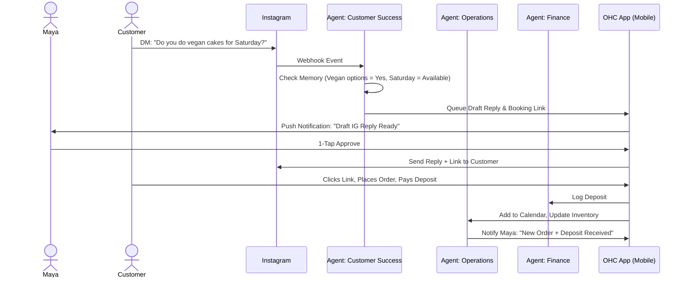
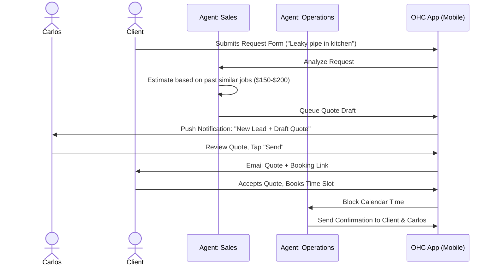
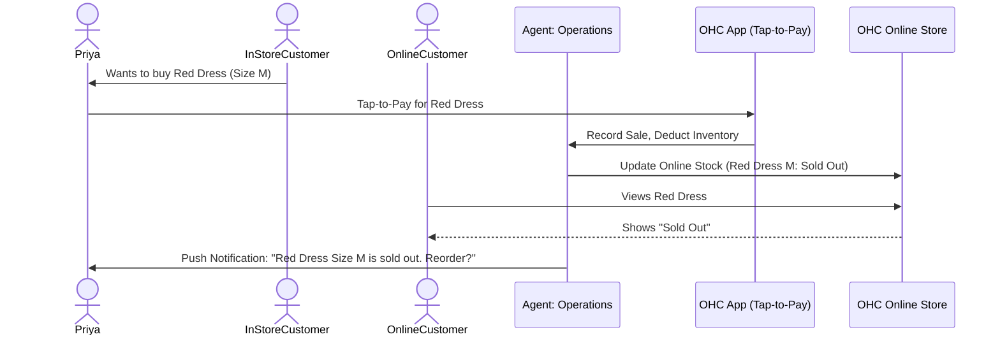
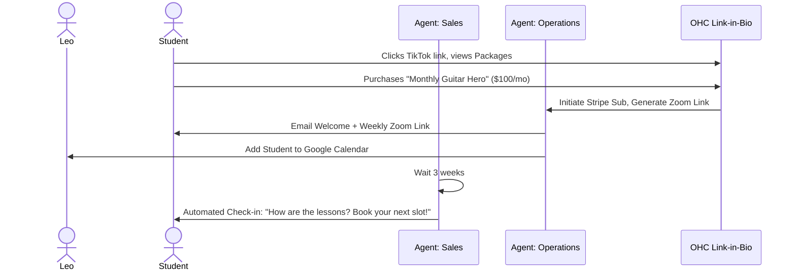
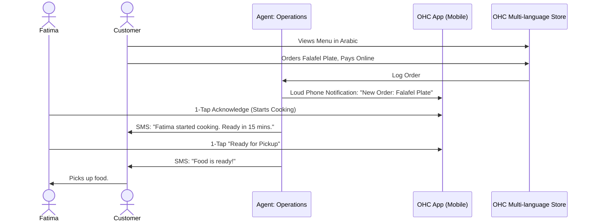

[research] Business Journey Architecture
# Business Journey Architecture

## 1. Problem Statement
Small business owners (SMBs) across various sectors—from bakers and handymen to tutors and boutique owners—face immense friction when trying to establish, run, and grow their online presence. Existing platforms (Shopify, Wix, Squarespace) cater primarily to users with some technical literacy, leading to cognitive overload, abandonment, and significant drops in potential revenue due to complex setup processes, disjointed toolchains, and a lack of proactive guidance. The core problem is that non-technical users are forced to learn how to operate software rather than running their business.

## 2. Research Report
### 2.1 Findings & User Friction Points
Analysis of SMB pain points (based on competitive analysis of Shopify, Wix, Squarespace, and GoDaddy user feedback, as well as Reddit/Trustpilot data) reveals:
- **Setup Complexity:** 73% of users struggle with initial configuration (DNS, templates, shipping).
- **Operational Fatigue:** 68% suffer from managing multiple apps and inboxes.
- **Invisible Discovery:** 52% launch sites but fail to attract traffic because SEO is opaque.
- **Mobile Gaps:** 42% cannot manage core functions (inventory, price changes) effectively from their phones.
- **Abandonment:** Complex onboarding leads to high churn before the first dollar is earned.

### 2.2 Persona Analysis
We evaluated the journeys of five distinct OHC personas:
- **Maya (Baker, 28):** Needs zero-friction setup, mobile-first management, and automated DM handling.
- **Carlos (Handyman, 42):** Relies on Android. Needs clear service listings, quote generation, and booking.
- **Priya (Boutique, 35):** Requires Omni-channel (in-store POS + online), variant management, and analytics.
- **Leo (Tutor, 22):** Needs subscription packages, scheduling, and a strong social media link-in-bio presence.
- **Fatima (Food Cart, 50):** Requires low-data, multi-language support (Arabic/English), and fast pre-order flow.

### 2.3 Competitive Differentiation
While Shopify provides a robust backend, it demands technical investment. Wix/Squarespace focus heavily on desktop website builders. OHC distinguishes itself through **Radical Simplicity** and **AI as a Teammate**. The entire journey must be achievable via a 375px mobile screen, with AI agents proactively managing operations, marketing, and customer success behind the scenes.

## 3. Design Doc: Business Journeys

### 3.1 End-to-End User Journeys
The architecture of the business journey is divided into six stages: Acquisition, Onboarding, Activation, Retention, Revenue, and Referral.

#### 1. Acquisition
- **Mechanism:** Users discover OHC via targeted social media ads, organic search (optimized by GEO agents), or word-of-mouth (referral links).
- **Friction Point:** The transition from "interested" to "signing up".
- **Design Decision:** The landing page CTA immediately launches the Onboarding Wizard. No credit card required. "Launch in 10 minutes."

#### 2. Onboarding
- **Mechanism:** A conversational, AI-driven wizard. Minimal inputs (Business Name, Industry, Main Goal).
- **Friction Point:** Overwhelming setup forms.
- **Design Decision:** Defer complex configuration (tax rates, shipping zones). The "Promoter" agent generates a functional site draft based on the initial 3 inputs.

#### 3. Activation
- **Mechanism:** The user's first "Aha!" moment.
- **Success Criteria:** Adding the first product/service, publishing the storefront, and receiving the first test or real payment.
- **Design Decision:** Provide a gamified checklist. The "Manager" agent guides them through their first mock order.

#### 4. Retention
- **Mechanism:** Keeping the user engaged daily.
- **Friction Point:** Users forget to check the app or feel disconnected.
- **Design Decision:** Push notifications for critical events (new orders, low stock). The "Advisor" agent sends a weekly plain-language brief ("You sold 5 cakes. Tuesday was busy."). The "Ambassador" drafts DM replies for review.

#### 5. Revenue (Upgrading)
- **Mechanism:** Transitioning from Free to Starter/Pro tiers.
- **Friction Point:** Hard paywalls block critical workflows.
- **Design Decision:** Value-based gating. Upgrades are suggested when limits are approached (e.g., "You've reached your 100 AI actions for the month. Upgrade to Starter to let the Ambassador keep replying to customers.").

#### 6. Referral
- **Mechanism:** Viral growth.
- **Friction Point:** Complex affiliate programs.
- **Design Decision:** 1-tap sharing. "Give a free month, get a free month." The "Salesperson" agent manages referral tracking invisibly.

### 3.2 Sequence Diagrams (Mermaid.js)

#### Journey: Maya (The Baker) - Order Flow

#### Journey: Carlos (The Handyman) - Quote & Booking Flow

## 4. Implementation Prompt
**Role:** Implementer Agent
**Task:** Build the Onboarding Wizard and Initial Activation Flow.
**Context:** Non-technical users need to launch their business in under 10 minutes. The current onboarding is too complex.
**Requirements:**
1.  **Conversational UX:** Implement a 3-step conversational flow (Business Name, Type, Main Goal) optimized for 375px mobile screens. Use large touch targets (>= 44x44px).
2.  **Deferred Configuration:** Do not ask for shipping, taxes, or bank details during initial setup.
3.  **Agent Integration:** Hook the completion of the 3-step wizard to the `Marketing & Advertising` agent to trigger the automatic generation of a draft storefront.
4.  **Activation Checklist:** Build a minimal, gamified checklist dashboard component that guides the user to:
    - Review & Publish Storefront.
    - Add first product/service.
    - Set up a payment method (Stripe Connect).
5.  **Aesthetics:** Strictly adhere to the OHC Premium Token library (Glassmorphism, 20px blur, Outfit/Inter fonts).

**Acceptance Criteria:**
- A user can complete the wizard in under 2 minutes.
- The Marketing agent successfully queues a storefront generation task.
- The dashboard immediately shows the activation checklist upon wizard completion.
- All layouts render perfectly on a 375px width without horizontal scrolling.
- E2E Playwright tests must be included covering the entire onboarding flow from landing page to viewing the checklist.

## 5. Priority
**P0 (Critical)** - The onboarding and activation journey is the highest leverage point for reducing churn and proving platform value immediately.

## 6. Estimated Scope
**Large** - Involves cross-cutting UI updates (Flutter/Slint), KAIROS agent triggering, and significant state management updates.

#### Journey: Priya (The Boutique Owner) - Omni-channel Inventory Flow

#### Journey: Leo (The Music Tutor) - Subscription Booking Flow

#### Journey: Fatima (The Food Cart Operator) - Pre-order Pickup Flow

