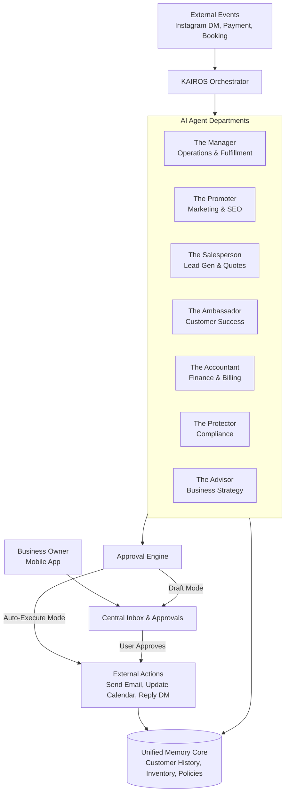

# 🧠 KAIROS: AI Agent Department Architecture

## Problem Statement
Small business owners—whether selling custom cakes via Instagram, running a local repair service, or managing a halal food cart—are overwhelmed by the operational complexity of running a business. They spend hours managing customer inquiries, calculating prices, updating inventories, scheduling bookings, and chasing payments, rather than focusing on their actual craft.

Our core users (Maya, Carlos, Priya, Leo, Fatima) need an "invisible team" that can take over the mental load of managing operations, marketing, sales, support, and finance. However, they are non-technical; they do not understand "automations," "workflows," or "bots." They understand **departments** and **employees** with clear responsibilities. The gap is transforming raw AI capabilities into intuitive, specialized "AI Departments" that seamlessly coordinate to run the business on the user's behalf, entirely from a mobile device.

## Research Report
**Market Gap:**
- **Shopify / Wix / Squarespace:** Offer complex rule-based automations (e.g., "If X then Y" tools) that require manual configuration, conceptual understanding of logic gates, and desktop-centric setup. They lack autonomous, conversational agents that can *reason* about edge cases (e.g., an Instagram DM asking "do you do vegan cakes?").
- **GoDaddy:** Offers basic AI website generation but stops at operations. It does not provide a specialized AI team to manage the business post-launch.
- **OneHumanCorp (OHC):** Must provide autonomous, specialized agents ("Departments") that mirror a real-world business structure. These agents must be capable of reasoning, maintaining context over time, and executing complex tasks without user intervention or complex setup.

**Core Findings:**
1. **Mental Model:** Users understand "The Manager" handling orders and "The Promoter" handling Instagram, but not "Agent A" triggering "Webhook B."
2. **Trust & Control:** Users want the AI to handle tasks autonomously but need to retain ultimate veto power (draft vs. auto-execute). They require transparency into what the AI is doing.
3. **Coordination:** The AI departments cannot operate in silos. "The Salesperson" (booking a consultation) must inform "The Accountant" (sending an invoice).
4. **Mobile-First:** All insights, approvals, and configurations must fit seamlessly into a 375px mobile screen.

## Design Doc

### Key Architectural Decisions
1. **Specialized Departments:** The AI is divided into intuitive, role-based departments: Operations ("The Manager"), Marketing ("The Promoter"), Sales ("The Salesperson"), Customer Success ("The Ambassador"), Finance ("The Accountant"), Legal ("The Protector"), and Advisory ("The Advisor").
2. **Context & Memory Shared Core:** All departments access a unified "Memory Core" (knowledge graph) to ensure consistent context (e.g., if a customer previously requested vegan options, both Sales and Customer Success are aware).
3. **Event-Driven Orchestration:** Departments are triggered via natural business events (e.g., "New Message Received," "Order Placed," "Weekly Review Schedule") rather than manual workflows.
4. **Approval Modes:** Every department supports progressive autonomy: "Draft for Review" (requires human approval on mobile) and "Auto-Execute" (handles entirely autonomously).
5. **Mobile-First Interaction:** The user interacts with the AI team via a central "Inbox/Feed" on their mobile device, receiving bite-sized updates, drafted messages for approval, and weekly summaries.

### Architecture Diagram

### Mobile UX Flows (375px)
- **The Central Inbox (The "Desk"):** The primary landing screen. A unified feed of actionable items from all departments.
  - *Example:* "The Ambassador drafted a reply to Sarah's Instagram DM about vegan cakes. [Review & Send] [Edit]"
- **Department Settings:** A simple toggle screen for each department.
  - *Example:* The Salesperson -> [ ] Draft quotes for review | [x] Auto-send quotes under $100.
- **The Weekly Briefing:** A Sunday morning push notification from "The Advisor."
  - *Example:* "Good morning Maya! The Promoter noticed your Valentine's cupcakes are trending. Want to launch a quick email campaign to your waitlist? [Yes, draft it]"

### AI Integration Points
- **Trigger:** Webhooks from social platforms, payment gateways, or internal schedule ticks.
- **Coordination:** The Orchestrator routes events to the relevant department based on intent classification.
- **State Management:** The unified Memory Core ensures agents don't hallucinate or contradict previous interactions.
- **Budgeting:** AI actions are tracked per tenant against their subscription tier limits (e.g., "100 actions/mo" on the Free tier).

## Implementation Prompt
**Task for Implementer:**
Implement the "AI Department Orchestration Engine" that handles the routing and execution of AI tasks across the defined specialized departments (Manager, Promoter, Salesperson, Ambassador, Accountant, Protector, Advisor).

**User Journey (CUJ):**
1. An external event occurs (e.g., a customer sends an Instagram DM asking for a quote).
2. The Orchestrator receives the event and routes it to the appropriate department (e.g., "The Salesperson").
3. The Salesperson accesses the Unified Memory Core to gather context (product pricing, customer history).
4. Based on the owner's settings, the Salesperson either auto-executes the reply or routes a drafted response to the owner's Mobile Inbox for one-tap approval.
5. Once executed, the action is logged back into the Memory Core.

**Acceptance Criteria:**
- Events can be routed to at least 3 distinct "Departments."
- Departments share context via a unified memory interface.
- Support for "Draft" and "Auto-Execute" approval modes.
- Actions are auditable and presented in a unified feed format suitable for a mobile UI.
- Implement rate limiting/budgeting per tenant.

*(Note: Do not prescribe specific database schemas, LLM APIs, or function signatures. Design the internal interfaces and execution flow to support these user-facing outcomes.)*

## Priority
P0 (Critical)

## Estimated Scope
Large
