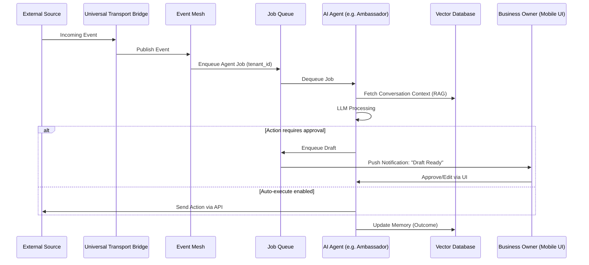
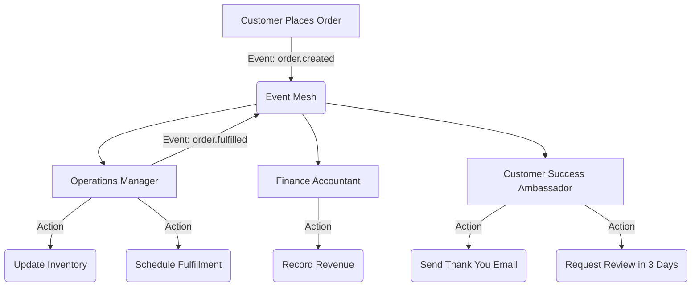
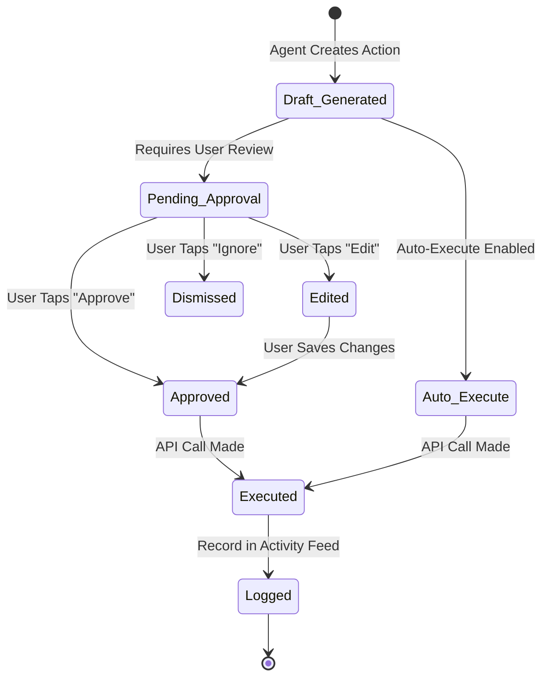

# Issue Brief: Autonomous AI Agent Department Architecture

## 1. Problem Statement & Context

Small business owners—from bakers to handymen—are overwhelmed by the sheer volume of manual tasks required to run a business. While competitors like Shopify, Wix, and Squarespace offer AI capabilities, they treat AI as a reactive chatbot (e.g., Shopify Sidekick) or a one-time generative tool. Users must initiate actions, leaving the burden of constant management on their shoulders.

**The Opportunity:** OneHumanCorp (OHC) will implement **autonomous, background AI agents** that operate as true functional departments (Customer Success, Operations, Marketing, etc.). These agents continuously monitor the business state and take action invisibly, fulfilling the promise of "AI does the heavy lifting invisibly."

---

## 2. Research Report: Persona Pain Points & Department Mapping

Based on an analysis of competitor platforms and our target personas:
- **Shopify & Wix** offer AI tools, but they require the user to initiate actions. The burden of daily operations remains on the owner.
- **Top User Complaints** highlight the fatigue of answering repetitive questions and managing inventory syncing across channels.
- **OHC's Differentiation:** Autonomous background agents that act without direct prompting, using a "Draft-First, Auto-Execute Later" model.

| Persona | Business Type | Primary Pain Point | Primary AI Department | Expected Autonomous Action |
|---|---|---|---|---|
| **Maya** (28) | Custom Baker | "I can't answer DMs about vegan options while baking." | Customer Success ("The Ambassador") | Auto-replies to Instagram DMs and drafts custom order quotes. |
| **Carlos** (42) | Handyman | "I lose leads because I don't follow up fast enough." | Sales & Acquisition ("The Salesperson") | Auto-generates quotes from job descriptions and follows up with unbooked leads. |
| **Priya** (35) | Boutique | "Tracking inventory across online and in-store is exhausting." | Operations ("The Manager") | Syncs inventory, flags low stock, and pauses out-of-stock items on storefront. |
| **Leo** (22) | Music Tutor | "Students forget to rebook their next lesson." | Finance & Payments ("The Accountant") & Sales | Sends automated booking reminders and tracks subscription payments. |
| **Fatima** (50) | Food Cart | "I need simple notifications when pre-orders arrive." | Operations ("The Manager") | Triggers immediate mobile push notifications for new pre-orders and prints daily prep lists. |

---

## 3. Design Doc: High-Level Architecture

The AI agents in OHC are structured into logical "Departments." These are isolated execution environments with dedicated tools, memories, and access scopes.

### Core Departments
1. **Operations ("The Manager"):** Order fulfillment, booking management, inventory syncing.
2. **Marketing & Advertising ("The Promoter"):** Website design updates, SEO, auto-posting to social media.
3. **Sales & Acquisition ("The Salesperson"):** Quote generation, lead follow-ups, upselling.
4. **Customer Success ("The Ambassador"):** Message replies, review requests, post-sale engagement.
5. **Finance & Payments ("The Accountant"):** Payment processing, financial health summaries, tax prep.
6. **Legal & Compliance ("The Protector"):** Contract generation, policy updates, compliance tracking.
7. **Business Advisory ("The Advisor"):** Weekly actionable insights, pricing optimization, seasonal trend alerts.

### Trigger Mechanisms & Execution Flow
Agents operate on an **Event-Driven Architecture**.
- **Event-Driven:** Triggered by system events (e.g., `Webhook_Instagram_DM_Received`).
- **Schedule-Driven:** Triggered by cron jobs (e.g., `Weekly_Advisory_Report`).
- **State-Driven:** Triggered by state invariants (e.g., Lead unbooked for >48h).

### Inter-Agent Coordination
Departments coordinate via a shared event mesh, using distributed locks to prevent race conditions.

### Memory Architecture
- **Short-Term Context:** Recent events in the current session.
- **Long-Term Memory:** Historical interactions, stored in a Vector DB.
- **Memory Retrieval:** Proactive RAG approach to maintain context (e.g., tone, pricing history).

### Approval Workflows & UX Design
A **Draft-First, Auto-Execute Later** strategy builds trust.
- **Agent Activity Feed (Mobile UI):** A continuous feed of agent actions on the home dashboard.
- Users can review, edit, or approve drafted actions.
- **Approval Settings:** Owners can toggle specific workflows to "Auto-Execute."

---

## 4. Implementation Prompt
Implement the backend job queue and agent event processing loop to enable autonomous AI actions across the defined departments. The system must listen for standard business events (e.g., incoming messages, new orders) and queue them for the appropriate AI agent.

Create the Flutter mobile UI (ensuring perfect rendering at 375px) to display the "Agent Activity Feed" on the home dashboard. This UI must allow users to review, edit, and approve drafted actions generated by the agents. The feature must be entirely transparent, using plain-language descriptions (e.g., "The Ambassador drafted a reply to Sarah"). Implement the settings toggle to allow users to switch specific agent workflows from "Draft-First" to "Auto-Execute."

**Acceptance Criteria:**
- Backend successfully routes events to the correct agent department.
- Agents can generate draft actions that require user approval.
- Mobile UI accurately displays the activity feed and handles approval/edit/dismiss flows.
- Users can toggle workflows between draft and auto-execute modes.

---

## 5. Priority
P0

---

## 6. Estimated Scope
Large
