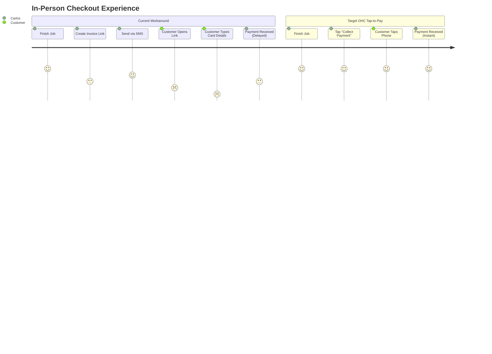
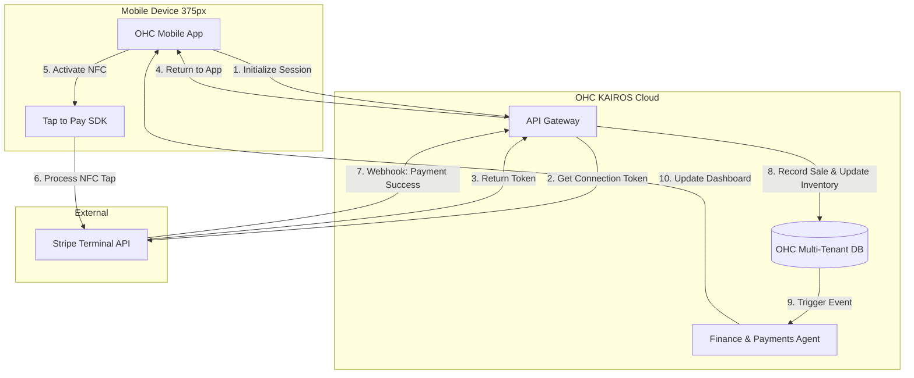

# Issue Brief: Omnichannel Mobile Tap-to-Pay POS Architecture

## Title
[Architecture] Omnichannel Mobile Tap-to-Pay POS

## Problem Statement
Small business owners like Priya (Boutique Owner) and Carlos (Handyman) operate in a hybrid world, selling both online and in person. Currently, OHC handles online transactions smoothly, but when Priya makes an in-store sale or Carlos finishes a repair, they must rely on clunky external card readers or manual invoice entries. This breaks the unified platform experience, fragments their financial data, and fails the "Grandmother Test." They need the ability to accept contactless payments directly on their mobile device (Tap-to-Pay on iPhone/Android) instantly, with zero additional hardware.

## Research Report
### Persona Summaries & Pain Points
- **Priya (Boutique Owner, 35)**: Manages physical store inventory and online sales. *Pain Point:* Currently uses a separate Square terminal for in-store sales, which doesn't sync with her OHC online inventory, leading to overselling online.
- **Carlos (Handyman, 42)**: Needs to collect payment immediately after finishing a job at a client's house. *Pain Point:* Asking clients to pay via a web link sent by email introduces friction and delays payment.
- **Fatima (Food Cart Operator, 50)**: High volume of small transactions. *Pain Point:* Cannot afford or manage separate Bluetooth card readers. Needs her Android phone to act as the payment terminal.

### Competitive Analysis & Evidence
Competitors like Shopify and Square have heavily invested in mobile point-of-sale (POS) and Tap-to-Pay capabilities, recognizing that unified omnichannel commerce is critical for SMB retention.

| Feature / Platform | OHC (Current) | Shopify POS | Square POS | OHC (Target) |
| :--- | :--- | :--- | :--- | :--- |
| **Tap-to-Pay (No Hardware)** | ❌ No | ✅ Yes (App required) | ✅ Yes (App required) | **✅ Yes (Native OHC App)** |
| **Unified Inventory Sync** | ✅ Yes (Online only) | ✅ Yes | ✅ Yes | **✅ Yes (Real-time)** |
| **Setup Complexity** | N/A | Medium (Multiple apps) | Low | **Zero (Built-in)** |
| **AI Agent Handoff** | ❌ No | ❌ No | ❌ No | **✅ Yes (Finance Agent)** |

### Actionable Recommendations (Evidence-Backed)
1. **Adopt Native Tap-to-Pay SDKs**: Integrate Stripe Terminal's Tap to Pay SDK for iOS and Android directly into the OHC mobile wrapper to eliminate the need for Bluetooth card readers.
2. **Real-time Inventory Deduplication**: Ensure that an in-person POS transaction uses the exact same `Order` and `Inventory` state machine as an online checkout to prevent overselling.
3. **Automate the Financial Reconciliation**: Use the "Finance & Payments" AI agent to automatically match Tap-to-Pay settlements with daily online sales, providing a unified daily briefing.

### Comparative Journey (Mermaid.js)

## Design Doc

### Architecture Diagram (Mermaid.js)

### UI Wireframes (375px First)
1. **Checkout Keypad View**: A clean, high-contrast numeric keypad (glassmorphism style) for Carlos to quickly enter an amount (e.g., "$150.00") or select items from a visual grid (for Priya/Fatima).
2. **Payment Method Bottom Sheet**: After hitting "Charge", a bottom sheet slides up showing "Tap to Pay on iPhone/Android" as the primary, high-contrast button.
3. **NFC Interaction Screen**: The native OS Tap-to-Pay interface takes over temporarily to read the customer's card or digital wallet.
4. **Success Card**: A celebratory success animation returning to the OHC app, with 1-tap buttons for "Email Receipt" or "SMS Receipt".

### Mobile UX Flow
1. Carlos finishes a repair. He opens the OHC App and taps the large floating action button (FAB): "New Sale".
2. He enters "$150" and taps "Charge".
3. He selects "Tap to Pay". The screen prompts him to hold his phone near the customer's card.
4. The customer taps their contactless card or Apple Pay device against Carlos's phone.
5. A checkmark appears. The system automatically reconciles the invoice and updates Carlos's daily revenue dashboard.

### AI Agent Integration Points
- **The Bookkeeper (Finance Agent)**: Instantly logs the in-person transaction alongside online sales, ensuring unified accounting without manual data entry.
- **The Operations Agent (Vigilant Manager)**: If Priya sells the last blue dress via Tap-to-Pay, the Operations Agent instantly triggers a "Low Stock" alert and removes the item from her online storefront.

### Key Design Decisions
- **No Extra Hardware**: Eliminating Bluetooth card readers removes a major friction point for onboarding solopreneurs, satisfying the Radical Simplicity rule.
- **Unified Ledger**: Treating physical POS transactions exactly like digital web checkouts at the database level guarantees 100% accurate multi-tenant inventory and revenue tracking.
- **Native OS Security**: Offloading the NFC processing to the native OS SDKs (via Stripe Terminal) ensures PCI compliance and Zero Trust security without burdening the OHC backend.

## Implementation Prompt
**To Implementer Agent:**
Implement the Omnichannel Mobile Tap-to-Pay POS capability within the OHC platform. Extend the mobile UI to include a "Point of Sale" mode with a numeric keypad and cart system designed for 375px screens. Integrate the necessary Tap to Pay SDK (e.g., Stripe Terminal) to allow merchants to accept contactless payments directly on their mobile devices. Ensure that completed in-person payments automatically generate a standard order event that updates the unified inventory ledger and triggers the "Finance" and "Operations" AI agents. The user journey must flow seamlessly from entering an amount to a successful tap-to-pay interaction, culminating in a digital receipt option.
- **Acceptance Criteria**: Merchant can initiate a Tap-to-Pay session from the mobile dashboard. A successful NFC tap results in a processed payment. The transaction is recorded in the unified ledger, and online inventory is correctly decremented.
- **CUJ**: Merchant opens POS tab -> Enters $50.00 -> Taps "Charge with Tap-to-Pay" -> Customer taps card -> Payment succeeds -> Merchant views updated total revenue.

## Priority
P0

## Estimated Scope
Large
