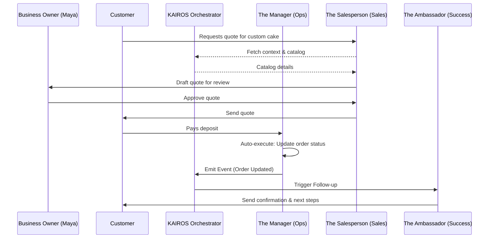

# Title: AI Agent Department Architecture

## Problem Statement
Small business owners (like Maya, Carlos, Priya, Leo, and Fatima) do not have the time, expertise, or budget to hire specialized staff for operations, marketing, sales, customer success, finance, legal, or advisory roles. They need these functions handled invisibly in the background. If we just expose raw AI models or confusing "agent builder" interfaces, they will abandon the platform. We need an AI architecture that mirrors a real business organization with friendly department names ("The Manager", "The Promoter", etc.) that handle complexity automatically, with clear approval workflows, memory persistence, and usage throttling.

## Research Report
### Competitive Analysis
- **Shopify**: Offers "Shopify Magic" which helps generate text and some operational insights, but it lacks autonomous multi-agent coordination. It still requires the user to explicitly prompt and act.
- **Wix/Squarespace**: AI is used primarily for site generation during onboarding. Post-launch, the AI does not actively run the business.
- **GoDaddy**: Basic AI text generation and social media post scheduling, but highly manual.

### Findings
1. Users need AI that triggers automatically (e.g., Operations processes an order -> Customer Success sends a thank you note) without user intervention.
2. Users fear AI "going rogue." Therefore, high-stakes actions (like issuing refunds or sending marketing blasts) require an approval flow (draft-for-review), while low-stakes actions (like tagging an order) can auto-execute.
3. Multi-tenancy and resource budgeting are critical. AI usage must be throttled per tier (Free = 100 actions, Starter = 1000, Pro = Unlimited).
4. Agents must share memory. If "The Salesperson" generates a quote, "The Ambassador" must know about it when following up.

## Design Doc
### Departments Structure

1. **Operations ("The Manager")**
   - **Triggers**: Events (OrderPlaced, InventoryLow, BookingCreated).
   - **Responsibilities**: Process orders, manage calendar capacity, trigger fulfillment workflows, handle refund requests.

2. **Marketing & Advertising ("The Promoter")**
   - **Triggers**: Schedule (WeeklyCampaign), Events (NewProductAdded).
   - **Responsibilities**: Draft SEO updates, generate link-in-bio pages, draft social media posts, design website sections.

3. **Sales & Acquisition ("The Salesperson")**
   - **Triggers**: Events (InquiryReceived, QuoteRequested).
   - **Responsibilities**: Draft custom quotes, follow-up on abandoned carts, suggest upsells.

4. **Customer Success ("The Ambassador")**
   - **Triggers**: Events (OrderDelivered, MessageReceived).
   - **Responsibilities**: Send order updates, request reviews, handle FAQ messages, run re-engagement campaigns.

5. **Finance & Payments ("The Accountant")**
   - **Triggers**: Schedule (MonthlyClose), Events (PaymentFailed, SubscriptionRenewed).
   - **Responsibilities**: Generate financial reports, draft tax summaries, retry failed payments, manage recurring billing.

6. **Legal & Compliance ("The Protector")**
   - **Triggers**: Events (NewFeatureAdopted, UserDataRequested), Schedule (QuarterlyAudit).
   - **Responsibilities**: Draft terms/policies, flag GDPR requests, track license expirations, suggest liability disclaimers.

7. **Business Advisory ("The Advisor")**
   - **Triggers**: Schedule (WeeklyHealthReport), Events (SignificantTrendDetected).
   - **Responsibilities**: Generate weekly actionable health reports, suggest seasonal pricing adjustments, highlight next-action recommendations.

### Architecture Diagram

### UX & Screen Flow (Mobile First - 375px)
1. **Agent Dashboard ("Your Team")**: A horizontal scroll of available departments. Each department shows an avatar, name, and recent activity (e.g., "The Manager: Processed 3 orders today").
2. **Action Feed**: A vertical feed of actions. Items are either "Completed" (auto-executed) or "Requires Approval" (drafts).
3. **Approval Card**:
   - Title: "The Salesperson drafted a quote for Sarah."
   - Body: Preview of the message/quote.
   - Actions: [Approve & Send] [Edit] [Reject]
4. **Memory Log**: Clicking into an agent shows what they "know" about a specific customer, styled as a familiar chat history or CRM timeline.

### Key Design Decisions
1. **Event-Driven Triggers**: Departments do not poll; they are awakened by domain events (e.g., `OrderPlaced`, `MessageReceived`) or on a schedule (e.g., `WeeklySummary`).
2. **Shared Memory Bus**: Agents write to and read from a shared context store tied to the tenant, ensuring one department isn't blind to another's actions.
3. **Approval Gateway**: All agent outputs pass through a central gateway that determines if the action matches the tenant's auto-execute policies or requires manual approval.
4. **Budgeting Throttler**: The gateway checks the tenant's usage limits before dispatching the agent, gracefully degrading or prompting an upgrade when limits are reached.

## Implementation Prompt
**Role**: Implementer Agent
**Task**: Implement the "Approval Gateway" and "Action Feed" UI for the AI Agent Departments.
**User Journey (CUJ)**: Maya logs into her app. She sees a notification that "The Salesperson" has drafted a response to an Instagram DM. She taps the notification, reviews the drafted response in the Action Feed, edits one word, and taps "Approve & Send".
**Acceptance Criteria**:
- Build the UI components for the "Your Team" dashboard and the vertical Action Feed.
- Implement the Approval Card with [Approve], [Edit], and [Reject] interactions.
- Ensure the design follows Glassmorphism UI standards (backdrop-filter: blur(20px)), Outfit/Inter typography, and mobile-first responsive design (375px baseline).
- Do not prescribe backend storage; define the necessary view models and event handlers for the UI to connect to an eventual backend service.

## Priority
P0

## Estimated Scope
Large
