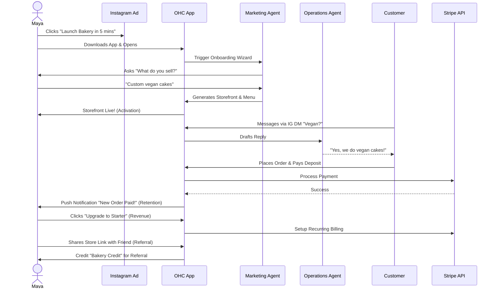
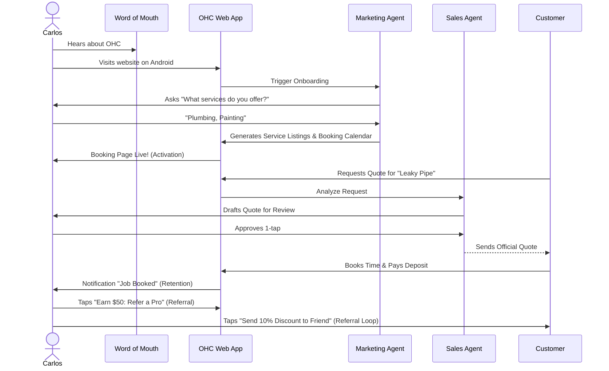
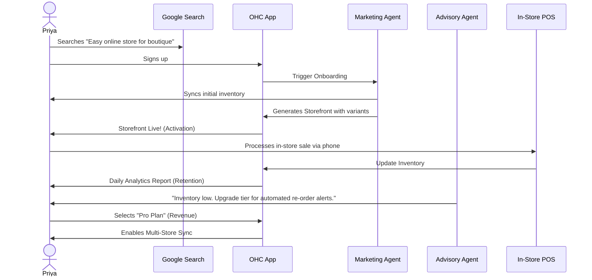
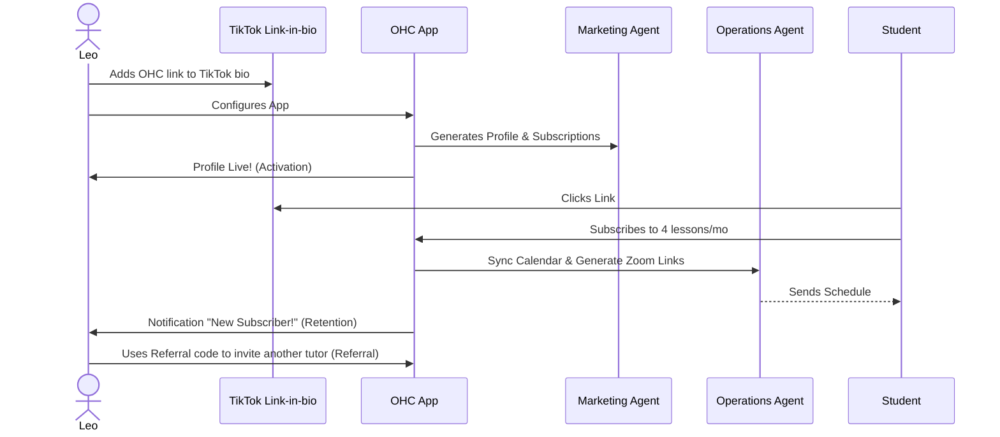
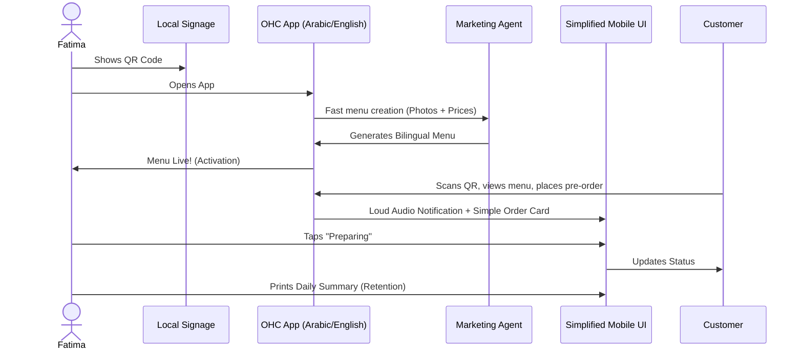

# Title
Business Journey Architecture

# Problem Statement
Small business owners—from bakers to handymen—often lack the technical skills to launch, run, and grow their businesses online. Current platforms are fragmented and require manual setup, leading to high drop-off rates and abandoned tools. OHC aims to solve this by providing a unified, AI-driven platform that guides users from zero to a live business in under 10 minutes. This architecture defines the end-to-end user journey for all personas (Maya, Carlos, Priya, Leo, Fatima) to ensure the system naturally supports their progression through Acquisition, Onboarding, Activation, Retention, Revenue, and Referral without requiring a manual.

# Research Report

### Persona-Specific Pain Point Summaries
- **Maya (baker, 28)**: Struggles with manually tracking custom orders via Instagram DMs and chasing deposits. Needs an automated storefront and AI that can answer simple queries ("do you do vegan cakes?") while she sleeps.
- **Carlos (handyman, 42)**: Relies on word of mouth and phone calls; lacks a centralized booking system and quote generation tool. Needs a simple way to list services with prices and collect deposits securely from an Android phone.
- **Priya (boutique owner, 35)**: Struggles to sync in-store sales with online inventory. Needs omnichannel support, product variants (size/color), tap-to-pay POS capabilities, and unified analytics on her mobile device.
- **Leo (music tutor, 22)**: Juggles teaching online and in-person without an integrated booking and meeting system. Needs subscription management, automated calendar sync, and a link-in-bio portfolio.
- **Fatima (food cart, 50)**: Has limited English and low technical literacy; uses a low-end Android phone. Needs extreme simplicity, a bilingual photo menu, and loud audio notifications for pre-orders.

### Key advantages and risks
**Advantages**:
- Frictionless onboarding via conversational AI.
- Centralized data model eliminates syncing errors across multiple tools.
- Unified customer experience and mobile-first design.

**Risks**:
- AI misinterpreting user intent during onboarding or customer interaction.
- Over-simplification limiting advanced users.
- Connectivity issues for users like Fatima on low-end devices without robust offline support.

### Rough Pricing & Competitor Comparison
| Platform | Key Features | Pricing | OHC Advantage |
|---|---|---|---|
| Shopify | E-commerce, Inventory, POS | $39/mo + fees | Requires setup time; OHC is zero-setup. |
| Wix | Website Builder, Bookings | $16/mo - $59/mo | Often needs desktop; OHC is 100% mobile native. |
| Calendly | Scheduling, Routing | $10/mo - $16/mo | Fragmented; OHC has native unified billing & CRM. |
| OHC | AI-driven, Unified platform | Free to $79/mo | Conversational setup, zero manual configuration. |

### Whether it works in both Cloud and Standalone modes
The underlying journey orchestration layer leverages a hybrid mesh design. User state (onboarding progress, activation status) and AI agent interactions seamlessly operate in Cloud mode via distributed databases/Redis, and in Standalone mode using local IPC and SQLite, ensuring identical behavior and robust offline capabilities for mobile users.

# Design Doc

### Key Design Decisions
- **AI-Driven Progressive Onboarding**: Instead of traditional forms, users converse with an AI agent to build their business profile step-by-step.
- **Mobile-First UX**: The entire flow is optimized for 375px viewports, emphasizing tap targets, clear typography (Outfit & Inter), and offline-first data caching.
- **Unified Event Pipeline**: User progression (from Acquisition to Referral) emits standard events triggering relevant AI departments (e.g., Marketing, Sales).

### Business Journey Diagrams

#### Maya (Baker)

#### Carlos (Handyman)

#### Priya (Boutique Owner)

#### Leo (Music Tutor)

#### Fatima (Food Cart)

# Implementation Prompt
Implement the foundational user onboarding flow and dashboard state management that supports the progression from Acquisition to Activation. Build the mobile-first (375px) conversational UI wizard that captures the user's business context. Ensure all interactions feel premium (using OHC Design Standards: Glassmorphism, correct typography) and handle optimistic updates for low-connectivity environments. The final wizard step must trigger the instantaneous generation of a functional Storefront or Booking Page. Ensure that the core data pipelines emitting stage-transition events (Onboarding -> Activated) are properly instrumented.

# Priority
P0

# Estimated Scope
Large
