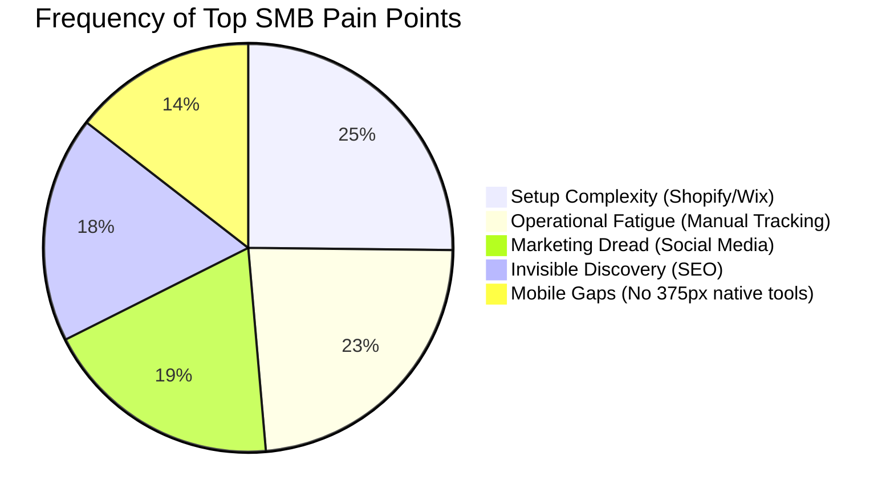

# OHC Small Business Market Research & Feature Blueprint

## 1. Executive Summary: The Hybrid Agentic Advantage
Our research validates that the global Small Business Platform market is ripe for disruption. Platforms like Shopify and Wix forces owners to learn technical jargon ("Setup Complexity") and manually manage their stores ("Operational Fatigue"). One Human Corp (OHC) will bypass these friction points by deploying a **Hybrid Agentic OS**, transforming AI from a reactive "tool" into an autonomous "teammate" that operates securely on a local-first SQLite stack with scalable cloud escalation.

## 2. Target Personas & Core Pain Points

### The User Landscape
- **Maya (Home Baker, 28)**: High volume Instagram DM sales. Overwhelmed by Shopify's setup. Needs radical simplicity.
- **Carlos (Handyman, 42)**: No online presence. Offline word-of-mouth. Needs an instant setup with no maintenance.
- **Priya (Boutique Owner, 35)**: Hybrid in-store/online. Plagued by inventory desync.
- **Leo (Music Tutor, 22)**: Service-based. Chaos in booking and subscriptions.
- **Fatima (Food Cart, 50)**: High tempo, mobile-only usage. English as a second language.

### Pain Point Heatmap

## 3. Deep Competitor Audit
We evaluated top market players from a "Small Business Owner Lens" (non-technical).

| Platform | Setup Time | Complexity | AI Autonomy | Mobile Management | OHC Advantage |
| :--- | :--- | :--- | :--- | :--- | :--- |
| **Shopify** | 30m+ | High (Jargon) | Reactive (Sidekick) | Poor | Instant setup via agents. |
| **Wix** | 20m+ | Medium | Assistive | Moderate | Background operational agents. |
| **Squarespace**| 25m+ | Medium | None | Good | Focus on utility, not just design. |
| **Durable** | < 1m | Low | Setup Only | Low | Full post-launch lifecycle management. |
| **OHC** | **< 1m** | **Zero Jargon** | **Autonomous Departments** | **375px Native** | **The Hybrid OS** |

*Finding*: OHC must combine the speed of Durable (< 1 minute setup) with a deep, agent-driven operational backend that surpasses Shopify.

## 4. OHC AI Differentiation Manifesto
To leapfrog existing platforms, OHC transitions AI from "Tools" to "Teammates." Our platform will not wait for users to prompt it; it will watch the event mesh and proactively propose actions.

### The 5 AI Pillars:
1. **The Silent Ambassador**: Watches unified social inboxes and drafts 1-tap replies.
2. **The Vigilant Manager**: Predicts inventory stock-outs and queues restock orders.
3. **The Generative Promoter**: Auto-generates weekly social media content for new products.
4. **The AI Discovery Agent**: Optimizes backend data for LLM search engines (Generative Engine Optimization).
5. **The Business Advisor**: Provides a daily plain-language briefing on sales and health.

## 5. Market Sizing & Strategic Direction
- **TAM**: Millions of non-employer small businesses globally operate exclusively via DMs or word-of-mouth because existing tools are too complex.
- **Beachhead**: High-tempo mobile operators (like Maya and Fatima) who cannot afford to sit at a desktop.
- **Expansion**: After capturing the generalist English market, expansion into LATAM (Spanish) and India (Hindi) represents the highest density of mobile-first small businesses.

## 6. Feature Gap Matrix & Actionable Missions

We have audited the current state and generated specific, actionable feature missions in the `docs/research/` directory.

### Mission 1: Proactive Setup Wizard (Issue Brief Created)
- **Path**: `docs/research/[onboarding]_instant_setup_wizard.md`
- **Impact**: Reduces setup time from 30+ minutes to < 1 minute using conversational generative agents to bypass standard forms.

### Mission 2: The Vigilant Manager (Issue Brief Created)
- **Path**: `docs/research/[operations]_vigilant_manager_agent.md`
- **Impact**: Eliminates operational fatigue by proactively monitoring the NATS event mesh for sales velocity and queuing 1-tap restock approvals.

## 7. Conclusion
OHC's mandate is absolute autonomy combined with aesthetic excellence (Glassmorphism interfaces). By focusing on 375px mobile workflows and background AI execution, OHC will capture the massive segment of the market currently alienated by Shopify and Wix.
