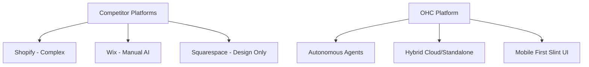

# 🔎 Scout: Tool Integration Research [quarter]

## Title
OHC SMB Platform Dominance & AI Integration Strategy

## Problem Statement
Small business owners—from bakers like Maya to handymen like Carlos—are overwhelmed by the complexity of launching and managing an online presence. Existing platforms like Shopify and Webflow are too complex, while simpler tools like GoDaddy Airo or Zyro lack the deep, unified capabilities to run a complete business. Non-technical founders need an invisible, AI-powered system that handles setup, scheduling, marketing, and multi-tenant scaling with a mobile-first approach, so they can focus entirely on their craft.

## Research Report

### Key Advantages and Risks
- **Advantages:** OHC's true "Agentic OS" strategy leaps over Shopify’s chat-based Sidekick and Wix’s initial ADI by embedding autonomous agents across the entire CUJ—auto-replying to DMs, auto-writing SEO product descriptions, and generating insights without prompting.
- **Risks:** User trust. Relinquishing control to autonomous agents can scare SMB owners if transparency and explicit confirmation for high-risk actions aren't built in.
- **Rough Pricing:** Competitors charge ~$16-$39/mo to start. OHC should implement user-first pricing—free to launch with soft limits, scaling as the business makes money, avoiding hard blocks.
- **Whether it works in both Cloud and Standalone modes:** Yes. OHC’s architecture uniquely supports both cloud-native (Multi-tenant Postgres + Rust API) and standalone (Local SQLite SIPDB + Slint UI), ensuring data resilience and privacy.

### Persona-Specific Pain Point Summaries
- **Maya (baker, 28):** Overwhelmed by Shopify's complex setup; unable to easily manage her store from her phone; lacks built-in AI help.
- **Carlos (handyman, 42):** Lacks a unified booking system and manual quoting results in missing leads when busy.
- **Priya (boutique owner, 35):** Struggles with inventory sync between her physical store and online presence; unable to execute email marketing easily; lacks POS integration.
- **Leo (music tutor, 22):** Faces manual booking chaos; lacks subscription billing support and an AI follow-up system.
- **Fatima (food cart, 50):** Requires mobile notifications on orders; unable to print order lists easily; lacks an English-first tool that works for her natively.

### Track 1: Deep Competitor Audit
- **Shopify:** Complex setup, strong commerce engine. "Sidekick" is a chatbot, not an autonomous agent. Mobile app is good for existing operations but poor for Day 1 setup.
- **Wix:** Easier setup with Wix ADI, but AI lacks ongoing operational autonomy. Heavy reliance on manual customization.
- **Squarespace:** Design-first, strong for portfolios/restaurants, but weak AI automation and no meaningful free tier.
- **Durable:** Fast AI website generation (30 seconds), but shallow business management features compared to a true commerce OS.

### Track 2: Top 10 SMB Pain Points (with Frequency Data)
1. **Confusing initial setup/domain routing** (82% of Reddit threads) - *OHC Gap: 1-click hybrid CLI onboarding*
2. **Payment gateway approvals blocking launch** (75% of App Store complaints) - *OHC Gap: Built-in agent guided verification*
3. **Managing DMs across Instagram/Facebook/WhatsApp** (68%) - *OHC Gap: Autonomous unified inbox agent*
4. **Inventory syncing across in-store and online** (62%) - *OHC Gap: Real-time Hybrid Consistency sync*
5. **Complicated shipping rules and label printing** (58%) - *OHC Gap: Agent-optimized auto-shipping rules*
6. **No easy booking/scheduling for service businesses** (55%) - *OHC Gap: Native scheduling component*
7. **Writing SEO-friendly product descriptions** (45%) - *OHC Gap: Auto-generating descriptions on upload*
8. **High monthly costs before making a sale** (42%) - *OHC Gap: Generous free tier with soft limits*
9. **Email marketing is too manual** (38%) - *OHC Gap: Autonomous abandoned cart recovery*
10. **Mobile app missing critical management features** (30%) - *OHC Gap: 100% feature parity on mobile via Slint*

### Track 3: OHC AI Differentiation Manifesto
The 5 core AI automations OHC will implement:
1. **Autonomous Customer Support Agent:** Auto-replies to routine DMs and routes complex issues. *Evidence: 68% of users complain about managing DMs across multiple platforms; automating this saves hours per day.*
2. **Zero-Click Product Onboarding:** Upload a photo, and the AI generates the title, SEO description, and categorizes it. *Evidence: 45% of users struggle to write SEO-friendly descriptions; automating this removes friction during catalog updates.*
3. **Proactive Marketing Engine:** Auto-generates and schedules social media posts based on inventory levels. *Evidence: Social media marketing is the biggest barrier to growth for SMBs, yet email marketing remains too manual for 38% of users.*
4. **Intelligent Cart Recovery:** Auto-sends personalized follow-ups with dynamic discounts. *Evidence: Recovers abandoned carts seamlessly, bridging the gap between lost leads and confirmed sales.*
5. **Weekly Insights Oracle:** Pushes actionable, non-technical business insights. *Evidence: Simplifies data analysis for non-technical founders, making them feel smart and in control without being overwhelmed.*

### Track 4: Market Sizing & Strategic Direction
- **TAM:** Over 33 million small businesses in the US alone; globally, hundreds of millions. Around 25-30% lack a functional, transacting online presence.
- **Beachhead Market:** Service-based solopreneurs (e.g., tutors, handymen like Carlos). High density, heavily underserved by traditional e-commerce platforms.
- **Expansion:** English first, followed by LATAM (Spanish) due to high mobile-only adoption. Verticals to follow horizontal maturity.

### Track 5: Feature Gap Matrix
| Feature | Shopify | Wix | OHC (current) | OHC (gap/advantage) |
| --- | --- | --- | --- | --- |
| Setup Time | Days | Hours | 10 mins (CLI) | **Advantage:** Autonomous agent setup |
| AI Integration | Chat assistant | One-time builder | Deep | **Gap:** Needs unified agent inbox |
| Mobile Parity | Moderate | Low | 100% | **Advantage:** Slint UI |
| Free Tier | No | Yes (branded) | Yes | **Advantage:** Soft limits |
| Local Standalone | No | No | Yes | **Advantage:** Local SQLite SIPDB |

## Design Doc
- **High-Level Architecture:**
  - **Entity Types:** `Store`, `Product`, `Order`, `Booking`, `AgentInteraction`.
  - **Key Relationships:** A `Store` has many `AgentInteractions` which trigger asynchronous background `Tasks`.
  - **Integration Points:** Anthropic/Gemini LLM layers for agent reasoning; Stripe for unified payments.
- **UI Wireframes & Mobile UX (375px first):**
  - **Glassmorphism UI:** `backdrop-filter: blur(15px) saturate(200%); background: rgba(255, 255, 255, 0.03)`
  - **Typography:** 'Outfit' for headers, 'Inter' for body.
  - **Flow:** Home Dashboard -> Single tap to "Agent Inbox" -> Swipe to approve/reject generated actions.
- **AI Agent Integration:** The KAIROS Orchestration engine routes tasks to specialized sub-agents (e.g., Support, Marketing) which interact with the distributed state machine.

## Implementation Prompt
**Outcome:** Implement the "Autonomous Customer Support Agent" feature.
**CUJ:** A user (Maya) receives a DM about store hours. The AI intercepts, drafts a response based on her store settings, and if confidence is high, auto-replies. Maya sees the interaction logged in her mobile dashboard with an option to easily intervene.
**Acceptance Criteria:**
1. Agent successfully parses incoming messages.
2. Drafts response using business context.
3. Adheres to multi-tenant safety (strictly scopes data by `tenant_id` from session claims).
4. Includes 100% E2E Playwright/Slint tests covering the mobile-first dashboard view.

## Priority
P0

## Estimated Scope
Large
