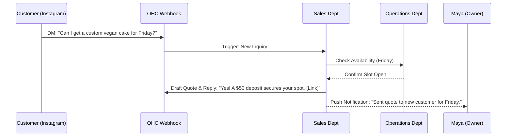

# Research: AI Agent Department Architecture

## Title
AI Agent Department Architecture: Orchestrating the Invisible Small Business Swarm

## Problem Statement
Small business owners—whether operating a bustling food cart, managing boutique retail, or teaching music lessons—are consistently overwhelmed by the operational sprawl of their businesses. They need a platform that doesn't just provide software tools, but active, intelligent employees acting on their behalf. Currently, understanding complex automations, scheduling logic, multi-step customer follow-ups, and financial reporting requires a steep learning curve. From the perspective of Carlos the Handyman or Maya the Baker, the gap is clear: they don't want to build "workflows"; they want an invisible swarm of dedicated agents grouped into familiar departments (e.g., Marketing, Sales, Operations, Finance) to seamlessly handle these tasks while they sleep.

## Research Report

### Market Needs & Persona Alignment
- **Maya (Baker):** Requires a "Salesperson" to respond to Instagram DM inquiries for custom cake orders and an "Accountant" to track deposit statuses.
- **Carlos (Handyman):** Needs an "Operations Manager" to manage calendar conflicts, dispatch auto-generated quotes, and a "Customer Success Ambassador" to follow up for reviews.
- **Fatima (Food Cart):** Needs a simplified "Operations" agent that toggles sold-out statuses based on daily inventory trends and sends pickup notifications instantly, accessible entirely on her low-end Android device.

### Competitive Analysis
- **Shopify:** Offers strong app ecosystem but relies on disjointed plugins (e.g., Klaviyo for marketing, Gorgias for support). The user has to connect and manage these separate logic silos.
- **Wix/Squarespace:** Provides rigid automations (IFTTT-style triggers). They lack autonomous decision-making or proactive advising.
- **OneHumanCorp (OHC) Opportunity:** A cohesive, multi-department AI swarm that shares a single unified context (KAIROS orchestration). Departments proactively collaborate (e.g., Operations finalizes an order, triggering Customer Success to request a review) without the user configuring any integration.

### Proposed AI Departments
1. **Operations ("The Manager"):** Inventory tracking, scheduling, fulfillment workflows, refund logic.
2. **Marketing & Advertising ("The Promoter"):** Social media draft generation, SEO optimization, promotion scheduling.
3. **Sales & Acquisition ("The Salesperson"):** Quote generation, DM/lead follow-ups, upsell routing.
4. **Customer Success ("The Ambassador"):** Order updates, re-engagement campaigns, review collection.
5. **Finance & Payments ("The Accountant"):** Tax summaries, recurring billing health, payout tracking.
6. **Legal & Compliance ("The Protector"):** GDPR consent tracking, policy updates, liability disclaimers.
7. **Business Advisory ("The Advisor"):** High-level weekly summaries ("Your revenue is up 12%; you should re-stock Vanilla cakes by Thursday").

## Design Doc

### 1. Department Architecture Overview
KAIROS orchestrates these departments. The user simply views an "Employees" tab where each department is represented as an autonomous entity. They can review pending actions or set departments to "Auto-Approve".

#### Architecture Diagram

```mermaid
graph TD
    User([Small Business Owner]) --> UI[OHC Mobile/Web Dashboard]
    UI --> K[KAIROS Orchestrator]

    K -->|Delegates Tasks| D1[Operations Dept]
    K -->|Delegates Tasks| D2[Sales Dept]
    K -->|Delegates Tasks| D3[Customer Success Dept]
    K -->|Delegates Tasks| D4[Finance Dept]

    D1 -.->|Task Complete| K
    D2 -.->|New Lead| D1
    D1 -.->|Order Fulfilled| D3

    subgraph KAIROS Engine
        K
        TL[(Shared Task List)]
        AD[AutoDream Memory]
        K --> TL
        K --> AD
    end

    subgraph Department Interfaces
        D1
        D2
        D3
        D4
    end

    classDef premium fill:rgba(255,255,255,0.03),stroke:rgba(255,255,255,0.08),stroke-width:1px,color:#fff,backdrop-filter:blur(20px) saturate(200%);
    class UI,K,D1,D2,D3,D4,TL,AD premium;
```

### 2. Mobile UX Flow (375px First) & UI Wireframes
The UI adheres strictly to the **Visual Excellence Mandate**:
- **Style:** Glassmorphism (`backdrop-filter: blur(20px) saturate(200%)`), smooth transitions, Outfit + Inter typography.
- **Grandmother Test:** No complex workflow builders. Just toggle switches and conversational interfaces.

**Screen 1: Department Overview**
- Top half: "Business Health Score" (provided by The Advisor).
- Bottom half: Grid of stylized cards representing departments (e.g., "The Manager", "The Salesperson").
- Each card shows a status indicator: "3 Tasks Pending Approval" or "Sleeping".

**Screen 2: Department Detail ("The Salesperson")**
- **Recent Actions List:** "Responded to 4 Instagram DMs", "Generated 2 Quotes".
- **Pending Actions (Requires Approval):** "Send 10% discount to 5 inactive customers? [Approve] [Edit]".
- **Configuration Slider:** "Autonomy Level" (Strict Review vs. Auto-Pilot).



### Key Design Decisions
- **Unified Context:** All departments read from the same `AutoDream` memory. The Salesperson knows if Customer Success recently refunded the user.
- **Approval-First Onboarding:** New users start with "Draft-for-Review" mode to build trust, before transitioning to Auto-Execute.
- **Event-Driven Coordination:** Departments do not call each other directly; they publish events to the Teammate Mesh, which KAIROS routes to the appropriate subscriber department.

## Implementation Prompt
**To the Implementer Swarm:**
Your objective is to implement the underlying infrastructure and initial user interface for the AI Agent Departments.
1. Implement the department routing layer in the KAIROS Orchestrator to categorize sub-agents into the defined departments.
2. Build the "Employees" mobile-first dashboard (Slint UI components) reflecting the glassmorphic design and the Autonomy slider (Draft vs. Auto).
3. Ensure that events (e.g., "Order Completed") can be routed between departments (e.g., from Operations to Customer Success) via the Teammate Mesh without hardcoded point-to-point connections.
4. Acceptance Criteria: A full CUJ where a mock "New Order" event triggers Operations to handle inventory and subsequently triggers Customer Success to draft a thank-you message for owner approval. Mobile UX must be fully responsive.

## Priority
P0 (Critical to the core value proposition of the Hybrid OS)

## Estimated Scope
Large
