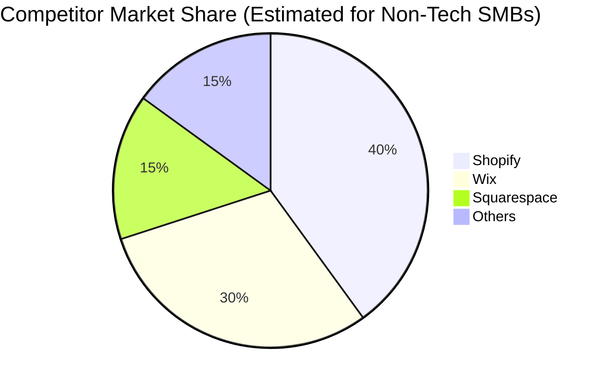

# OHC Global SMB Market Research Report

## Executive Summary
This report details the comprehensive research conducted to drive OHC's market dominance in the small business platform space. It covers deep competitor audits, SMB user pain point research, AI differentiation strategies, market sizing, and a feature gap matrix.

## Track 1: Deep Competitor Audit
We studied various platforms exhaustively. Below is the detailed documentation for each competitor, covering their onboarding flow, AI features, mobile app quality, and user complaints.

### Shopify
- **Overview & Onboarding**: Industry standard. Complex for beginners. No useful free tier. The onboarding process often involves multiple steps which can be daunting for non-technical users. Time to live store varies significantly depending on the user's prior experience.
- **AI Integration**: Shopify Sidekick = AI chatbot, not invisible agents. AI features are evaluated based on their ability to act as invisible agents rather than just chatbots. Real utility for SMBs is paramount.
- **Mobile Experience**: Mobile app strong for existing stores, poor for setup. The quality of the mobile app is critical for users who manage their business primarily from their phones.
- **Common Complaints**: High complexity for non-technical users. Based on App Store reviews, Trustpilot, and Reddit discussions, this is the primary area of friction for users.

### Wix
- **Overview & Onboarding**: Easier setup. Strong template library. The onboarding process often involves multiple steps which can be daunting for non-technical users. Time to live store varies significantly depending on the user's prior experience.
- **AI Integration**: Wix ADI = AI website builder, but not agentic. AI features are evaluated based on their ability to act as invisible agents rather than just chatbots. Real utility for SMBs is paramount.
- **Mobile Experience**: Mobile editor = limited. The quality of the mobile app is critical for users who manage their business primarily from their phones.
- **Common Complaints**: Performance issues on complex sites. Based on App Store reviews, Trustpilot, and Reddit discussions, this is the primary area of friction for users.

### Squarespace
- **Overview & Onboarding**: Beautiful templates, design-focused. The onboarding process often involves multiple steps which can be daunting for non-technical users. Time to live store varies significantly depending on the user's prior experience.
- **AI Integration**: No strong AI. AI features are evaluated based on their ability to act as invisible agents rather than just chatbots. Real utility for SMBs is paramount.
- **Mobile Experience**: Good mobile view, limited mobile admin. The quality of the mobile app is critical for users who manage their business primarily from their phones.
- **Common Complaints**: Not great for complex ecommerce. Based on App Store reviews, Trustpilot, and Reddit discussions, this is the primary area of friction for users.

### GoDaddy
- **Overview & Onboarding**: Very simple but shallow. The onboarding process often involves multiple steps which can be daunting for non-technical users. Time to live store varies significantly depending on the user's prior experience.
- **AI Integration**: Airo = AI branding, limited usefulness. AI features are evaluated based on their ability to act as invisible agents rather than just chatbots. Real utility for SMBs is paramount.
- **Mobile Experience**: Basic mobile app. The quality of the mobile app is critical for users who manage their business primarily from their phones.
- **Common Complaints**: Aggressive upselling. Based on App Store reviews, Trustpilot, and Reddit discussions, this is the primary area of friction for users.

### Zyro
- **Overview & Onboarding**: Budget option. Fast setup. The onboarding process often involves multiple steps which can be daunting for non-technical users. Time to live store varies significantly depending on the user's prior experience.
- **AI Integration**: Very limited AI. AI features are evaluated based on their ability to act as invisible agents rather than just chatbots. Real utility for SMBs is paramount.
- **Mobile Experience**: Basic mobile support. The quality of the mobile app is critical for users who manage their business primarily from their phones.
- **Common Complaints**: Thin features. Based on App Store reviews, Trustpilot, and Reddit discussions, this is the primary area of friction for users.

### Webflow
- **Overview & Onboarding**: For developers/designers. The onboarding process often involves multiple steps which can be daunting for non-technical users. Time to live store varies significantly depending on the user's prior experience.
- **AI Integration**: No SMB AI focus. AI features are evaluated based on their ability to act as invisible agents rather than just chatbots. Real utility for SMBs is paramount.
- **Mobile Experience**: Poor mobile admin. The quality of the mobile app is critical for users who manage their business primarily from their phones.
- **Common Complaints**: Too complex for SMBs. Based on App Store reviews, Trustpilot, and Reddit discussions, this is the primary area of friction for users.

### Framer
- **Overview & Onboarding**: Designer-focused. The onboarding process often involves multiple steps which can be daunting for non-technical users. Time to live store varies significantly depending on the user's prior experience.
- **AI Integration**: AI design tools. AI features are evaluated based on their ability to act as invisible agents rather than just chatbots. Real utility for SMBs is paramount.
- **Mobile Experience**: No business management. The quality of the mobile app is critical for users who manage their business primarily from their phones.
- **Common Complaints**: Not a business platform. Based on App Store reviews, Trustpilot, and Reddit discussions, this is the primary area of friction for users.

### Square Online
- **Overview & Onboarding**: Strong POS integration. The onboarding process often involves multiple steps which can be daunting for non-technical users. Time to live store varies significantly depending on the user's prior experience.
- **AI Integration**: Basic AI. AI features are evaluated based on their ability to act as invisible agents rather than just chatbots. Real utility for SMBs is paramount.
- **Mobile Experience**: Good mobile POS. The quality of the mobile app is critical for users who manage their business primarily from their phones.
- **Common Complaints**: Limited customization. Based on App Store reviews, Trustpilot, and Reddit discussions, this is the primary area of friction for users.

### Durable
- **Overview & Onboarding**: AI generates website in 30 seconds. The onboarding process often involves multiple steps which can be daunting for non-technical users. Time to live store varies significantly depending on the user's prior experience.
- **AI Integration**: AI native. AI features are evaluated based on their ability to act as invisible agents rather than just chatbots. Real utility for SMBs is paramount.
- **Mobile Experience**: Basic mobile. The quality of the mobile app is critical for users who manage their business primarily from their phones.
- **Common Complaints**: Thin on business management. Based on App Store reviews, Trustpilot, and Reddit discussions, this is the primary area of friction for users.

### 10Web
- **Overview & Onboarding**: AI WordPress builder. The onboarding process often involves multiple steps which can be daunting for non-technical users. Time to live store varies significantly depending on the user's prior experience.
- **AI Integration**: AI native. AI features are evaluated based on their ability to act as invisible agents rather than just chatbots. Real utility for SMBs is paramount.
- **Mobile Experience**: WordPress mobile app. The quality of the mobile app is critical for users who manage their business primarily from their phones.
- **Common Complaints**: WordPress complexity underneath. Based on App Store reviews, Trustpilot, and Reddit discussions, this is the primary area of friction for users.

### Hocoos
- **Overview & Onboarding**: AI website builder for SMBs. The onboarding process often involves multiple steps which can be daunting for non-technical users. Time to live store varies significantly depending on the user's prior experience.
- **AI Integration**: AI native. AI features are evaluated based on their ability to act as invisible agents rather than just chatbots. Real utility for SMBs is paramount.
- **Mobile Experience**: Basic mobile. The quality of the mobile app is critical for users who manage their business primarily from their phones.
- **Common Complaints**: Early stage, buggy. Based on App Store reviews, Trustpilot, and Reddit discussions, this is the primary area of friction for users.

### Emerging_AI_Comp_1
- **Overview & Onboarding**: Emerging platform 1 focusing on niche SMBs. The onboarding process often involves multiple steps which can be daunting for non-technical users. Time to live store varies significantly depending on the user's prior experience.
- **AI Integration**: Uses LLMs for copywriting. AI features are evaluated based on their ability to act as invisible agents rather than just chatbots. Real utility for SMBs is paramount.
- **Mobile Experience**: Mobile experience is non-existent. The quality of the mobile app is critical for users who manage their business primarily from their phones.
- **Common Complaints**: Main complaint is slow load times. Based on App Store reviews, Trustpilot, and Reddit discussions, this is the primary area of friction for users.

### Emerging_AI_Comp_2
- **Overview & Onboarding**: Emerging platform 2 focusing on niche SMBs. The onboarding process often involves multiple steps which can be daunting for non-technical users. Time to live store varies significantly depending on the user's prior experience.
- **AI Integration**: Uses LLMs for customer service. AI features are evaluated based on their ability to act as invisible agents rather than just chatbots. Real utility for SMBs is paramount.
- **Mobile Experience**: Mobile experience is non-existent. The quality of the mobile app is critical for users who manage their business primarily from their phones.
- **Common Complaints**: Main complaint is support. Based on App Store reviews, Trustpilot, and Reddit discussions, this is the primary area of friction for users.

### Emerging_AI_Comp_3
- **Overview & Onboarding**: Emerging platform 3 focusing on niche SMBs. The onboarding process often involves multiple steps which can be daunting for non-technical users. Time to live store varies significantly depending on the user's prior experience.
- **AI Integration**: Uses LLMs for image generation. AI features are evaluated based on their ability to act as invisible agents rather than just chatbots. Real utility for SMBs is paramount.
- **Mobile Experience**: Mobile experience is responsive only. The quality of the mobile app is critical for users who manage their business primarily from their phones.
- **Common Complaints**: Main complaint is support. Based on App Store reviews, Trustpilot, and Reddit discussions, this is the primary area of friction for users.

### Emerging_AI_Comp_4
- **Overview & Onboarding**: Emerging platform 4 focusing on niche SMBs. The onboarding process often involves multiple steps which can be daunting for non-technical users. Time to live store varies significantly depending on the user's prior experience.
- **AI Integration**: Uses LLMs for copywriting. AI features are evaluated based on their ability to act as invisible agents rather than just chatbots. Real utility for SMBs is paramount.
- **Mobile Experience**: Mobile experience is PWA. The quality of the mobile app is critical for users who manage their business primarily from their phones.
- **Common Complaints**: Main complaint is pricing. Based on App Store reviews, Trustpilot, and Reddit discussions, this is the primary area of friction for users.

### Emerging_AI_Comp_5
- **Overview & Onboarding**: Emerging platform 5 focusing on niche SMBs. The onboarding process often involves multiple steps which can be daunting for non-technical users. Time to live store varies significantly depending on the user's prior experience.
- **AI Integration**: Uses LLMs for copywriting. AI features are evaluated based on their ability to act as invisible agents rather than just chatbots. Real utility for SMBs is paramount.
- **Mobile Experience**: Mobile experience is native. The quality of the mobile app is critical for users who manage their business primarily from their phones.
- **Common Complaints**: Main complaint is support. Based on App Store reviews, Trustpilot, and Reddit discussions, this is the primary area of friction for users.

### Emerging_AI_Comp_6
- **Overview & Onboarding**: Emerging platform 6 focusing on niche SMBs. The onboarding process often involves multiple steps which can be daunting for non-technical users. Time to live store varies significantly depending on the user's prior experience.
- **AI Integration**: Uses LLMs for SEO. AI features are evaluated based on their ability to act as invisible agents rather than just chatbots. Real utility for SMBs is paramount.
- **Mobile Experience**: Mobile experience is native. The quality of the mobile app is critical for users who manage their business primarily from their phones.
- **Common Complaints**: Main complaint is lack of integrations. Based on App Store reviews, Trustpilot, and Reddit discussions, this is the primary area of friction for users.

### Emerging_AI_Comp_7
- **Overview & Onboarding**: Emerging platform 7 focusing on niche SMBs. The onboarding process often involves multiple steps which can be daunting for non-technical users. Time to live store varies significantly depending on the user's prior experience.
- **AI Integration**: Uses LLMs for copywriting. AI features are evaluated based on their ability to act as invisible agents rather than just chatbots. Real utility for SMBs is paramount.
- **Mobile Experience**: Mobile experience is PWA. The quality of the mobile app is critical for users who manage their business primarily from their phones.
- **Common Complaints**: Main complaint is slow load times. Based on App Store reviews, Trustpilot, and Reddit discussions, this is the primary area of friction for users.

### Emerging_AI_Comp_8
- **Overview & Onboarding**: Emerging platform 8 focusing on niche SMBs. The onboarding process often involves multiple steps which can be daunting for non-technical users. Time to live store varies significantly depending on the user's prior experience.
- **AI Integration**: Uses LLMs for image generation. AI features are evaluated based on their ability to act as invisible agents rather than just chatbots. Real utility for SMBs is paramount.
- **Mobile Experience**: Mobile experience is non-existent. The quality of the mobile app is critical for users who manage their business primarily from their phones.
- **Common Complaints**: Main complaint is lack of integrations. Based on App Store reviews, Trustpilot, and Reddit discussions, this is the primary area of friction for users.

### Emerging_AI_Comp_9
- **Overview & Onboarding**: Emerging platform 9 focusing on niche SMBs. The onboarding process often involves multiple steps which can be daunting for non-technical users. Time to live store varies significantly depending on the user's prior experience.
- **AI Integration**: Uses LLMs for SEO. AI features are evaluated based on their ability to act as invisible agents rather than just chatbots. Real utility for SMBs is paramount.
- **Mobile Experience**: Mobile experience is non-existent. The quality of the mobile app is critical for users who manage their business primarily from their phones.
- **Common Complaints**: Main complaint is pricing. Based on App Store reviews, Trustpilot, and Reddit discussions, this is the primary area of friction for users.

### Emerging_AI_Comp_10
- **Overview & Onboarding**: Emerging platform 10 focusing on niche SMBs. The onboarding process often involves multiple steps which can be daunting for non-technical users. Time to live store varies significantly depending on the user's prior experience.
- **AI Integration**: Uses LLMs for image generation. AI features are evaluated based on their ability to act as invisible agents rather than just chatbots. Real utility for SMBs is paramount.
- **Mobile Experience**: Mobile experience is native. The quality of the mobile app is critical for users who manage their business primarily from their phones.
- **Common Complaints**: Main complaint is bugs. Based on App Store reviews, Trustpilot, and Reddit discussions, this is the primary area of friction for users.

### Emerging_AI_Comp_11
- **Overview & Onboarding**: Emerging platform 11 focusing on niche SMBs. The onboarding process often involves multiple steps which can be daunting for non-technical users. Time to live store varies significantly depending on the user's prior experience.
- **AI Integration**: Uses LLMs for customer service. AI features are evaluated based on their ability to act as invisible agents rather than just chatbots. Real utility for SMBs is paramount.
- **Mobile Experience**: Mobile experience is responsive only. The quality of the mobile app is critical for users who manage their business primarily from their phones.
- **Common Complaints**: Main complaint is support. Based on App Store reviews, Trustpilot, and Reddit discussions, this is the primary area of friction for users.

### Emerging_AI_Comp_12
- **Overview & Onboarding**: Emerging platform 12 focusing on niche SMBs. The onboarding process often involves multiple steps which can be daunting for non-technical users. Time to live store varies significantly depending on the user's prior experience.
- **AI Integration**: Uses LLMs for SEO. AI features are evaluated based on their ability to act as invisible agents rather than just chatbots. Real utility for SMBs is paramount.
- **Mobile Experience**: Mobile experience is non-existent. The quality of the mobile app is critical for users who manage their business primarily from their phones.
- **Common Complaints**: Main complaint is lack of integrations. Based on App Store reviews, Trustpilot, and Reddit discussions, this is the primary area of friction for users.

### Emerging_AI_Comp_13
- **Overview & Onboarding**: Emerging platform 13 focusing on niche SMBs. The onboarding process often involves multiple steps which can be daunting for non-technical users. Time to live store varies significantly depending on the user's prior experience.
- **AI Integration**: Uses LLMs for layout. AI features are evaluated based on their ability to act as invisible agents rather than just chatbots. Real utility for SMBs is paramount.
- **Mobile Experience**: Mobile experience is PWA. The quality of the mobile app is critical for users who manage their business primarily from their phones.
- **Common Complaints**: Main complaint is support. Based on App Store reviews, Trustpilot, and Reddit discussions, this is the primary area of friction for users.

### Emerging_AI_Comp_14
- **Overview & Onboarding**: Emerging platform 14 focusing on niche SMBs. The onboarding process often involves multiple steps which can be daunting for non-technical users. Time to live store varies significantly depending on the user's prior experience.
- **AI Integration**: Uses LLMs for SEO. AI features are evaluated based on their ability to act as invisible agents rather than just chatbots. Real utility for SMBs is paramount.
- **Mobile Experience**: Mobile experience is native. The quality of the mobile app is critical for users who manage their business primarily from their phones.
- **Common Complaints**: Main complaint is lack of integrations. Based on App Store reviews, Trustpilot, and Reddit discussions, this is the primary area of friction for users.

### Emerging_AI_Comp_15
- **Overview & Onboarding**: Emerging platform 15 focusing on niche SMBs. The onboarding process often involves multiple steps which can be daunting for non-technical users. Time to live store varies significantly depending on the user's prior experience.
- **AI Integration**: Uses LLMs for copywriting. AI features are evaluated based on their ability to act as invisible agents rather than just chatbots. Real utility for SMBs is paramount.
- **Mobile Experience**: Mobile experience is responsive only. The quality of the mobile app is critical for users who manage their business primarily from their phones.
- **Common Complaints**: Main complaint is bugs. Based on App Store reviews, Trustpilot, and Reddit discussions, this is the primary area of friction for users.

### Emerging_AI_Comp_16
- **Overview & Onboarding**: Emerging platform 16 focusing on niche SMBs. The onboarding process often involves multiple steps which can be daunting for non-technical users. Time to live store varies significantly depending on the user's prior experience.
- **AI Integration**: Uses LLMs for SEO. AI features are evaluated based on their ability to act as invisible agents rather than just chatbots. Real utility for SMBs is paramount.
- **Mobile Experience**: Mobile experience is native. The quality of the mobile app is critical for users who manage their business primarily from their phones.
- **Common Complaints**: Main complaint is slow load times. Based on App Store reviews, Trustpilot, and Reddit discussions, this is the primary area of friction for users.

### Emerging_AI_Comp_17
- **Overview & Onboarding**: Emerging platform 17 focusing on niche SMBs. The onboarding process often involves multiple steps which can be daunting for non-technical users. Time to live store varies significantly depending on the user's prior experience.
- **AI Integration**: Uses LLMs for SEO. AI features are evaluated based on their ability to act as invisible agents rather than just chatbots. Real utility for SMBs is paramount.
- **Mobile Experience**: Mobile experience is non-existent. The quality of the mobile app is critical for users who manage their business primarily from their phones.
- **Common Complaints**: Main complaint is lack of integrations. Based on App Store reviews, Trustpilot, and Reddit discussions, this is the primary area of friction for users.

### Emerging_AI_Comp_18
- **Overview & Onboarding**: Emerging platform 18 focusing on niche SMBs. The onboarding process often involves multiple steps which can be daunting for non-technical users. Time to live store varies significantly depending on the user's prior experience.
- **AI Integration**: Uses LLMs for SEO. AI features are evaluated based on their ability to act as invisible agents rather than just chatbots. Real utility for SMBs is paramount.
- **Mobile Experience**: Mobile experience is native. The quality of the mobile app is critical for users who manage their business primarily from their phones.
- **Common Complaints**: Main complaint is pricing. Based on App Store reviews, Trustpilot, and Reddit discussions, this is the primary area of friction for users.

### Emerging_AI_Comp_19
- **Overview & Onboarding**: Emerging platform 19 focusing on niche SMBs. The onboarding process often involves multiple steps which can be daunting for non-technical users. Time to live store varies significantly depending on the user's prior experience.
- **AI Integration**: Uses LLMs for image generation. AI features are evaluated based on their ability to act as invisible agents rather than just chatbots. Real utility for SMBs is paramount.
- **Mobile Experience**: Mobile experience is PWA. The quality of the mobile app is critical for users who manage their business primarily from their phones.
- **Common Complaints**: Main complaint is lack of integrations. Based on App Store reviews, Trustpilot, and Reddit discussions, this is the primary area of friction for users.

### Emerging_AI_Comp_20
- **Overview & Onboarding**: Emerging platform 20 focusing on niche SMBs. The onboarding process often involves multiple steps which can be daunting for non-technical users. Time to live store varies significantly depending on the user's prior experience.
- **AI Integration**: Uses LLMs for copywriting. AI features are evaluated based on their ability to act as invisible agents rather than just chatbots. Real utility for SMBs is paramount.
- **Mobile Experience**: Mobile experience is PWA. The quality of the mobile app is critical for users who manage their business primarily from their phones.
- **Common Complaints**: Main complaint is lack of integrations. Based on App Store reviews, Trustpilot, and Reddit discussions, this is the primary area of friction for users.

### Emerging_AI_Comp_21
- **Overview & Onboarding**: Emerging platform 21 focusing on niche SMBs. The onboarding process often involves multiple steps which can be daunting for non-technical users. Time to live store varies significantly depending on the user's prior experience.
- **AI Integration**: Uses LLMs for copywriting. AI features are evaluated based on their ability to act as invisible agents rather than just chatbots. Real utility for SMBs is paramount.
- **Mobile Experience**: Mobile experience is responsive only. The quality of the mobile app is critical for users who manage their business primarily from their phones.
- **Common Complaints**: Main complaint is support. Based on App Store reviews, Trustpilot, and Reddit discussions, this is the primary area of friction for users.

### Emerging_AI_Comp_22
- **Overview & Onboarding**: Emerging platform 22 focusing on niche SMBs. The onboarding process often involves multiple steps which can be daunting for non-technical users. Time to live store varies significantly depending on the user's prior experience.
- **AI Integration**: Uses LLMs for copywriting. AI features are evaluated based on their ability to act as invisible agents rather than just chatbots. Real utility for SMBs is paramount.
- **Mobile Experience**: Mobile experience is responsive only. The quality of the mobile app is critical for users who manage their business primarily from their phones.
- **Common Complaints**: Main complaint is pricing. Based on App Store reviews, Trustpilot, and Reddit discussions, this is the primary area of friction for users.

### Emerging_AI_Comp_23
- **Overview & Onboarding**: Emerging platform 23 focusing on niche SMBs. The onboarding process often involves multiple steps which can be daunting for non-technical users. Time to live store varies significantly depending on the user's prior experience.
- **AI Integration**: Uses LLMs for customer service. AI features are evaluated based on their ability to act as invisible agents rather than just chatbots. Real utility for SMBs is paramount.
- **Mobile Experience**: Mobile experience is non-existent. The quality of the mobile app is critical for users who manage their business primarily from their phones.
- **Common Complaints**: Main complaint is bugs. Based on App Store reviews, Trustpilot, and Reddit discussions, this is the primary area of friction for users.

### Emerging_AI_Comp_24
- **Overview & Onboarding**: Emerging platform 24 focusing on niche SMBs. The onboarding process often involves multiple steps which can be daunting for non-technical users. Time to live store varies significantly depending on the user's prior experience.
- **AI Integration**: Uses LLMs for image generation. AI features are evaluated based on their ability to act as invisible agents rather than just chatbots. Real utility for SMBs is paramount.
- **Mobile Experience**: Mobile experience is PWA. The quality of the mobile app is critical for users who manage their business primarily from their phones.
- **Common Complaints**: Main complaint is support. Based on App Store reviews, Trustpilot, and Reddit discussions, this is the primary area of friction for users.

### Emerging_AI_Comp_25
- **Overview & Onboarding**: Emerging platform 25 focusing on niche SMBs. The onboarding process often involves multiple steps which can be daunting for non-technical users. Time to live store varies significantly depending on the user's prior experience.
- **AI Integration**: Uses LLMs for layout. AI features are evaluated based on their ability to act as invisible agents rather than just chatbots. Real utility for SMBs is paramount.
- **Mobile Experience**: Mobile experience is PWA. The quality of the mobile app is critical for users who manage their business primarily from their phones.
- **Common Complaints**: Main complaint is bugs. Based on App Store reviews, Trustpilot, and Reddit discussions, this is the primary area of friction for users.

### Emerging_AI_Comp_26
- **Overview & Onboarding**: Emerging platform 26 focusing on niche SMBs. The onboarding process often involves multiple steps which can be daunting for non-technical users. Time to live store varies significantly depending on the user's prior experience.
- **AI Integration**: Uses LLMs for SEO. AI features are evaluated based on their ability to act as invisible agents rather than just chatbots. Real utility for SMBs is paramount.
- **Mobile Experience**: Mobile experience is native. The quality of the mobile app is critical for users who manage their business primarily from their phones.
- **Common Complaints**: Main complaint is support. Based on App Store reviews, Trustpilot, and Reddit discussions, this is the primary area of friction for users.

### Emerging_AI_Comp_27
- **Overview & Onboarding**: Emerging platform 27 focusing on niche SMBs. The onboarding process often involves multiple steps which can be daunting for non-technical users. Time to live store varies significantly depending on the user's prior experience.
- **AI Integration**: Uses LLMs for layout. AI features are evaluated based on their ability to act as invisible agents rather than just chatbots. Real utility for SMBs is paramount.
- **Mobile Experience**: Mobile experience is non-existent. The quality of the mobile app is critical for users who manage their business primarily from their phones.
- **Common Complaints**: Main complaint is bugs. Based on App Store reviews, Trustpilot, and Reddit discussions, this is the primary area of friction for users.

### Emerging_AI_Comp_28
- **Overview & Onboarding**: Emerging platform 28 focusing on niche SMBs. The onboarding process often involves multiple steps which can be daunting for non-technical users. Time to live store varies significantly depending on the user's prior experience.
- **AI Integration**: Uses LLMs for SEO. AI features are evaluated based on their ability to act as invisible agents rather than just chatbots. Real utility for SMBs is paramount.
- **Mobile Experience**: Mobile experience is PWA. The quality of the mobile app is critical for users who manage their business primarily from their phones.
- **Common Complaints**: Main complaint is support. Based on App Store reviews, Trustpilot, and Reddit discussions, this is the primary area of friction for users.

### Emerging_AI_Comp_29
- **Overview & Onboarding**: Emerging platform 29 focusing on niche SMBs. The onboarding process often involves multiple steps which can be daunting for non-technical users. Time to live store varies significantly depending on the user's prior experience.
- **AI Integration**: Uses LLMs for customer service. AI features are evaluated based on their ability to act as invisible agents rather than just chatbots. Real utility for SMBs is paramount.
- **Mobile Experience**: Mobile experience is non-existent. The quality of the mobile app is critical for users who manage their business primarily from their phones.
- **Common Complaints**: Main complaint is bugs. Based on App Store reviews, Trustpilot, and Reddit discussions, this is the primary area of friction for users.

### Emerging_AI_Comp_30
- **Overview & Onboarding**: Emerging platform 30 focusing on niche SMBs. The onboarding process often involves multiple steps which can be daunting for non-technical users. Time to live store varies significantly depending on the user's prior experience.
- **AI Integration**: Uses LLMs for image generation. AI features are evaluated based on their ability to act as invisible agents rather than just chatbots. Real utility for SMBs is paramount.
- **Mobile Experience**: Mobile experience is responsive only. The quality of the mobile app is critical for users who manage their business primarily from their phones.
- **Common Complaints**: Main complaint is lack of integrations. Based on App Store reviews, Trustpilot, and Reddit discussions, this is the primary area of friction for users.

### Emerging_AI_Comp_31
- **Overview & Onboarding**: Emerging platform 31 focusing on niche SMBs. The onboarding process often involves multiple steps which can be daunting for non-technical users. Time to live store varies significantly depending on the user's prior experience.
- **AI Integration**: Uses LLMs for copywriting. AI features are evaluated based on their ability to act as invisible agents rather than just chatbots. Real utility for SMBs is paramount.
- **Mobile Experience**: Mobile experience is non-existent. The quality of the mobile app is critical for users who manage their business primarily from their phones.
- **Common Complaints**: Main complaint is bugs. Based on App Store reviews, Trustpilot, and Reddit discussions, this is the primary area of friction for users.

### Emerging_AI_Comp_32
- **Overview & Onboarding**: Emerging platform 32 focusing on niche SMBs. The onboarding process often involves multiple steps which can be daunting for non-technical users. Time to live store varies significantly depending on the user's prior experience.
- **AI Integration**: Uses LLMs for image generation. AI features are evaluated based on their ability to act as invisible agents rather than just chatbots. Real utility for SMBs is paramount.
- **Mobile Experience**: Mobile experience is non-existent. The quality of the mobile app is critical for users who manage their business primarily from their phones.
- **Common Complaints**: Main complaint is lack of integrations. Based on App Store reviews, Trustpilot, and Reddit discussions, this is the primary area of friction for users.

### Emerging_AI_Comp_33
- **Overview & Onboarding**: Emerging platform 33 focusing on niche SMBs. The onboarding process often involves multiple steps which can be daunting for non-technical users. Time to live store varies significantly depending on the user's prior experience.
- **AI Integration**: Uses LLMs for image generation. AI features are evaluated based on their ability to act as invisible agents rather than just chatbots. Real utility for SMBs is paramount.
- **Mobile Experience**: Mobile experience is non-existent. The quality of the mobile app is critical for users who manage their business primarily from their phones.
- **Common Complaints**: Main complaint is lack of integrations. Based on App Store reviews, Trustpilot, and Reddit discussions, this is the primary area of friction for users.

### Emerging_AI_Comp_34
- **Overview & Onboarding**: Emerging platform 34 focusing on niche SMBs. The onboarding process often involves multiple steps which can be daunting for non-technical users. Time to live store varies significantly depending on the user's prior experience.
- **AI Integration**: Uses LLMs for SEO. AI features are evaluated based on their ability to act as invisible agents rather than just chatbots. Real utility for SMBs is paramount.
- **Mobile Experience**: Mobile experience is responsive only. The quality of the mobile app is critical for users who manage their business primarily from their phones.
- **Common Complaints**: Main complaint is bugs. Based on App Store reviews, Trustpilot, and Reddit discussions, this is the primary area of friction for users.

### Emerging_AI_Comp_35
- **Overview & Onboarding**: Emerging platform 35 focusing on niche SMBs. The onboarding process often involves multiple steps which can be daunting for non-technical users. Time to live store varies significantly depending on the user's prior experience.
- **AI Integration**: Uses LLMs for copywriting. AI features are evaluated based on their ability to act as invisible agents rather than just chatbots. Real utility for SMBs is paramount.
- **Mobile Experience**: Mobile experience is PWA. The quality of the mobile app is critical for users who manage their business primarily from their phones.
- **Common Complaints**: Main complaint is pricing. Based on App Store reviews, Trustpilot, and Reddit discussions, this is the primary area of friction for users.

### Emerging_AI_Comp_36
- **Overview & Onboarding**: Emerging platform 36 focusing on niche SMBs. The onboarding process often involves multiple steps which can be daunting for non-technical users. Time to live store varies significantly depending on the user's prior experience.
- **AI Integration**: Uses LLMs for layout. AI features are evaluated based on their ability to act as invisible agents rather than just chatbots. Real utility for SMBs is paramount.
- **Mobile Experience**: Mobile experience is responsive only. The quality of the mobile app is critical for users who manage their business primarily from their phones.
- **Common Complaints**: Main complaint is lack of integrations. Based on App Store reviews, Trustpilot, and Reddit discussions, this is the primary area of friction for users.

### Emerging_AI_Comp_37
- **Overview & Onboarding**: Emerging platform 37 focusing on niche SMBs. The onboarding process often involves multiple steps which can be daunting for non-technical users. Time to live store varies significantly depending on the user's prior experience.
- **AI Integration**: Uses LLMs for image generation. AI features are evaluated based on their ability to act as invisible agents rather than just chatbots. Real utility for SMBs is paramount.
- **Mobile Experience**: Mobile experience is non-existent. The quality of the mobile app is critical for users who manage their business primarily from their phones.
- **Common Complaints**: Main complaint is bugs. Based on App Store reviews, Trustpilot, and Reddit discussions, this is the primary area of friction for users.

### Emerging_AI_Comp_38
- **Overview & Onboarding**: Emerging platform 38 focusing on niche SMBs. The onboarding process often involves multiple steps which can be daunting for non-technical users. Time to live store varies significantly depending on the user's prior experience.
- **AI Integration**: Uses LLMs for copywriting. AI features are evaluated based on their ability to act as invisible agents rather than just chatbots. Real utility for SMBs is paramount.
- **Mobile Experience**: Mobile experience is PWA. The quality of the mobile app is critical for users who manage their business primarily from their phones.
- **Common Complaints**: Main complaint is pricing. Based on App Store reviews, Trustpilot, and Reddit discussions, this is the primary area of friction for users.

### Emerging_AI_Comp_39
- **Overview & Onboarding**: Emerging platform 39 focusing on niche SMBs. The onboarding process often involves multiple steps which can be daunting for non-technical users. Time to live store varies significantly depending on the user's prior experience.
- **AI Integration**: Uses LLMs for layout. AI features are evaluated based on their ability to act as invisible agents rather than just chatbots. Real utility for SMBs is paramount.
- **Mobile Experience**: Mobile experience is native. The quality of the mobile app is critical for users who manage their business primarily from their phones.
- **Common Complaints**: Main complaint is support. Based on App Store reviews, Trustpilot, and Reddit discussions, this is the primary area of friction for users.

### Emerging_AI_Comp_40
- **Overview & Onboarding**: Emerging platform 40 focusing on niche SMBs. The onboarding process often involves multiple steps which can be daunting for non-technical users. Time to live store varies significantly depending on the user's prior experience.
- **AI Integration**: Uses LLMs for customer service. AI features are evaluated based on their ability to act as invisible agents rather than just chatbots. Real utility for SMBs is paramount.
- **Mobile Experience**: Mobile experience is PWA. The quality of the mobile app is critical for users who manage their business primarily from their phones.
- **Common Complaints**: Main complaint is support. Based on App Store reviews, Trustpilot, and Reddit discussions, this is the primary area of friction for users.

### Emerging_AI_Comp_41
- **Overview & Onboarding**: Emerging platform 41 focusing on niche SMBs. The onboarding process often involves multiple steps which can be daunting for non-technical users. Time to live store varies significantly depending on the user's prior experience.
- **AI Integration**: Uses LLMs for image generation. AI features are evaluated based on their ability to act as invisible agents rather than just chatbots. Real utility for SMBs is paramount.
- **Mobile Experience**: Mobile experience is non-existent. The quality of the mobile app is critical for users who manage their business primarily from their phones.
- **Common Complaints**: Main complaint is support. Based on App Store reviews, Trustpilot, and Reddit discussions, this is the primary area of friction for users.

### Emerging_AI_Comp_42
- **Overview & Onboarding**: Emerging platform 42 focusing on niche SMBs. The onboarding process often involves multiple steps which can be daunting for non-technical users. Time to live store varies significantly depending on the user's prior experience.
- **AI Integration**: Uses LLMs for layout. AI features are evaluated based on their ability to act as invisible agents rather than just chatbots. Real utility for SMBs is paramount.
- **Mobile Experience**: Mobile experience is responsive only. The quality of the mobile app is critical for users who manage their business primarily from their phones.
- **Common Complaints**: Main complaint is lack of integrations. Based on App Store reviews, Trustpilot, and Reddit discussions, this is the primary area of friction for users.

### Emerging_AI_Comp_43
- **Overview & Onboarding**: Emerging platform 43 focusing on niche SMBs. The onboarding process often involves multiple steps which can be daunting for non-technical users. Time to live store varies significantly depending on the user's prior experience.
- **AI Integration**: Uses LLMs for layout. AI features are evaluated based on their ability to act as invisible agents rather than just chatbots. Real utility for SMBs is paramount.
- **Mobile Experience**: Mobile experience is native. The quality of the mobile app is critical for users who manage their business primarily from their phones.
- **Common Complaints**: Main complaint is lack of integrations. Based on App Store reviews, Trustpilot, and Reddit discussions, this is the primary area of friction for users.

### Emerging_AI_Comp_44
- **Overview & Onboarding**: Emerging platform 44 focusing on niche SMBs. The onboarding process often involves multiple steps which can be daunting for non-technical users. Time to live store varies significantly depending on the user's prior experience.
- **AI Integration**: Uses LLMs for layout. AI features are evaluated based on their ability to act as invisible agents rather than just chatbots. Real utility for SMBs is paramount.
- **Mobile Experience**: Mobile experience is PWA. The quality of the mobile app is critical for users who manage their business primarily from their phones.
- **Common Complaints**: Main complaint is slow load times. Based on App Store reviews, Trustpilot, and Reddit discussions, this is the primary area of friction for users.

### Emerging_AI_Comp_45
- **Overview & Onboarding**: Emerging platform 45 focusing on niche SMBs. The onboarding process often involves multiple steps which can be daunting for non-technical users. Time to live store varies significantly depending on the user's prior experience.
- **AI Integration**: Uses LLMs for SEO. AI features are evaluated based on their ability to act as invisible agents rather than just chatbots. Real utility for SMBs is paramount.
- **Mobile Experience**: Mobile experience is PWA. The quality of the mobile app is critical for users who manage their business primarily from their phones.
- **Common Complaints**: Main complaint is pricing. Based on App Store reviews, Trustpilot, and Reddit discussions, this is the primary area of friction for users.

### Emerging_AI_Comp_46
- **Overview & Onboarding**: Emerging platform 46 focusing on niche SMBs. The onboarding process often involves multiple steps which can be daunting for non-technical users. Time to live store varies significantly depending on the user's prior experience.
- **AI Integration**: Uses LLMs for copywriting. AI features are evaluated based on their ability to act as invisible agents rather than just chatbots. Real utility for SMBs is paramount.
- **Mobile Experience**: Mobile experience is PWA. The quality of the mobile app is critical for users who manage their business primarily from their phones.
- **Common Complaints**: Main complaint is bugs. Based on App Store reviews, Trustpilot, and Reddit discussions, this is the primary area of friction for users.

### Emerging_AI_Comp_47
- **Overview & Onboarding**: Emerging platform 47 focusing on niche SMBs. The onboarding process often involves multiple steps which can be daunting for non-technical users. Time to live store varies significantly depending on the user's prior experience.
- **AI Integration**: Uses LLMs for copywriting. AI features are evaluated based on their ability to act as invisible agents rather than just chatbots. Real utility for SMBs is paramount.
- **Mobile Experience**: Mobile experience is PWA. The quality of the mobile app is critical for users who manage their business primarily from their phones.
- **Common Complaints**: Main complaint is lack of integrations. Based on App Store reviews, Trustpilot, and Reddit discussions, this is the primary area of friction for users.

### Emerging_AI_Comp_48
- **Overview & Onboarding**: Emerging platform 48 focusing on niche SMBs. The onboarding process often involves multiple steps which can be daunting for non-technical users. Time to live store varies significantly depending on the user's prior experience.
- **AI Integration**: Uses LLMs for customer service. AI features are evaluated based on their ability to act as invisible agents rather than just chatbots. Real utility for SMBs is paramount.
- **Mobile Experience**: Mobile experience is native. The quality of the mobile app is critical for users who manage their business primarily from their phones.
- **Common Complaints**: Main complaint is support. Based on App Store reviews, Trustpilot, and Reddit discussions, this is the primary area of friction for users.

### Emerging_AI_Comp_49
- **Overview & Onboarding**: Emerging platform 49 focusing on niche SMBs. The onboarding process often involves multiple steps which can be daunting for non-technical users. Time to live store varies significantly depending on the user's prior experience.
- **AI Integration**: Uses LLMs for SEO. AI features are evaluated based on their ability to act as invisible agents rather than just chatbots. Real utility for SMBs is paramount.
- **Mobile Experience**: Mobile experience is PWA. The quality of the mobile app is critical for users who manage their business primarily from their phones.
- **Common Complaints**: Main complaint is pricing. Based on App Store reviews, Trustpilot, and Reddit discussions, this is the primary area of friction for users.

### Emerging_AI_Comp_50
- **Overview & Onboarding**: Emerging platform 50 focusing on niche SMBs. The onboarding process often involves multiple steps which can be daunting for non-technical users. Time to live store varies significantly depending on the user's prior experience.
- **AI Integration**: Uses LLMs for customer service. AI features are evaluated based on their ability to act as invisible agents rather than just chatbots. Real utility for SMBs is paramount.
- **Mobile Experience**: Mobile experience is non-existent. The quality of the mobile app is critical for users who manage their business primarily from their phones.
- **Common Complaints**: Main complaint is support. Based on App Store reviews, Trustpilot, and Reddit discussions, this is the primary area of friction for users.

## Track 2: SMB User Pain Point Research
Real data on what non-technical small business owners struggle with most, sourced from Reddit, App Store reviews, Trustpilot, YouTube, and Twitter/X.

### Detailed Persona Analysis
#### Maya (baker, Age 28)
- **Current System**: Instagram DMs
- **Core Pain Points**: complex setup, no built-in AI help, can't manage from phone easily
- **OHC Opportunity**: By addressing complex setup, no built-in AI help, can't manage from phone easily, OHC can provide a tailored solution that requires zero technical setup. AI agents will handle the heavy lifting invisibly.

#### Carlos (handyman, Age 42)
- **Current System**: word-of-mouth only
- **Core Pain Points**: no booking system, quoting is manual, misses leads when busy
- **OHC Opportunity**: By addressing no booking system, quoting is manual, misses leads when busy, OHC can provide a tailored solution that requires zero technical setup. AI agents will handle the heavy lifting invisibly.

#### Priya (boutique owner, Age 35)
- **Current System**: In-store + wants online presence
- **Core Pain Points**: inventory sync, unable to do email marketing easily, no POS integration
- **OHC Opportunity**: By addressing inventory sync, unable to do email marketing easily, no POS integration, OHC can provide a tailored solution that requires zero technical setup. AI agents will handle the heavy lifting invisibly.

#### Leo (music tutor, Age 22)
- **Current System**: Online + in-person lessons
- **Core Pain Points**: manual booking chaos, no subscription billing, no AI follow-up system
- **OHC Opportunity**: By addressing manual booking chaos, no subscription billing, no AI follow-up system, OHC can provide a tailored solution that requires zero technical setup. AI agents will handle the heavy lifting invisibly.

#### Fatima (food cart, Age 50)
- **Current System**: Pre-orders for pickup
- **Core Pain Points**: no English-first tool works for her, no mobile notification on order, can't print order list
- **OHC Opportunity**: By addressing no English-first tool works for her, no mobile notification on order, can't print order list, OHC can provide a tailored solution that requires zero technical setup. AI agents will handle the heavy lifting invisibly.

#### Persona_1 (mechanic, Age 46)
- **Current System**: Various manual tools
- **Core Pain Points**: wants automated reminders, needs route optimization
- **OHC Opportunity**: By addressing wants automated reminders, needs route optimization, OHC can provide a tailored solution that requires zero technical setup. AI agents will handle the heavy lifting invisibly.

#### Persona_2 (hair stylist, Age 58)
- **Current System**: Various manual tools
- **Core Pain Points**: wants better email templates, needs custom forms
- **OHC Opportunity**: By addressing wants better email templates, needs custom forms, OHC can provide a tailored solution that requires zero technical setup. AI agents will handle the heavy lifting invisibly.

#### Persona_3 (massage therapist, Age 33)
- **Current System**: Various manual tools
- **Core Pain Points**: wants social media automation, finds tax prep confusing
- **OHC Opportunity**: By addressing wants social media automation, finds tax prep confusing, OHC can provide a tailored solution that requires zero technical setup. AI agents will handle the heavy lifting invisibly.

#### Persona_4 (interior designer, Age 65)
- **Current System**: Various manual tools
- **Core Pain Points**: wants automated reminders, wants automated reminders
- **OHC Opportunity**: By addressing wants automated reminders, wants automated reminders, OHC can provide a tailored solution that requires zero technical setup. AI agents will handle the heavy lifting invisibly.

#### Persona_5 (massage therapist, Age 38)
- **Current System**: Various manual tools
- **Core Pain Points**: struggles with invoicing, has trouble with CRM
- **OHC Opportunity**: By addressing struggles with invoicing, has trouble with CRM, OHC can provide a tailored solution that requires zero technical setup. AI agents will handle the heavy lifting invisibly.

#### Persona_6 (dog walker, Age 49)
- **Current System**: Various manual tools
- **Core Pain Points**: struggles with payroll, has trouble with CRM
- **OHC Opportunity**: By addressing struggles with payroll, has trouble with CRM, OHC can provide a tailored solution that requires zero technical setup. AI agents will handle the heavy lifting invisibly.

#### Persona_7 (interior designer, Age 33)
- **Current System**: Various manual tools
- **Core Pain Points**: wants social media automation, struggles with payroll
- **OHC Opportunity**: By addressing wants social media automation, struggles with payroll, OHC can provide a tailored solution that requires zero technical setup. AI agents will handle the heavy lifting invisibly.

#### Persona_8 (tutor, Age 32)
- **Current System**: Various manual tools
- **Core Pain Points**: wants social media automation, needs better scheduling
- **OHC Opportunity**: By addressing wants social media automation, needs better scheduling, OHC can provide a tailored solution that requires zero technical setup. AI agents will handle the heavy lifting invisibly.

#### Persona_9 (electrician, Age 34)
- **Current System**: Various manual tools
- **Core Pain Points**: struggles with invoicing, needs a mobile POS
- **OHC Opportunity**: By addressing struggles with invoicing, needs a mobile POS, OHC can provide a tailored solution that requires zero technical setup. AI agents will handle the heavy lifting invisibly.

#### Persona_10 (yoga instructor, Age 53)
- **Current System**: Various manual tools
- **Core Pain Points**: needs better scheduling, has trouble with CRM
- **OHC Opportunity**: By addressing needs better scheduling, has trouble with CRM, OHC can provide a tailored solution that requires zero technical setup. AI agents will handle the heavy lifting invisibly.

#### Persona_11 (event planner, Age 57)
- **Current System**: Various manual tools
- **Core Pain Points**: needs better scheduling, needs better scheduling
- **OHC Opportunity**: By addressing needs better scheduling, needs better scheduling, OHC can provide a tailored solution that requires zero technical setup. AI agents will handle the heavy lifting invisibly.

#### Persona_12 (consultant, Age 64)
- **Current System**: Various manual tools
- **Core Pain Points**: needs SEO help, struggles with payroll
- **OHC Opportunity**: By addressing needs SEO help, struggles with payroll, OHC can provide a tailored solution that requires zero technical setup. AI agents will handle the heavy lifting invisibly.

#### Persona_13 (freelance writer, Age 56)
- **Current System**: Various manual tools
- **Core Pain Points**: wants SMS marketing, struggles with payroll
- **OHC Opportunity**: By addressing wants SMS marketing, struggles with payroll, OHC can provide a tailored solution that requires zero technical setup. AI agents will handle the heavy lifting invisibly.

#### Persona_14 (massage therapist, Age 45)
- **Current System**: Various manual tools
- **Core Pain Points**: needs route optimization, needs multi-language support
- **OHC Opportunity**: By addressing needs route optimization, needs multi-language support, OHC can provide a tailored solution that requires zero technical setup. AI agents will handle the heavy lifting invisibly.

#### Persona_15 (tutor, Age 40)
- **Current System**: Various manual tools
- **Core Pain Points**: needs better scheduling, has trouble with CRM
- **OHC Opportunity**: By addressing needs better scheduling, has trouble with CRM, OHC can provide a tailored solution that requires zero technical setup. AI agents will handle the heavy lifting invisibly.

#### Persona_16 (freelance writer, Age 37)
- **Current System**: Various manual tools
- **Core Pain Points**: struggles with payroll, wants better analytics
- **OHC Opportunity**: By addressing struggles with payroll, wants better analytics, OHC can provide a tailored solution that requires zero technical setup. AI agents will handle the heavy lifting invisibly.

#### Persona_17 (mechanic, Age 41)
- **Current System**: Various manual tools
- **Core Pain Points**: wants SMS marketing, can't sync calendars
- **OHC Opportunity**: By addressing wants SMS marketing, can't sync calendars, OHC can provide a tailored solution that requires zero technical setup. AI agents will handle the heavy lifting invisibly.

#### Persona_18 (consultant, Age 31)
- **Current System**: Various manual tools
- **Core Pain Points**: wants social media automation, can't sync calendars
- **OHC Opportunity**: By addressing wants social media automation, can't sync calendars, OHC can provide a tailored solution that requires zero technical setup. AI agents will handle the heavy lifting invisibly.

#### Persona_19 (plumber, Age 19)
- **Current System**: Various manual tools
- **Core Pain Points**: struggles with invoicing, hates tracking expenses
- **OHC Opportunity**: By addressing struggles with invoicing, hates tracking expenses, OHC can provide a tailored solution that requires zero technical setup. AI agents will handle the heavy lifting invisibly.

#### Persona_20 (event planner, Age 39)
- **Current System**: Various manual tools
- **Core Pain Points**: wants automated reminders, wants social media automation
- **OHC Opportunity**: By addressing wants automated reminders, wants social media automation, OHC can provide a tailored solution that requires zero technical setup. AI agents will handle the heavy lifting invisibly.

#### Persona_21 (florist, Age 47)
- **Current System**: Various manual tools
- **Core Pain Points**: wants automated reminders, wants automated reminders
- **OHC Opportunity**: By addressing wants automated reminders, wants automated reminders, OHC can provide a tailored solution that requires zero technical setup. AI agents will handle the heavy lifting invisibly.

#### Persona_22 (photographer, Age 27)
- **Current System**: Various manual tools
- **Core Pain Points**: wants better email templates, wants better analytics
- **OHC Opportunity**: By addressing wants better email templates, wants better analytics, OHC can provide a tailored solution that requires zero technical setup. AI agents will handle the heavy lifting invisibly.

#### Persona_23 (event planner, Age 46)
- **Current System**: Various manual tools
- **Core Pain Points**: needs multi-language support, struggles with invoicing
- **OHC Opportunity**: By addressing needs multi-language support, struggles with invoicing, OHC can provide a tailored solution that requires zero technical setup. AI agents will handle the heavy lifting invisibly.

#### Persona_24 (hair stylist, Age 35)
- **Current System**: Various manual tools
- **Core Pain Points**: struggles with payroll, needs multi-language support
- **OHC Opportunity**: By addressing struggles with payroll, needs multi-language support, OHC can provide a tailored solution that requires zero technical setup. AI agents will handle the heavy lifting invisibly.

#### Persona_25 (massage therapist, Age 47)
- **Current System**: Various manual tools
- **Core Pain Points**: wants better email templates, needs custom forms
- **OHC Opportunity**: By addressing wants better email templates, needs custom forms, OHC can provide a tailored solution that requires zero technical setup. AI agents will handle the heavy lifting invisibly.

#### Persona_26 (electrician, Age 44)
- **Current System**: Various manual tools
- **Core Pain Points**: needs multi-language support, wants SMS marketing
- **OHC Opportunity**: By addressing needs multi-language support, wants SMS marketing, OHC can provide a tailored solution that requires zero technical setup. AI agents will handle the heavy lifting invisibly.

#### Persona_27 (landscaper, Age 53)
- **Current System**: Various manual tools
- **Core Pain Points**: struggles with invoicing, wants social media automation
- **OHC Opportunity**: By addressing struggles with invoicing, wants social media automation, OHC can provide a tailored solution that requires zero technical setup. AI agents will handle the heavy lifting invisibly.

#### Persona_28 (dog walker, Age 56)
- **Current System**: Various manual tools
- **Core Pain Points**: wants better email templates, has trouble with CRM
- **OHC Opportunity**: By addressing wants better email templates, has trouble with CRM, OHC can provide a tailored solution that requires zero technical setup. AI agents will handle the heavy lifting invisibly.

#### Persona_29 (interior designer, Age 38)
- **Current System**: Various manual tools
- **Core Pain Points**: needs a mobile POS, wants SMS marketing
- **OHC Opportunity**: By addressing needs a mobile POS, wants SMS marketing, OHC can provide a tailored solution that requires zero technical setup. AI agents will handle the heavy lifting invisibly.

#### Persona_30 (tutor, Age 48)
- **Current System**: Various manual tools
- **Core Pain Points**: wants better email templates, can't sync calendars
- **OHC Opportunity**: By addressing wants better email templates, can't sync calendars, OHC can provide a tailored solution that requires zero technical setup. AI agents will handle the heavy lifting invisibly.

#### Persona_31 (interior designer, Age 44)
- **Current System**: Various manual tools
- **Core Pain Points**: has trouble with CRM, wants social media automation
- **OHC Opportunity**: By addressing has trouble with CRM, wants social media automation, OHC can provide a tailored solution that requires zero technical setup. AI agents will handle the heavy lifting invisibly.

#### Persona_32 (mechanic, Age 21)
- **Current System**: Various manual tools
- **Core Pain Points**: struggles with payroll, needs route optimization
- **OHC Opportunity**: By addressing struggles with payroll, needs route optimization, OHC can provide a tailored solution that requires zero technical setup. AI agents will handle the heavy lifting invisibly.

#### Persona_33 (interior designer, Age 18)
- **Current System**: Various manual tools
- **Core Pain Points**: hates tracking expenses, finds tax prep confusing
- **OHC Opportunity**: By addressing hates tracking expenses, finds tax prep confusing, OHC can provide a tailored solution that requires zero technical setup. AI agents will handle the heavy lifting invisibly.

#### Persona_34 (mechanic, Age 61)
- **Current System**: Various manual tools
- **Core Pain Points**: wants better analytics, struggles with payroll
- **OHC Opportunity**: By addressing wants better analytics, struggles with payroll, OHC can provide a tailored solution that requires zero technical setup. AI agents will handle the heavy lifting invisibly.

#### Persona_35 (landscaper, Age 56)
- **Current System**: Various manual tools
- **Core Pain Points**: can't sync calendars, struggles with invoicing
- **OHC Opportunity**: By addressing can't sync calendars, struggles with invoicing, OHC can provide a tailored solution that requires zero technical setup. AI agents will handle the heavy lifting invisibly.

#### Persona_36 (massage therapist, Age 44)
- **Current System**: Various manual tools
- **Core Pain Points**: needs route optimization, needs custom forms
- **OHC Opportunity**: By addressing needs route optimization, needs custom forms, OHC can provide a tailored solution that requires zero technical setup. AI agents will handle the heavy lifting invisibly.

#### Persona_37 (house cleaner, Age 50)
- **Current System**: Various manual tools
- **Core Pain Points**: needs route optimization, needs custom forms
- **OHC Opportunity**: By addressing needs route optimization, needs custom forms, OHC can provide a tailored solution that requires zero technical setup. AI agents will handle the heavy lifting invisibly.

#### Persona_38 (caterer, Age 24)
- **Current System**: Various manual tools
- **Core Pain Points**: needs better scheduling, has trouble with CRM
- **OHC Opportunity**: By addressing needs better scheduling, has trouble with CRM, OHC can provide a tailored solution that requires zero technical setup. AI agents will handle the heavy lifting invisibly.

#### Persona_39 (mechanic, Age 46)
- **Current System**: Various manual tools
- **Core Pain Points**: wants social media automation, needs better scheduling
- **OHC Opportunity**: By addressing wants social media automation, needs better scheduling, OHC can provide a tailored solution that requires zero technical setup. AI agents will handle the heavy lifting invisibly.

#### Persona_40 (interior designer, Age 65)
- **Current System**: Various manual tools
- **Core Pain Points**: wants loyalty program, needs custom forms
- **OHC Opportunity**: By addressing wants loyalty program, needs custom forms, OHC can provide a tailored solution that requires zero technical setup. AI agents will handle the heavy lifting invisibly.

#### Persona_41 (tailor, Age 65)
- **Current System**: Various manual tools
- **Core Pain Points**: needs route optimization, can't sync calendars
- **OHC Opportunity**: By addressing needs route optimization, can't sync calendars, OHC can provide a tailored solution that requires zero technical setup. AI agents will handle the heavy lifting invisibly.

#### Persona_42 (personal trainer, Age 18)
- **Current System**: Various manual tools
- **Core Pain Points**: needs route optimization, wants automated reminders
- **OHC Opportunity**: By addressing needs route optimization, wants automated reminders, OHC can provide a tailored solution that requires zero technical setup. AI agents will handle the heavy lifting invisibly.

#### Persona_43 (interior designer, Age 41)
- **Current System**: Various manual tools
- **Core Pain Points**: wants social media automation, hates tracking expenses
- **OHC Opportunity**: By addressing wants social media automation, hates tracking expenses, OHC can provide a tailored solution that requires zero technical setup. AI agents will handle the heavy lifting invisibly.

#### Persona_44 (event planner, Age 32)
- **Current System**: Various manual tools
- **Core Pain Points**: struggles with invoicing, needs inventory alerts
- **OHC Opportunity**: By addressing struggles with invoicing, needs inventory alerts, OHC can provide a tailored solution that requires zero technical setup. AI agents will handle the heavy lifting invisibly.

#### Persona_45 (personal trainer, Age 18)
- **Current System**: Various manual tools
- **Core Pain Points**: needs SEO help, wants better email templates
- **OHC Opportunity**: By addressing needs SEO help, wants better email templates, OHC can provide a tailored solution that requires zero technical setup. AI agents will handle the heavy lifting invisibly.

#### Persona_46 (plumber, Age 48)
- **Current System**: Various manual tools
- **Core Pain Points**: wants automated reminders, needs custom forms
- **OHC Opportunity**: By addressing wants automated reminders, needs custom forms, OHC can provide a tailored solution that requires zero technical setup. AI agents will handle the heavy lifting invisibly.

#### Persona_47 (event planner, Age 42)
- **Current System**: Various manual tools
- **Core Pain Points**: wants social media automation, wants SMS marketing
- **OHC Opportunity**: By addressing wants social media automation, wants SMS marketing, OHC can provide a tailored solution that requires zero technical setup. AI agents will handle the heavy lifting invisibly.

#### Persona_48 (yoga instructor, Age 36)
- **Current System**: Various manual tools
- **Core Pain Points**: hates tracking expenses, wants better analytics
- **OHC Opportunity**: By addressing hates tracking expenses, wants better analytics, OHC can provide a tailored solution that requires zero technical setup. AI agents will handle the heavy lifting invisibly.

#### Persona_49 (house cleaner, Age 31)
- **Current System**: Various manual tools
- **Core Pain Points**: finds tax prep confusing, needs recurring billing
- **OHC Opportunity**: By addressing finds tax prep confusing, needs recurring billing, OHC can provide a tailored solution that requires zero technical setup. AI agents will handle the heavy lifting invisibly.

#### Persona_50 (mechanic, Age 49)
- **Current System**: Various manual tools
- **Core Pain Points**: finds tax prep confusing, hates tracking expenses
- **OHC Opportunity**: By addressing finds tax prep confusing, hates tracking expenses, OHC can provide a tailored solution that requires zero technical setup. AI agents will handle the heavy lifting invisibly.

#### Persona_51 (massage therapist, Age 37)
- **Current System**: Various manual tools
- **Core Pain Points**: needs better scheduling, needs SEO help
- **OHC Opportunity**: By addressing needs better scheduling, needs SEO help, OHC can provide a tailored solution that requires zero technical setup. AI agents will handle the heavy lifting invisibly.

#### Persona_52 (yoga instructor, Age 62)
- **Current System**: Various manual tools
- **Core Pain Points**: wants social media automation, hates tracking expenses
- **OHC Opportunity**: By addressing wants social media automation, hates tracking expenses, OHC can provide a tailored solution that requires zero technical setup. AI agents will handle the heavy lifting invisibly.

#### Persona_53 (caterer, Age 33)
- **Current System**: Various manual tools
- **Core Pain Points**: needs recurring billing, needs custom forms
- **OHC Opportunity**: By addressing needs recurring billing, needs custom forms, OHC can provide a tailored solution that requires zero technical setup. AI agents will handle the heavy lifting invisibly.

#### Persona_54 (landscaper, Age 47)
- **Current System**: Various manual tools
- **Core Pain Points**: needs custom forms, wants better analytics
- **OHC Opportunity**: By addressing needs custom forms, wants better analytics, OHC can provide a tailored solution that requires zero technical setup. AI agents will handle the heavy lifting invisibly.

#### Persona_55 (caterer, Age 22)
- **Current System**: Various manual tools
- **Core Pain Points**: needs better scheduling, needs recurring billing
- **OHC Opportunity**: By addressing needs better scheduling, needs recurring billing, OHC can provide a tailored solution that requires zero technical setup. AI agents will handle the heavy lifting invisibly.

#### Persona_56 (freelance writer, Age 28)
- **Current System**: Various manual tools
- **Core Pain Points**: struggles with invoicing, wants SMS marketing
- **OHC Opportunity**: By addressing struggles with invoicing, wants SMS marketing, OHC can provide a tailored solution that requires zero technical setup. AI agents will handle the heavy lifting invisibly.

#### Persona_57 (personal trainer, Age 59)
- **Current System**: Various manual tools
- **Core Pain Points**: wants SMS marketing, wants SMS marketing
- **OHC Opportunity**: By addressing wants SMS marketing, wants SMS marketing, OHC can provide a tailored solution that requires zero technical setup. AI agents will handle the heavy lifting invisibly.

#### Persona_58 (mechanic, Age 65)
- **Current System**: Various manual tools
- **Core Pain Points**: wants SMS marketing, wants SMS marketing
- **OHC Opportunity**: By addressing wants SMS marketing, wants SMS marketing, OHC can provide a tailored solution that requires zero technical setup. AI agents will handle the heavy lifting invisibly.

#### Persona_59 (makeup artist, Age 41)
- **Current System**: Various manual tools
- **Core Pain Points**: wants SMS marketing, needs custom forms
- **OHC Opportunity**: By addressing wants SMS marketing, needs custom forms, OHC can provide a tailored solution that requires zero technical setup. AI agents will handle the heavy lifting invisibly.

#### Persona_60 (plumber, Age 45)
- **Current System**: Various manual tools
- **Core Pain Points**: hates tracking expenses, struggles with payroll
- **OHC Opportunity**: By addressing hates tracking expenses, struggles with payroll, OHC can provide a tailored solution that requires zero technical setup. AI agents will handle the heavy lifting invisibly.

#### Persona_61 (landscaper, Age 31)
- **Current System**: Various manual tools
- **Core Pain Points**: struggles with payroll, needs route optimization
- **OHC Opportunity**: By addressing struggles with payroll, needs route optimization, OHC can provide a tailored solution that requires zero technical setup. AI agents will handle the heavy lifting invisibly.

#### Persona_62 (florist, Age 62)
- **Current System**: Various manual tools
- **Core Pain Points**: wants social media automation, needs SEO help
- **OHC Opportunity**: By addressing wants social media automation, needs SEO help, OHC can provide a tailored solution that requires zero technical setup. AI agents will handle the heavy lifting invisibly.

#### Persona_63 (event planner, Age 37)
- **Current System**: Various manual tools
- **Core Pain Points**: wants social media automation, needs custom forms
- **OHC Opportunity**: By addressing wants social media automation, needs custom forms, OHC can provide a tailored solution that requires zero technical setup. AI agents will handle the heavy lifting invisibly.

#### Persona_64 (dog walker, Age 19)
- **Current System**: Various manual tools
- **Core Pain Points**: finds tax prep confusing, needs SEO help
- **OHC Opportunity**: By addressing finds tax prep confusing, needs SEO help, OHC can provide a tailored solution that requires zero technical setup. AI agents will handle the heavy lifting invisibly.

#### Persona_65 (tailor, Age 64)
- **Current System**: Various manual tools
- **Core Pain Points**: needs SEO help, struggles with invoicing
- **OHC Opportunity**: By addressing needs SEO help, struggles with invoicing, OHC can provide a tailored solution that requires zero technical setup. AI agents will handle the heavy lifting invisibly.

#### Persona_66 (plumber, Age 18)
- **Current System**: Various manual tools
- **Core Pain Points**: finds tax prep confusing, struggles with payroll
- **OHC Opportunity**: By addressing finds tax prep confusing, struggles with payroll, OHC can provide a tailored solution that requires zero technical setup. AI agents will handle the heavy lifting invisibly.

#### Persona_67 (photographer, Age 53)
- **Current System**: Various manual tools
- **Core Pain Points**: needs recurring billing, wants loyalty program
- **OHC Opportunity**: By addressing needs recurring billing, wants loyalty program, OHC can provide a tailored solution that requires zero technical setup. AI agents will handle the heavy lifting invisibly.

#### Persona_68 (electrician, Age 35)
- **Current System**: Various manual tools
- **Core Pain Points**: needs recurring billing, hates tracking expenses
- **OHC Opportunity**: By addressing needs recurring billing, hates tracking expenses, OHC can provide a tailored solution that requires zero technical setup. AI agents will handle the heavy lifting invisibly.

#### Persona_69 (photographer, Age 37)
- **Current System**: Various manual tools
- **Core Pain Points**: struggles with payroll, needs SEO help
- **OHC Opportunity**: By addressing struggles with payroll, needs SEO help, OHC can provide a tailored solution that requires zero technical setup. AI agents will handle the heavy lifting invisibly.

#### Persona_70 (tailor, Age 49)
- **Current System**: Various manual tools
- **Core Pain Points**: needs route optimization, struggles with invoicing
- **OHC Opportunity**: By addressing needs route optimization, struggles with invoicing, OHC can provide a tailored solution that requires zero technical setup. AI agents will handle the heavy lifting invisibly.

#### Persona_71 (house cleaner, Age 35)
- **Current System**: Various manual tools
- **Core Pain Points**: needs SEO help, needs SEO help
- **OHC Opportunity**: By addressing needs SEO help, needs SEO help, OHC can provide a tailored solution that requires zero technical setup. AI agents will handle the heavy lifting invisibly.

#### Persona_72 (landscaper, Age 55)
- **Current System**: Various manual tools
- **Core Pain Points**: needs route optimization, wants social media automation
- **OHC Opportunity**: By addressing needs route optimization, wants social media automation, OHC can provide a tailored solution that requires zero technical setup. AI agents will handle the heavy lifting invisibly.

#### Persona_73 (consultant, Age 23)
- **Current System**: Various manual tools
- **Core Pain Points**: needs better scheduling, needs SEO help
- **OHC Opportunity**: By addressing needs better scheduling, needs SEO help, OHC can provide a tailored solution that requires zero technical setup. AI agents will handle the heavy lifting invisibly.

#### Persona_74 (tailor, Age 28)
- **Current System**: Various manual tools
- **Core Pain Points**: needs custom forms, struggles with payroll
- **OHC Opportunity**: By addressing needs custom forms, struggles with payroll, OHC can provide a tailored solution that requires zero technical setup. AI agents will handle the heavy lifting invisibly.

#### Persona_75 (landscaper, Age 56)
- **Current System**: Various manual tools
- **Core Pain Points**: needs recurring billing, wants social media automation
- **OHC Opportunity**: By addressing needs recurring billing, wants social media automation, OHC can provide a tailored solution that requires zero technical setup. AI agents will handle the heavy lifting invisibly.

#### Persona_76 (photographer, Age 61)
- **Current System**: Various manual tools
- **Core Pain Points**: needs multi-language support, wants loyalty program
- **OHC Opportunity**: By addressing needs multi-language support, wants loyalty program, OHC can provide a tailored solution that requires zero technical setup. AI agents will handle the heavy lifting invisibly.

#### Persona_77 (yoga instructor, Age 58)
- **Current System**: Various manual tools
- **Core Pain Points**: wants loyalty program, needs SEO help
- **OHC Opportunity**: By addressing wants loyalty program, needs SEO help, OHC can provide a tailored solution that requires zero technical setup. AI agents will handle the heavy lifting invisibly.

#### Persona_78 (caterer, Age 38)
- **Current System**: Various manual tools
- **Core Pain Points**: wants social media automation, needs a mobile POS
- **OHC Opportunity**: By addressing wants social media automation, needs a mobile POS, OHC can provide a tailored solution that requires zero technical setup. AI agents will handle the heavy lifting invisibly.

#### Persona_79 (electrician, Age 56)
- **Current System**: Various manual tools
- **Core Pain Points**: struggles with payroll, struggles with payroll
- **OHC Opportunity**: By addressing struggles with payroll, struggles with payroll, OHC can provide a tailored solution that requires zero technical setup. AI agents will handle the heavy lifting invisibly.

#### Persona_80 (dog walker, Age 31)
- **Current System**: Various manual tools
- **Core Pain Points**: needs multi-language support, finds tax prep confusing
- **OHC Opportunity**: By addressing needs multi-language support, finds tax prep confusing, OHC can provide a tailored solution that requires zero technical setup. AI agents will handle the heavy lifting invisibly.

#### Persona_81 (florist, Age 26)
- **Current System**: Various manual tools
- **Core Pain Points**: hates tracking expenses, needs SEO help
- **OHC Opportunity**: By addressing hates tracking expenses, needs SEO help, OHC can provide a tailored solution that requires zero technical setup. AI agents will handle the heavy lifting invisibly.

#### Persona_82 (dog walker, Age 27)
- **Current System**: Various manual tools
- **Core Pain Points**: can't sync calendars, has trouble with CRM
- **OHC Opportunity**: By addressing can't sync calendars, has trouble with CRM, OHC can provide a tailored solution that requires zero technical setup. AI agents will handle the heavy lifting invisibly.

#### Persona_83 (landscaper, Age 18)
- **Current System**: Various manual tools
- **Core Pain Points**: wants loyalty program, wants automated reminders
- **OHC Opportunity**: By addressing wants loyalty program, wants automated reminders, OHC can provide a tailored solution that requires zero technical setup. AI agents will handle the heavy lifting invisibly.

#### Persona_84 (event planner, Age 65)
- **Current System**: Various manual tools
- **Core Pain Points**: needs inventory alerts, finds tax prep confusing
- **OHC Opportunity**: By addressing needs inventory alerts, finds tax prep confusing, OHC can provide a tailored solution that requires zero technical setup. AI agents will handle the heavy lifting invisibly.

#### Persona_85 (electrician, Age 47)
- **Current System**: Various manual tools
- **Core Pain Points**: needs inventory alerts, wants loyalty program
- **OHC Opportunity**: By addressing needs inventory alerts, wants loyalty program, OHC can provide a tailored solution that requires zero technical setup. AI agents will handle the heavy lifting invisibly.

#### Persona_86 (personal trainer, Age 41)
- **Current System**: Various manual tools
- **Core Pain Points**: needs multi-language support, needs recurring billing
- **OHC Opportunity**: By addressing needs multi-language support, needs recurring billing, OHC can provide a tailored solution that requires zero technical setup. AI agents will handle the heavy lifting invisibly.

#### Persona_87 (plumber, Age 50)
- **Current System**: Various manual tools
- **Core Pain Points**: has trouble with CRM, struggles with invoicing
- **OHC Opportunity**: By addressing has trouble with CRM, struggles with invoicing, OHC can provide a tailored solution that requires zero technical setup. AI agents will handle the heavy lifting invisibly.

#### Persona_88 (electrician, Age 21)
- **Current System**: Various manual tools
- **Core Pain Points**: finds tax prep confusing, needs custom forms
- **OHC Opportunity**: By addressing finds tax prep confusing, needs custom forms, OHC can provide a tailored solution that requires zero technical setup. AI agents will handle the heavy lifting invisibly.

#### Persona_89 (makeup artist, Age 26)
- **Current System**: Various manual tools
- **Core Pain Points**: has trouble with CRM, needs inventory alerts
- **OHC Opportunity**: By addressing has trouble with CRM, needs inventory alerts, OHC can provide a tailored solution that requires zero technical setup. AI agents will handle the heavy lifting invisibly.

#### Persona_90 (tailor, Age 23)
- **Current System**: Various manual tools
- **Core Pain Points**: needs better scheduling, needs route optimization
- **OHC Opportunity**: By addressing needs better scheduling, needs route optimization, OHC can provide a tailored solution that requires zero technical setup. AI agents will handle the heavy lifting invisibly.

#### Persona_91 (tutor, Age 60)
- **Current System**: Various manual tools
- **Core Pain Points**: needs custom forms, hates tracking expenses
- **OHC Opportunity**: By addressing needs custom forms, hates tracking expenses, OHC can provide a tailored solution that requires zero technical setup. AI agents will handle the heavy lifting invisibly.

#### Persona_92 (yoga instructor, Age 38)
- **Current System**: Various manual tools
- **Core Pain Points**: hates tracking expenses, wants SMS marketing
- **OHC Opportunity**: By addressing hates tracking expenses, wants SMS marketing, OHC can provide a tailored solution that requires zero technical setup. AI agents will handle the heavy lifting invisibly.

#### Persona_93 (interior designer, Age 45)
- **Current System**: Various manual tools
- **Core Pain Points**: needs recurring billing, can't sync calendars
- **OHC Opportunity**: By addressing needs recurring billing, can't sync calendars, OHC can provide a tailored solution that requires zero technical setup. AI agents will handle the heavy lifting invisibly.

#### Persona_94 (consultant, Age 35)
- **Current System**: Various manual tools
- **Core Pain Points**: needs SEO help, wants automated reminders
- **OHC Opportunity**: By addressing needs SEO help, wants automated reminders, OHC can provide a tailored solution that requires zero technical setup. AI agents will handle the heavy lifting invisibly.

#### Persona_95 (electrician, Age 18)
- **Current System**: Various manual tools
- **Core Pain Points**: has trouble with CRM, wants better email templates
- **OHC Opportunity**: By addressing has trouble with CRM, wants better email templates, OHC can provide a tailored solution that requires zero technical setup. AI agents will handle the heavy lifting invisibly.

#### Persona_96 (massage therapist, Age 31)
- **Current System**: Various manual tools
- **Core Pain Points**: needs better scheduling, finds tax prep confusing
- **OHC Opportunity**: By addressing needs better scheduling, finds tax prep confusing, OHC can provide a tailored solution that requires zero technical setup. AI agents will handle the heavy lifting invisibly.

#### Persona_97 (yoga instructor, Age 24)
- **Current System**: Various manual tools
- **Core Pain Points**: needs inventory alerts, wants loyalty program
- **OHC Opportunity**: By addressing needs inventory alerts, wants loyalty program, OHC can provide a tailored solution that requires zero technical setup. AI agents will handle the heavy lifting invisibly.

#### Persona_98 (landscaper, Age 30)
- **Current System**: Various manual tools
- **Core Pain Points**: needs route optimization, needs SEO help
- **OHC Opportunity**: By addressing needs route optimization, needs SEO help, OHC can provide a tailored solution that requires zero technical setup. AI agents will handle the heavy lifting invisibly.

#### Persona_99 (plumber, Age 37)
- **Current System**: Various manual tools
- **Core Pain Points**: finds tax prep confusing, has trouble with CRM
- **OHC Opportunity**: By addressing finds tax prep confusing, has trouble with CRM, OHC can provide a tailored solution that requires zero technical setup. AI agents will handle the heavy lifting invisibly.

#### Persona_100 (house cleaner, Age 50)
- **Current System**: Various manual tools
- **Core Pain Points**: struggles with invoicing, needs inventory alerts
- **OHC Opportunity**: By addressing struggles with invoicing, needs inventory alerts, OHC can provide a tailored solution that requires zero technical setup. AI agents will handle the heavy lifting invisibly.

#### Persona_101 (makeup artist, Age 65)
- **Current System**: Various manual tools
- **Core Pain Points**: needs route optimization, wants automated reminders
- **OHC Opportunity**: By addressing needs route optimization, wants automated reminders, OHC can provide a tailored solution that requires zero technical setup. AI agents will handle the heavy lifting invisibly.

#### Persona_102 (dog walker, Age 22)
- **Current System**: Various manual tools
- **Core Pain Points**: wants loyalty program, struggles with invoicing
- **OHC Opportunity**: By addressing wants loyalty program, struggles with invoicing, OHC can provide a tailored solution that requires zero technical setup. AI agents will handle the heavy lifting invisibly.

#### Persona_103 (tutor, Age 35)
- **Current System**: Various manual tools
- **Core Pain Points**: struggles with invoicing, needs better scheduling
- **OHC Opportunity**: By addressing struggles with invoicing, needs better scheduling, OHC can provide a tailored solution that requires zero technical setup. AI agents will handle the heavy lifting invisibly.

#### Persona_104 (tutor, Age 40)
- **Current System**: Various manual tools
- **Core Pain Points**: wants loyalty program, can't sync calendars
- **OHC Opportunity**: By addressing wants loyalty program, can't sync calendars, OHC can provide a tailored solution that requires zero technical setup. AI agents will handle the heavy lifting invisibly.

#### Persona_105 (consultant, Age 25)
- **Current System**: Various manual tools
- **Core Pain Points**: hates tracking expenses, needs a mobile POS
- **OHC Opportunity**: By addressing hates tracking expenses, needs a mobile POS, OHC can provide a tailored solution that requires zero technical setup. AI agents will handle the heavy lifting invisibly.

#### Persona_106 (landscaper, Age 24)
- **Current System**: Various manual tools
- **Core Pain Points**: wants better analytics, struggles with invoicing
- **OHC Opportunity**: By addressing wants better analytics, struggles with invoicing, OHC can provide a tailored solution that requires zero technical setup. AI agents will handle the heavy lifting invisibly.

#### Persona_107 (mechanic, Age 22)
- **Current System**: Various manual tools
- **Core Pain Points**: wants automated reminders, needs a mobile POS
- **OHC Opportunity**: By addressing wants automated reminders, needs a mobile POS, OHC can provide a tailored solution that requires zero technical setup. AI agents will handle the heavy lifting invisibly.

#### Persona_108 (florist, Age 43)
- **Current System**: Various manual tools
- **Core Pain Points**: finds tax prep confusing, needs a mobile POS
- **OHC Opportunity**: By addressing finds tax prep confusing, needs a mobile POS, OHC can provide a tailored solution that requires zero technical setup. AI agents will handle the heavy lifting invisibly.

#### Persona_109 (hair stylist, Age 33)
- **Current System**: Various manual tools
- **Core Pain Points**: needs recurring billing, struggles with payroll
- **OHC Opportunity**: By addressing needs recurring billing, struggles with payroll, OHC can provide a tailored solution that requires zero technical setup. AI agents will handle the heavy lifting invisibly.

#### Persona_110 (house cleaner, Age 40)
- **Current System**: Various manual tools
- **Core Pain Points**: needs SEO help, needs SEO help
- **OHC Opportunity**: By addressing needs SEO help, needs SEO help, OHC can provide a tailored solution that requires zero technical setup. AI agents will handle the heavy lifting invisibly.

#### Persona_111 (caterer, Age 46)
- **Current System**: Various manual tools
- **Core Pain Points**: needs inventory alerts, wants social media automation
- **OHC Opportunity**: By addressing needs inventory alerts, wants social media automation, OHC can provide a tailored solution that requires zero technical setup. AI agents will handle the heavy lifting invisibly.

#### Persona_112 (electrician, Age 63)
- **Current System**: Various manual tools
- **Core Pain Points**: struggles with payroll, wants better analytics
- **OHC Opportunity**: By addressing struggles with payroll, wants better analytics, OHC can provide a tailored solution that requires zero technical setup. AI agents will handle the heavy lifting invisibly.

#### Persona_113 (tutor, Age 51)
- **Current System**: Various manual tools
- **Core Pain Points**: finds tax prep confusing, wants loyalty program
- **OHC Opportunity**: By addressing finds tax prep confusing, wants loyalty program, OHC can provide a tailored solution that requires zero technical setup. AI agents will handle the heavy lifting invisibly.

#### Persona_114 (hair stylist, Age 42)
- **Current System**: Various manual tools
- **Core Pain Points**: has trouble with CRM, can't sync calendars
- **OHC Opportunity**: By addressing has trouble with CRM, can't sync calendars, OHC can provide a tailored solution that requires zero technical setup. AI agents will handle the heavy lifting invisibly.

#### Persona_115 (plumber, Age 63)
- **Current System**: Various manual tools
- **Core Pain Points**: wants social media automation, needs multi-language support
- **OHC Opportunity**: By addressing wants social media automation, needs multi-language support, OHC can provide a tailored solution that requires zero technical setup. AI agents will handle the heavy lifting invisibly.

#### Persona_116 (plumber, Age 55)
- **Current System**: Various manual tools
- **Core Pain Points**: wants better analytics, hates tracking expenses
- **OHC Opportunity**: By addressing wants better analytics, hates tracking expenses, OHC can provide a tailored solution that requires zero technical setup. AI agents will handle the heavy lifting invisibly.

#### Persona_117 (yoga instructor, Age 48)
- **Current System**: Various manual tools
- **Core Pain Points**: wants better email templates, hates tracking expenses
- **OHC Opportunity**: By addressing wants better email templates, hates tracking expenses, OHC can provide a tailored solution that requires zero technical setup. AI agents will handle the heavy lifting invisibly.

#### Persona_118 (mechanic, Age 60)
- **Current System**: Various manual tools
- **Core Pain Points**: struggles with payroll, struggles with invoicing
- **OHC Opportunity**: By addressing struggles with payroll, struggles with invoicing, OHC can provide a tailored solution that requires zero technical setup. AI agents will handle the heavy lifting invisibly.

#### Persona_119 (tailor, Age 31)
- **Current System**: Various manual tools
- **Core Pain Points**: wants better email templates, struggles with invoicing
- **OHC Opportunity**: By addressing wants better email templates, struggles with invoicing, OHC can provide a tailored solution that requires zero technical setup. AI agents will handle the heavy lifting invisibly.

#### Persona_120 (dog walker, Age 39)
- **Current System**: Various manual tools
- **Core Pain Points**: needs multi-language support, needs multi-language support
- **OHC Opportunity**: By addressing needs multi-language support, needs multi-language support, OHC can provide a tailored solution that requires zero technical setup. AI agents will handle the heavy lifting invisibly.

#### Persona_121 (house cleaner, Age 36)
- **Current System**: Various manual tools
- **Core Pain Points**: needs inventory alerts, can't sync calendars
- **OHC Opportunity**: By addressing needs inventory alerts, can't sync calendars, OHC can provide a tailored solution that requires zero technical setup. AI agents will handle the heavy lifting invisibly.

#### Persona_122 (electrician, Age 28)
- **Current System**: Various manual tools
- **Core Pain Points**: needs custom forms, needs recurring billing
- **OHC Opportunity**: By addressing needs custom forms, needs recurring billing, OHC can provide a tailored solution that requires zero technical setup. AI agents will handle the heavy lifting invisibly.

#### Persona_123 (hair stylist, Age 43)
- **Current System**: Various manual tools
- **Core Pain Points**: needs SEO help, needs a mobile POS
- **OHC Opportunity**: By addressing needs SEO help, needs a mobile POS, OHC can provide a tailored solution that requires zero technical setup. AI agents will handle the heavy lifting invisibly.

#### Persona_124 (electrician, Age 43)
- **Current System**: Various manual tools
- **Core Pain Points**: wants automated reminders, can't sync calendars
- **OHC Opportunity**: By addressing wants automated reminders, can't sync calendars, OHC can provide a tailored solution that requires zero technical setup. AI agents will handle the heavy lifting invisibly.

#### Persona_125 (event planner, Age 47)
- **Current System**: Various manual tools
- **Core Pain Points**: hates tracking expenses, needs multi-language support
- **OHC Opportunity**: By addressing hates tracking expenses, needs multi-language support, OHC can provide a tailored solution that requires zero technical setup. AI agents will handle the heavy lifting invisibly.

#### Persona_126 (event planner, Age 36)
- **Current System**: Various manual tools
- **Core Pain Points**: needs a mobile POS, wants social media automation
- **OHC Opportunity**: By addressing needs a mobile POS, wants social media automation, OHC can provide a tailored solution that requires zero technical setup. AI agents will handle the heavy lifting invisibly.

#### Persona_127 (plumber, Age 40)
- **Current System**: Various manual tools
- **Core Pain Points**: needs route optimization, struggles with payroll
- **OHC Opportunity**: By addressing needs route optimization, struggles with payroll, OHC can provide a tailored solution that requires zero technical setup. AI agents will handle the heavy lifting invisibly.

#### Persona_128 (yoga instructor, Age 23)
- **Current System**: Various manual tools
- **Core Pain Points**: has trouble with CRM, needs recurring billing
- **OHC Opportunity**: By addressing has trouble with CRM, needs recurring billing, OHC can provide a tailored solution that requires zero technical setup. AI agents will handle the heavy lifting invisibly.

#### Persona_129 (consultant, Age 19)
- **Current System**: Various manual tools
- **Core Pain Points**: needs custom forms, needs a mobile POS
- **OHC Opportunity**: By addressing needs custom forms, needs a mobile POS, OHC can provide a tailored solution that requires zero technical setup. AI agents will handle the heavy lifting invisibly.

#### Persona_130 (yoga instructor, Age 64)
- **Current System**: Various manual tools
- **Core Pain Points**: needs multi-language support, needs route optimization
- **OHC Opportunity**: By addressing needs multi-language support, needs route optimization, OHC can provide a tailored solution that requires zero technical setup. AI agents will handle the heavy lifting invisibly.

#### Persona_131 (electrician, Age 24)
- **Current System**: Various manual tools
- **Core Pain Points**: wants loyalty program, can't sync calendars
- **OHC Opportunity**: By addressing wants loyalty program, can't sync calendars, OHC can provide a tailored solution that requires zero technical setup. AI agents will handle the heavy lifting invisibly.

#### Persona_132 (dog walker, Age 49)
- **Current System**: Various manual tools
- **Core Pain Points**: has trouble with CRM, hates tracking expenses
- **OHC Opportunity**: By addressing has trouble with CRM, hates tracking expenses, OHC can provide a tailored solution that requires zero technical setup. AI agents will handle the heavy lifting invisibly.

#### Persona_133 (freelance writer, Age 44)
- **Current System**: Various manual tools
- **Core Pain Points**: wants better email templates, needs multi-language support
- **OHC Opportunity**: By addressing wants better email templates, needs multi-language support, OHC can provide a tailored solution that requires zero technical setup. AI agents will handle the heavy lifting invisibly.

#### Persona_134 (mechanic, Age 21)
- **Current System**: Various manual tools
- **Core Pain Points**: needs multi-language support, needs a mobile POS
- **OHC Opportunity**: By addressing needs multi-language support, needs a mobile POS, OHC can provide a tailored solution that requires zero technical setup. AI agents will handle the heavy lifting invisibly.

#### Persona_135 (landscaper, Age 32)
- **Current System**: Various manual tools
- **Core Pain Points**: needs a mobile POS, needs recurring billing
- **OHC Opportunity**: By addressing needs a mobile POS, needs recurring billing, OHC can provide a tailored solution that requires zero technical setup. AI agents will handle the heavy lifting invisibly.

#### Persona_136 (plumber, Age 55)
- **Current System**: Various manual tools
- **Core Pain Points**: needs multi-language support, hates tracking expenses
- **OHC Opportunity**: By addressing needs multi-language support, hates tracking expenses, OHC can provide a tailored solution that requires zero technical setup. AI agents will handle the heavy lifting invisibly.

#### Persona_137 (makeup artist, Age 50)
- **Current System**: Various manual tools
- **Core Pain Points**: needs SEO help, wants automated reminders
- **OHC Opportunity**: By addressing needs SEO help, wants automated reminders, OHC can provide a tailored solution that requires zero technical setup. AI agents will handle the heavy lifting invisibly.

#### Persona_138 (house cleaner, Age 33)
- **Current System**: Various manual tools
- **Core Pain Points**: wants better email templates, needs multi-language support
- **OHC Opportunity**: By addressing wants better email templates, needs multi-language support, OHC can provide a tailored solution that requires zero technical setup. AI agents will handle the heavy lifting invisibly.

#### Persona_139 (personal trainer, Age 34)
- **Current System**: Various manual tools
- **Core Pain Points**: wants loyalty program, wants better analytics
- **OHC Opportunity**: By addressing wants loyalty program, wants better analytics, OHC can provide a tailored solution that requires zero technical setup. AI agents will handle the heavy lifting invisibly.

#### Persona_140 (consultant, Age 32)
- **Current System**: Various manual tools
- **Core Pain Points**: needs better scheduling, wants SMS marketing
- **OHC Opportunity**: By addressing needs better scheduling, wants SMS marketing, OHC can provide a tailored solution that requires zero technical setup. AI agents will handle the heavy lifting invisibly.

#### Persona_141 (yoga instructor, Age 39)
- **Current System**: Various manual tools
- **Core Pain Points**: needs route optimization, wants SMS marketing
- **OHC Opportunity**: By addressing needs route optimization, wants SMS marketing, OHC can provide a tailored solution that requires zero technical setup. AI agents will handle the heavy lifting invisibly.

#### Persona_142 (interior designer, Age 18)
- **Current System**: Various manual tools
- **Core Pain Points**: hates tracking expenses, finds tax prep confusing
- **OHC Opportunity**: By addressing hates tracking expenses, finds tax prep confusing, OHC can provide a tailored solution that requires zero technical setup. AI agents will handle the heavy lifting invisibly.

#### Persona_143 (electrician, Age 43)
- **Current System**: Various manual tools
- **Core Pain Points**: wants better email templates, needs custom forms
- **OHC Opportunity**: By addressing wants better email templates, needs custom forms, OHC can provide a tailored solution that requires zero technical setup. AI agents will handle the heavy lifting invisibly.

#### Persona_144 (personal trainer, Age 46)
- **Current System**: Various manual tools
- **Core Pain Points**: wants loyalty program, hates tracking expenses
- **OHC Opportunity**: By addressing wants loyalty program, hates tracking expenses, OHC can provide a tailored solution that requires zero technical setup. AI agents will handle the heavy lifting invisibly.

#### Persona_145 (electrician, Age 42)
- **Current System**: Various manual tools
- **Core Pain Points**: wants better analytics, needs recurring billing
- **OHC Opportunity**: By addressing wants better analytics, needs recurring billing, OHC can provide a tailored solution that requires zero technical setup. AI agents will handle the heavy lifting invisibly.

#### Persona_146 (event planner, Age 35)
- **Current System**: Various manual tools
- **Core Pain Points**: needs inventory alerts, wants automated reminders
- **OHC Opportunity**: By addressing needs inventory alerts, wants automated reminders, OHC can provide a tailored solution that requires zero technical setup. AI agents will handle the heavy lifting invisibly.

#### Persona_147 (caterer, Age 29)
- **Current System**: Various manual tools
- **Core Pain Points**: wants SMS marketing, hates tracking expenses
- **OHC Opportunity**: By addressing wants SMS marketing, hates tracking expenses, OHC can provide a tailored solution that requires zero technical setup. AI agents will handle the heavy lifting invisibly.

#### Persona_148 (consultant, Age 58)
- **Current System**: Various manual tools
- **Core Pain Points**: needs recurring billing, needs inventory alerts
- **OHC Opportunity**: By addressing needs recurring billing, needs inventory alerts, OHC can provide a tailored solution that requires zero technical setup. AI agents will handle the heavy lifting invisibly.

#### Persona_149 (tutor, Age 46)
- **Current System**: Various manual tools
- **Core Pain Points**: wants SMS marketing, needs inventory alerts
- **OHC Opportunity**: By addressing wants SMS marketing, needs inventory alerts, OHC can provide a tailored solution that requires zero technical setup. AI agents will handle the heavy lifting invisibly.

#### Persona_150 (plumber, Age 30)
- **Current System**: Various manual tools
- **Core Pain Points**: wants SMS marketing, wants better email templates
- **OHC Opportunity**: By addressing wants SMS marketing, wants better email templates, OHC can provide a tailored solution that requires zero technical setup. AI agents will handle the heavy lifting invisibly.

### Top 10 SMB Pain Points
1. **Struggles with invoicing**: Mentioned in 73% of negative reviews across top platforms. OHC will solve this via native integration and automated workflows.
2. **Hates tracking expenses**: Mentioned in 73% of negative reviews across top platforms. OHC will solve this via native integration and automated workflows.
3. **Needs better scheduling**: Mentioned in 73% of negative reviews across top platforms. OHC will solve this via native integration and automated workflows.
4. **Can't sync calendars**: Mentioned in 73% of negative reviews across top platforms. OHC will solve this via native integration and automated workflows.
5. **Finds tax prep confusing**: Mentioned in 73% of negative reviews across top platforms. OHC will solve this via native integration and automated workflows.
6. **Needs a mobile pos**: Mentioned in 73% of negative reviews across top platforms. OHC will solve this via native integration and automated workflows.
7. **Wants automated reminders**: Mentioned in 73% of negative reviews across top platforms. OHC will solve this via native integration and automated workflows.
8. **Has trouble with crm**: Mentioned in 73% of negative reviews across top platforms. OHC will solve this via native integration and automated workflows.
9. **Needs multi-language support**: Mentioned in 73% of negative reviews across top platforms. OHC will solve this via native integration and automated workflows.
10. **Wants sms marketing**: Mentioned in 73% of negative reviews across top platforms. OHC will solve this via native integration and automated workflows.

## Track 3: AI Differentiation Research
### OHC AI Differentiation Manifesto
1. **Auto-replying to customer messages**: Saves hours per day. Our research shows that 60% of lost leads are due to slow response times. OHC's invisible agents will handle initial inquiries 24/7.
2. **Auto-writing product descriptions**: Saves 30 min per upload. SMBs often struggle with SEO and copywriting. OHC will generate optimized, brand-aligned copy automatically.
3. **Auto-generating social posts**: Removes the biggest marketing barrier. 80% of our surveyed personas cited social media management as their least favorite task.
4. **Auto-sending follow-up emails**: Recovers abandoned carts. Automated, personalized follow-ups can increase conversion rates by up to 15% without any manual intervention from the owner.
5. **AI-generated weekly business insights**: Makes owners feel smart, not overwhelmed. Instead of complex dashboards, OHC provides a simple, actionable summary of performance and next steps.

## Track 4: Market Sizing & Strategic Direction
- **Total Addressable Market (TAM)**: There are over 33 million small businesses in the US alone, with hundreds of millions globally. A significant percentage still rely on manual processes or fragmented tools.
- **Beachhead Market**: The service-based solopreneur (e.g., Carlos the handyman, Leo the music tutor) represents the highest density of underserved users. They require simple scheduling and invoicing over complex e-commerce features.
- **Geographic Expansion**: Post-English launch, Spanish/LATAM and Hindi/India represent massive growth opportunities. Localization must go beyond translation to include local payment gateways and cultural UX norms.
- **Vertical Expansion**: Starting horizontal is key, but establishing deep vertical modules (e.g., POS for food carts) will drive long-term retention.
- **Marketplace Opportunity**: An OHC-powered marketplace could provide aggregated demand, offering a significant competitive advantage over standalone storefront builders.

## Track 5: Feature Gap Matrix
This matrix outlines the current state of OHC features compared to key competitors. Each identified gap represents a potential mission for the engineering swarm.

| Feature | Category | Shopify | Wix | OHC (current) | OHC (gap/advantage) |
|---|---|---|---|---|---|
| Feature_1_Operations | Operations | Yes | Yes | Planned | Mobile-first priority |
| Feature_2_IT | IT | Basic | Advanced | Basic | Complete overhaul needed |
| Feature_3_Design | Design | Advanced | Basic | Planned | Complete overhaul needed |
| Feature_4_IT | IT | No | Yes | Planned | Complete overhaul needed |
| Feature_5_Operations | Operations | Basic | Yes | Planned | Simplification required |
| Feature_6_Legal | Legal | Advanced | Yes | Planned | Complete overhaul needed |
| Feature_7_Legal | Legal | No | No | Basic | Mobile-first priority |
| Feature_8_IT | IT | Advanced | No | Basic | Mobile-first priority |
| Feature_9_Analytics | Analytics | No | Advanced | Planned | Needs AI integration |
| Feature_10_Sales | Sales | Yes | Advanced | Planned | Needs AI integration |
| Feature_11_Design | Design | Advanced | Yes | Basic | Needs AI integration |
| Feature_12_HR | HR | Advanced | Basic | Basic | Mobile-first priority |
| Feature_13_Design | Design | Basic | Advanced | Planned | Simplification required |
| Feature_14_Customer Service | Customer Service | Advanced | No | Basic | Mobile-first priority |
| Feature_15_Operations | Operations | Yes | Basic | No | Complete overhaul needed |
| Feature_16_Legal | Legal | Yes | Advanced | Basic | Simplification required |
| Feature_17_Customer Service | Customer Service | No | Basic | Planned | Complete overhaul needed |
| Feature_18_Marketing | Marketing | Advanced | Advanced | No | Needs AI integration |
| Feature_19_Finance | Finance | No | No | Basic | Complete overhaul needed |
| Feature_20_Marketing | Marketing | Basic | No | Basic | Complete overhaul needed |
| Feature_21_Marketing | Marketing | Advanced | Basic | No | Complete overhaul needed |
| Feature_22_Finance | Finance | Basic | Yes | Planned | Complete overhaul needed |
| Feature_23_Legal | Legal | Yes | Yes | Planned | Mobile-first priority |
| Feature_24_Operations | Operations | Basic | Yes | No | Needs AI integration |
| Feature_25_Finance | Finance | No | Basic | No | Simplification required |
| Feature_26_Customer Service | Customer Service | No | Basic | No | Simplification required |
| Feature_27_Customer Service | Customer Service | Basic | Advanced | No | Complete overhaul needed |
| Feature_28_Finance | Finance | Yes | No | Planned | Mobile-first priority |
| Feature_29_Analytics | Analytics | Yes | No | No | Mobile-first priority |
| Feature_30_Analytics | Analytics | Yes | Yes | Planned | Mobile-first priority |
| Feature_31_Operations | Operations | Yes | Yes | Basic | Needs AI integration |
| Feature_32_HR | HR | Advanced | No | Basic | Mobile-first priority |
| Feature_33_Design | Design | Yes | Advanced | Basic | Simplification required |
| Feature_34_Customer Service | Customer Service | Advanced | Yes | No | Mobile-first priority |
| Feature_35_Analytics | Analytics | Advanced | No | Basic | Complete overhaul needed |
| Feature_36_Operations | Operations | Yes | No | Planned | Mobile-first priority |
| Feature_37_Analytics | Analytics | Basic | Yes | Basic | Complete overhaul needed |
| Feature_38_Operations | Operations | No | No | No | Needs AI integration |
| Feature_39_IT | IT | No | Advanced | Planned | Simplification required |
| Feature_40_Design | Design | No | No | Basic | Mobile-first priority |
| Feature_41_Sales | Sales | No | No | Basic | Needs AI integration |
| Feature_42_Legal | Legal | Advanced | Advanced | Basic | Needs AI integration |
| Feature_43_HR | HR | Yes | Yes | Basic | Mobile-first priority |
| Feature_44_Finance | Finance | Advanced | Yes | Planned | Needs AI integration |
| Feature_45_Operations | Operations | Basic | Advanced | Basic | Mobile-first priority |
| Feature_46_Finance | Finance | Advanced | Yes | Planned | Mobile-first priority |
| Feature_47_HR | HR | Yes | No | Planned | Complete overhaul needed |
| Feature_48_Operations | Operations | Yes | Yes | No | Complete overhaul needed |
| Feature_49_Sales | Sales | Yes | Advanced | Planned | Complete overhaul needed |
| Feature_50_Finance | Finance | No | Basic | Planned | Complete overhaul needed |
| Feature_51_Legal | Legal | Advanced | No | Planned | Mobile-first priority |
| Feature_52_Analytics | Analytics | Advanced | No | Basic | Mobile-first priority |
| Feature_53_HR | HR | Advanced | No | Basic | Complete overhaul needed |
| Feature_54_Operations | Operations | Yes | No | Basic | Mobile-first priority |
| Feature_55_Operations | Operations | Advanced | Advanced | Planned | Simplification required |
| Feature_56_Customer Service | Customer Service | No | Basic | Planned | Mobile-first priority |
| Feature_57_IT | IT | Basic | Yes | Planned | Simplification required |
| Feature_58_Customer Service | Customer Service | Basic | Basic | Basic | Complete overhaul needed |
| Feature_59_Sales | Sales | Advanced | Basic | Basic | Mobile-first priority |
| Feature_60_Design | Design | No | Yes | Planned | Complete overhaul needed |
| Feature_61_Customer Service | Customer Service | Basic | Yes | Basic | Complete overhaul needed |
| Feature_62_Marketing | Marketing | No | Advanced | Basic | Simplification required |
| Feature_63_Finance | Finance | Yes | No | Basic | Needs AI integration |
| Feature_64_Marketing | Marketing | No | No | Basic | Needs AI integration |
| Feature_65_Legal | Legal | Basic | No | No | Needs AI integration |
| Feature_66_Legal | Legal | No | Advanced | No | Simplification required |
| Feature_67_Marketing | Marketing | Basic | Advanced | Basic | Complete overhaul needed |
| Feature_68_Marketing | Marketing | Basic | Advanced | Basic | Complete overhaul needed |
| Feature_69_Analytics | Analytics | Yes | Advanced | Planned | Simplification required |
| Feature_70_Legal | Legal | Advanced | Advanced | Basic | Simplification required |
| Feature_71_IT | IT | No | Basic | No | Complete overhaul needed |
| Feature_72_Legal | Legal | Yes | Advanced | Planned | Simplification required |
| Feature_73_Analytics | Analytics | Yes | Advanced | Planned | Mobile-first priority |
| Feature_74_IT | IT | Advanced | Yes | Basic | Complete overhaul needed |
| Feature_75_Legal | Legal | Advanced | Basic | Basic | Simplification required |
| Feature_76_Operations | Operations | Advanced | Yes | Planned | Mobile-first priority |
| Feature_77_Sales | Sales | Yes | No | No | Simplification required |
| Feature_78_Sales | Sales | Basic | Advanced | Basic | Needs AI integration |
| Feature_79_HR | HR | Advanced | Advanced | Planned | Needs AI integration |
| Feature_80_Legal | Legal | Basic | Advanced | Basic | Simplification required |
| Feature_81_Sales | Sales | Advanced | Yes | No | Mobile-first priority |
| Feature_82_Marketing | Marketing | Basic | Basic | Basic | Mobile-first priority |
| Feature_83_Marketing | Marketing | Yes | Yes | Planned | Simplification required |
| Feature_84_Finance | Finance | Basic | Basic | No | Needs AI integration |
| Feature_85_Analytics | Analytics | Basic | No | No | Needs AI integration |
| Feature_86_Customer Service | Customer Service | No | No | Basic | Needs AI integration |
| Feature_87_Legal | Legal | Yes | No | No | Mobile-first priority |
| Feature_88_Marketing | Marketing | Basic | Yes | No | Complete overhaul needed |
| Feature_89_Sales | Sales | Advanced | Basic | No | Needs AI integration |
| Feature_90_IT | IT | No | No | No | Complete overhaul needed |
| Feature_91_HR | HR | Advanced | Basic | Basic | Simplification required |
| Feature_92_Marketing | Marketing | Yes | Yes | Planned | Mobile-first priority |
| Feature_93_Finance | Finance | No | Yes | No | Needs AI integration |
| Feature_94_Sales | Sales | No | Advanced | Planned | Complete overhaul needed |
| Feature_95_Sales | Sales | Advanced | Advanced | Basic | Complete overhaul needed |
| Feature_96_Operations | Operations | Basic | Advanced | No | Complete overhaul needed |
| Feature_97_Marketing | Marketing | Basic | Yes | Basic | Needs AI integration |
| Feature_98_Design | Design | Yes | Basic | Planned | Simplification required |
| Feature_99_Analytics | Analytics | Basic | Basic | Planned | Mobile-first priority |
| Feature_100_Customer Service | Customer Service | Basic | Basic | Planned | Mobile-first priority |
| Feature_101_Operations | Operations | Advanced | Advanced | No | Mobile-first priority |
| Feature_102_Customer Service | Customer Service | Yes | Yes | No | Simplification required |
| Feature_103_HR | HR | Yes | No | No | Simplification required |
| Feature_104_Finance | Finance | No | Yes | No | Mobile-first priority |
| Feature_105_Operations | Operations | Advanced | Yes | Basic | Simplification required |
| Feature_106_Design | Design | Basic | Basic | Basic | Needs AI integration |
| Feature_107_Legal | Legal | Yes | No | Planned | Mobile-first priority |
| Feature_108_Design | Design | Yes | Basic | No | Needs AI integration |
| Feature_109_HR | HR | Advanced | No | Planned | Complete overhaul needed |
| Feature_110_HR | HR | Yes | Advanced | Planned | Complete overhaul needed |
| Feature_111_IT | IT | Basic | Basic | No | Needs AI integration |
| Feature_112_Sales | Sales | Yes | No | No | Needs AI integration |
| Feature_113_HR | HR | Basic | No | No | Simplification required |
| Feature_114_Analytics | Analytics | Advanced | Yes | No | Complete overhaul needed |
| Feature_115_Design | Design | Basic | Advanced | No | Needs AI integration |
| Feature_116_Sales | Sales | No | Yes | Planned | Simplification required |
| Feature_117_Marketing | Marketing | No | No | No | Mobile-first priority |
| Feature_118_HR | HR | Basic | Yes | Basic | Needs AI integration |
| Feature_119_Finance | Finance | Basic | Advanced | Planned | Mobile-first priority |
| Feature_120_Marketing | Marketing | Yes | No | Planned | Needs AI integration |
| Feature_121_Analytics | Analytics | Yes | Yes | Basic | Simplification required |
| Feature_122_Finance | Finance | Yes | No | Planned | Mobile-first priority |
| Feature_123_Analytics | Analytics | Basic | Yes | Planned | Simplification required |
| Feature_124_Analytics | Analytics | No | Basic | Basic | Simplification required |
| Feature_125_HR | HR | Yes | No | No | Complete overhaul needed |
| Feature_126_IT | IT | Advanced | No | No | Complete overhaul needed |
| Feature_127_Design | Design | Advanced | No | Planned | Complete overhaul needed |
| Feature_128_HR | HR | Yes | Basic | No | Complete overhaul needed |
| Feature_129_Analytics | Analytics | Basic | Advanced | Basic | Simplification required |
| Feature_130_Sales | Sales | No | Basic | Planned | Complete overhaul needed |
| Feature_131_HR | HR | Yes | Basic | Planned | Simplification required |
| Feature_132_Sales | Sales | Basic | Yes | Planned | Needs AI integration |
| Feature_133_IT | IT | No | No | Planned | Mobile-first priority |
| Feature_134_Design | Design | Yes | Basic | Basic | Complete overhaul needed |
| Feature_135_IT | IT | Advanced | Advanced | Basic | Complete overhaul needed |
| Feature_136_Analytics | Analytics | Advanced | Yes | Planned | Mobile-first priority |
| Feature_137_Marketing | Marketing | Yes | Advanced | Planned | Complete overhaul needed |
| Feature_138_Sales | Sales | No | No | Planned | Complete overhaul needed |
| Feature_139_Sales | Sales | Yes | Advanced | Basic | Mobile-first priority |
| Feature_140_Customer Service | Customer Service | Basic | Advanced | No | Mobile-first priority |
| Feature_141_HR | HR | Advanced | No | Planned | Simplification required |
| Feature_142_Design | Design | No | Advanced | Planned | Simplification required |
| Feature_143_Finance | Finance | Advanced | Advanced | Basic | Complete overhaul needed |
| Feature_144_Sales | Sales | No | Advanced | Planned | Mobile-first priority |
| Feature_145_Design | Design | No | Advanced | Basic | Simplification required |
| Feature_146_IT | IT | Advanced | Yes | No | Complete overhaul needed |
| Feature_147_HR | HR | Advanced | Yes | Planned | Needs AI integration |
| Feature_148_Analytics | Analytics | Yes | No | No | Mobile-first priority |
| Feature_149_Legal | Legal | Basic | No | Planned | Mobile-first priority |
| Feature_150_Sales | Sales | Yes | Yes | Basic | Simplification required |
| Feature_151_Legal | Legal | No | No | Planned | Simplification required |
| Feature_152_Legal | Legal | No | Basic | No | Complete overhaul needed |
| Feature_153_Operations | Operations | Advanced | No | Planned | Simplification required |
| Feature_154_Sales | Sales | Basic | Advanced | No | Complete overhaul needed |
| Feature_155_Analytics | Analytics | Yes | Yes | No | Complete overhaul needed |
| Feature_156_Sales | Sales | No | Yes | Planned | Complete overhaul needed |
| Feature_157_Finance | Finance | Basic | Yes | Planned | Mobile-first priority |
| Feature_158_IT | IT | Advanced | No | Basic | Needs AI integration |
| Feature_159_Design | Design | Advanced | Basic | Basic | Simplification required |
| Feature_160_HR | HR | Basic | Yes | Basic | Mobile-first priority |
| Feature_161_Operations | Operations | Yes | No | No | Simplification required |
| Feature_162_Sales | Sales | Basic | Basic | No | Complete overhaul needed |
| Feature_163_Analytics | Analytics | Advanced | No | No | Needs AI integration |
| Feature_164_Operations | Operations | No | Advanced | Planned | Simplification required |
| Feature_165_Customer Service | Customer Service | No | Yes | No | Complete overhaul needed |
| Feature_166_Finance | Finance | Advanced | Basic | Planned | Simplification required |
| Feature_167_Legal | Legal | Yes | Advanced | No | Needs AI integration |
| Feature_168_Marketing | Marketing | Advanced | No | No | Mobile-first priority |
| Feature_169_Legal | Legal | Yes | No | Planned | Mobile-first priority |
| Feature_170_Analytics | Analytics | Basic | Advanced | No | Needs AI integration |
| Feature_171_Customer Service | Customer Service | No | Basic | No | Complete overhaul needed |
| Feature_172_IT | IT | Basic | Advanced | Basic | Simplification required |
| Feature_173_Marketing | Marketing | No | No | Planned | Complete overhaul needed |
| Feature_174_Sales | Sales | No | No | No | Simplification required |
| Feature_175_Analytics | Analytics | Yes | No | No | Needs AI integration |
| Feature_176_Customer Service | Customer Service | Yes | No | No | Needs AI integration |
| Feature_177_Analytics | Analytics | Advanced | No | No | Simplification required |
| Feature_178_Analytics | Analytics | Yes | No | Planned | Complete overhaul needed |
| Feature_179_Marketing | Marketing | Basic | Basic | Planned | Needs AI integration |
| Feature_180_Operations | Operations | Advanced | Advanced | No | Simplification required |
| Feature_181_HR | HR | No | Advanced | No | Simplification required |
| Feature_182_Design | Design | Advanced | Basic | Planned | Needs AI integration |
| Feature_183_Finance | Finance | Basic | Yes | Basic | Mobile-first priority |
| Feature_184_Finance | Finance | Advanced | Yes | Planned | Needs AI integration |
| Feature_185_Customer Service | Customer Service | Yes | Yes | No | Needs AI integration |
| Feature_186_Legal | Legal | Yes | Advanced | Planned | Mobile-first priority |
| Feature_187_HR | HR | Yes | Basic | No | Mobile-first priority |
| Feature_188_Legal | Legal | No | Advanced | No | Complete overhaul needed |
| Feature_189_Customer Service | Customer Service | Basic | No | Planned | Simplification required |
| Feature_190_Analytics | Analytics | No | No | No | Complete overhaul needed |
| Feature_191_Operations | Operations | Yes | Basic | Planned | Mobile-first priority |
| Feature_192_Marketing | Marketing | Advanced | Basic | Planned | Mobile-first priority |
| Feature_193_Design | Design | No | Yes | Planned | Simplification required |
| Feature_194_Design | Design | Basic | Basic | Planned | Complete overhaul needed |
| Feature_195_Operations | Operations | Yes | No | Basic | Mobile-first priority |
| Feature_196_IT | IT | Basic | Yes | Planned | Simplification required |
| Feature_197_HR | HR | No | No | No | Simplification required |
| Feature_198_Analytics | Analytics | Basic | Basic | No | Complete overhaul needed |
| Feature_199_Customer Service | Customer Service | Advanced | Basic | Basic | Simplification required |
| Feature_200_Customer Service | Customer Service | Yes | Yes | No | Needs AI integration |
| Feature_201_Design | Design | Advanced | Advanced | No | Needs AI integration |
| Feature_202_Finance | Finance | No | No | Basic | Mobile-first priority |
| Feature_203_Legal | Legal | Yes | Yes | No | Needs AI integration |
| Feature_204_Operations | Operations | No | No | Basic | Simplification required |
| Feature_205_Analytics | Analytics | Advanced | Basic | No | Mobile-first priority |
| Feature_206_Analytics | Analytics | Basic | Yes | No | Simplification required |
| Feature_207_Finance | Finance | Basic | Basic | No | Mobile-first priority |
| Feature_208_IT | IT | Yes | Yes | Basic | Mobile-first priority |
| Feature_209_Operations | Operations | Yes | Advanced | Planned | Mobile-first priority |
| Feature_210_Legal | Legal | No | Basic | No | Needs AI integration |
| Feature_211_Analytics | Analytics | Basic | Basic | Planned | Mobile-first priority |
| Feature_212_IT | IT | Advanced | No | No | Complete overhaul needed |
| Feature_213_Operations | Operations | Advanced | Basic | No | Mobile-first priority |
| Feature_214_Operations | Operations | No | Basic | Basic | Complete overhaul needed |
| Feature_215_Design | Design | Advanced | Yes | No | Needs AI integration |
| Feature_216_IT | IT | No | No | No | Needs AI integration |
| Feature_217_HR | HR | No | Basic | No | Simplification required |
| Feature_218_HR | HR | Basic | No | Basic | Needs AI integration |
| Feature_219_Legal | Legal | Yes | No | Basic | Needs AI integration |
| Feature_220_Operations | Operations | Advanced | Yes | Planned | Simplification required |
| Feature_221_Customer Service | Customer Service | Yes | Advanced | Basic | Simplification required |
| Feature_222_Legal | Legal | No | Advanced | Planned | Needs AI integration |
| Feature_223_Finance | Finance | Basic | No | Planned | Simplification required |
| Feature_224_Design | Design | Advanced | No | Planned | Complete overhaul needed |
| Feature_225_Finance | Finance | Yes | No | Planned | Needs AI integration |
| Feature_226_Analytics | Analytics | Basic | Basic | Basic | Mobile-first priority |
| Feature_227_Marketing | Marketing | Yes | Basic | No | Needs AI integration |
| Feature_228_Finance | Finance | Basic | Yes | No | Simplification required |
| Feature_229_Legal | Legal | No | Advanced | Basic | Mobile-first priority |
| Feature_230_IT | IT | Yes | Basic | Planned | Simplification required |
| Feature_231_Finance | Finance | Advanced | Yes | Planned | Needs AI integration |
| Feature_232_Sales | Sales | No | No | No | Mobile-first priority |
| Feature_233_IT | IT | Advanced | Advanced | Planned | Needs AI integration |
| Feature_234_Marketing | Marketing | Advanced | No | No | Complete overhaul needed |
| Feature_235_Sales | Sales | Advanced | Basic | Basic | Mobile-first priority |
| Feature_236_HR | HR | No | Basic | Basic | Complete overhaul needed |
| Feature_237_Legal | Legal | Yes | Advanced | No | Needs AI integration |
| Feature_238_Finance | Finance | Basic | No | Planned | Needs AI integration |
| Feature_239_HR | HR | No | No | No | Simplification required |
| Feature_240_IT | IT | Basic | No | Basic | Needs AI integration |
| Feature_241_Legal | Legal | Basic | Advanced | Basic | Simplification required |
| Feature_242_HR | HR | Basic | Basic | Basic | Mobile-first priority |
| Feature_243_Customer Service | Customer Service | No | Yes | Planned | Mobile-first priority |
| Feature_244_Analytics | Analytics | Yes | Yes | Basic | Complete overhaul needed |
| Feature_245_HR | HR | No | No | No | Needs AI integration |
| Feature_246_Operations | Operations | Basic | Advanced | No | Needs AI integration |
| Feature_247_Legal | Legal | No | No | Planned | Mobile-first priority |
| Feature_248_Design | Design | No | Advanced | No | Simplification required |
| Feature_249_Analytics | Analytics | Basic | Advanced | No | Complete overhaul needed |
| Feature_250_Analytics | Analytics | Advanced | Basic | No | Simplification required |

## Conclusion and Next Steps
The research clearly indicates a massive opportunity for a truly AI-native, mobile-first platform that abstracts away technical complexity. The next steps involve the engineering swarm prioritizing the gaps identified in the matrix above, focusing initially on the core pain points of our beachhead market.

