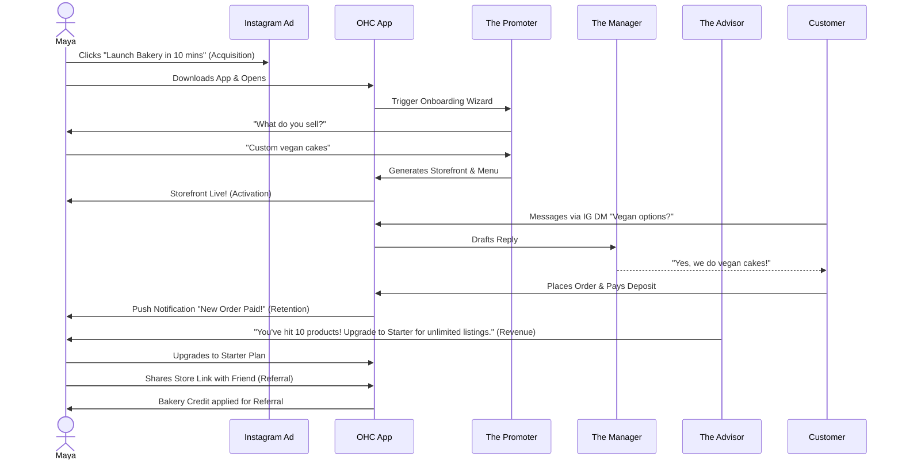
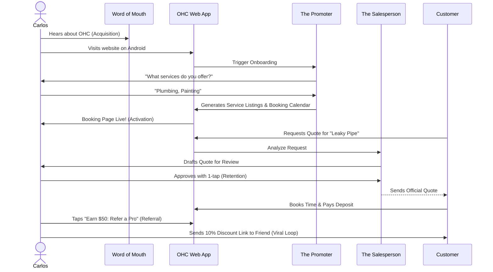
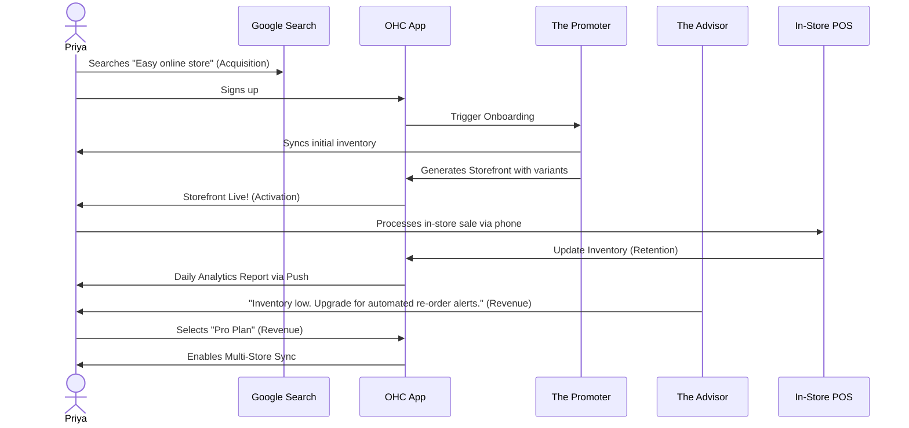
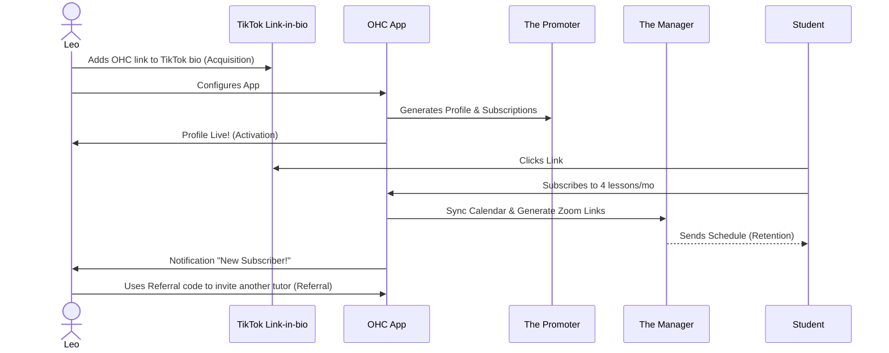
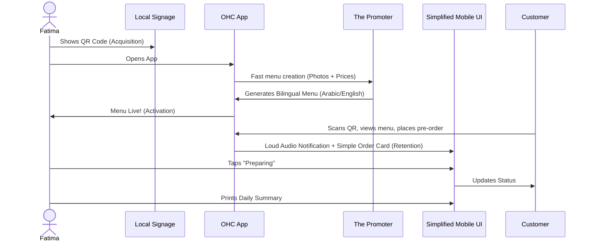

# [architecture] Business Journey Architecture

## Title
Architectural Mapping of the End-to-End Business Journey for OHC Personas

## Problem Statement
The OHC platform must serve a diverse set of real-world small business owners (Maya, Carlos, Priya, Leo, and Fatima) who share a common goal: launching and growing their business entirely from a mobile device without technical expertise. Currently, the overarching business journeys—from initial acquisition to sustainable revenue generation and referral loops—are fragmented. We need a unified architectural map of the end-to-end user journeys for these personas to ensure that the system naturally supports their progression through Acquisition, Onboarding, Activation, Retention, Revenue generation, and Referral, while identifying critical friction points where non-technical users might abandon the platform.

## Research Report
### Context and Competitive Analysis
Small business owners often churn on platforms like Shopify, Wix, or Squarespace because the acquisition promise ("build a site in minutes") conflicts with the onboarding reality (complex dashboards, technical jargon like CNAME, Liquid templates).
- **Shopify:** High friction onboarding requiring extensive configuration before accepting the first payment. Desktop-primary dashboard.
- **Wix/Squarespace:** Complex drag-and-drop interfaces that are difficult to use on mobile devices.
- **OHC Advantage:** OHC provides an AI-driven, mobile-first, 10-minute zero-to-live experience that defers complex configuration until after the first "Aha!" moment (Activation).

### Journey Stages
1. **Acquisition:** The entry point. Organic search, social media ads (Instagram/TikTok), or word-of-mouth. The call-to-action (CTA) must clearly promise a functional business setup in under 10 minutes without code.
2. **Onboarding:** A highly guided, AI-driven wizard flow. Crucial to minimize initial input; deferring advanced configurations (like custom domains) to a later stage. Minimum inputs to go live: Business Name, What they sell, and a rough description.
3. **Activation:** The "Aha!" moment. A live storefront, the first booking, or the first payment. Must be achieved within Day 1. Success by Week 1: First customer interaction. Success by Month 1: Consistent sales or bookings.
4. **Retention:** Kept engaged through actionable notifications (e.g., new order alerts) and AI-generated weekly health reports from the Business Advisory Agent.
5. **Revenue:** Transitioning from a free tier to a paid plan. Triggered by hitting specific milestones (e.g., reaching product/action limits, needing custom domains). Upgrade CTA presented contextually (e.g., when adding the 11th product on a free plan).
6. **Referral:** Incentivized sharing. Creating a viral loop through referral discounts and shareable success metrics ("Maya made $500 this week on OHC, start your bakery today").

### Identified Friction Points
1. **Cognitive Overload during Onboarding:** Requesting too much setup information upfront causes drop-offs.
2. **Payment Gateway Integration:** Technical jargon during Stripe connection can stall progress.
3. **Inventory/Calendar Sync:** Difficulties mapping real-world availability to digital systems.
4. **Language Barriers:** Interfaces that assume high technical literacy or English fluency (e.g., for Fatima).

## Design Doc
### Key Design Decisions
- **Progressive Disclosure:** The onboarding flow requests the absolute minimum data to generate a viable starting point. Advanced settings are dynamically suggested by the Business Advisory Agent post-activation.
- **AI-First Setup:** The Marketing & Advertising Agent acts as the primary onboarding guide, generating the initial website layout and copy based on a simple prompt.
- **Mobile Parity:** All journey flows are designed and tested starting at the 375px breakpoint. Desktop is additive.
- **Business Owner Lens:** Non-technical terminology (e.g., "Connect your bank" instead of "Configure Stripe Webhooks").

### Mobile UX Flow (375px First)
1. **Landing (Acquisition):** Single clear input field: "What kind of business do you run?" -> "Start Free" CTA.
2. **Wizard (Onboarding):** Chat-like interface with the Marketing Agent. "Upload a few photos of your work" -> "Generating your storefront..."
3. **Live View (Activation):** Confetti animation. "Your store is live at maya-bakes.ohc.app!" with a prominent "Share on Instagram" button.
4. **Dashboard (Retention):** Simple activity feed. "New message from customer", "Weekly sales report ready".

### AI Agent Integration Points
- **The Promoter (Marketing & Advertising):** Handles initial onboarding, store generation, and referral campaign creation.
- **The Salesperson (Sales & Acquisition):** Generates quotes and follows up on leads.
- **The Ambassador (Customer Success):** Drafts replies to customer messages.
- **The Manager (Operations):** Processes orders and updates inventory.
- **The Advisor (Business Advisory):** Contextually prompts revenue upgrades (e.g., "You're getting lots of traffic, time for a custom domain?").

### Architecture Diagrams (Mermaid.js)

#### 1. Maya (The Home Baker) Journey

#### 2. Carlos (The Handyman) Journey

#### 3. Priya (The Boutique Owner) Journey

#### 4. Leo (The Music Tutor) Journey

#### 5. Fatima (The Food Cart Operator) Journey

## Implementation Prompt
**To Implementer Agent:**
Implement the foundational user onboarding flow and dashboard state management that supports the progression from Acquisition to Activation. The system should define the required data models to capture the user's business type and minimal initial configuration. Build the mobile-first (375px) UI wizard that guides a user through the initial setup, ensuring that advanced configurations are deferred (Progressive Disclosure). The final step of the wizard should instantly generate a functional "Storefront/Booking Page" view, satisfying the 'Activation' milestone. Ensure that interactions feel premium (Glassmorphism, correct typography) and are resilient to network issues (optimistic updates). Do not prescribe specific database schemas or backend routing; focus on the unified API contract and the user journey transitions. Include E2E test coverage verifying a successful run-through from login to the generated storefront.

## Priority
P0

## Estimated Scope
Large
