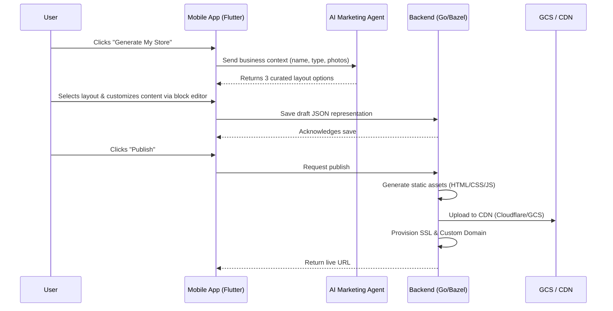

# 🔍 Scout: Architecture Research Task

## [Architecture] Website & Storefront Builder Architecture
**Title**: Website & Storefront Builder Architecture
**Problem Statement**: Small business owners (like Maya, Carlos, Priya) are overwhelmed by complex website builders like WordPress, Shopify, or Webflow. They don't understand "padding," "margins," or "DNS." They need a completely frictionless way to generate a beautiful, mobile-first storefront in under 10 minutes from their phone, with AI handling design, copywriting, and layout invisibly.
**Research Report**:
- **Target Persona**: Maya (Home Baker), Carlos (Handyman), Priya (Boutique Owner), Leo (Music Tutor), Fatima (Food Cart Operator)
- **Competitive Analysis**:
  - *Shopify*: Powerful but assumes desktop management and technical understanding of themes and liquid.
  - *Wix/Squarespace*: Desktop-first drag-and-drop. Too many options leading to decision paralysis.
  - *Link-in-bio (Linktree)*: Too simple. Doesn't support full commerce, bookings, or multi-page sites natively.
- **Key Findings**:
  - Over 80% of SMBs manage their digital presence exclusively from mobile devices.
  - Non-technical users fail when presented with abstract layout concepts (e.g., CSS grid, flexbox).
  - The solution must restrict choices to ensure aesthetic excellence (Glassmorphism, curated typography).
**Design Doc**:
### Architecture Diagram

### UI Wireframes & Screen Flow (375px first)
1. **Onboarding Screen**: "What kind of business do you run?" (Options: Food, Services, Retail, Digital, etc.)
2. **AI Generation Screen**: Loading spinner with text: "The Promoter is designing your storefront..."
3. **Preview Screen**: A live, scrollable 375px preview of the generated site. Floating action button: "Edit" or "Publish".
4. **Edit Block Flow**: User taps a block (e.g., Hero image). A bottom sheet slides up with simple options:
   - "Replace Image" (opens native camera/gallery).
   - "Rewrite Text" (AI generates new copy).
   - "Change Vibe" (switches between predefined premium color/font themes).
5. **Publish Flow**: A simple success screen with a confetti animation and a shareable link. Options to "Share to Instagram" or "Get QR Code".

### Mobile UX Flow
- The builder is entirely block-based (Hero, Product Grid, Testimonials, Contact Form, Booking Widget).
- No free-form dragging. Blocks snap into a linear vertical stack optimized for mobile scrolling.
- Global styling is restricted to curated "Vibes" to prevent ugly designs.

### AI Agent Integration Points
- **The Promoter (Marketing & Advertising)**: Automatically generates the initial layout, writes SEO-optimized copy, selects stock images if user has none, and suggests new blocks based on business type (e.g., suggesting a booking widget for a handyman).
- **The Advisor (Business Advisory)**: Analyzes published site performance and suggests improvements (e.g., "Moving your testimonials block higher might increase conversions").

### Key Design Decisions
- **JSON-Driven Content**: The storefront is stored as a JSON tree of blocks, not raw HTML. This allows the native mobile app to render the builder natively and the backend to generate the static web version.
- **Constrained Customization**: No pixel-level adjustments. Users select from pre-approved OHC Premium Tokens (Glassmorphism, Outfit/Inter typography) to guarantee aesthetic excellence.
- **Server-Side Generation**: The backend compiles the JSON block representation into static, highly optimized HTML/CSS/WebP assets pushed to a CDN for instant load times globally.

**Implementation Prompt**: Implement the backend JSON block schema for storefront pages. Create the mobile Flutter UI to render these blocks natively and allow simple content editing. Build the AI integration where the Marketing Agent translates raw business data into a fully populated block structure. Implement the static site generator that compiles the JSON schema into CDN-ready HTML/CSS.
**Priority**: P0
**Estimated Scope**: Large
