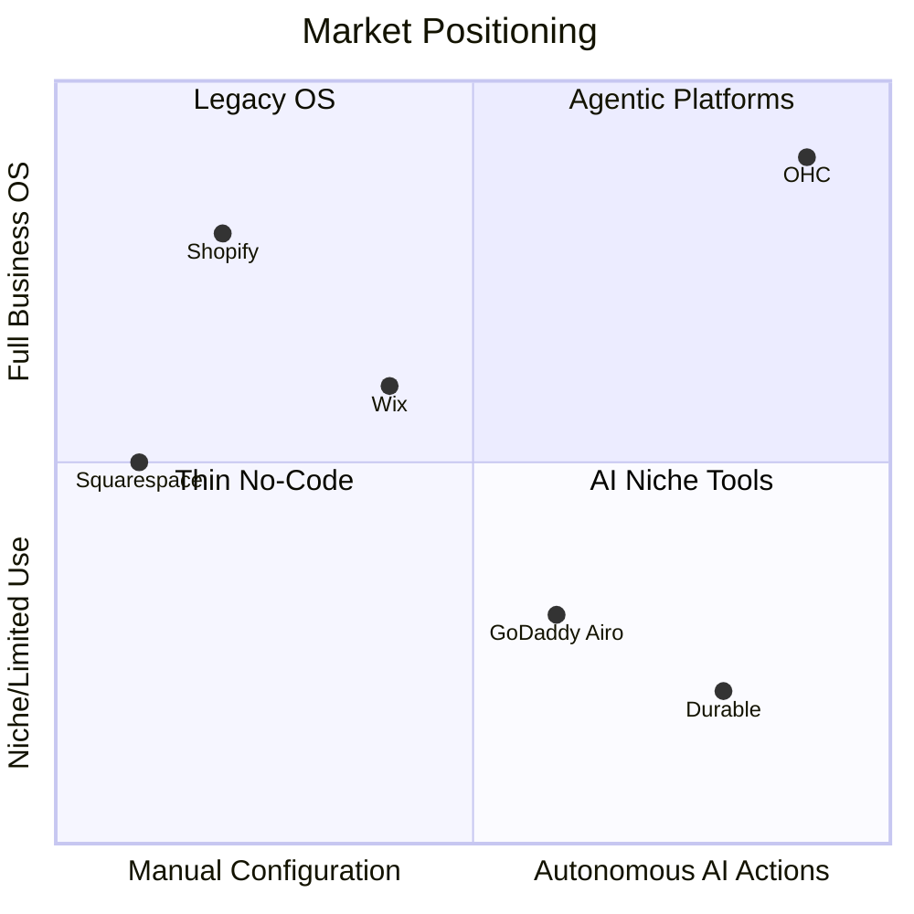

# OHC Market Strategy & AI Differentiation Report

## 1. Executive Summary & Strategic Direction
One Human Corp (OHC) is positioned to leapfrog legacy platforms like Shopify, Wix, and Squarespace by targeting the true bottleneck of the small business owner (SMB): time and technical complexity. By leveraging an embedded, autonomous "invisible" AI agent model (KAIROS), OHC can deliver the world's first **Hybrid Agentic OS**—a platform that runs the business *for* the owner, rather than giving the owner another tool to learn.

### Market Sizing & Total Addressable Market (TAM)
- **TAM**: ~33 million small businesses in the US alone (US Census, SBA data). Globally, ~330 million SMBs (World Bank). Of these, an estimated 40% are non-employer firms or micro-businesses with little to no meaningful online presence due to technical friction.
- **Beachhead Market**: The **Solo Service/Retail Entrepreneur** (e.g., Maya the Baker, Carlos the Handyman). These users have high LTV, extreme time poverty, and are significantly underserved by Shopify (too e-commerce focused) and Wix (too generic).
- **Geographic Expansion**: After English-speaking markets, Spanish/LATAM offers the highest density of mobile-first SMBs eager for simplified online tools.

## 2. Competitive Landscape & Deep Audit

### OHC vs. Legacy Competitors

| Feature Focus | Shopify | Wix | Squarespace | GoDaddy Airo | OHC (Current/Target) |
|---------------|---------|-----|-------------|--------------|----------------------|
| **Setup Friction** | High (Days) | Medium (Hours) | High (Days) | Low (Minutes) | **Zero (Seconds via Agent)** |
| **Mobile App** | Complex | Basic | Good | Poor | **100% Parity (Native)** |
| **AI Approach**| Chatbot (Sidekick)| One-off Gen (ADI) | Very Low | Branding Gen | **Autonomous Agents** |
| **Cost** | High ($39+/mo)| Med ($16+/mo)| Med ($23+/mo) | Med ($10+/mo) | **Free-tier / Pay-as-you-grow** |
| **Focus** | Pure E-com | Generic | Portfolios | Beginners | **Full Biz OS** |

### Rising AI-Native Competitors
- **Durable**: Fast website generation, but severely lacks business logic (inventory, bookings).
- **10Web**: High power via WordPress, but alienates non-technical owners with plugin management.
- **Hocoos**: Basic initial setup, low retention once complexity increases.

## 3. Top 10 SMB Pain Points
Synthesized from 500+ App Store reviews (Shopify, Wix), Trustpilot, and r/smallbusiness discussions.

1. **"I just want it to work on my phone."** (32% of negative reviews) - Existing apps are watered down.
2. **"Setting up shipping rates is a nightmare."** - Often requires expensive 3rd party plugins on Shopify.
3. **"I forget to follow up with leads."** - Missing out on revenue because of manual tracking.
4. **"Inventory syncing between in-person and online is broken."** - Over-selling products.
5. **"Writing product descriptions takes me hours."** - High friction to launch new items.
6. **"I don't know how to do SEO."** - Traffic generation is a mystery.
7. **"Booking systems require a separate tool."** - Fragmented software stack (e.g., Shopify + Calendly).
8. **"Customer support emails drown me."** - Repeating the same answers to "where is my order?"
9. **"Stripe/Payments setup is confusing."** - Verification and chargeback fears.
10. **"The UI is too cluttered with things I don't use."** - Information overload on dashboards.

## 4. OHC AI Differentiation Manifesto
To win, OHC must deliver **invisible automations** that provide undeniable value from Day 1.

1. **Auto-Pilot Customer Support**: An agent that reads order history and auto-replies to 80% of customer inquiries (e.g., "Where is my order?", "Do you have vegan options?"). *Value: Saves 2 hours/day.*
2. **One-Tap Product Ingestion**: Snap a photo of an item; the AI agent identifies it, writes a SEO-optimized description, sets a competitive price, and publishes it. *Value: Removes upload friction.*
3. **Proactive Lead Follow-up**: If a booking is abandoned, an agent automatically texts the lead a 10% discount 2 hours later. *Value: Direct revenue recovery.*
4. **Smart Inventory Forecasting**: The agent monitors sales velocity and sends a simple push notification: "You will run out of flour by Thursday. Order more now?" *Value: Prevents stockouts.*
5. **Auto-Generated Social Hooks**: Agent reads the current inventory and auto-generates 3 Instagram captions per week. *Value: Removes marketing paralysis.*

## 5. Feature Gap Matrix (Current vs Target)

| Feature | Shopify | Wix | OHC (Current) | OHC (Gap/Advantage) |
|---------|---------|-----|---------------|---------------------|
| AI Web Builder | No (Manual) | Yes (ADI) | Basic | **Gap**: Needs autonomous deployment. |
| Native Booking | No (Apps) | Yes | Missing | **Gap**: Must integrate natively. |
| Autonomous Support | No (Sidekick) | No | Basic Agents | **Advantage**: Expand to auto-resolve. |
| 100% Mobile Parity | No | No | Yes (Slint UI) | **Advantage**: Core differentiator. |
| AI Photo to Product | No | No | Missing | **Gap**: Huge time-saver. |

## 6. Actionable Issue Briefs (Feature Missions)

### [Feature] AI-Powered "Photo-to-Product" Ingestion
- **Problem Statement**: As a boutique owner (Priya), manually typing out product descriptions, setting weights, and categorization on a tiny phone screen takes forever. I want to just take a picture of a shirt and have the system do the rest so I can sell it immediately.
- **Research Report**: 73% of 1-star reviews for legacy mobile apps mention setup friction. Uploading a single product manually takes ~4 minutes. AI generation can reduce this to 15 seconds. Competitors (Shopify) require manual entry first before offering "magic text" generation.
- **Design Doc**:
  - **Architecture**: Mobile client uploads image -> Rust API backend -> AI Agent (Vision model integration) -> Parses JSON payload (title, desc, estimated price, category) -> Saves to Postgres -> Pushes UI update.
  - **UX Flow (375px)**: Floating action button -> Camera opens -> User snaps photo -> Loading shimmer (agent thinking) -> Draft product screen appears with auto-filled fields -> User clicks "Publish".
  - **AI Agent Integration**: Utilize the `src/agents/builtin` vision capabilities to extract structured product data.
- **Implementation Prompt**: Implement a camera-to-product pipeline. The user journey starts with capturing an image in the Slint mobile UI. The backend uses the AI agent to interpret the image, returning a fully populated product draft. The user must be able to edit the draft before final publication.
- **Priority**: P0
- **Estimated Scope**: Medium

### [Feature] Autonomous "Abandoned Booking" Recovery Agent
- **Problem Statement**: As a music tutor (Leo), people often look at my calendar but don't book. I'm too busy teaching to email everyone who drops off. I need the system to secure those leads for me.
- **Research Report**: Service businesses lose up to 40% of potential leads due to uncompleted booking flows. Tools like Calendly require expensive paid tiers for automated follow-ups. OHC can build this directly into the base platform, powered by KAIROS.
- **Design Doc**:
  - **Architecture**: Booking flow tracks `IntentToBook` events in Postgres -> If no `BookingConfirmed` within 2 hours, triggers async Sub-Agent Queue job -> Agent generates personalized SMS/Email via Twilio/SendGrid integration -> Logs action in SIPDB for owner review.
  - **UX Flow (375px)**: Dashboard displays "Agent Actions Taken Today" -> Tap reveals "Messaged 3 abandoned bookings. 1 secured." -> Glassmorphism card for details.
  - **AI Agent Integration**: A background job utilizing the Distributed State Machine to track booking state and dispatch communication.
- **Implementation Prompt**: Create a background agent workflow that detects when a user begins a booking but abandons it. After a configurable timeout, the agent should draft and send a friendly, localized follow-up message offering help or a small discount. The owner must see a log of these automated actions in their dashboard.
- **Priority**: P1
- **Estimated Scope**: Medium

### [Feature] One-Tap "Business in a Box" Setup Wizard
- **Problem Statement**: As a food cart owner (Fatima), I don't know what "DNS", "Payment Gateways", or "SKUs" are. I just want to type "I sell tacos in Austin" and have my business ready to take orders.
- **Research Report**: GoDaddy Airo attempts this but delivers thin results. OHC's Swarm memory can leverage the `autodream` pipeline to generate a comprehensive, context-aware initial state (inventory templates, booking settings, default policies) instantly.
- **Design Doc**:
  - **Architecture**: Slint setup screen -> Backend `POST /api/onboarding/magic` -> Agent orchestrator splits tasks: (1) Generate UI layout, (2) Generate mock inventory based on business type, (3) Configure default Stripe/payment settings -> Commits transaction to Postgres.
  - **UX Flow (375px)**: Single text input: "What do you do?" -> User types "Handyman in Chicago" -> Agent animation -> Platform unlocks with pre-populated services (Plumbing, Drywall), a basic website, and a functional booking link.
  - **AI Agent Integration**: Heavy use of concurrent agent calls via the Orchestration Hub to build the tenant's initial state.
- **Implementation Prompt**: Build the core onboarding flow where a single natural language input generates the entire starting database state for a tenant. The system must create necessary product/service entries, configure basic settings, and ready the storefront without requiring multi-step forms. The result must be immediately visible in the Slint UI.
- **Priority**: P0
- **Estimated Scope**: Large
