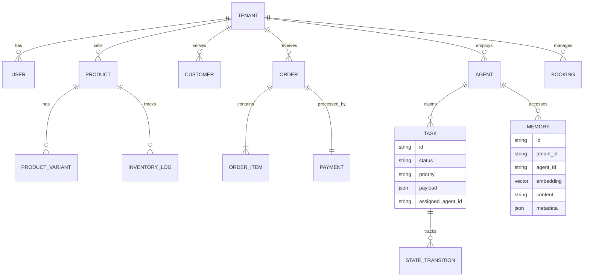

# [architecture] Data Model Architecture Evolution for AI & Multi-Tenancy

## Title
Architectural Upgrade: Unified Multi-Tenant Data Model for OHC Businesses

## Problem Statement
Small business owners like Maya, Carlos, Priya, Leo, and Fatima need a platform that "just works" while keeping their business data—customer lists, messages, and orders—strictly private and secure. They rely on the OHC app to be incredibly fast, even on weak mobile connections, and they need AI agents to remember their business details seamlessly. Currently, if the data model isn't built to guarantee total separation between businesses (multi-tenancy) or isn't optimized for how AI naturally stores "memories," the app can become slow, buggy, or worse, risk exposing one business's data to another. From a business owner's perspective, the system must act like an infallible, highly secure digital filing cabinet that their AI teammates can access instantly to help them run operations effortlessly.

## Persona-Specific Pain Point Summaries
- **Maya (Baker):** Struggles with manual tracking. Pain point: Needs "The Advisor" to instantly recall past seasonal trends (like her top-selling vegan cakes last December) without her having to dig through spreadsheets.
- **Carlos (Handyman):** Works in areas with poor cellular service. Pain point: Experiences frustration when the mobile app takes too long to load service lists or save quotes because the data fetching is bloated.
- **Priya (Boutique Owner):** Manages high volumes of inventory across physical and digital stores. Pain point: Worries about data privacy; needs absolute assurance that her competitor's AI agent cannot peek at her sales data.
- **Leo (Music Tutor):** Manages recurring bookings. Pain point: Needs his students' booking histories instantly tied to his AI generated responses, but finds his current tools fragment this data across different systems.
- **Fatima (Food Cart):** Uses an older Android device with limited data. Pain point: A heavy, unoptimized data model causes her app to freeze, preventing her from updating "Sold Out" statuses during peak lunch hours.

## Research Report
### Competitive Analysis
- **Shopify:** Utilizes a highly complex relational database system that is powerful but notoriously difficult to extend with semantic AI memory without third-party plugins. Their multi-tenancy model is strong but heavy for simple SMBs.
- **Wix & Squarespace:** Offer simplified document-like data stores, but these often struggle with complex cross-referencing needed for autonomous AI agents (e.g., tying a specific booking deposit directly to an AI marketing campaign).
- **GoDaddy:** Traditional monolithic data structures that lack native vector support for AI memory, making any intelligent agent add-ons feel bolted-on rather than native.
- **OHC Advantage:** By employing a "Shared Database, Shared Schema" model with localized SQLite for standalone modes and `pgvector` for semantic memory in the cloud, OHC natively embeds AI capabilities at the very foundation of the data tier, operating completely invisibly to the user.

### Actionable Recommendations
- OHC should implement strict Tenant ID scoping on all database operations because Row-Level Security (RLS) guarantees Maya's data never leaks to Priya's boutique, fulfilling our privacy promise.
- OHC should integrate vector embeddings directly into the core data entities because it allows the AI "Customer Success Agent" to instantly recall context-rich memories of past interactions, providing personalized responses.
- OHC should adopt optimistic UI data mutations paired with background synchronization because mobile-first users like Carlos and Fatima demand sub-100ms response times even on poor 4G networks.

## Design Doc

### Entity-Relationship Diagram

### Key Invariants & Design Decisions
1.  **Mandatory Tenant Scoping:** Every single data entity across the platform (except global system tables) must be tied to a `tenant_id`. This is the fundamental consistency boundary for all operations.
2.  **RLS-First Security:** In cloud deployments, access is strictly governed by PostgreSQL Row-Level Security policies tied to the current session's tenant.
3.  **Agent Memory Isolation:** Agents can only query vector memories belonging to their assigned tenant. "The Advisor" working for Carlos has zero context about Maya's bakery.
4.  **Optimized Mobile Payload:** The data access pattern prioritizes lightweight summary queries (e.g., fetching a dashboard aggregate object in one round trip) over heavy relational joins, keeping mobile network payloads under 500KB.
5.  **Schema Evolution & Migration Strategy:**
    - To prevent disruptive downtime for global users, schema migrations must follow an Expand-and-Contract model.
    - **Expand:** Add new columns or tables alongside existing ones. The application layer handles both schema versions (reading from old, writing to both). This enables non-breaking forward compatibility.
    - **Backfill:** Background jobs migrate existing data into the new structure (e.g., generating vector embeddings for older records).
    - **Contract:** Once all data is backfilled and the application only depends on the new schema, drop the deprecated tables/columns in a subsequent release.

### Mobile UX Flow & UI Wireframes
- **Screen Flow (375px First):**
  - **Screen 1 (Dashboard Summary):** Displays lightweight aggregates (Total Orders, Active Tasks, Unread Messages) fetched efficiently. Uses a shimmer effect while loading.
  - **Screen 2 (Agent Interaction/Memory):** When viewing "The Advisor" insights, the screen queries the vectorized memory store and displays a plain-language summary of recent business trends.
  - **Screen 3 (Optimistic Mutation):** User toggles a product to "Sold Out". The UI updates instantly (optimistic UI), while the data model securely queues a background transition for the task.

## Implementation Prompt
**To Implementer Agent:**
Implement the evolved multi-tenant data model and memory integration framework. Update the core data repository layers to automatically scope all queries and mutations by the authenticated user's `tenant_id`. Integrate the vector memory storage mechanism so that AI agent context is correctly isolated per business. Build the mobile-friendly dashboard summary view that aggregates key business metrics (Orders, Tasks, Messages) into a lightweight structure designed for fast loading on 4G networks. Ensure that state changes (like marking a task complete or updating inventory) apply optimistically to the UI with background synchronization. Verify the isolation boundary by writing tests that confirm one tenant cannot access another's data or agent memories. Validate the end-to-end Critical User Journey (CUJ) where a user logs in, instantly sees their dashboard, and updates a setting with no perceived lag. Ensure all UI uses the premium OHC design system.

## Priority
P0

## Estimated Scope
Large
