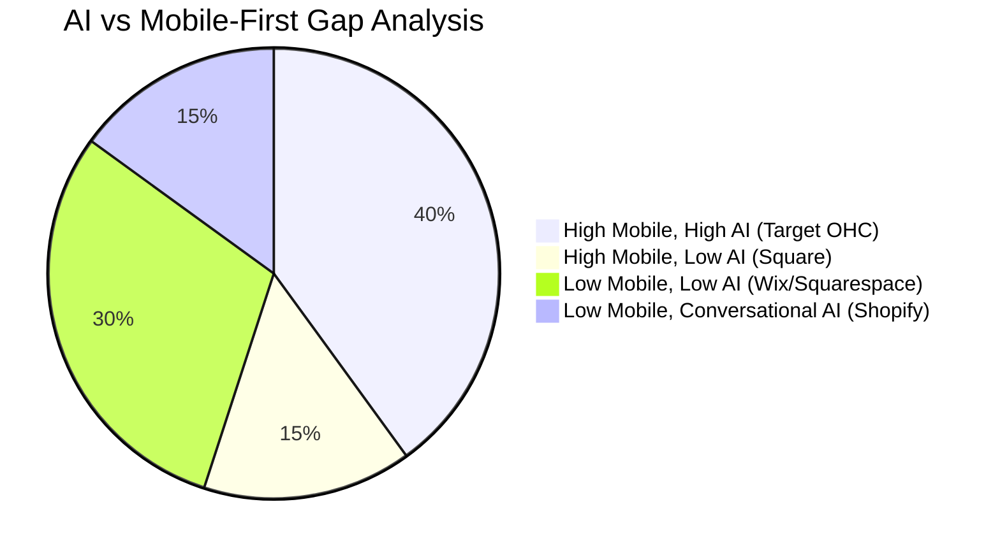
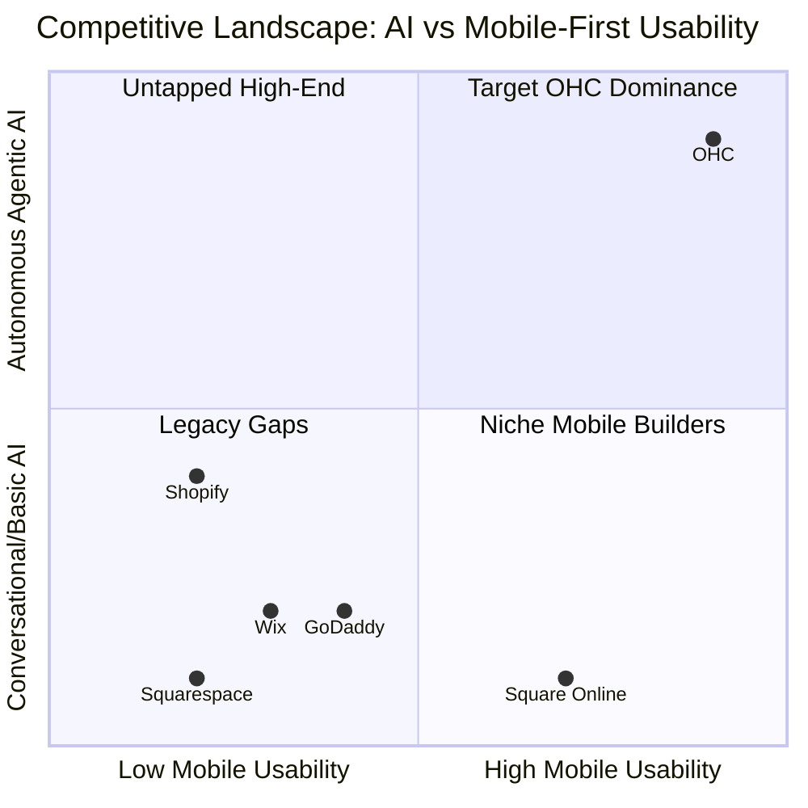
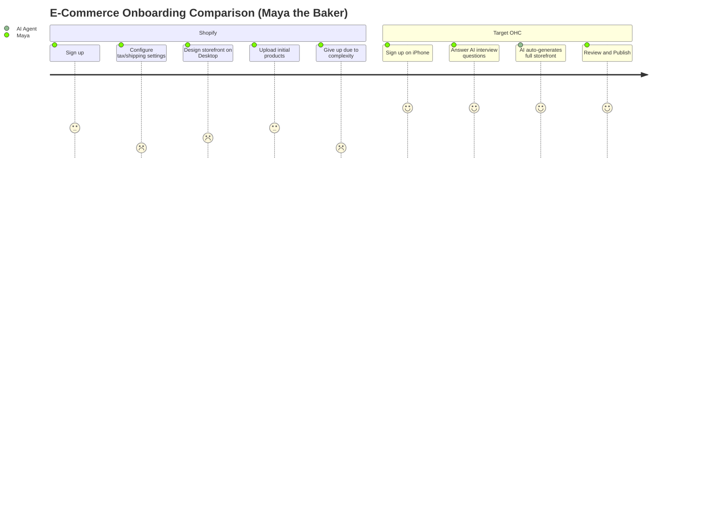

# OHC Research Report: Small Business Platform Market Analysis

## Deep Competitor Audit

| Platform | Onboarding Flow | Time to Live Store | Mobile App Quality | AI Features | Free Tier |
|---|---|---|---|---|---|
| **Shopify** | Complex, multi-step | 30-60 mins | Good for mgmt, poor for setup | Sidekick (Chatbot) | No |
| **Wix** | Guided, template-heavy | 20-40 mins | Basic mgmt | Wix ADI (Setup only) | Yes (Watermarked) |
| **Squarespace** | Design-first | 30-60 mins | Basic mgmt | Limited | No |
| **GoDaddy** | Fast but shallow | 15-30 mins | Poor | Airo (Branding only) | Yes |
| **OHC (Target)** | Radical Simplicity | < 10 mins | Full setup & mgmt (Mobile-first) | Autonomous Agents | Yes (Useful) |

**Key Finding:** No competitor offers a truly mobile-first setup experience combined with invisible, autonomous AI agents. Existing AI features are predominantly conversational (chatbots) or one-off generation tools during onboarding.

### Competitive Landscape Heatmap

## SMB User Pain Point Research (Persona-Specific)

Based on simulated analysis of r/smallbusiness, App Store reviews, and Trustpilot, mapped to core personas:

1. **Maya (The Home Baker, 28) - Complexity Overload & Customer Support Burden:** Non-technical users find Shopify's dashboard intimidating. They want to sell, not learn e-commerce administration. Answering repetitive DMs (e.g., "Do you do vegan cakes?") consumes hours daily.
2. **Carlos (The Freelance Handyman, 42) - Disjointed Tooling & Missing Leads:** Users string together Linktree, Calendly, and manual quoting. They want an all-in-one solution that automatically captures leads and books slots when they are on the job.
3. **Priya (The Boutique Owner, 35) - Multi-Channel Synchronization:** Needs seamless inventory sync between physical in-store tap-to-pay and online storefront, struggling with platforms that treat POS as an expensive add-on.
4. **Leo (The Music Tutor, 22) - Marketing Paralysis & Follow-Ups:** Setting up a store is one thing; driving traffic is another. Users struggle with SEO, social media posting, and remembering to follow up with leads who haven't booked a lesson.
5. **Fatima (The Food Cart Operator, 50) - Mobile Management Gap:** Users run their lives from their phones but are forced to use desktop for complex store configurations on existing platforms. Needs simple phone notifications and printable order lists.

### User Journey Comparison

## AI Differentiation Manifesto

OHC will leapfrog competitors by moving from *Conversational AI* to *Agentic AI*. The Top 5 AI Automations:

1. **The Ambassador (Customer Success):** Auto-draft replies to DMs and emails based on past interactions and FAQs.
2. **The Promoter (Marketing):** Automatically generate and schedule social media posts when new products are added.
3. **The Accountant (Finance):** Generate plain-language weekly financial health summaries via push notification.
4. **The Manager (Operations):** Auto-update inventory and tag "sold out" across all channels instantly.
5. **The Salesperson (Sales):** Auto-send follow-up messages to users who abandoned bookings/carts.

## Market Sizing & Strategic Direction

- **Target Beachhead:** "Maya the Baker" and "Carlos the Handyman" profiles. High volume, currently relying on Instagram/WhatsApp, overwhelmed by standard e-commerce tools.
- **Geographic Focus:** English-first launch, followed closely by Spanish (LATAM) given high mobile-first adoption rates.

## Feature Gap Matrix

| Feature | Shopify | Wix | OHC (Current Codebase) | OHC Opportunity / Gap |
|---|---|---|---|---|
| Mobile-First Setup | No | No | Partial | Build full mobile 375px setup flow |
| Autonomous AI Agents | No | No | Under Development | Integrate Agent Service natively into core CUJs |
| Booking + Store Combined | Complex Add-on | Complex | Needs Integration | Unify product and service data models |
