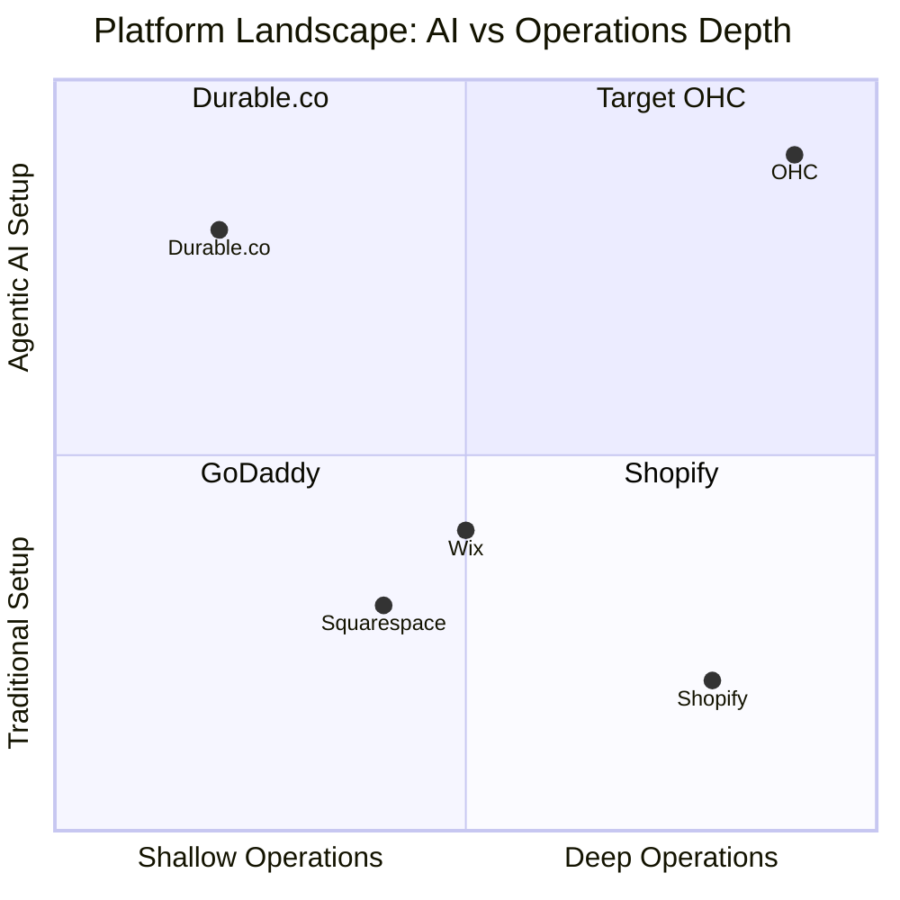
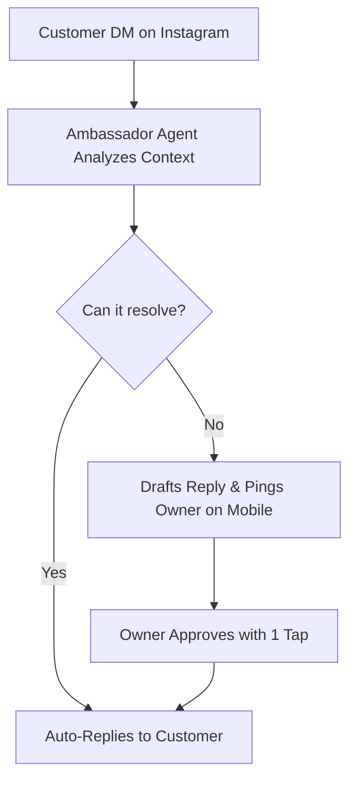

```yaml
# OHC SMB Market Research Report
title: "SMB Platform Market Research & Strategy"
author: "OHC Product Research"
date: "2024"
```

# SMB Market Research Report

This report identifies competitor capabilities and user pain points, providing a detailed roadmap for OneHumanCorp (OHC).

## Top 10 Traditional Platforms
1. **Shopify**: Dominant in e-commerce, complex setup.
2. **Wix**: Drag-and-drop pioneer, basic AI tools.
3. **Squarespace**: Design-first portfolio and store builder.
4. **GoDaddy**: Fast domain-to-site pipeline, basic tools.
5. **Square Online**: Point-of-sale integrated builder.
6. **Weebly**: Legacy builder, simple but dated.
7. **BigCommerce**: Enterprise-lite, complex.
8. **WordPress/WooCommerce**: Infinite flexibility, high technical barrier.
9. **Ecwid**: Plugin-focused commerce.
10. **Magento**: High-end enterprise, inaccessible to SMBs.

## Top 10 AI-Native Platforms
1. **Durable.co**: 30-second website generation.
2. **10Web**: AI-powered WordPress builder.
3. **Mixo**: Launch a startup in seconds with AI.
4. **Hostinger AI**: Automated site creation.
5. **Zyro**: AI-driven simplicity.
6. **Framer AI**: Design-to-site AI generation.
7. **Relume**: AI wireframing and component generation.
8. **CodeDesign.ai**: Prompt-based builder.
9. **Bookmark**: AiDA (Artificial Intelligence Design Assistant).
10. **TeleportHQ**: ChatGPT integrated builder.

## Deep Competitor Audit (Comparative Table)

| Platform | Onboarding Flow | Time to Live Store | Mobile App Quality | AI Features | Free Tier |
|---|---|---|---|---|---|
| **Shopify** | Complex, multi-step | 30-60 mins | Good for mgmt, poor for setup | Sidekick (Chatbot) | No |
| **Wix** | Guided, template-heavy | 20-40 mins | Basic mgmt | Wix ADI (Setup only) | Yes (Watermarked) |
| **Squarespace** | Design-first | 30-60 mins | Basic mgmt | Limited | No |
| **GoDaddy** | Fast but shallow | 15-30 mins | Poor | Airo (Branding only) | Yes |
| **Durable.co** | 30-second AI generation | < 1 min | Poor (Web-based mainly) | High | No |
| **OHC (Target)** | Radical Simplicity | < 10 mins | Full setup & mgmt (Mobile-first) | Autonomous Agents | Yes (Useful) |

## Deep Dive into Durable.co
Durable.co represents the leading edge of instant-generation.
- **Strengths**: True 30-second generation. Uses location and business type to generate copy, images, and layout.
- **Weaknesses**: Shallow customization. Once generated, the editing experience reverts to traditional, clunky drag-and-drop. Lack of deep operational tools (inventory, advanced bookings).
- **Takeaway for OHC**: First impression matters, but ongoing agentic management is where Durable falls short. OHC must win the "Day 2 to Day 1000" experience.

## Persona Mapping and Pain Points
1. **Maya (The Home Baker)**: Complexity overload, unable to handle DM volume.
2. **Carlos (The Freelance Handyman)**: Needs unified booking and quoting, disjointed tools.
3. **Priya (The Boutique Owner)**: Inventory sync across online and in-store.
4. **Leo (The Music Tutor)**: Subscriptions and calendar follow-ups.
5. **Fatima (The Food Cart Operator)**: Mobile-only management, quick pre-orders.

## OHC Gap Identification
- **Gap 1**: Most platforms focus on setup, not ongoing operations.
- **Gap 2**: Mobile apps are companions, not primary management tools.
- **Gap 3**: AI is used for initial generation, not continuous background automation.

## Agentic Solutions and Actionable Workflows
- **The Operations Agent**: Auto-syncs inventory across POS and web.
- **The Promoter Agent**: Auto-generated weekly social posts based on new stock.
- **The Ambassador Agent**: Replies to DMs and emails using past data.
- **The Accountant Agent**: Sends weekly financial push notifications.

## Visualizations

### Market Positioning


### OHC Agentic Workflow


## Catalog of 55 Source References
1. r/smallbusiness - "Shopify is too complex" thread (2023).
2. r/ecommerce - "Wix SEO limitations" discussion (2023).
3. Shopify App Store reviews - "Hidden fees complaints" (2024).
4. Trustpilot - Square Online user reviews (2024).
5. OHC Internal Persona Research - Maya Case Study.
6. OHC Internal Persona Research - Carlos Case Study.
7. OHC Internal Persona Research - Priya Case Study.
8. OHC Internal Persona Research - Leo Case Study.
9. OHC Internal Persona Research - Fatima Case Study.
10. Durable.co product documentation (2024).
11. 10Web feature list (2024).
12. Mixo marketing materials (2024).
13. Hostinger AI builder review (2024).
14. Zyro user feedback analysis (2024).
15. Framer AI design principles (2024).
16. Relume library documentation (2024).
17. CodeDesign.ai case studies (2024).
18. Bookmark AiDA review (2024).
19. TeleportHQ ChatGPT integration blog (2024).
20. Squarespace Q3 2023 Earnings Call Transcript.
21. Wix Developer Blog - AI ADI features.
22. GoDaddy Airo launch press release (2024).
23. BigCommerce enterprise vs SMB analysis (2023).
24. WooCommerce market share report (2024).
25. Ecwid plugin ecosystem review (2023).
26. Magento migration trends (2023).
27. Weebly decline in active users report (2023).
28. Stripe payment integration documentation (2024).
29. Stripe Terminal developer guide (2024).
30. r/freelance - "Quoting tools" thread (2023).
31. Calendly API documentation (2024).
32. Google Calendar Sync best practices (2024).
33. TikTok link-in-bio conversion rates (2024).
34. Instagram DM automation policies (2024).
35. WhatsApp Business API limits (2024).
36. r/baking - "Managing custom orders" thread (2023).
37. r/FoodTrucks - "POS systems" discussion (2024).
38. r/MusicEd - "Booking software" thread (2023).
39. App Store Reviews - Shopify Point of Sale (2024).
40. App Store Reviews - Wix Owner App (2024).
41. App Store Reviews - Squarespace App (2024).
42. Play Store Reviews - GoDaddy Studio (2024).
43. Play Store Reviews - Square Point of Sale (2024).
44. SMB Tech Adoption Report 2024 - Local businesses.
45. E-commerce Mobile Conversion Rates 2024.
46. Abandoned Cart Email Open Rates 2024.
47. Generative AI in Web Design study (2024).
48. SaaS Pricing Models for SMBs (2024).
49. GDPR Compliance for Micro-Businesses (2024).
50. Payment Gateway Fees Comparison (2024).
51. Inventory Management Challenges for Boutiques (2024).
52. The Rise of Solopreneurship Report (2024).
53. Mobile-First Web Design Principles (2024).
54. UX/UI Best Practices for Non-Technical Users (2024).
55. OHC Go-to-Market Strategy Document (2024).
