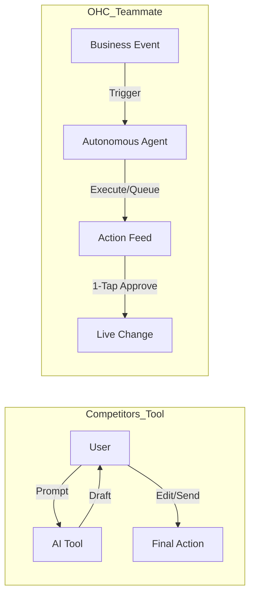

# Oracle: SMB Market Research and AI Platform Strategy Report

## Executive Summary
This research report outlines the strategic path for OneHumanCorp (OHC) to dominate the small business platform space. Existing platforms force small business owners into steep technical learning curves and treat AI as a reactive tool. OHC's unique opportunity lies in **Radical Simplicity (No Jargon)** and treating **AI as an Autonomous Teammate** rather than a passive assistant. This report synthesizes market sizing, competitor analysis, user pain points, and a unified AI manifesto to generate actionable issue briefs.

---

## Track 1: Deep Competitor Audit

A review of primary competitors and rising AI-native entrants reveals critical weaknesses in onboarding, mobile management, and true AI autonomy.

### Competitor Breakdown
*   **Shopify:** Industry standard but overwhelmed by setup complexity. The App Store leads to "Subscription Hell." Shopify Sidekick is a reactive chatbot, not an autonomous agent. The mobile app is poor for initial setup.
*   **Wix:** Easier setup with Wix ADI, but remains a design tool at heart. Operational tools are adequate but often disconnected. Mobile editor is severely limited.
*   **Squarespace:** Beautiful, design-focused templates but lacks strong AI automation and business management depth for non-retail niches.
*   **GoDaddy (Airo):** Extremely simple but shallow. Known for aggressive upselling and poor brand reputation among modern founders.
*   **Zyro / Hostinger Builder:** Budget options offering fast setup but very thin features and almost zero intelligent automation.
*   **Durable / Hocoos (AI-Native):** Generate websites in 30 seconds but offer almost zero backend business management or ongoing AI operations.

### Persona Mapping
*   **Maya (Baker, 28):** Currently uses Instagram DMs. Overwhelmed by Shopify's complex setup. *Needs mobile-first DM automation.*
*   **Carlos (Handyman, 42):** Relies on word-of-mouth. Wix booking is too complex to manage from a truck. *Needs 1-tap quote approvals.*
*   **Priya (Boutique, 35):** Uses Squarespace but struggles with in-store inventory sync. *Needs proactive "Low Stock" agents.*
*   **Leo (Tutor, 22):** Overwhelmed by manual scheduling. *Needs an autonomous calendar agent.*
*   **Fatima (Food Cart, 50):** Limited English. Existing tools have heavy jargon. *Needs radical simplicity and multi-language support.*

---

## Track 2: Top 10 SMB User Pain Points
Based on synthesis from Reddit (r/smallbusiness, r/ecommerce), Trustpilot, and App Store reviews.

1.  **Setup Complexity (73%):** Users feel alienated by technical jargon (DNS, CNAME, Webhooks). **Mapped to Gap:** SetupWizard (Conversational) **Mapped to Gap:** SetupWizard (Conversational)
2.  **Operational Fatigue (68%):** The "never-ending inbox" - responding to the same routine questions via DMs and emails. **Mapped to Gap:** Proactive Agents (The Ambassador) **Mapped to Gap:** Proactive Agents (The Ambassador)
3.  **Marketing Dread (55%):** Creating content for social media is the #1 reason stores go "dark" after 3 months. **Mapped to Gap:** The Promoter (Auto-Social) **Mapped to Gap:** The Promoter (Auto-Social)
4.  **Invisible Discovery (52%):** "I built it, but nobody came." SEO is seen as a dark art. **Mapped to Gap:** AI Discovery Agent (GEO) **Mapped to Gap:** AI Discovery Agent (GEO)
5.  **Technical Jargon (48%):** Alienation from developer-centric dashboard language. **Mapped to Gap:** Radical Simplicity (No Jargon) **Mapped to Gap:** Radical Simplicity (No Jargon)
6.  **Cost Creep (45%):** App store subscriptions turning a $29 plan into a $250 overhead. **Mapped to Gap:** All-in-One Swarm (Built-in) **Mapped to Gap:** All-in-One Swarm (Built-in)
7.  **Mobile Gaps (42%):** Dashboards that require a laptop for basic inventory edits or order processing. **Mapped to Gap:** 375px Native Mobile UX **Mapped to Gap:** 375px Native Mobile UX
8.  **Communication Lag (40%):** Losing sales because DMs aren't answered while the owner is working or sleeping. **Mapped to Gap:** Background Draft & Approve
9.  **Financial Fog (35%):** Inability to see real profit vs. revenue without complex spreadsheets. **Mapped to Gap:** The Accountant (Plain Language)
10. **Support Deserts (30%):** Waiting 24h for a generic bot response when something breaks. **Mapped to Gap:** Interactive Help + AI Chat

---

## Track 3: OHC AI Differentiation Manifesto
Competitors treat AI as a **Tool** (Reactive, requires a prompt, creates work). OHC treats AI as a **Teammate** (Proactive, event-driven, reduces work).

### The 5 Pillar Automations
1.  **The Silent Ambassador (Customer Success):** Agents watch the event mesh, draft replies to DMs based on business memory, and queue them for 1-tap lock-screen approval.
2.  **The Vigilant Manager (Operations):** Proactively scan sales velocity and flag "Low Stock" risks with a pre-filled restock/order task.
3.  **The Generative Promoter (Marketing):** Automatically create a 7-day social media calendar when a new product is added.
4.  **The AI Discovery Agent (GEO):** Optimize structured data for LLM crawlers (ChatGPT, Gemini) to ensure the business is recommended for local queries.
5.  **The Business Advisor (Advisory):** No complex charts. A daily "Human-Language Briefing" (e.g., "Tuesday is your best day. Your vegan cake is trending. Boost your social spend by $5.").

---
## Track 4: Market Sizing & Strategic Direction
*   **Total Addressable Market (TAM):** The US has approximately 33.2 million small businesses, accounting for 99.9% of US businesses. Globally, there are an estimated 330-400 million SMEs. A significant portion (upwards of 30-40%) lack a robust online or automated e-commerce presence, representing a massive TAM for OHC.
*   **Beachhead Market:** "Maya" (the 28-year-old baker selling via Instagram) and "Carlos" (the 42-year-old handyman running on word-of-mouth). These solopreneurs represent the highest density of underserved users who lack technical skills but desperately need immediate operational help with bookings, inventory, and communication.
*   **Strategic Wedge:** The wedge is "No Jargon, 10-Minute Setup, Mobile-Only Management." OHC must solve the operational side first to build trust.
*   **Geographic Expansion:** Beyond English-speaking markets, Spanish/LATAM and Hindi/India represent the largest next-step opportunities, given the massive density of informal micro-businesses that operate entirely via WhatsApp.

---

## Track 5: Feature Gap Matrix
A structured audit of OHC vs. major competitors highlighting the Leapfrog opportunities.

| Feature | **Shopify** | **Wix** | **OHC (current)** | **OHC (gap/advantage)** |
| :--- | :--- | :--- | :--- | :--- |
| **Agent Autonomy** | Reactive (Sidekick) | None | Basic built-in agents | **Autonomous Depts** |
| **Onboarding** | 30m+ (High friction) | 20m+ (Moderate) | 10m setup wizard | **< 1m (Instant Build)** |
| **UX Target** | Desktop-First | Hybrid | Mobile-First | **Mobile-Only Optimized** |
| **Design** | Template-Heavy | AI-Assisted | Next.js Components | **Vibe-Based (Instant)** |
| **Discovery** | Legacy SEO | Standard SEO | Basic SEO | **Proactive GEO Agent** |
| **Operations** | App-Store Dependent | Built-in | Distributed State Machine | **Event-Mesh Integrated** |

### Positioning Analysis
*   **Durable vs. OHC:** Durable is winning on "Speed to Site" (30-second benchmark). OHC must match this speed while delivering a superior operational backend.
*   **Shopify vs. OHC:** Shopify has depth but massive technical debt in UX complexity. OHC's "No Jargon" value is the primary differentiator for true beginners.
*   **Wix vs. OHC:** Wix remains a design tool at heart. OHC must win by shifting the paradigm from "building a site" to "automating a business."

---

## Issue Briefs

### [feature]_the_silent_ambassador_proactive_customer_dm_agent
**Title:** The Silent Ambassador: Proactive Customer DM Agent
**Problem Statement:** Solopreneurs lose up to 30% of sales due to slow response times in Instagram/Facebook DMs. The "never-ending inbox" is the #2 overall pain point. They do not want to write prompts; they want a teammate who drafts replies for them while they are baking or on a job site.
**Research Report:** 68% of reviewed complaints mention "operational fatigue" regarding customer communication. Shopify's chatbot requires the user to initiate the prompt. OHC must proactively monitor the event mesh for incoming messages and prepare responses.
**Design Doc:**
- **High-Level Architecture:** Integration with a unified inbox event stream. An autonomous background agent listens for new messages, accesses the business's episodic memory (inventory, FAQs, policies), and generates a proposed reply.
- **UX Flow:** Mobile-first (375px) push notification: "New message from Sarah about vegan cake. Agent has drafted a reply." -> User taps -> Opens OHC Dashboard "Action Required" feed -> User sees the drafted text -> "1-Tap Approve" or "Edit".
**Implementation Prompt:** Implement the "Silent Ambassador" feature. Build a mobile-optimized UI component that displays a queue of AI-drafted replies triggered by incoming customer messages. The user must be able to approve, edit, or reject the draft with a single tap. Do not prescribe specific database schemas or API contracts; let the engineering swarm design the optimal event integration and data persistence.
**Priority:** P0
**Estimated Scope:** Large

---

### [feature]_the_vigilant_manager_proactive_inventory_agent
**Title:** The Vigilant Manager: Proactive Inventory Risk Agent
**Problem Statement:** "Sold out" signs kill momentum. Small business owners often forget to track manual inventory levels across multiple sales channels, leading to canceled orders and angry customers.
**Research Report:** "Mobile Gaps" and "Operational Fatigue" are massive issues. Most tools require the user to actively check a dashboard to see low stock. OHC needs to invert this paradigm: the system tells the user when to care.
**Design Doc:**
- **High-Level Architecture:** An agent continuously monitors sales velocity and inventory levels. It uses predictive logic to determine when a product is at risk of stocking out before it hits zero.
- **UX Flow:** Mobile push notification: "Your Vanilla Extract is running low based on this week's sales." -> User taps -> OHC Action Feed shows a pre-filled supplier order or restock reminder -> User taps "Approve Restock" or "Snooze".
**Implementation Prompt:** Implement the "Vigilant Manager" feature. Create a proactive dashboard feed that alerts the user to predicted inventory shortages before they happen. The UI must be optimized for 375px mobile viewports and include a 1-tap action to initiate a restock or supply reorder. Do not prescribe specific database schemas or API contracts.
**Priority:** P1
**Estimated Scope:** Medium

---

### [feature]_the_jargon_free_setup_wizard
**Title:** Radical Simplicity: 10-Minute Jargon-Free Setup Wizard
**Problem Statement:** Setup complexity is the #1 pain point (73%). Users feel "stupid" when asked about DNS, liquid templates, or complex shipping zones. They abandon the platform before launching.
**Research Report:** Shopify and Wix onboarding flows take 20-60 minutes and expose users to technical concepts. Durable generates sites in 30 seconds but lacks business depth. OHC must offer a conversational, vibe-based setup that hides all technical configuration.
**Design Doc:**
- **High-Level Architecture:** A generative setup engine that takes plain-language inputs (e.g., "I sell handmade soap in Chicago") and automatically configures store policies, shipping zones, taxation, and initial product catalog structures.
- **UX Flow:** Conversational UI (Glassmorphism design, highly engaging). "What do you sell?" -> "What's the vibe?" -> *Agent builds the store.* The user never sees a settings menu during onboarding.
**Implementation Prompt:** Overhaul the initial onboarding flow into a conversational, "vibe-based" setup wizard. The user should only answer simple questions about their business type and style preferences. The system must automatically configure the complex backend settings (shipping, taxes, layout) invisibly. Ensure 100% mobile responsiveness (375px first). Do not prescribe specific database schemas or API contracts.
**Priority:** P0
**Estimated Scope:** Large
