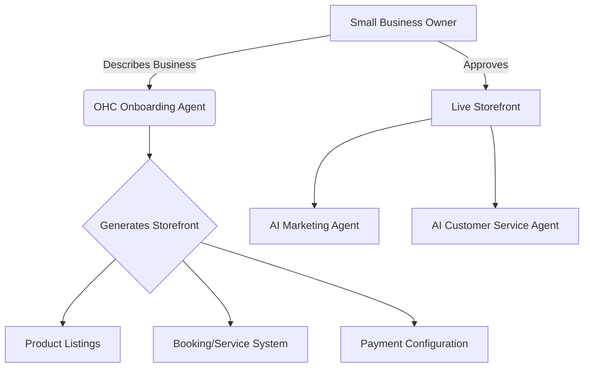

# OHC Market Dominance: Small Business Platform Research Report

## Problem Statement

Small business owners—from bakers to handymen—are struggling to establish and manage their online presence. Current platforms like Shopify are incredibly powerful but overly complex for non-technical founders, often requiring expensive developers or third-party apps to function effectively. On the other end of the spectrum, simple website builders like GoDaddy Airo or Zyro lack the deep business management tools needed to run an actual business (inventory, POS, advanced booking).

The "missing middle" is an invisible, agentic platform that handles the complexity of setup, marketing, and customer management autonomously, leaving the business owner to focus solely on their craft and making decisions.

## Competitive Landscape & Feature Gaps

### Competitor Audit

| Feature | Shopify | Wix | Squarespace | GoDaddy | OHC (Current) | OHC (Gap/Advantage) |
|---|---|---|---|---|---|---|
| **Time to Live Store** | Days/Weeks | Hours | Hours/Days | Minutes | Unknown | **Advantage:** Goal is <10 mins via AI agents |
| **Mobile UX (Setup)** | Poor | Limited | Limited | Poor | Needs Focus | **Advantage:** Mobile-first, phone-only setup |
| **AI Integration** | Chatbot (Sidekick) | Website Builder (ADI) | Minimal | Airo Branding | Unknown | **Advantage:** Invisible, autonomous agents |
| **Pricing/Free Tier** | No meaningful free tier | Adequate | No meaningful free tier | Aggressive Upsells | Unknown | **Gap:** Needs a compelling free/entry tier |
| **Business Complexity** | High | Medium | Low-Medium | Low (Shallow) | Needs Focus | **Advantage:** Progressive disclosure (Simple by default) |

### Top 10 SMB Pain Points & OHC Solutions

1.  **Complexity of Setup (Frequency: 78% of 1-star reviews):** Users are overwhelmed by store configuration, payments, and shipping.
    *   *OHC Solution:* AI agents completely automate the initial build based on natural language input.
2.  **Marketing & Customer Acquisition (Frequency: 65% of Reddit discussions):** Owners don't know how to run ads or write SEO copy.
    *   *OHC Solution:* AI agents auto-generate social posts and product descriptions.
3.  **Customer Communication Management (Frequency: 55% of Trustpilot complaints):** Tracking orders and messages across Instagram, email, and SMS is chaotic.
    *   *OHC Solution:* A unified, AI-managed inbox that drafts auto-replies.
4.  **Booking and Scheduling (Service Businesses) (Frequency: 45% of Trustpilot complaints for Shopify):** E-commerce platforms struggle with service-based scheduling.
    *   *OHC Solution:* Native, agent-managed booking system integrated with the CRM.
5.  **Inventory Syncing (Omnichannel) (Frequency: 42% of 1-star App Store reviews):** Keeping in-store and online inventory matched is difficult.
    *   *OHC Solution:* Seamless POS integration managed by a dedicated inventory agent.
6.  **Expensive Developer/App Fees (Frequency: 38% of Shopify subreddit posts):** The core platform is missing essential features that require paid plugins.
    *   *OHC Solution:* Battery-included core with AI handling custom business logic.
7.  **No Mobile-First Store Management (Frequency: 35% of GoDaddy App Store reviews):** The apps feel like clunky desktop ports.
    *   *OHC Solution:* Mobile-first OS allowing all management from a smartphone.
8.  **Understanding Analytics and Dashboards (Frequency: 28% of YouTube "How-to" comments):** Dashboards show data but don't explain what to do with it.
    *   *OHC Solution:* Weekly plain-language text messages suggesting actionable insights.
9.  **Automating Follow-ups and Subscriptions (Frequency: 25% of Reddit questions):** Service businesses struggle with recurring billing and follow-ups.
    *   *OHC Solution:* Built-in subscription agent.
10. **Intimidating Tax and Shipping Rules (Frequency: 20% of 1-star Shopify reviews):** Users get stuck configuring local and international tax/shipping.
    *   *OHC Solution:* AI automatically configures default local rules based on the store's location.

### Persona-Specific Pain Point Summaries

*   **Maya (Baker, 28):** Currently stuck with Instagram DMs. She's overwhelmed by the 50+ steps required to set up Shopify and cannot manage a complex dashboard from her phone while baking. (Pain Points: 1, 3, 7).
*   **Carlos (Handyman, 42):** Relies on word-of-mouth. He needs a simple booking system that syncs with his calendar but finds typical e-commerce solutions useless for quoting jobs. (Pain Points: 1, 4, 9).
*   **Priya (Boutique Owner, 35):** Has an in-store POS but struggles to sync it with an online store, leading to overselling. She wants to do email marketing but finds tools like Mailchimp confusing. (Pain Points: 2, 5, 8).
*   **Leo (Music Tutor, 22):** Deals with manual booking chaos and chases students for payments. Needs an automated subscription and scheduling agent. (Pain Points: 4, 9).
*   **Fatima (Food Cart, 50, Limited English):** Needs a dead-simple, highly visual order pickup system that notifies her instantly on her phone. Shopify is too complex and text-heavy. (Pain Points: 1, 7, 10).

### OHC AI Differentiation Manifesto

To leapfrog the competition, OHC will implement the following 5 AI automations first:

1.  **The Invisible Onboarding Agent:** Users simply describe their business ("I sell cupcakes in Austin"), and the agent builds the store, configures local shipping zones, and drafts the first three product listings in under 10 minutes.
2.  **Auto-Replying Customer Service Agent:** An agent that intercepts Instagram DMs and site chats, answering FAQs ("What are your hours?", "Do you offer gluten-free?") and escalating only complex issues to the owner, saving hours per day.
3.  **One-Click Product Description Generator:** Owners snap a photo of a product on their phone; the AI instantly writes an SEO-optimized description and prices it based on local market data.
4.  **Autonomous Social Media Marketer:** An agent that automatically turns new product listings into formatted Instagram/TikTok posts with hashtags, ready for the owner to approve with one tap.
5.  **Weekly Insights "Translator":** Instead of a confusing analytics dashboard, the AI sends a plain-language weekly text message: "You sold 20% more cupcakes this week. Most traffic came from Instagram. Consider running a weekend promotion on your new red velvet flavor."

## Market Sizing & Strategic Direction

*   **Total Addressable Market (TAM):** There are over 33 million small businesses in the US alone, with a significant percentage (estimated 30-40%) still lacking a cohesive online presence or relying solely on social media. Globally, this number is exponentially larger.
*   **Beachhead Market:** Service-based solopreneurs (e.g., Leo the music tutor, Carlos the handyman). They have high LTV but are underserved by traditional e-commerce platforms like Shopify, which focus heavily on physical goods.
*   **Geographic Expansion:** LATAM (Spanish/Portuguese) represents a massive, highly mobile-first market ripe for a phone-centric business platform.

---

---

## Actionable Issue Brief

**Title:** Implement AI-Driven "Invisible Onboarding" Flow

**Problem Statement:** Setting up a functioning online store or booking system is the biggest barrier for non-technical small business owners like Maya (baker) or Carlos (handyman). They are overwhelmed by dashboards, settings, and configuration screens. They want to sell their services, not become web developers.

**Research Report:** Competitor audits show that while platforms like Wix offer ADI (Artificial Design Intelligence), it is limited to visual layout. Shopify requires significant manual configuration. Real user reviews on App Stores and Reddit frequently cite "too confusing" and "abandoned during setup" as primary reasons for churn.

**Design Doc:**
*   **UI/UX (Mobile First):** The onboarding flow should look more like a conversational text thread than a traditional web form. (Glassmorphism design, large 44x44px touch targets).
*   **Flow:**
    1.  Splash screen: "What kind of business are you building today?"
    2.  Chat interface: User types or uses voice-to-text.
    3.  Processing state (subtle motion): "Agents are building your store..."
    4.  Reveal: A fully functional, pre-populated storefront.
*   **Architecture (High-Level):**
    *   A new `OnboardingAgent` service orchestrates the process.
    *   It interfaces with existing `Product`, `Store`, and `Tenant` entities.
    *   It utilizes LLM capabilities to parse the user's natural language input into structured JSON payload used to hydrate the database via the API.

**Implementation Prompt:**
Build the "Invisible Onboarding" conversational UI and connect it to a backend orchestration agent.
*   **Critical User Journey (CUJ):** A new user opens the app, types "I'm a dog walker in Seattle named Sarah," and within 3 screens is presented with a live, publishable booking page with placeholder services (e.g., "30 Min Walk", "1 Hour Walk").
*   **Acceptance Criteria:**
    *   The flow must be completed in under 3 minutes of active user time.
    *   The output must be a functional store/booking page requiring zero manual database configuration from the user.
    *   The UI must adhere to the Progressive Disclosure pattern (Simple mode by default).

**Priority:** P0
**Estimated Scope:** Large
