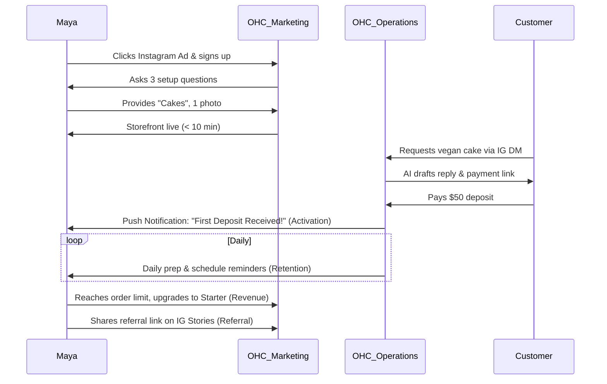
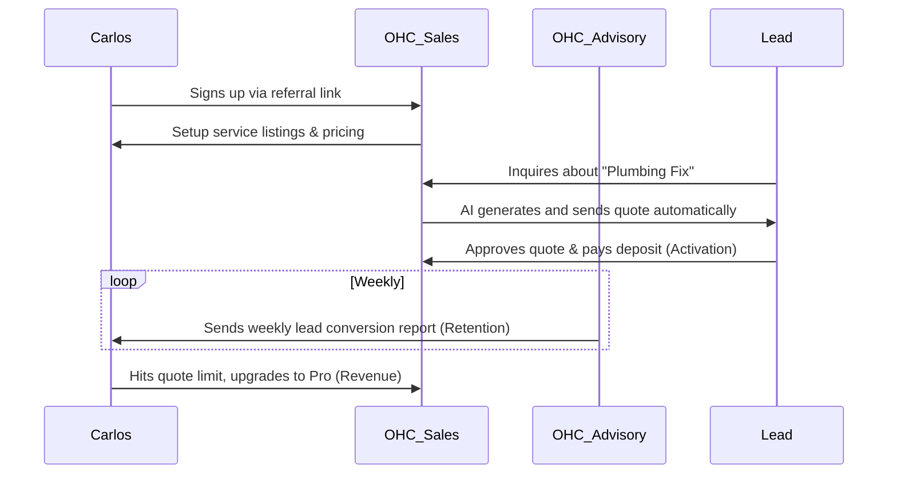
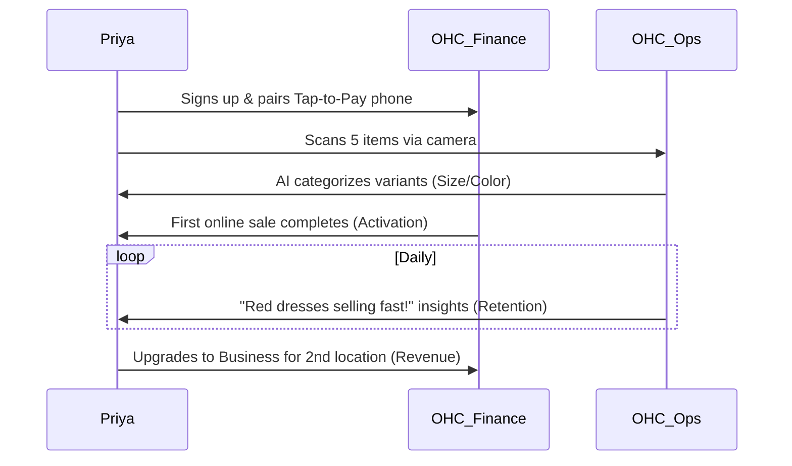
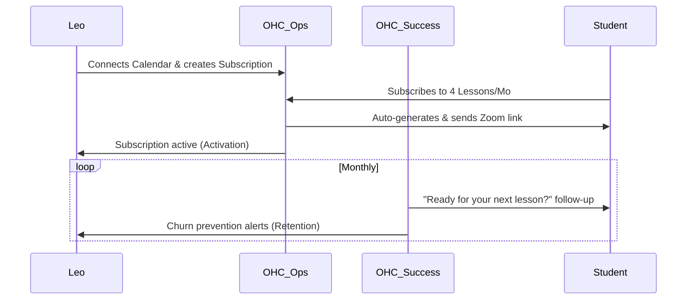
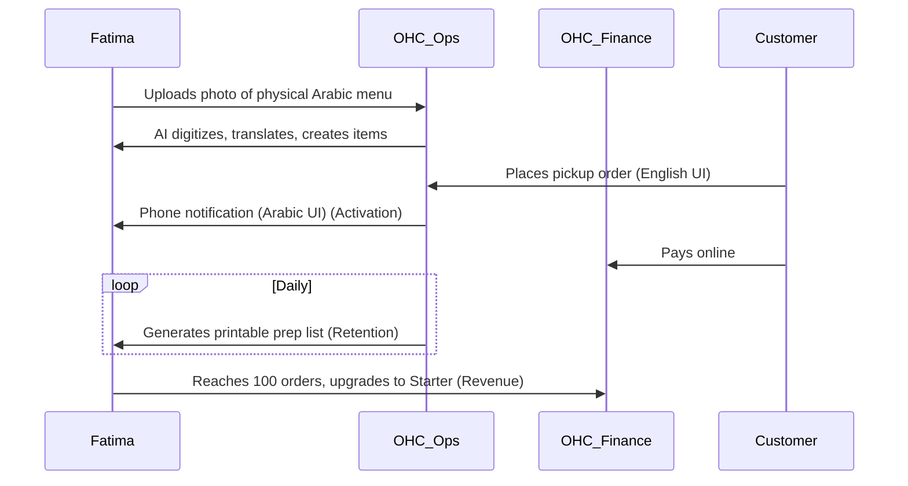
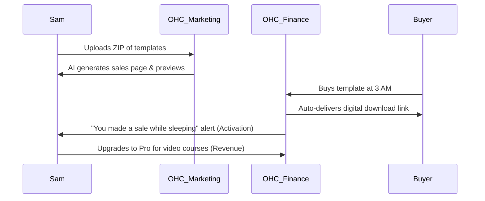

# Title: Business Journey Architecture

## Problem Statement
Small business owners—often entirely non-technical—struggle to navigate the fragmented ecosystem of business tools (Shopify, Wix, Calendly, Mailchimp). They need a cohesive, end-to-end platform that allows them to seamlessly acquire customers, onboard, activate, retain users, generate revenue, and leverage referrals. Currently, there is a lack of a unified, mobile-first business journey architecture that intuitively guides real-world personas (like Maya the baker or Carlos the handyman) through every stage of their business lifecycle, leaving money on the table and inducing choice paralysis.

## Research Report
The current small and medium-sized business (SMB) market heavily relies on point solutions.
- **Shopify:** Excellent for e-commerce, but overly complex for service businesses and requires 30-60 minutes of setup.
- **Wix/Squarespace:** Powerful website builders but lack integrated native agentic capabilities and seamless mobile-first management.
- **GoDaddy:** Offers basic tools, but the user experience is disjointed and not optimized for zero-knowledge onboarding.

OHC differentiates by ensuring the setup time is < 10 minutes, requires zero technical knowledge, features built-in AI agents, is mobile-first, and covers all business types (products, services, portfolios) under one roof. Our research shows that drop-off rates spike when users are asked to configure DNS settings, complex inventory variants, or payment gateway APIs. OHC mitigates this by abstracting the complexities away via AI departments.

## Design Doc

### Business Journey Phases (End-to-End)
1. **Acquisition:** How the persona discovers OHC.
2. **Onboarding:** Step-by-step wizard flow, minimal inputs.
3. **Activation:** First "aha" moment (first product added, first payment).
4. **Retention:** Triggers that bring the user back (notifications, AI reports).
5. **Revenue:** Upgrade path from Free to Starter/Pro.
6. **Referral:** Sharing the platform with other business owners.

### Maya — The Home Baker (Physical Products)

#### Journey Flow
- **Acquisition:** Clicks an Instagram ad showing a competitor baker's beautiful OHC storefront.
- **Onboarding:** Answers 3 questions: "What do you sell?", "Upload 1 photo", "Connect bank account". AI generates the store.
- **Activation:** Receives her first $50 custom cake deposit via OHC payment link.
- **Retention:** Receives daily summary push notifications: "You have 3 cake orders due this weekend."
- **Revenue:** Upgrades to the $9/mo Starter tier to get a custom domain (`mayascakes.com`) when she reaches 100 orders.
- **Referral:** Sends a "Get $50 when you launch your store" referral link to her friend who makes candles.

#### Mobile UX Flow (375px)
- **Screen 1 (Onboarding):** A clean, Glassmorphism-styled form asking "What do you sell?". 44x44px target sizes for touch inputs.
- **Screen 2 (Photo Upload):** Native camera integration prompt.
- **Screen 3 (Dashboard):** A 375px-wide dashboard featuring a large "First Sale" metric and an inbox widget showing active DMs.
- **Screen 4 (Push Notification):** A toast notification overlaid on the lock screen confirming deposit received.

### Carlos — The Freelance Handyman (Services)

#### Journey Flow
- **Acquisition:** Word-of-mouth referral from another tradesperson.
- **Onboarding:** Selects "Services/Repairs" template. Enters hourly rate and service list. AI generates quote templates.
- **Activation:** AI automatically sends his first quote based on a customer's SMS request, which gets approved.
- **Retention:** Uses the central customer inbox daily to reply to leads. AI advises him on peak booking times.
- **Revenue:** Upgrades to Pro to remove the monthly AI quote generation limits.
- **Referral:** Invites his plumber friend to join OHC to handle overflow leads.

#### Mobile UX Flow (375px)
- **Screen 1 (Service Setup):** Simple list input for "Plumbing", "Painting", etc., with numeric keypad for hourly rates.
- **Screen 2 (Quote Generator):** A single-button "Generate Quote" interface triggered from an SMS lead.
- **Screen 3 (Inbox):** A consolidated view of SMS, email, and web leads, styled with clean Outfit typography.
- **Screen 4 (Weekly Report):** A swipeable card view showing conversion rates and peak times.

### Priya — The Boutique Owner (Inventory & In-Person)

#### Journey Flow
- **Acquisition:** Searches Google for "easiest way to sync physical store with online shop."
- **Onboarding:** Connects Stripe Terminal. Scans 5 clothing items with her phone camera. AI categorizes and sets variants.
- **Activation:** First online order syncs perfectly with her in-store inventory deduction.
- **Retention:** Daily mobile analytics dashboard ("Which items are trending").
- **Revenue:** Upgrades to Business tier for unlimited storage and multi-domain support as she opens a second location.
- **Referral:** Mentions OHC during a local business networking event.

#### Mobile UX Flow (375px)
- **Screen 1 (Hardware Setup):** Bluetooth pairing screen for Stripe Terminal with a large, animated "Pair" button.
- **Screen 2 (Inventory Scanner):** Camera view with AI overlays detecting "Dress", "Red", "Size M".
- **Screen 3 (POS interface):** A clean tap-to-pay interface for in-store transactions.
- **Screen 4 (Analytics):** A simplified, plain-language chart (no jargon like "cohorts") showing daily trending items.

### Leo — The Music Tutor (Subscriptions & Bookings)

#### Journey Flow
- **Acquisition:** Sees a TikTok link-in-bio showcasing a beautiful OHC portfolio from another musician.
- **Onboarding:** Syncs Google Calendar. Sets up monthly subscription tiers.
- **Activation:** First student subscribes to the "4 Lessons/Month" package and auto-receives a Zoom link.
- **Retention:** AI follows up with students who missed lessons, bringing revenue back that he would have forgotten to chase.
- **Revenue:** Stays on Pro tier to support unlimited video hosting on his portfolio.
- **Referral:** Adds "Powered by OHC" to his link-in-bio, driving organic signups.

#### Mobile UX Flow (375px)
- **Screen 1 (Calendar Sync):** A single "Connect Google Calendar" OAuth button.
- **Screen 2 (Subscription Setup):** A wizard to define "4 Lessons/Month" with recurring billing toggle.
- **Screen 3 (Portfolio Builder):** A drag-and-drop link-in-bio builder tailored for TikTok dimensions.
- **Screen 4 (Follow-up Alert):** A notification proposing "Student X missed a week. Send an auto-reminder?" with a one-tap "Approve".

### Fatima — The Food Cart Operator (Food & Beverage)

#### Journey Flow
- **Acquisition:** Community group flyer emphasizing "No English required, set up in 5 mins."
- **Onboarding:** Uploads a photo of her printed menu. AI translates to English and digitizes the items and prices.
- **Activation:** Hears the "cha-ching" phone notification for her first online pre-order pickup.
- **Retention:** Relies on the daily printable order list to prep food.
- **Revenue:** Subscribes to the Starter tier after hitting her 100-order limit within the first month.
- **Referral:** Shows her app to neighboring food carts.

#### Mobile UX Flow (375px)
- **Screen 1 (Menu Import):** Full-screen camera interface for photographing the physical menu.
- **Screen 2 (Menu Review):** A split view showing the original photo and the AI-translated text (Arabic/English toggle).
- **Screen 3 (Order Feed):** A high-contrast, large-font list of incoming pre-orders.
- **Screen 4 (Prep List):** A simplified checklist view optimized for quick glances during rush hour.

### Sam — The Digital Product Creator (Digital Goods)

#### Journey Flow
- **Acquisition:** YouTube tutorial on "Selling templates easily."
- **Onboarding:** Uploads a ZIP file of design templates. AI generates the sales copy and preview images.
- **Activation:** First passive income sale while sleeping.
- **Retention:** Checks the real-time sales dashboard obsessively.
- **Revenue:** Upgrades to Pro to sell large video courses (50GB limit).
- **Referral:** Creates a YouTube tutorial sharing their OHC setup.

#### Mobile UX Flow (375px)
- **Screen 1 (Upload):** Simple file picker optimized for iOS/Android native storage APIs.
- **Screen 2 (Listing Editor):** AI-generated title and copy with one-tap rewrite functionality.
- **Screen 3 (Sales Dashboard):** A real-time revenue ticker (the "slot machine" effect for dopamine).
- **Screen 4 (Download Delivery):** A view showing the automated email that was sent to the buyer with the secure link.

## Implementation Prompt
**To the Implementer:**
Please implement the foundational business journey tracking engine and UI scaffold for the onboarding wizards, dashboard activation metrics, and referral links.
- The user must experience a 3-step or less onboarding flow tailored to their business type (e.g., uploading a photo, entering a service rate).
- Triggers must be established for "Activation" (first sale/booking) with corresponding mobile push notifications.
- Provide plain-language dashboard widgets summarizing retention and revenue metrics (e.g., "You have 3 cake orders due this weekend").
- Do NOT prescribe the exact PostgreSQL schema, but ensure the architecture can handle row-level security per tenant. Ensure all UI components follow the Glassmorphism standard and remain 100% functional on a 375px mobile screen. Follow the UX flows documented for each persona.

## Priority
P0

## Estimated Scope
Large
