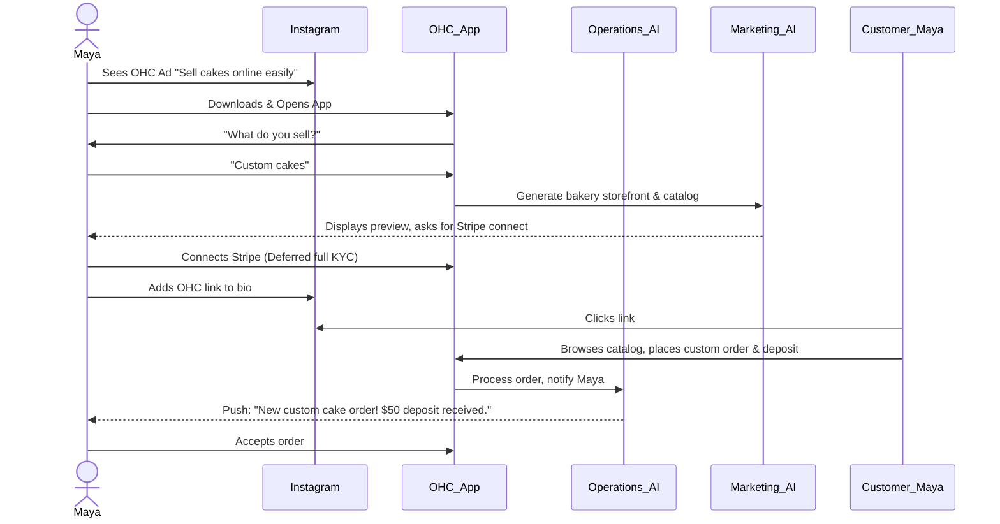
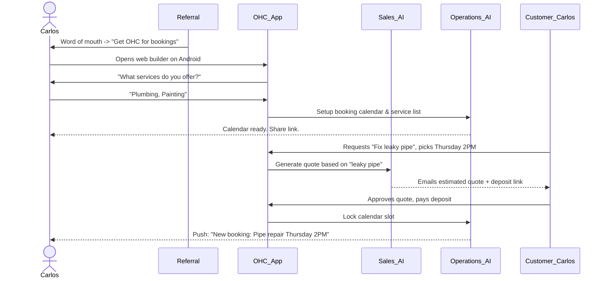
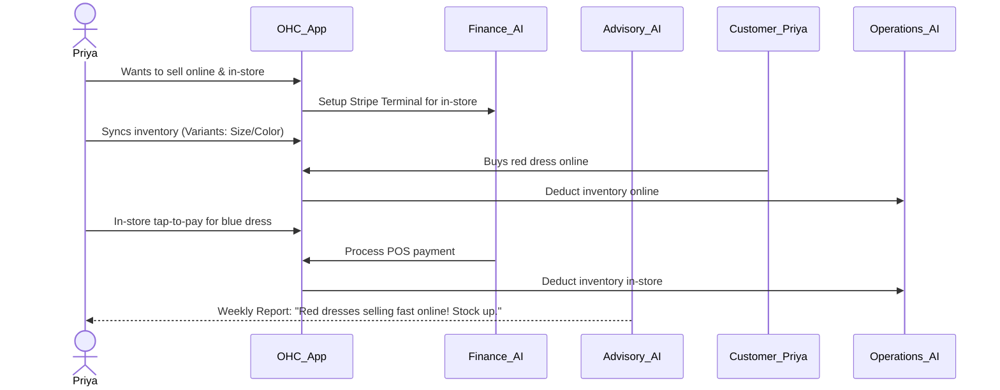
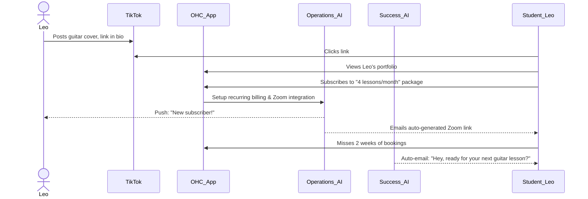
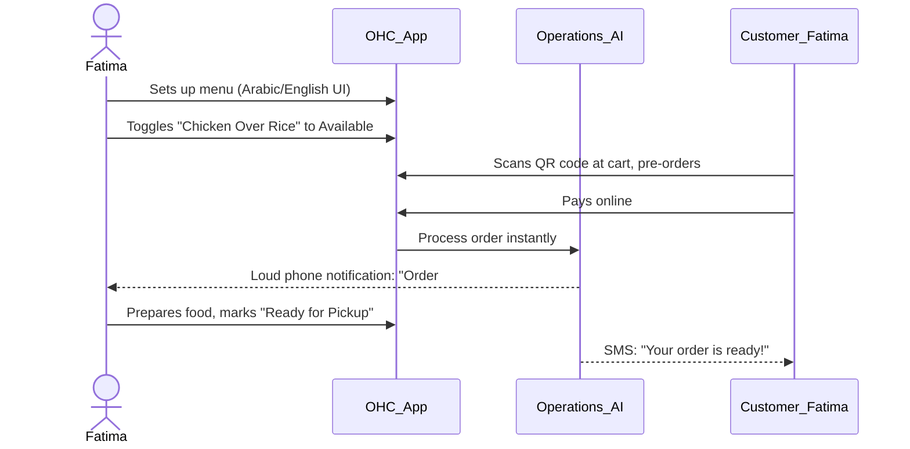

# [Architecture] Business Journey End-to-End Flows

## Title
Business Journey Architecture: End-to-End User Journey Mapping for All Personas

## Problem Statement
Small business owners—our core users like Maya the Baker or Carlos the Handyman—are non-technical and easily overwhelmed by complex software setups. Currently, standard e-commerce flows (like Shopify or Wix) take 30-60 minutes and require technical literacy. We need a frictionless, guided, AI-driven journey that takes a user from initial discovery to a fully live, transacting business in under 10 minutes. If our acquisition, onboarding, activation, retention, and referral flows have friction, users will abandon the platform before realizing the value of our AI agents and mobile-first approach.

## Research Report
### Competitive Analysis
- **Shopify:** Complex onboarding. Requires choosing themes, setting up payments manually, adding DNS records. Friction is high for non-technical users.
- **Wix:** Easier drag-and-drop but overwhelming UI with too many desktop-centric tools.
- **Squarespace:** Aesthetic but slow setup process. Not mobile-first for management.

### The OHC Advantage
OHC's differentiation lies in radical simplicity and invisible AI. Our onboarding should require only:
1. What do you sell?
2. What is your business name?
3. Connect bank/Stripe.
AI handles the rest (website design, initial catalog, booking flow).

### Key Journey Stages
1. **Acquisition:** Driven by organic search, Instagram/TikTok ads, and viral loops ("Powered by OHC" link in bio). The landing page CTA is "Start your business in 3 minutes."
2. **Onboarding:** Conversational AI wizard. No jargon. We defer non-critical steps (like custom domain setup) to later.
3. **Activation:** The "Aha!" moment. E.g., getting the first booking or selling the first product. We aim for Activation on Day 1.
4. **Retention:** Driven by the "Business Advisory" and "Operations" AI departments. Push notifications for new orders, weekly plain-language health reports.
5. **Revenue:** Triggered when users hit limits (e.g., Free tier allows 100 AI actions, Maya needs more during a holiday rush). Upgrade CTA is contextual: "Let The Promoter AI handle 500 more DMs this month for $9."
6. **Referral:** Viral loop built into customer-facing storefronts and post-purchase emails. "Want a store like Priya's? Launch yours for free."

## Design Doc

### Mobile UX Flow (375px First)
1. **Landing Screen:** Large, clean typography (Outfit/Inter). Glassmorphism elements. CTA: "What do you do?" with a text input.
2. **Chat-based Onboarding:** "The Advisor" AI asks 3 simple questions in a conversational UI format.
3. **Magic Moment:** A progress bar with micro-animations: "The Promoter is designing your site... The Manager is setting up your catalog..."
4. **Dashboard:** A clean mobile dashboard.
    - Top: "1 Action Required: Connect Stripe to accept payments."
    - Middle: Revenue today, New Orders.
    - Bottom: AI Department status ("The Salesperson drafted 3 quotes for you").

### Friction Points & Solutions
- **Friction:** Setting up a custom domain.
  **Solution:** Defer to Week 2. Start with `maya.ohc.store`.
- **Friction:** Writing product descriptions.
  **Solution:** User uploads a photo of a cake. AI auto-generates title, price suggestion, and description.
- **Friction:** Creating Stripe account.
  **Solution:** Use Stripe Connect with minimal onboarding up front; prompt for full verification only when withdrawing funds.

### AI Agent Integration Points
- **Onboarding:** "The Promoter" generates the initial site based on just a few text prompts.
- **Activation:** "The Manager" pre-fills 3 sample products or services based on the business type.
- **Retention:** "The Advisor" sends a push notification on Friday: "You had a great week, Maya! 5 new cake orders. Tap here to view your summary."
- **Revenue:** "The Accountant" triggers an upgrade prompt when AI actions exceed the free tier limit.

### Architecture Diagrams (Mermaid.js)

#### 1. Maya (The Home Baker) - Product Journey

#### 2. Carlos (The Handyman) - Service Booking Journey

#### 3. Priya (The Boutique Owner) - Omnichannel Journey

#### 4. Leo (The Music Tutor) - Subscription Journey

#### 5. Fatima (The Food Cart) - Pre-Order Journey

## Implementation Prompt
**To the Implementer:**
Your task is to implement the Core Onboarding Flow and Dashboard UI for the mobile-first frontend.
1. Create a conversational onboarding wizard that asks for Business Type, Business Name, and enables Stripe Connect.
2. The UI must be optimized for 375px screens with large touch targets (>44px). Use Glassmorphism (backdrop-filter: blur(20px) saturate(200%)) for cards. Typography should use Outfit for headers, Inter for body.
3. Integrate an AI mock response for "The Promoter" generating the initial storefront layout.
4. Implement the post-onboarding Dashboard with a top action banner ("Complete Stripe Setup"), metrics section, and AI activity feed.
5. Create an E2E Playwright test that simulates a user starting on the landing page, completing the conversational onboarding, and landing on the Dashboard. Ensure test relies strictly on the UI flow.

## Priority
P0

## Estimated Scope
Large
