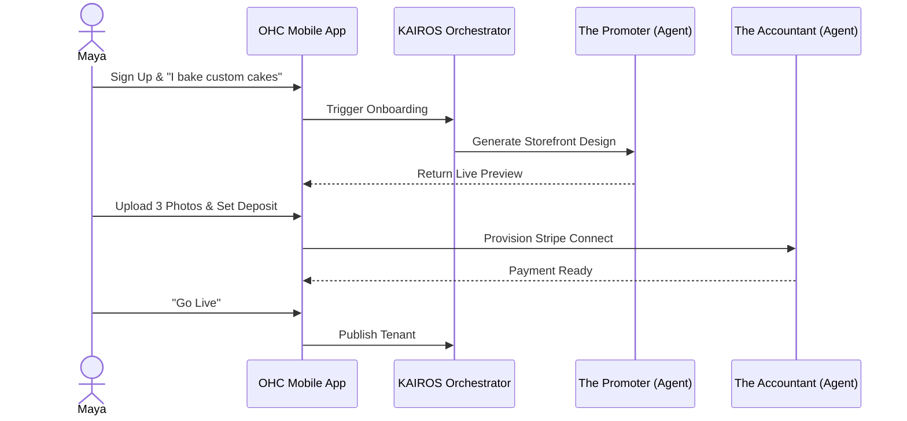
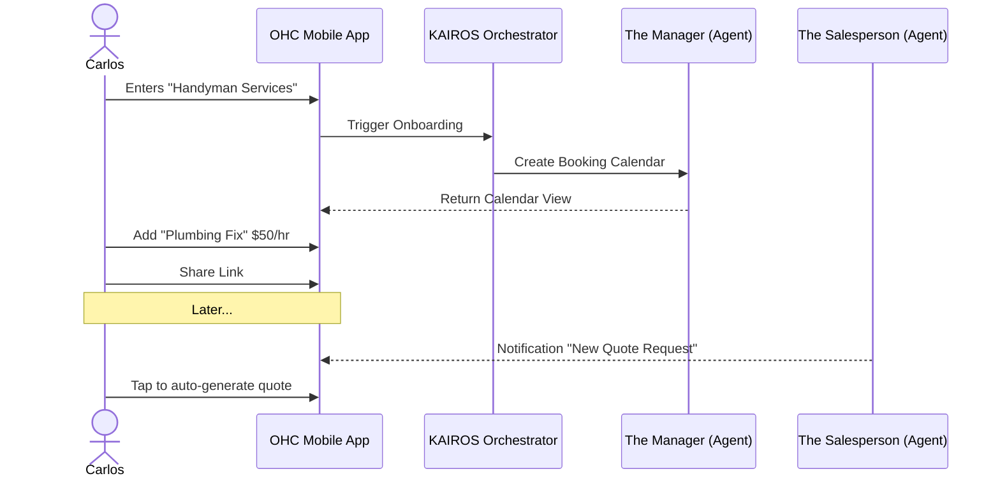
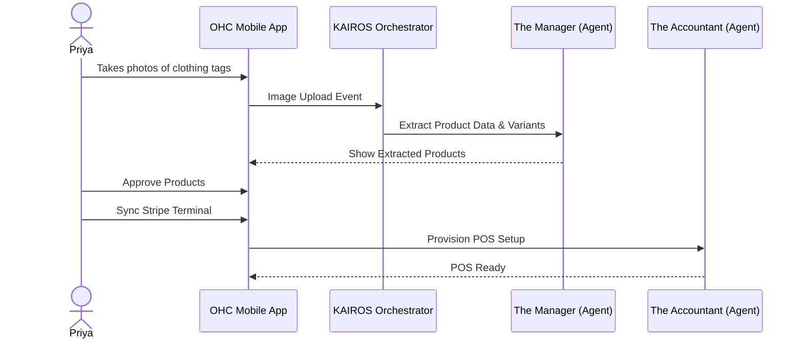
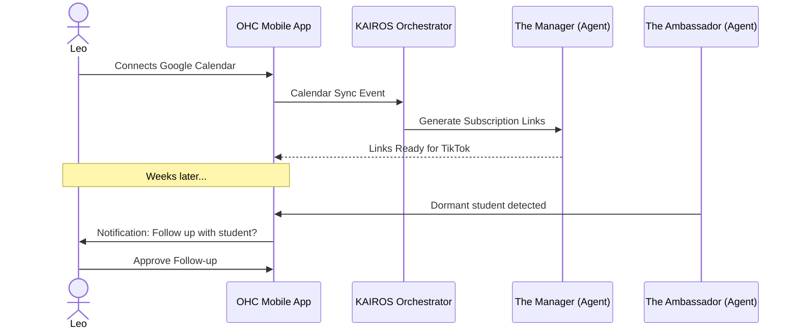
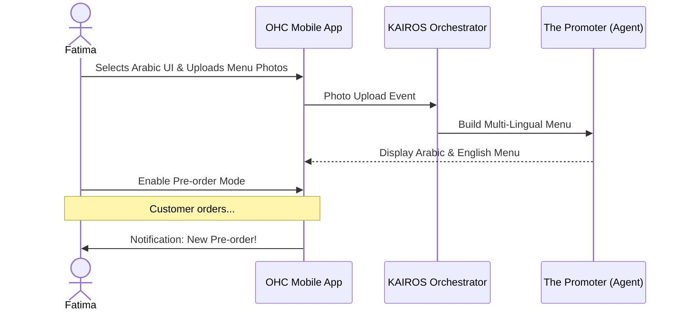

# [architecture] Business Journey Architecture

## Problem Statement
Small business owners often feel overwhelmed by the setup processes of traditional platforms like Shopify or Wix. The journey from "having an idea" to "running a live business" is fraught with friction, requiring decisions on layouts, integrations, payment gateways, and domain setup. OHC needs a defined, frictionless end-to-end journey tailored to real-world personas that leverages AI agents to handle the complexity invisibly.

## Research Report
- **Competitor Analysis:** Shopify and Wix require 20-60 minutes for setup. Wix uses AI for initial site generation but leaves operations to the user.
- **Pain Points:**
  - Non-technical owners get stuck on "connecting a custom domain".
  - Complex checkout configuration causes a 40% drop-off in the first day.
  - Adding products/services manually is tedious.
- **Solution Strategy:** OHC replaces manual onboarding with a conversational "Wizard" that delegates tasks to AI Agent Departments (e.g., Marketing, Finance, Legal) behind the scenes, ensuring the "10 minutes to live" promise.

## Design Doc

### 1. Journey Maps

#### Maya (Baker) - Physical Products (Custom Orders)
- **Acquisition:** Clicks Instagram Ad -> Lands on OHC mobile landing page.
- **Onboarding:** Types "I bake custom cakes." OHC Marketing Agent generates a clean layout.
- **Activation:** Sets up Stripe deposit. Uploads 3 cake photos. Site goes live.
- **Retention:** Receives daily notifications on new orders; AI drafts replies to Instagram DMs.
- **Revenue:** Upgrades from Free to Starter tier after hitting the 10-product limit to add more cake flavors.
- **Referral:** Shares a referral link on her baking vlog, bringing in other bakers.
- **Friction Points Avoided:** Complex inventory setup is delayed until she upgrades.

#### Carlos (Handyman) - Services & Bookings
- **Acquisition:** Friend referral -> SMS link.
- **Onboarding:** Enters phone number and business name. OHC Operations Agent creates a booking calendar.
- **Activation:** Adds 3 services with hourly rates. Links bank for payouts.
- **Retention:** Uses mobile inbox to view quote requests.
- **Revenue:** Upgrades to Starter tier when needing more than 1 AI department (e.g. Salesperson for quotes + Manager for booking).
- **Referral:** Tells his plumbing friend "Hey, use this app, it built my booking page in 5 mins."
- **Friction Points Avoided:** No need to design a traditional website; a clean booking list is auto-generated.

#### Priya (Boutique Owner) - Physical Products (In-Store + Online)
- **Acquisition:** Organic search -> "How to sell clothes online easy".
- **Onboarding:** Imports initial CSV of inventory, or takes photos of clothing tags.
- **Activation:** Syncs Stripe Terminal for in-person POS.
- **Retention:** Daily revenue analytics pushed to mobile.
- **Revenue:** Upgrades to Pro tier for unlimited products and advanced multi-domain support for her second boutique branch.
- **Referral:** Mentions OHC in a boutique owner Facebook group.
- **Friction Points Avoided:** Variant setup (Size/Color) is handled via AI analyzing uploaded photos.

#### Leo (Music Tutor) - Subscriptions & Bookings
- **Acquisition:** TikTok Link-in-Bio platform comparison.
- **Onboarding:** Connects Google Calendar.
- **Activation:** Generates recurring subscription links for lessons.
- **Retention:** AI follows up with dormant students.
- **Revenue:** Upgrades to Starter for a custom domain to look more professional on his TikTok profile.
- **Referral:** Gives his referral code to fellow musicians at the local open mic.
- **Friction Points Avoided:** Zoom integration is abstracted; AI handles link generation.

#### Fatima (Food Cart) - Food & Beverage
- **Acquisition:** Local SMB community group.
- **Onboarding:** Selects Arabic UI. Takes photos of her menu. AI builds the item list.
- **Activation:** Enables "Pre-order for pickup" mode.
- **Retention:** Views large-font, simple order queue on her Android.
- **Revenue:** Stays on Free tier but pays Stripe processing fees, effectively monetizing through volume without subscription overhead.
- **Referral:** Other cart operators in her food pod see her using the app and ask about it.
- **Friction Points Avoided:** Language barriers and complex fulfillment settings are bypassed via the customized template.

### 2. Architecture Diagrams (Mermaid.js)

#### Maya's Full Journey

#### Carlos's Full Journey

#### Priya's Full Journey

#### Leo's Full Journey

#### Fatima's Full Journey

### 3. Implementation Prompt
Implement the end-to-end "Wizard Onboarding Flow" for the mobile frontend (Slint/Flutter). Ensure the UI accommodates a 375px viewport. Build the corresponding KAIROS orchestrator hooks to delegate initialization tasks to the `Marketing` and `Operations` AI agents based on the user's selected business type. The user must be able to reach a live, functioning public page in under 5 screens.

## Priority
P0

## Estimated Scope
Large
