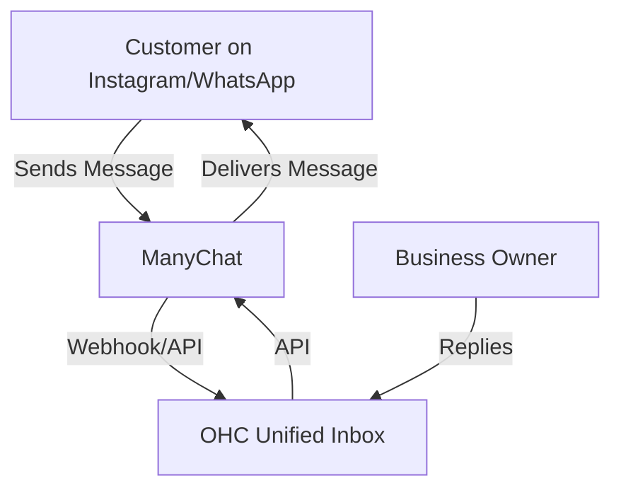
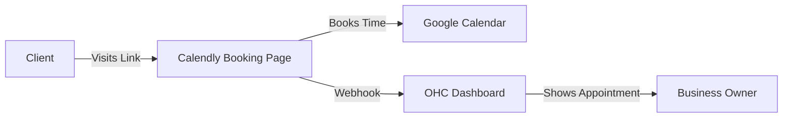
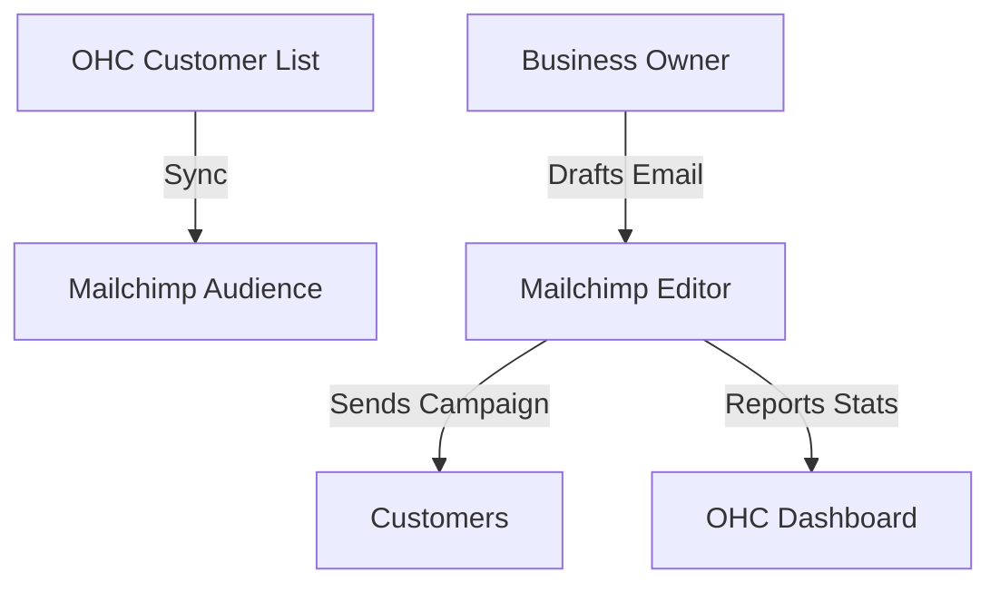
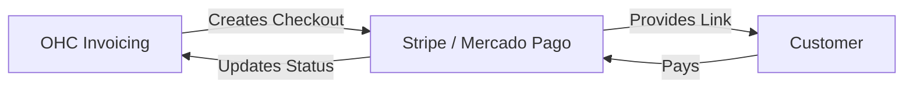
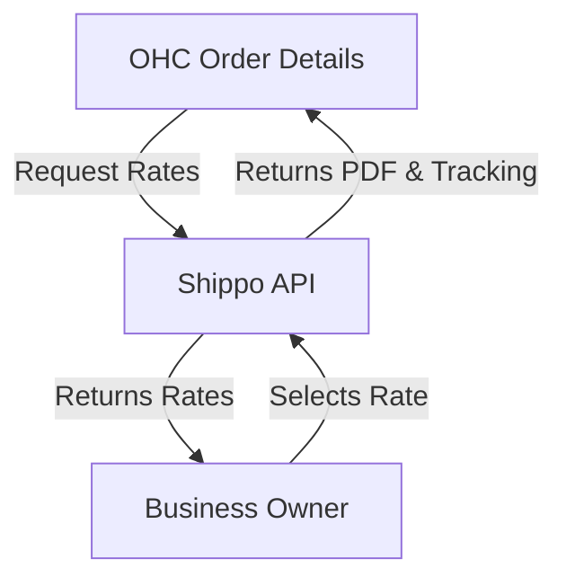
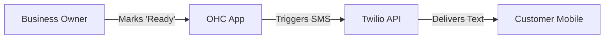
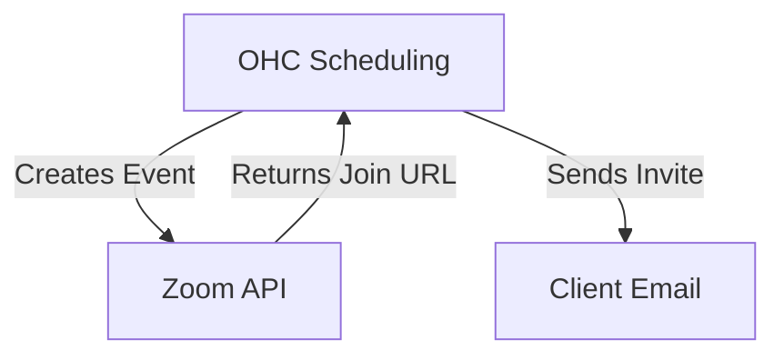

# Tool Integration Research Report

## 1. Social Media Integration

### [Social Media] Unified Unified Inbox Integration (Instagram, Facebook, WhatsApp, TikTok)
**Title**: Integrate ManyChat for Unified Social Media Inbox

**Problem Statement**:
Small business owners (like Fatima, running a boutique bakery) are overwhelmed by messages coming from Instagram DMs, Facebook comments, WhatsApp, and TikTok. They often miss customer inquiries or orders because they have to constantly switch between apps on their phone. They need all customer messages in one place to respond quickly and never miss a sale.

**Persona-specific pain point summary**:
*Fatima (Boutique Bakery Owner)*: "I get cake orders on WhatsApp, questions about my hours on Instagram, and complaints on Facebook. If I forget to check one app, I lose money and get bad reviews. I just want one inbox!"

**Research Report**:
ManyChat is a leading platform for social media messaging integration and automation.
- **Key advantages and risks**:
  - *Advantages*: Excellent support for Instagram, Facebook, and WhatsApp. Intuitive visual flow builder. Robust webhook support for receiving messages.
  - *Risks*: High dependency on Meta's API stability. If Meta changes its policies, the integration might break. Limited support for TikTok currently (though expanding).
- **Rough pricing estimate**: Free tier available (up to 1,000 contacts). Pro tier starts at $15/month, scaling with the number of contacts.
- **Whether it works in both Cloud and Standalone modes**: Yes. In Cloud mode, OHC connects via standard OAuth and webhooks. In Standalone mode, users would authenticate locally, and OHC can securely poll or receive forwarded messages using local relays or ManyChat's API.

**Comparative Table**:

| Tool | Instagram/FB/WA | TikTok | Developer API | Pricing |
|---|---|---|---|---|
| **ManyChat** | Excellent | Limited | Strong | $15/mo |
| **Chatfuel** | Good | None | Good | $14.99/mo |
| **Respond.io**| Excellent | Good | Excellent | $79/mo |

**Design Doc**:
When a customer sends a message on any connected social platform, it appears in the OHC unified inbox. The business owner can reply directly from OHC, and the message is sent back to the customer on their original platform.

**Implementation Prompt**:
Build an integration where users can connect their ManyChat account to OHC. Once connected, all incoming messages from ManyChat should appear in a new "Unified Inbox" view in the OHC UI. When the user types a reply in OHC and clicks "Send", the reply should be transmitted back to the customer via the ManyChat API. The inbox must indicate which platform (e.g., Instagram, WhatsApp) the message originated from.

**Priority**: P0
**Estimated Scope**: Large

## 2. Calendar & Scheduling

### [Calendar] Automated Booking Page Integration (Google Calendar & Meet)
**Title**: Integrate Calendly for Automated Scheduling and Sync

**Problem Statement**:
Service-based business owners spend hours playing "email tag" with clients to find a time to meet. They need a simple link they can share where clients can pick an available time, which then automatically updates the owner's calendar and generates a meeting link.

**Persona-specific pain point summary**:
*Carlos (Consultant)*: "I waste so much time going back and forth asking 'Does Tuesday at 2 PM work?'. I need a simple webpage where my clients can see when I'm free and just book it themselves."

**Research Report**:
Calendly is the industry standard for scheduling automation.
- **Key advantages and risks**:
  - *Advantages*: Widely recognized, incredibly easy for non-technical users to set up, native integrations with Google Calendar, Outlook, and Zoom/Meet.
  - *Risks*: Users might feel the free tier is too restrictive. Competitors like Cal.com offer open-source alternatives.
- **Rough pricing estimate**: Free tier available. Standard tier is $10/user/month.
- **Whether it works in both Cloud and Standalone modes**: Yes. Cloud mode can use webhooks for instant booking notifications. Standalone mode can regularly sync bookings via Calendly's API.

**Comparative Table**:

| Tool | Ease of Use | Customization | API Access | Pricing |
|---|---|---|---|---|
| **Calendly** | Very High | Medium | Paid only | $10/mo |
| **Cal.com** | High | High | Free | Free/Custom |
| **Acuity** | Medium | High | Paid only | $16/mo |

**Design Doc**:
The business owner connects their Calendly account in OHC. OHC displays their upcoming appointments on the main dashboard and allows them to easily copy their booking link to share with customers.

**Implementation Prompt**:
Create a module where the user can authorize their Calendly account. OHC should retrieve their main booking link and display it prominently so they can copy it. Additionally, fetch upcoming scheduled events and display them in a "Upcoming Appointments" widget on the OHC dashboard.

**Priority**: P1
**Estimated Scope**: Medium

## 3. Email Marketing

### [Email] Seamless Newsletter Campaigns Integration
**Title**: Integrate Mailchimp for Customer Email Marketing

**Problem Statement**:
Business owners collect customer emails but don't know how to send professional-looking newsletters or promotions. They need a simple way to email all their past customers about sales or updates without ending up in the spam folder.

**Persona-specific pain point summary**:
*Sarah (Local Bookstore Owner)*: "I have a list of 500 customer emails in a spreadsheet. I want to tell them about our summer sale, but if I email them all from Gmail, my account might get blocked for spam."

**Research Report**:
Mailchimp is the most recognizable email marketing platform for small businesses.
- **Key advantages and risks**:
  - *Advantages*: Huge library of templates, excellent deliverability, very user-friendly drag-and-drop builder.
  - *Risks*: Pricing scales aggressively as the contact list grows. API rate limits on lower tiers.
- **Rough pricing estimate**: Free tier up to 500 contacts / 1,000 sends per month. Essentials tier starts at $13/month.
- **Whether it works in both Cloud and Standalone modes**: Yes. Standard REST API integration works identically from the cloud or a standalone local environment.

**Comparative Table**:

| Tool | Template Quality | Automation | Deliverability | Pricing |
|---|---|---|---|---|
| **Mailchimp** | Excellent | Good | Excellent | $13/mo |
| **MailerLite** | Good | Excellent | Good | $10/mo |
| **Brevo** | Good | Good | Good | Free (300/day)|

**Design Doc**:
OHC syncs the local customer list with a Mailchimp audience. The owner can click a button in OHC to "Draft Newsletter," which opens Mailchimp's editor. OHC tracks the open and click rates of the latest campaign on the dashboard.

**Implementation Prompt**:
Develop an integration that continuously syncs the OHC customer directory with a connected Mailchimp audience. Provide a summary widget on the OHC dashboard that shows the performance (open rate, click rate) of the most recently sent Mailchimp campaign.

**Priority**: P2
**Estimated Scope**: Medium

## 4. Payment Processing

### [Payments] Global Payment Processing Integration
**Title**: Integrate Stripe & Mercado Pago for Unified Invoicing

**Problem Statement**:
Small businesses need a reliable way to accept credit cards, Apple Pay, and local payment methods online without setting up complex merchant accounts.

**Persona-specific pain point summary**:
*Mateo (Freelance Designer in LATAM)*: "My international clients want to pay with credit cards, but my local clients want to use Mercado Pago or bank transfers. Managing different payment links is a nightmare."

**Research Report**:
Stripe is the global standard, while Mercado Pago is essential for the LATAM market.
- **Key advantages and risks**:
  - *Advantages*: Instant onboarding, massive consumer trust, support for local payment methods (e.g., OXXO, PIX via Stripe/Mercado Pago).
  - *Risks*: High transaction fees for micro-payments. Account holds or bans if dispute rates spike.
- **Rough pricing estimate**: 2.9% + 30¢ per successful card charge. No monthly fees.
- **Whether it works in both Cloud and Standalone modes**: Yes. Cloud uses webhooks. Standalone can poll for payment status or use locally-tunneled webhooks for invoice state updates.

**Comparative Table**:

| Tool | Global Reach | LATAM Focus | Setup Speed | Fees |
|---|---|---|---|---|
| **Stripe** | Excellent | Medium | Instant | ~2.9% + 30¢ |
| **Mercado Pago**| Low | Excellent | Instant | Varies by country |
| **PayPal** | Excellent | Good | Instant | ~3.49% + 49¢ |

**Design Doc**:
The business owner generates an invoice in OHC. OHC creates a secure checkout link containing options for both Stripe and Mercado Pago, which the owner sends to the customer. When paid, OHC marks the invoice as "Paid."

**Implementation Prompt**:
Create a feature where an OHC invoice can generate a shareable payment link. The user should be able to connect their Stripe account. Once the customer completes the payment via the generated link, the invoice status in OHC should automatically change to "Paid."

**Priority**: P1
**Estimated Scope**: Large

## 5. Shipping & Logistics

### [Shipping] Automated Shipping Label Generation
**Title**: Integrate Shippo for Multi-Carrier Shipping Rates & Labels

**Problem Statement**:
E-commerce and craft business owners waste hours at the post office manually typing addresses and comparing shipping rates between USPS, UPS, and FedEx.

**Persona-specific pain point summary**:
*Chloe (Etsy Seller)*: "I spend more time copying and pasting customer addresses into shipping websites and printing labels than I do actually making my products."

**Research Report**:
Shippo provides an API to compare rates across 85+ carriers and print labels.
- **Key advantages and risks**:
  - *Advantages*: Aggregates multiple carriers, offers discounted USPS rates, easy address validation.
  - *Risks*: Label printing requires physical hardware compatibility (printers). Refunds for unused labels can be slow.
- **Rough pricing estimate**: Free tier (pay 5¢ per label). Pro tier at $19/month (no per-label fee).
- **Whether it works in both Cloud and Standalone modes**: Yes. It's a synchronous API call to generate a PDF label, which works perfectly from either environment.

**Comparative Table**:

| Tool | Carrier Network | Ease of API | Pricing |
|---|---|---|---|
| **Shippo** | 85+ | Excellent | $0/mo + 5¢/label |
| **EasyPost** | 100+ | Excellent | Developer focused |
| **ShipStation**| High | Good | $9.99/mo |

**Design Doc**:
For any pending order in OHC, the owner can click "Generate Shipping Label." OHC compares rates, the owner selects one, and OHC generates a printable PDF label and tracking number.

**Implementation Prompt**:
Add a "Fulfill Order" button to the order details screen. When clicked, present a list of shipping rates via the Shippo integration. Allow the user to select a rate, purchase the label, and download the resulting PDF. Save the tracking number to the order record.

**Priority**: P2
**Estimated Scope**: Medium

## 6. SMS & Notifications

### [SMS] Reliable Customer SMS Notifications
**Title**: Integrate Twilio for Automated Customer SMS

**Problem Statement**:
Emails are often ignored, but text messages have a 98% open rate. Business owners need a way to send urgent updates (like "Your table is ready" or "Your order is out for delivery") directly to customers' phones.

**Persona-specific pain point summary**:
*David (Restaurant Owner)*: "When a table frees up, if I email them, they won't see it in time. I need to text them so they come back to the restaurant immediately."

**Research Report**:
Twilio is the industry leader for programmatic SMS and voice.
- **Key advantages and risks**:
  - *Advantages*: Global reach, incredibly reliable, pay-as-you-go pricing.
  - *Risks*: A2P 10DLC compliance rules in the US make setup complicated for non-technical users (requires business registration verification).
- **Rough pricing estimate**: ~$0.0079 per SMS message in the US. No monthly platform fee.
- **Whether it works in both Cloud and Standalone modes**: Yes. Standard REST API.

**Comparative Table**:

| Tool | Reliability | Ease of Setup | Pricing |
|---|---|---|---|
| **Twilio** | Excellent | Hard (A2P compliance) | ~$0.0079/msg |
| **MessageBird**| Good | Medium | Varies |
| **Plivo** | Good | Medium | ~$0.0055/msg |

**Design Doc**:
The business owner configures pre-set SMS templates in OHC. Triggering a status change (e.g., Order Ready) automatically dispatches an SMS to the customer's phone number on file.

**Implementation Prompt**:
Create a notification settings panel where users can enable SMS notifications via a Twilio connection. When a user changes a task or order status to "Ready", automatically send a predefined SMS message to the customer associated with that task.

**Priority**: P1
**Estimated Scope**: Medium

## 7. Video Conferencing

### [Video] Instant Online Meeting Rooms
**Title**: Integrate Zoom for Auto-Generated Consultations

**Problem Statement**:
Coaches, tutors, and consultants need to manually create Zoom links and email them to clients for every meeting, which is tedious and error-prone.

**Persona-specific pain point summary**:
*Elena (Online Tutor)*: "I often forget to send the Zoom link until 5 minutes before the lesson, which stresses out my students. The link needs to be created and sent automatically when they book."

**Research Report**:
Zoom remains the most ubiquitous video conferencing tool post-pandemic.
- **Key advantages and risks**:
  - *Advantages*: Everyone has it installed, highly reliable, supports recording.
  - *Risks*: The free tier limits meetings to 40 minutes for 3+ participants. OAuth approval process for apps can be strict.
- **Rough pricing estimate**: Free for 1:1 meetings. Pro is $15.99/month.
- **Whether it works in both Cloud and Standalone modes**: Yes. OAuth tokens can be stored locally in Standalone mode to securely create meetings via API.

**Comparative Table**:

| Tool | Ubiquity | Free Tier Limits | Pricing |
|---|---|---|---|
| **Zoom** | Very High | 40 mins (3+ people) | $15.99/mo |
| **Google Meet**| High | 60 mins | Free w/ Google |
| **Whereby** | Low | 45 mins | $11.99/mo |

**Design Doc**:
When an appointment is created in OHC, OHC automatically calls the Zoom API to create a meeting. The resulting Join URL is saved to the appointment and emailed to the client.

**Implementation Prompt**:
Provide a "Connect Zoom" option. When a user manually creates a new calendar event in OHC, provide a toggle for "Make it a Zoom Meeting". If checked, auto-generate the meeting via the Zoom API and populate the event's location field with the Zoom join link.

**Priority**: P2
**Estimated Scope**: Medium
